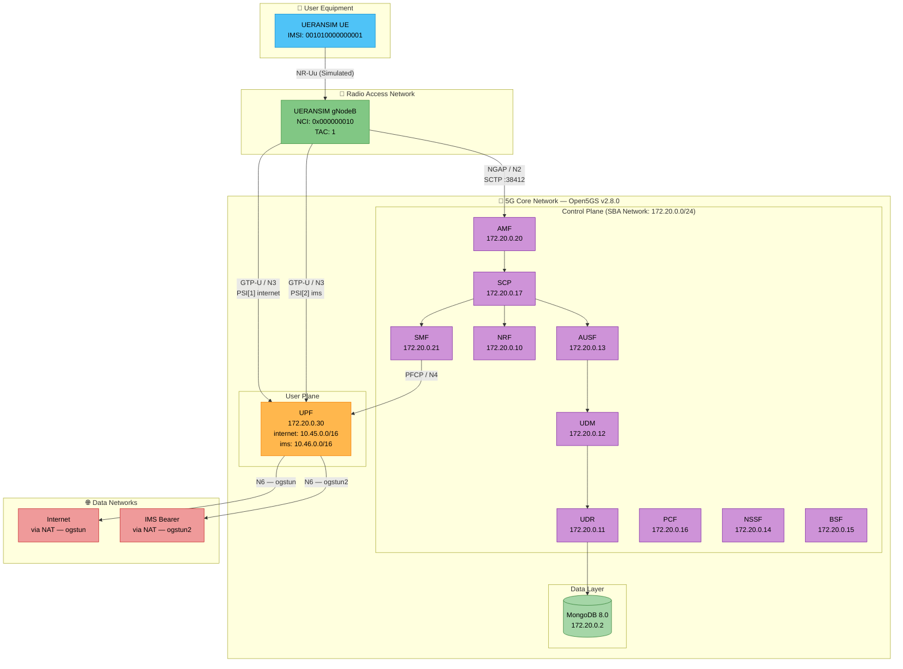
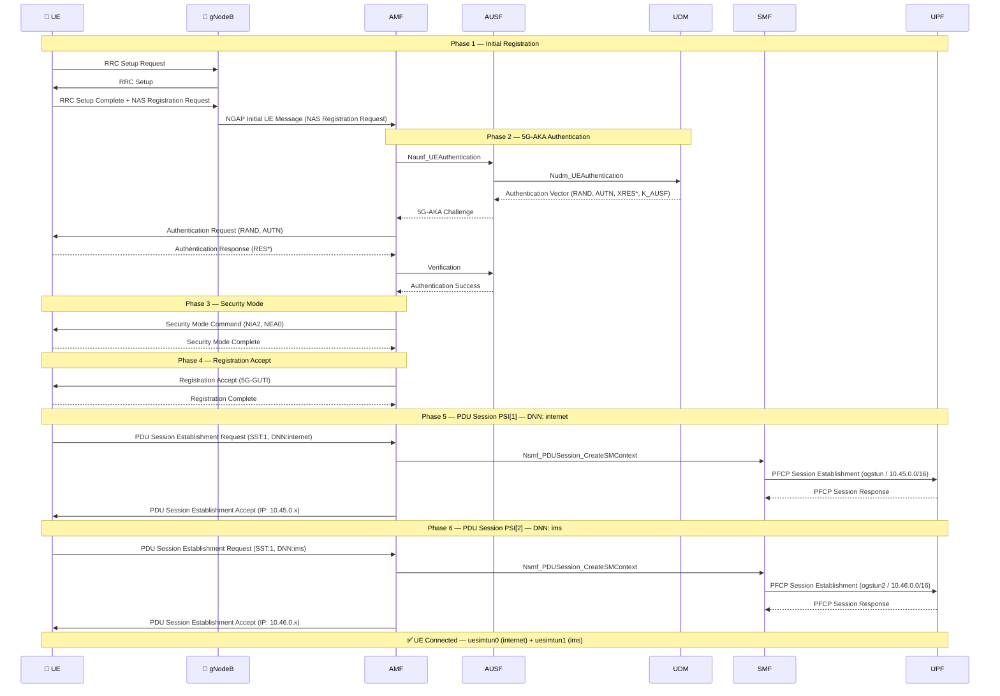
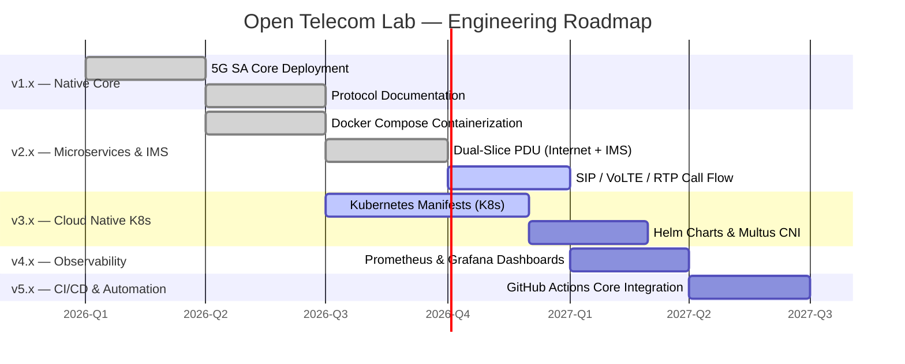

# Open Telecom Lab

<p align="center">
  
</p>

<h1 align="center">Open Telecom Lab</h1>

<p align="center">
  <strong>A Production-Grade 5G Core Network Laboratory for Hands-On Telecom Engineering</strong>
</p>

<p align="center">
  <a href="#-quick-start"></a>
  <a href="#-deployment-architecture"></a>
  <a href="#-documentation"></a>
  <a href="CONTRIBUTING.md"></a>
</p>

<p align="center">
  
  
  
  
  
  
  
  
</p>

---

## 📖 Overview

**Open Telecom Lab** is an end-to-end 5G Standalone (SA) network laboratory built with open-source network functions. It documents a complete engineering journey: from bare-metal 5G SA core deployments and dual-slice IMS bearer routing to containerized microservices orchestration and Kubernetes manifests.

> **Note:** This project is designed as an advanced engineering reference and production-grade lab environment. It serves as an evolving telecommunications portfolio rather than a basic introductory tutorial.

---

## ✨ What Makes This Different

| Aspect | This Project | Typical Tutorials |
| :--- | :--- | :--- |
| **Deployment** | Native Ubuntu + Docker Compose + Kubernetes | Single shell script setup |
| **Data Plane** | Dual-Slice PDU (Internet + IMS) with Policy Routing | Single default internet session |
| **Documentation** | Protocol-level PFCP/NGAP/SBA analysis | Surface-level installation commands |
| **Scope** | Full 5G SA end-to-end + Microservices | Isolated single components |
| **Evolution** | Versioned roadmap (Native → Docker → K8s) | Static, one-shot code dump |

---

## 🏗️ Architecture

### 5G SA Core Network Architecture (SBA Network: `172.20.0.0/24`)



### Signal Flow: 5G-AKA Registration & Dual PDU Session Establishment



---

## 🛠️ Technology Stack

| Component | Technology | Version | Purpose |
|-----------|-----------|---------|---------|
| **Operating System** | Ubuntu LTS | 24.04 (Noble) | Host platform |
| **5G Core** | Open5GS | 2.8.0 | 5G SA core network functions |
| **Container Runtime** | Docker & Docker Compose | v2.x | Modular microservice containerization |
| **Orchestration** | Kubernetes (kind) | v1.28+ | Cloud-native deployment (planned) |
| **RAN Simulator** | UERANSIM | 3.3.0 | gNodeB + UE simulation |
| **Database** | MongoDB | 8.0 | Subscriber data store |
| **Packet Capture** | tcpdump / Wireshark | Latest | Protocol analysis |
| **Networking** | Linux Namespaces + iptables | Native | Traffic isolation & NAT |
| **Firewall Persistence** | netfilter-persistent | Latest | Persistent iptables rules |

---

## 📁 Project Structure

```text
Open-Telecom-Lab/
├── docker-compose/            # 🐳 v2.0 Microservices Orchestration
│   ├── config/                # Open5GS NF configurations
│   │   ├── amf.yaml
│   │   ├── smf.yaml
│   │   ├── upf.yaml
│   │   └── upf-entrypoint.sh  # TUN creation & NAT rules
│   ├── Dockerfile             # Multi-stage build (Ubuntu 22.04)
│   └── docker-compose.yml     # 12-container orchestration stack
├── k8s/                       # ☸️ v3.0 Kubernetes Manifests (In Development)
│   ├── kind-config.yaml       # kind cluster configuration
│   ├── namespace.yaml         # open5gs namespace
│   ├── mongodb.yaml           # MongoDB 8.0 StatefulSet
│   ├── configmap.yaml         # Open5GS NF configuration
│   ├── control-plane.yaml     # NRF, AMF, SMF + SBI network functions
│   └── upf.yaml               # UPF (hostNetwork, NET_ADMIN, ogstun)
├── configs/                   # Native deployment & UERANSIM configuration
│   └── ueransim/              # open5gs-gnb.yaml, open5gs-ue.yaml
├── docs/                      # Engineering notes & protocol documentation
│   ├── architecture/          # Architecture deep-dives
│   ├── engineering-notes/     # Technical analysis
│   ├── protocols/             # Protocol deep-dives
│   └── troubleshooting/       # Common issues & fixes
├── labs/                      # Step-by-step lab exercises
│   ├── lab-01-5g-sa-setup/    # Core network deployment
│   ├── lab-02-ue-registration/# Registration procedure
│   ├── lab-03-pdu-session/    # PDU session establishment
│   └── lab-04-user-plane/     # End-to-end data path
├── scripts/                   # Automation & helper scripts
│   ├── start-lab.sh           # Bring up the lab
│   ├── verify-lab.sh          # Health check across the 5G core
│   ├── add-subscriber.sh      # Seed a test subscriber into MongoDB
│   ├── run-gnb.sh             # Launch UERANSIM gNodeB
│   └── run-ue.sh              # Launch UERANSIM UE
├── README.md
├── ROADMAP.md
├── CHANGELOG.md
├── CONTRIBUTING.md
└── LICENSE
```

---

## 🚀 Quick Start

### Option A: Containerized Microservices Stack (Recommended - v2.0)

#### 1. Clone & Navigate

```bash
git clone https://github.com/khattabpi/Open-Telecom-Lab.git
cd Open-Telecom-Lab/docker-compose
```

#### 2. Build & Launch the 5G Core Stack

```bash
# Build multi-stage container images
docker compose build

# Launch all services in detached mode
docker compose up -d
```

#### 3. Verify Health & PFCP Association

```bash
# Check container status
docker compose ps

# Check NRF registration
docker logs open5gs-nrf 2>&1 | grep "registered"

# Check SMF-UPF PFCP Association
docker logs open5gs-smf 2>&1 | grep -i "pfcp"
# Expected: "PFCP associated [172.20.0.30]:8805"
```

#### 4. Simulate the RAN & Establish Dual-Slice Sessions

Ensure UERANSIM is installed on your host system.

```bash
# Terminal 1 — Start gNodeB
nr-gnb -c ../configs/ueransim/open5gs-gnb.yaml

# Terminal 2 — Start UE
nr-ue -c ../configs/ueransim/open5gs-ue.yaml

# Terminal 3 — Verify dual IP allocation
ip addr show uesimtun0
# Expected: inet 10.45.0.x/16 (internet) & inet 10.46.0.x/16 (ims)

# Test internet connectivity
sudo ip netns exec ueransim-001010000000001-internet-psi1 ping -c 4 8.8.8.8

# Test IMS bearer connectivity
sudo ip netns exec ueransim-001010000000001-ims-psi2 ping -c 4 10.46.0.1
```

---

### Option B: Native Ubuntu Deployment (v1.0)

#### 1. Install Open5GS & MongoDB

```bash
# Add Open5GS repository
sudo add-apt-repository ppa:open5gs/latest
sudo apt update
sudo apt install -y open5gs mongodb-org

# Enable services
sudo systemctl enable --now mongod
```

#### 2. Configure Kernel & Policy Routing

```bash
# Enable IP forwarding
sudo sysctl -w net.ipv4.ip_forward=1

# Disable rp_filter on TUN interfaces (required for asymmetric UPF flows)
sudo sysctl -w net.ipv4.conf.ogstun.rp_filter=0
sudo sysctl -w net.ipv4.conf.ogstun2.rp_filter=0

# Policy routing — force GTP-U decapsulated packets to main table
sudo ip rule add from 10.45.0.0/16 lookup main priority 100
sudo ip rule add from 10.46.0.0/16 lookup main priority 100

# NAT for both slices
WAN=$(ip route show default | awk '{print $5}')
sudo iptables -t nat -A POSTROUTING -s 10.45.0.0/16 -o $WAN -j MASQUERADE
sudo iptables -t nat -A POSTROUTING -s 10.46.0.0/16 -o $WAN -j MASQUERADE

# Allow FORWARD for both TUN interfaces
sudo iptables -I FORWARD -i ogstun -j ACCEPT
sudo iptables -I FORWARD -o ogstun -m state --state RELATED,ESTABLISHED -j ACCEPT
sudo iptables -I FORWARD -i ogstun2 -j ACCEPT
sudo iptables -I FORWARD -o ogstun2 -m state --state RELATED,ESTABLISHED -j ACCEPT

# Persist rules
sudo apt install -y iptables-persistent
sudo netfilter-persistent save
```

#### 3. Start Core Services

```bash
sudo systemctl restart open5gs-upfd open5gs-smfd open5gs-amfd
```

#### 4. Build & Run UERANSIM

```bash
sudo apt install -y make gcc g++ libsctp-dev lksctp-tools iproute2
git clone https://github.com/aligungr/UERANSIM
cd UERANSIM && make

sudo ./build/nr-gnb -c ../configs/ueransim/open5gs-gnb.yaml
sudo ./build/nr-ue -c ../configs/ueransim/open5gs-ue.yaml
```

---

### Option C: Kubernetes on kind (v3.0 — In Active Development)

#### 1. Create the kind Cluster

```bash
# kind cluster configuration with required port mappings
kind create cluster --config k8s/kind-config.yaml
```

#### 2. Deploy the 5G Core

```bash
# Order matters: namespace → db → config → NFs
kubectl apply -f k8s/namespace.yaml
kubectl apply -f k8s/mongodb.yaml
kubectl apply -f k8s/configmap.yaml
kubectl apply -f k8s/control-plane.yaml
kubectl apply -f k8s/upf.yaml
```

#### 3. Wait for the Core to Come Up

```bash
# Monitor pod status
kubectl -n open5gs get pods -w

# Or use the helper script
bash scripts/start-lab.sh
```

> **Note:** The UPF runs with `hostNetwork: true` and binds GTP-U (`2152/udp`) directly on the node IP (`172.19.0.2`). Point a local UERANSIM gNB at that address rather than `localhost`. See [k8s/kind-config.yaml](k8s/kind-config.yaml) for the port-mapping rationale.

---

## 🐳 Docker Compose Microservices Architecture

The repository provides a complete containerized 5G Core deployment in [`docker-compose/`](docker-compose/).

| Container | Image / Base | IP Address (`5g-sba-net`) | Exposed Ports / Capabilities | Function |
|-----------|--------------|---------------------------|------------------------------|----------|
| `mongodb` | `mongo:8.0` | `172.20.0.2` | — | Subscriber Database (Healthchecked) |
| `open5gs-nrf` | Open5GS 2.8.0 | `172.20.0.10` | `7777:7777` (HTTP/2) | NF Repository Function (Healthchecked) |
| `open5gs-udr` | Open5GS 2.8.0 | `172.20.0.11` | — | Unified Data Repository |
| `open5gs-udm` | Open5GS 2.8.0 | `172.20.0.12` | — | Unified Data Management |
| `open5gs-ausf` | Open5GS 2.8.0 | `172.20.0.13` | — | Authentication Server Function |
| `open5gs-nssf` | Open5GS 2.8.0 | `172.20.0.14` | — | Network Slice Selection Function |
| `open5gs-bsf` | Open5GS 2.8.0 | `172.20.0.15` | — | Binding Support Function |
| `open5gs-pcf` | Open5GS 2.8.0 | `172.20.0.16` | — | Policy Control Function |
| `open5gs-scp` | Open5GS 2.8.0 | `172.20.0.17` | — | Service Communication Proxy |
| `open5gs-amf` | Open5GS 2.8.0 | `172.20.0.20` | `38412:38412/sctp` | Access & Mobility Management Function |
| `open5gs-smf` | Open5GS 2.8.0 | `172.20.0.21` | — | Session Management Function |
| `open5gs-upf` | Open5GS 2.8.0 | `172.20.0.30` | `2152:2152/udp`, `cap_add: NET_ADMIN`, `/dev/net/tun` | User Plane Function (`ogstun` NAT entrypoint) |

---

## 🔍 Packet Flow Analysis

### Registration & Dual PDU Session — Protocol Stack

```
┌─────────────────────────────────────────────────────────────────┐
│                    VERIFIED PACKET FLOW (from PCAP)             │
├──────┬──────────────────────────────────────────────────────────┤
│  #   │  Procedure                                               │
├──────┼──────────────────────────────────────────────────────────┤
│  1   │  RRC Setup Request / Setup Complete                      │
│  2   │  NGAP → Initial UE Message (NAS Registration Request)    │
│  3   │  NAS → Authentication Request (5G-AKA: RAND, AUTN)       │
│  4   │  NAS → Authentication Response (RES*)                    │
│  5   │  NAS → Security Mode Command (NIA2, NEA0)                │
│  6   │  NAS → Security Mode Complete                            │
│  7   │  NGAP → Initial Context Setup (Registration Accept)      │
│  8   │  NAS → Registration Complete                             │
│  9   │  NAS → PDU Session Establishment Request (DNN:internet)  │
│  10  │  PFCP → Session Establishment (SMF→UPF, ogstun)          │
│  11  │  NAS → PDU Session Establishment Accept (10.45.0.x)      │
│  12  │  GTP-U → Data via uesimtun0 ✅                           │
│  13  │  NAS → PDU Session Establishment Request (DNN:ims)       │
│  14  │  PFCP → Session Establishment (SMF→UPF, ogstun2)         │
│  15  │  NAS → PDU Session Establishment Accept (10.46.0.x)      │
│  16  │  GTP-U → IMS bearer via uesimtun1 ✅                     │
└──────┴──────────────────────────────────────────────────────────┘
```

### Capture Commands

```bash
# Capture NGAP (N2 interface)
sudo tcpdump -i any -w ngap.pcap sctp port 38412

# Capture PFCP (N4 interface)
sudo tcpdump -i any -w pfcp.pcap udp port 8805

# Capture GTP-U (N3 interface)
sudo tcpdump -i any -w gtpu.pcap udp port 2152

# Capture IMS bearer traffic on ogstun2
sudo tcpdump -i ogstun2 -n -w ims_bearer.pcap

# Capture all 5G traffic
sudo tcpdump -i any -w 5g_all.pcap \
  'sctp port 38412 or udp port 8805 or udp port 2152'
```

---

## ⚙️ Configuration Reference

### Network Parameters

| Parameter | internet Slice | ims Slice | Description |
|-----------|---------------|-----------|-------------|
| **PLMN** | 001/01 | 001/01 | Test PLMN (MCC/MNC) |
| **TAC** | 1 | 1 | Tracking Area Code |
| **SST** | 1 | 1 | Slice/Service Type (eMBB) |
| **SD** | 0xFFFFFF | 0xFFFFFF | Slice Differentiator |
| **DNN** | internet | ims | Data Network Name |
| **UE Subnet** | 10.45.0.0/16 | 10.46.0.0/16 | PDU session IP pool |
| **UE Gateway** | 10.45.0.1 (ogstun) | 10.46.0.1 (ogstun2) | UPF gateway address |
| **PDU Session** | PSI[1] / uesimtun0 | PSI[2] / uesimtun1 | UE TUN interface |

### Subscriber Credentials

| Field | Value |
|-------|-------|
| **SUPI** | imsi-001010000000001 |
| **K** | `465B5CE8B199B49FAA5F0A2EE238A6BC` |
| **OPc** | `E8ED2441347B7990E92C19B0316CD6FC` |
| **AMF** | `8000` |
| **IMEI** | 356938035643803 |
| **DNNs** | internet, ims |

### Security Algorithms

| Direction | Integrity | Ciphering |
|-----------|-----------|-----------|
| Selected | NIA2 (SNOW 3G) | NEA0 (Null) |
| Supported | NIA1, NIA2, NIA3 | NEA1, NEA2, NEA3 |

---

## 🔧 Troubleshooting

<details>
<summary><strong>UE fails to register — "PLMN not allowed"</strong></summary>

**Cause:** PLMN mismatch between UE config and AMF config.

**Fix:** Ensure `mcc`/`mnc` match across:
- `configs/ueransim/open5gs-ue.yaml` → `mcc: '001'`, `mnc: '01'`
- `configs/ueransim/open5gs-gnb.yaml` → `mcc: '001'`, `mnc: '01'`
- AMF config / Docker config → `plmn_id` under `tai` and `plmn_support`

</details>

<details>
<summary><strong>PDU Session fails — "No UPF available"</strong></summary>

**Cause:** SMF cannot reach UPF via PFCP, or S-NSSAI/DNN mismatch.

**Fix:**
1. Verify UPF status: `docker compose ps open5gs-upf` or `sudo systemctl status open5gs-upfd`
2. Check PFCP configuration: SMF client → UPF server IP
3. Verify `sd: ffffff` in `smf.yaml` matches the UE slice config
4. Confirm the DNN (`internet` or `ims`) exists in both `smf.yaml` `pdu_session` and subscriber DB

</details>

<details>
<summary><strong>UE has IP but no internet access — 100% packet loss</strong></summary>

**Cause 1 — Docker / Host FORWARD DROP policy:**
Docker sets the kernel FORWARD chain policy to `DROP`, blocking UPF traffic before it reaches the NAT rule.

**Fix:**
```bash
sudo iptables -I FORWARD -i ogstun -j ACCEPT
sudo iptables -I FORWARD -o ogstun -m state --state RELATED,ESTABLISHED -j ACCEPT
sudo netfilter-persistent save
```

**Cause 2 — NAT rule targeting wrong interface:**
The MASQUERADE rule must target the actual WAN interface, not `ogstun`.
```bash
WAN=$(ip route show default | awk '{print $5}')
sudo iptables -t nat -A POSTROUTING -s 10.45.0.0/16 -o $WAN -j MASQUERADE
```

**Cause 3 — IP forwarding disabled:**
```bash
sudo sysctl -w net.ipv4.ip_forward=1
```

</details>

<details>
<summary><strong>IMS PDU session established but packets dropped by kernel</strong></summary>

**Cause 1 — Policy routing loop:**
Decapsulated GTP-U packets from UPF match UERANSIM's policy routing rules and get re-injected into `uesimtun` interfaces, creating a loop.

**Fix:** Add high-priority rules to force packets to the main table:
```bash
sudo ip rule add from 10.45.0.0/16 lookup main priority 100
sudo ip rule add from 10.46.0.0/16 lookup main priority 100
```

**Cause 2 — rp_filter dropping asymmetric packets:**
The kernel drops packets arriving on `ogstun2` because the reverse path check fails for asymmetric UPF flows.

**Fix:**
```bash
sudo sysctl -w net.ipv4.conf.ogstun.rp_filter=0
sudo sysctl -w net.ipv4.conf.ogstun2.rp_filter=0
sudo sysctl -w net.ipv4.conf.all.rp_filter=0
```

</details>

<details>
<summary><strong>Authentication failure — "MAC failure"</strong></summary>

**Cause:** K/OPc mismatch between UE config and subscriber database.

**Fix:** Verify credentials match between `open5gs-ue.yaml` and MongoDB subscriber record.

</details>

<details>
<summary><strong>Port conflicts between Docker Compose and native services</strong></summary>

**Cause:** Native Open5GS services are still running and binding to ports 38412 (SCTP) or 2152 (UDP).

**Fix:**
```bash
# Stop native services
sudo systemctl stop open5gs-amfd open5gs-smfd open5gs-upfd

# Verify ports are free
sudo ss -tulpn | grep -E '38412|2152'

# If still in use, kill the processes
sudo pkill -f open5gs
```

</details>

---

## 🗺️ Roadmap



### Version Status

| Milestone | Status | Version | Scope / Milestone |
| :--- | :--- | :--- | :--- |
| v1.0 | ✅ Implemented | Native | 5G SA Core + UERANSIM + Basic Internet Access |
| v2.0 | ✅ Implemented | Docker Compose | 12-Container Stack + Dual-Slice (Internet + IMS) + Kernel Routing |
| v2.x | 🔄 In Progress | Docker Compose | SIP Registration + VoLTE Call Flow + RTP Analysis |
| v3.0 | 🔄 Active Progress | Kubernetes | Deployments (StatefulSets, ConfigMaps, Capabilities) |
| v4.0 | 📋 Planned | Observability | Prometheus + Grafana + eBPF metrics |
| v5.0 | 📋 Planned | CI/CD | Automated Protocol Verification Pipelines |

---

## 📝 Documentation & Engineering Notes

In-depth technical analysis for 5G Core engineers:

| Document | Topics |
|----------|--------|
| [Why Open5GS](docs/engineering-notes/why-open5gs.md) | Selection rationale, architecture overview, lab vs. production |
| [Understanding AMF](docs/engineering-notes/understanding-amf.md) | AMF responsibilities, N1/N2/SBI interfaces, authentication coordination |
| [5G Registration Analysis](docs/engineering-notes/5g-registration-analysis.md) | 8-step registration procedure, protocol mapping, Wireshark filters |
| [Debugging PDU Session](docs/engineering-notes/debugging-pdu-session.md) | DNN/S-NSSAI mismatch, PFCP failures, NAT troubleshooting |
| [Linux Networking Behind 5G](docs/engineering-notes/linux-networking-behind-5g.md) | Namespaces, TUN devices, GTP-U tunnels, iptables NAT, rp_filter, policy routing |

> See [docs/README.md](docs/README.md) for the full documentation index.

---

## 📚 Learning Outcomes

After completing the labs in this repository, you will master:

- **3GPP 5G SA Architecture** — How NFs interact via SBI (HTTP/2) and reference points (N1, N2, N3, N4, N6)
- **Containerized Telecom Operations** — Multi-service orchestration with Docker Compose, SBA bridge networks, and containerized UPF privileged TUN interfaces
- **NAS Protocol** — Registration, 5G-AKA authentication, and session management procedures
- **NGAP** — N2 signaling between gNodeB and AMF over SCTP
- **PFCP** — N4 session management between SMF and UPF
- **GTP-U** — N3 user plane tunneling across dual PDU sessions
- **Network Slicing** — S-NSSAI configuration (SST/SD) and multi-DNN subscriber provisioning
- **IMS Bearer** — How a dedicated `ims` PDU session separates voice-plane traffic from data
- **Linux Networking** — Namespaces, TUN interfaces, iptables NAT, policy routing (`ip rule`), rp_filter, nftables/iptables-nft coexistence
- **Subscriber Provisioning** — MongoDB-based credential management with multi-DNN support

---

## 📖 References

| Resource | Link |
|----------|------|
| **3GPP TS 23.501** | [System Architecture for 5G](https://www.3gpp.org/dynareport/23501.htm) |
| **3GPP TS 23.502** | [Procedures for 5G System](https://www.3gpp.org/dynareport/23502.htm) |
| **3GPP TS 24.501** | [NAS Protocol for 5G](https://www.3gpp.org/dynareport/24501.htm) |
| **3GPP TS 38.413** | [NGAP Specification](https://www.3gpp.org/dynareport/38413.htm) |
| **3GPP TS 29.244** | [PFCP Specification](https://www.3gpp.org/dynareport/29244.htm) |
| **3GPP TS 23.228** | [IMS Architecture](https://www.3gpp.org/dynareport/23228.htm) |
| **3GPP TS 24.229** | [SIP & SDP for IMS](https://www.3gpp.org/dynareport/24229.htm) |
| **Open5GS Docs** | [open5gs.org/open5gs/docs](https://open5gs.org/open5gs/docs/) |
| **UERANSIM Wiki** | [github.com/aligungr/UERANSIM/wiki](https://github.com/aligungr/UERANSIM/wiki) |

---

## 🤝 Contributing

We welcome contributions! Please see our [Contributing Guidelines](CONTRIBUTING.md) for details on:

- Code of Conduct
- Development workflow
- Pull request process
- Documentation standards

---

## 📄 License

This project is licensed under the MIT License - see the [LICENSE](LICENSE) file for details.

---

## 🙏 Acknowledgments

- [**Open5GS**](https://github.com/open5gs/open5gs) — Open-source 5G Core implementation by Sukchan Lee
- [**UERANSIM**](https://github.com/aligungr/UERANSIM) — Open-source 5G UE and RAN simulator by Ali Güngör
- [**3GPP**](https://www.3gpp.org/) — Standards body for mobile telecommunications
- [**MongoDB**](https://www.mongodb.com/) — Document database for subscriber management
- [**Wireshark**](https://www.wireshark.org/) — Network protocol analyzer

---

<p align="center">
  <strong>Built with ❤️ by telecommunications engineers, for telecommunications engineers.</strong>
</p>

<p align="center">
  <a href="https://github.com/khattabpi/Open-Telecom-Lab">GitHub</a> ·
  <a href="https://github.com/khattabpi/Open-Telecom-Lab/issues">Issues</a> ·
  <a href="https://github.com/khattabpi/Open-Telecom-Lab/discussions">Discussions</a>
</p>

---

