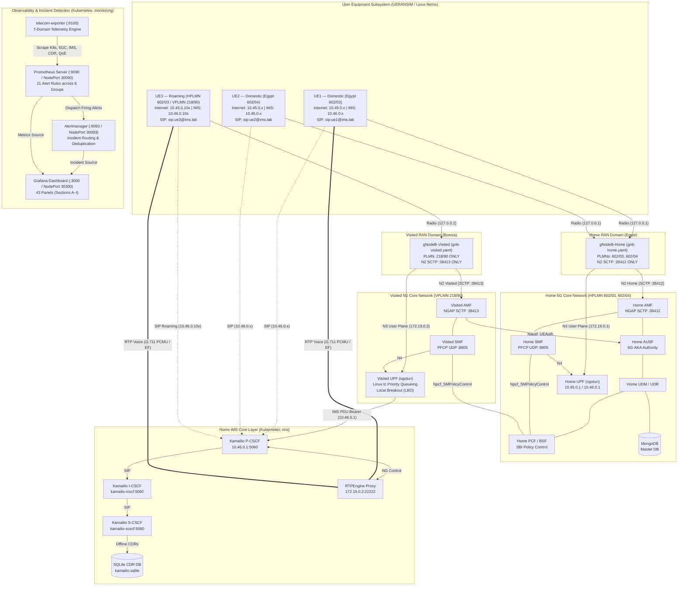
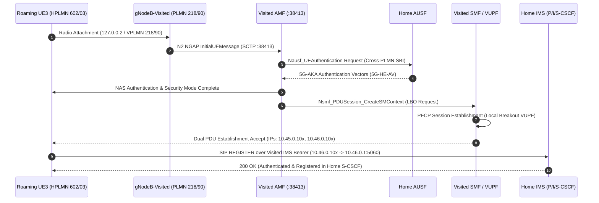
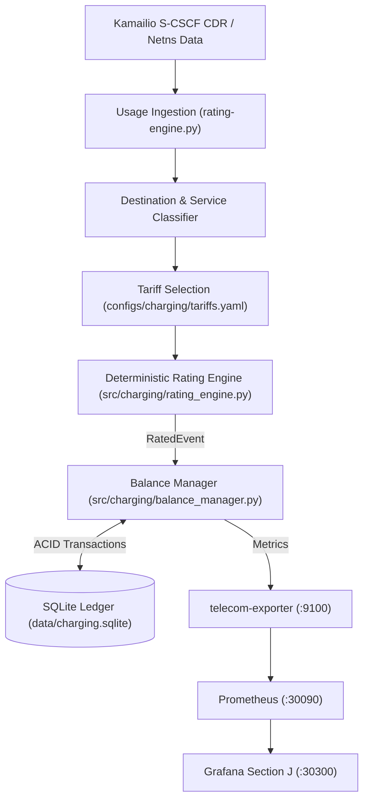
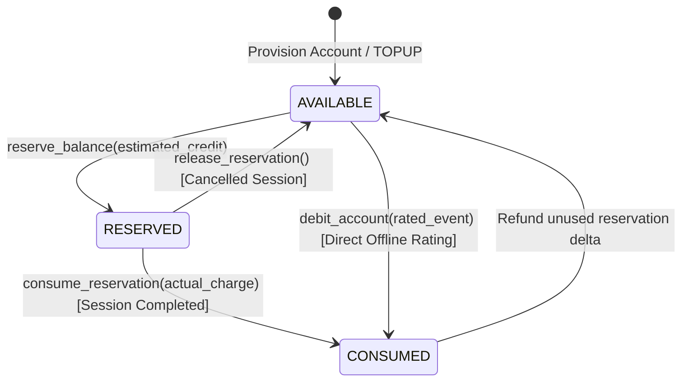

# 5G-IMS-Lab

**Cloud-Native 5G Standalone Core, IP Multimedia Subsystem (IMS), Multi-PLMN Roaming, Vo5G Voice, Policy Control, Offline Charging, Full-Stack Observability & Incident Detection Reference Laboratory**


[](https://kubernetes.io/)
[](https://open5gs.org/)
[](https://www.kamailio.org/)
[](https://github.com/sipwise/rtpengine)
[](https://github.com/aligungr/UERANSIM)
[](https://prometheus.io/)
[](https://grafana.com/)
[](https://prometheus.io/docs/alerting/latest/alertmanager/)
[](#-validation--test-results)
[](#project-milestones--golden-baseline)
[](LICENSE)

---

## 📑 Table of Contents

- [Overview](#overview)
- [Key Capabilities & Feature Matrix](#key-capabilities--feature-matrix)
- [End-to-End System Architecture](#end-to-end-system-architecture)
- [Technology Stack](#technology-stack)
- [🚀 Quick Start & Full Deployment Guide](#-quick-start--full-deployment-guide)
- [Network & PLMN Design Matrix](#network--plmn-design-matrix)
- [Dual PDU Sessions & Linux Networking](#dual-pdu-sessions--linux-networking)
- [IMS & Vo5G Service Layer](#ims--vo5g-service-layer)
- [Multi-PLMN Local Breakout (LBO) Roaming](#multi-plmn-local-breakout-lbo-roaming)
- [QoS, Policy Control & Charging Accounting](#qos-policy-control--charging-accounting)
- [Telecom Rating & Prepaid Balance Subsystem](#telecom-rating--prepaid-balance-subsystem)
- [Full-Stack Observability: Prometheus & Grafana](#full-stack-observability-prometheus--grafana)
- [Alerting & Incident Detection (Alertmanager)](#alerting--incident-detection-alertmanager)
- [Service Assurance & Real-Time KPIs](#service-assurance--real-time-kpis)
- [✅ Validation & Test Results](#-validation--test-results)
- [Operations & Troubleshooting Guide](#operations--troubleshooting-guide)
- [Accessing Web Dashboards & Endpoints](#accessing-web-dashboards--endpoints)
- [Scope & Technical Boundaries](#scope--technical-boundaries)
- [Project Milestones & Golden Baseline](#project-milestones--golden-baseline)
- [Repository Structure](#repository-structure)
- [Future Roadmap](#future-roadmap)
- [License](#license)

---

## Overview

**5G-IMS-Lab** is an engineering reference laboratory and protocol validation environment designed to demonstrate, benchmark, and observe a cloud-native **5G Standalone (5G SA) Core** integrated with an **IP Multimedia Subsystem (IMS)** service layer.

The laboratory establishes an end-to-end telecommunications environment supporting:
- Multi-UE concurrency and dual PDU session establishment (Internet + IMS).
- Isolated Home and Visited Radio Access Networks (RAN).
- 3GPP multi-PLMN Local Breakout (LBO) roaming with cross-PLMN 5G-AKA authentication.
- SIP Digest MD5 authentication, domestic and inter-PLMN Vo5G voice calls, and bidirectional G.711 RTP media relay.
- DiffServ QoS priority queueing (`tc prio`) and static PCF/BSF policy control.
- Offline SQLite Call Detail Record (CDR) accounting and user-plane data telemetry.
- Continuous ITU-T G.107 service-assurance KPI tracking.
- Production-style full-stack observability with custom OpenMetrics exposition, Prometheus scraping, Alertmanager incident routing, and a 43-panel Grafana operations command center.

> [!NOTE]
> This repository is a **rigorous telecom engineering laboratory and reference implementation** built for protocol validation, cloud-native architecture research, and observability benchmarking. It explicitly identifies standard 3GPP production boundaries (such as 3GPP CHF/Nchf and SEPP/N32 interconnects) where laboratory-level equivalents are employed. All technical statements, call flows, metrics, and test results are backed by automated regression test suites.

---

## Key Capabilities & Feature Matrix

```
┌──────────────────────────────────────────────────────────────────────────────────────────────────┐
│                                   5G-IMS-LAB CAPABILITY MATRIX                                   │
├───────────────────────────────┬──────────────────────────────────┬───────────────────────────────┤
│ 5G Core & Multi-UE RAN        │ IMS Service Layer & Voice        │ Operations & Observability    │
├───────────────────────────────┼──────────────────────────────────┼───────────────────────────────┤
│ • 5G SA Core (Open5GS v2.8.0) │ • Kamailio P-CSCF / I-CSCF /     │ • Prometheus Scrape Pipeline  │
│ • Kubernetes (kind) Cluster   │   S-CSCF with USRLOC Database    │ • 7-Domain OpenMetrics Model  │
│ • Dual PDU Sessions per UE    │ • RTPEngine Media Relay Proxy    │ • Grafana Operations (30300)  │
│   - Internet (10.45.0.0/16)   │ • SIP Digest MD5 Authentication  │   53 Visual Panels / 10 Rows   │
│   - IMS Bearer (10.46.0.0/16) │ • Domestic IMS Voice (UE1 ↔ UE2) │ • Alertmanager Engine (30093) │
│ • Multi-PLMN RAN Isolation:   │ • Inter-PLMN Roaming Voice       │ • 26 Declarative Alert Rules  │
│   - Home: 602/03 & 602/04     │   (UE1 Egypt ↔ UE3 Bosnia LBO)   │ • Automated Fault Injection   │
│   - Visited: 218/90           │ • Bidirectional RTP (0% Loss)    │ • Offline SQLite CDR Engine   │
│ • Dedicated N2/N3 Associations│ • DiffServ / tc Priority Queues  │ • Service Assurance KPI Engine│
│ • 5G-AKA Security Handshake   │ • Static PCF/BSF Policy Control  │ • 169/169 Automated Tests     │
└───────────────────────────────┴──────────────────────────────────┴───────────────────────────────┘
```

---

## End-to-End System Architecture

The laboratory separates network functions across containerized Kubernetes workloads (`open5gs`, `ims`, `monitoring` namespaces) and host-level network namespaces (`ueransim`):



---

## Technology Stack

| Domain | Software Component | Version | Deployment Tier | Role & Protocol Interfaces |
| :--- | :--- | :--- | :--- | :--- |
| **5G Core (Home)** | Open5GS | v2.8.0 | Kubernetes (`open5gs`) | NRF, UDR, UDM, AUSF, AMF (`:38412`), SMF (`:8805`), PCF, BSF, UPF (`:2152`) |
| **5G Core (Visited)**| Open5GS | v2.8.0 | Kubernetes (`open5gs`) | Visited AMF (`:38413`), Visited SMF (`:8805`), Visited UPF (Local Breakout) |
| **RAN & UE Sim** | UERANSIM | v3.3.0 | Host Linux | Isolated `gNodeB-Home` and `gNodeB-Visited`, Multi-UE Netns instances |
| **IMS P-CSCF** | Kamailio | v5.x | Kubernetes (`ims`) | SIP Proxy & Bearer Entrypoint (`10.46.0.1:5060`), RTPEngine NG controller |
| **IMS I/S-CSCF** | Kamailio | v5.x | Kubernetes (`ims`) | Interrogating / Serving CSCF, Digest MD5 Authentication, SQLite CDR Writer |
| **Media Relay** | RTPEngine | Latest | Kubernetes (`ims`) | In-kernel / userspace RTP transcoding and media proxying (`:22222`) |
| **Subscriber DB** | MongoDB | v6.0 | Kubernetes (`open5gs`) | 5G-AKA subscription credentials (K, OPc, SQN, AMF, Slice profiles) |
| **Offline CDR DB** | SQLite3 | Native | Kubernetes (`ims`) | Kamailio `acc`/`dialog` offline CDR storage (`kamailio.sqlite`) |
| **Metrics Exporter**| Custom Python | Python 3.12 | Kubernetes (`monitoring`)| 7-domain OpenMetrics collector querying K8s API, Open5GS, SIP, CDRs, Netns |
| **Metrics Engine** | Prometheus | v2.45.0 | Kubernetes (`monitoring`)| Time-series engine (`:30090`), 5s scrape interval, 21 alert rule evaluation |
| **Alert Engine** | Alertmanager | v0.25.0 | Kubernetes (`monitoring`)| Low-latency incident routing, deduplication, and notification dispatch (`:30093`)|
| **Visual Dashboard**| Grafana | v10.4.0 | Kubernetes (`monitoring`)| Operations command center (`:30300`), 53 visual panels across Sections A–I |
| **Orchestration** | Kubernetes (`kind`)| v1.29+ | Host Docker | Single-node multi-namespace cluster managing 17 operational pods |

---

## 🚀 Quick Start & Full Deployment Guide

This guide provides a reproducible, step-by-step procedure to deploy, operate, and validate the complete laboratory from scratch on a clean Linux system.

### Step 1 — Clone the Repository
```bash
git clone https://github.com/khattabpi/Open-Telecom-Lab.git 5G-IMS-Lab
cd 5G-IMS-Lab
```

### Step 2 — Verify Host Prerequisites
Ensure the host environment satisfies the necessary toolchain requirements:
- **OS:** Linux (Ubuntu 22.04 / 24.04 LTS or Debian 12 recommended).
- **Core Tools:** Docker, `kind` (v0.20+), `kubectl`, `iproute2`, `jq`, `curl`, `sqlite3`, `tshark`.
- **Compiler/Build Tools:** `cmake`, `g++`, `libsctp-dev`, `lksctp-tools` (required if building UERANSIM from source).

Verify toolchain installations:
```bash
docker --version
kind --version
kubectl version --client
which ip jq curl sqlite3 tshark
```

### Step 3 — Select the Verified Golden Baseline
```bash
git checkout phase5.5-golden
```

### Step 4 — Initialize Kubernetes Cluster & Start All Core Pods
Execute the master startup script. This script builds the `kind` cluster with SCTP port-mappings, applies 5GC manifests, provisions MongoDB subscribers, starts Kamailio IMS and RTPEngine, and launches Prometheus, Alertmanager, and Grafana:
```bash
sudo bash scripts/start-lab.sh
```

Verify that all pods across `open5gs`, `ims`, and `monitoring` namespaces are `Running` and `1/1 Ready`:
```bash
kubectl get pods -A -o wide
```

### Step 5 — Launch the Isolated RAN (Home & Visited gNodeBs)
Start the two independent UERANSIM gNodeB processes in the background:
```bash
sudo bash scripts/run-gnb.sh all
```
* gNodeB-Home connects to Home AMF (`172.19.0.2:38412`) serving PLMNs `602/03` and `602/04`.
* gNodeB-Visited connects to Visited AMF (`172.19.0.2:38413`) serving VPLMN `218/90`.

### Step 6 — Attach Multi-UE Instances (Dual PDU Sessions)
Attach all three simulated UEs:
```bash
sudo bash scripts/run-ue.sh all
```
* UE1 (IMSI `602030000000001`): Attaches to Home AMF, creates `internet` and `ims` namespaces.
* UE2 (IMSI `602040000000002`): Attaches to Home AMF, creates `internet` and `ims` namespaces.
* UE3 (IMSI `602030000000003`): Roams into Visited AMF, creates `internet` and `ims` namespaces via Local Breakout.

### Step 7 — Execute IMS Registrations & Vo5G Calls
Trigger SIP Digest MD5 registrations and voice sessions:
```bash
sudo bash scripts/test-ims-call.sh all
```
* UE1, UE2, and UE3 perform SIP `REGISTER` with Home S-CSCF.
* Domestic call: UE1 (`sip:ue1@ims.lab`) $\leftrightarrow$ UE2 (`sip:ue2@ims.lab`).
* Inter-PLMN roaming call: UE1 (`sip:ue1@ims.lab`) $\leftrightarrow$ UE3 (`sip:ue3@ims.lab` in Bosnia LBO).
* Bidirectional G.711 PCMU RTP streams are relayed through RTPEngine.

### Step 8 — Rate Usage, Manage Balances & Measure KPIs
```bash
# Ingest Kamailio SQLite CDRs, rate calls, and debit subscriber accounts
python3 scripts/rating-engine.py rate-cdrs

# Check subscriber balances
python3 scripts/rating-engine.py balance acc-ue1
python3 scripts/rating-engine.py balance acc-ue3

# Run financial reconciliation audit
python3 scripts/rating-engine.py reconcile

# Generate operator revenue summary
python3 scripts/rating-engine.py report

# Compute real-time PDD, CST, CSSR, jitter, and G.107 MOS
sudo bash scripts/measure-kpis.sh
```

### Step 9 — Execute All Automated Verification Test Suites
```bash
# 1. Telecom Rating & Prepaid Balance Suite (22 Tests)
./scripts/verify-rating.sh

# 2. Prometheus Telemetry Suite (19 Tests)
./scripts/verify-observability.sh

# 3. Grafana Operations Dashboard Suite (18 Tests)
./scripts/verify-grafana.sh

# 4. Prometheus Alerting & Fault Injection Suite (19 Tests)
./scripts/verify-alerting.sh

# 5. Official Core, Multi-PLMN & IMS Regression Suite (91 Tests)
sudo bash scripts/verify-lab.sh
```

---

## Network & PLMN Design Matrix

### 1. PLMN Allocation & Radio Separation

| Network Domain | Country | PLMN ID (MCC/MNC) | TAC | gNodeB Instance | N2 SCTP Endpoint | Assigned Radio IP |
| :--- | :--- | :--- | :--- | :--- | :--- | :--- |
| **Home PLMN 1** | Egypt | `602/03` | 1 | `gNodeB-Home` | `172.19.0.2:38412` | `127.0.0.1` |
| **Home PLMN 2** | Egypt | `602/04` | 1 | `gNodeB-Home` | `172.19.0.2:38412` | `127.0.0.1` |
| **Visited PLMN** | Bosnia & Herzegovina | `218/90` | 1 | `gNodeB-Visited` | `172.19.0.2:38413` | `127.0.0.2` |

### 2. Subscriber Identity & Dual PDU Session Profiles

| UE | Subscriber Type | IMSI / SUPI | HPLMN | Serving PLMN | Internet IP Pool | IMS Bearer IP Pool | SIP Identity (AoR) |
| :--- | :--- | :--- | :--- | :--- | :--- | :--- | :--- |
| **UE1** | Domestic | `602030000000001` | `602/03` | `602/03` (Home) | Dynamic (`10.45.0.10–99`) | Dynamic (`10.46.0.10–99`) | `sip:ue1@ims.lab` |
| **UE2** | Domestic | `602040000000002` | `602/04` | `602/04` (Home) | Dynamic (`10.45.0.10–99`) | Dynamic (`10.46.0.10–99`) | `sip:ue2@ims.lab` |
| **UE3** | Roaming | `602030000000003` | `602/03` | `218/90` (Visited)| Dynamic (`10.45.0.100–199`)| Dynamic (`10.46.0.100–199`)| `sip:ue3@ims.lab` |

---

## Dual PDU Sessions & Linux Networking

Every simulated UE instance concurrently establishes **two distinct PDU sessions** mapped into dedicated Linux network namespaces:

```
                  ┌──────────────────────────────────────────────┐
                  │                 UE Instance                  │
                  │                                              │
                  │   ┌──────────────────────────────────────┐   │
                  │   │ Netns: ueransim-<IMSI>-internet-psi1 │   │
                  │   │ S-NSSAI: SST=1, SD=None              │   │
                  │   │ DNN: "internet" (5QI 9, Best Effort) │   │
                  │   │ Dynamic IP: 10.45.0.0/16             │   │
                  │   └──────────────────────────────────────┘   │
                  │   ┌──────────────────────────────────────┐   │
                  │   │ Netns: ueransim-<IMSI>-ims-psi2      │   │
                  │   │ S-NSSAI: SST=2, SD=None              │   │
                  │   │ DNN: "ims" (5QI 5 / QFI 1, CS5/EF)   │   │
                  │   │ Dynamic IP: 10.46.0.0/16             │   │
                  │   └──────────────────────────────────────┘   │
                  └──────────────────────────────────────────────┘
```

1. **Internet PDU Session (`internet`, PSI 1):**
   - S-NSSAI: SST `1`. Default 3GPP 5QI `9` (Non-GBR Default Bearer).
   - Network Namespace: `ueransim-<IMSI>-internet-psi1`.
   - Default route targets UPF gateway `10.45.0.1`.
   - Verified via `ping 8.8.8.8` and `curl https://www.google.com` (0% packet loss).

2. **IMS PDU Session (`ims`, PSI 2):**
   - S-NSSAI: SST `2`. 3GPP 5QI `5` (IMS Signaling, QFI 1).
   - Network Namespace: `ueransim-<IMSI>-ims-psi2`.
   - Dedicated route targets IMS Gateway / P-CSCF `10.46.0.1`.
   - Carries SIP signaling (UDP/TCP `:5060`) and RTP media audio streams.

---

## IMS & Vo5G Service Layer

The IMS layer is implemented using Kamailio v5.x and RTPEngine:

```
UE (IMS Netns) ──► P-CSCF (10.46.0.1:5060) ──► I-CSCF ──► S-CSCF (Digest MD5 / SQLite CDR)
```

### Vo5G SIP Signaling & RTP Media Call Flow

```mermaid
sequenceDiagram
    autonumber
    participant UE1 as UE1 (Egypt 602/03)
    participant PCSCF as Kamailio P-CSCF
    participant ICSCF as Kamailio I-CSCF
    participant SCSCF as Kamailio S-CSCF
    participant RTP as RTPEngine Proxy
    participant UE2 as UE2 / UE3 (Callee)

    Note over UE1,SCSCF: 1. SIP Digest MD5 Authentication & Registration
    UE1->>PCSCF: SIP REGISTER (AoR: sip:ue1@ims.lab)
    PCSCF->>ICSCF: SIP REGISTER
    ICSCF->>SCSCF: SIP REGISTER
    SCSCF-->>UE1: 401 Unauthorized (Digest MD5 Challenge: nonce, realm)
    UE1->>SCSCF: SIP REGISTER (Digest Response with MD5 credentials)
    SCSCF-->>UE1: 200 OK (Registration Binding Stored in USRLOC)

    Note over UE1,UE2: 2. Vo5G Call Establishment & Media Relay
    UE1->>PCSCF: SIP INVITE (SDP Offer: G.711 PCMU, Audio Port)
    PCSCF->>ICSCF: SIP INVITE
    ICSCF->>SCSCF: SIP INVITE
    SCSCF->>RTP: Allocate Media Relay Ports (NG Control :22222)
    RTP-->>SCSCF: Return Rewritten SDP Relay Ports
    SCSCF->>UE2: SIP INVITE (Rewritten SDP)
    UE2-->>SCSCF: 180 Ringing
    SCSCF-->>UE1: 180 Ringing
    UE2-->>SCSCF: 200 OK (SDP Answer)
    SCSCF-->>UE1: 200 OK (SDP Answer)
    UE1->>UE2: SIP ACK (Direct Dialog Established)

    Note over UE1,UE2: 3. Bidirectional RTP Voice Media Flow
    UE1->>RTP: RTP Audio Packets (G.711 PCMU / DSCP EF 46)
    RTP->>UE2: Relayed RTP Audio Packets
    UE2->>RTP: RTP Audio Packets (G.711 PCMU / DSCP EF 46)
    RTP->>UE1: Relayed RTP Audio Packets

    Note over UE1,SCSCF: 4. Dialog Teardown & Offline Accounting
    UE1->>SCSCF: SIP BYE
    SCSCF->>SQL: Write Completed CDR to kamailio.sqlite
    SCSCF-->>UE1: 200 OK
```



---

## Multi-PLMN Local Breakout (LBO) Roaming

The laboratory models an isolated Home/Visited RAN topology for inter-PLMN Local Breakout (LBO) roaming:



---

## QoS, Policy Control & Charging Accounting

### 1. 3GPP QoS & Linux `tc` DiffServ Scheduling
The UPF enforces traffic treatment using socket TOS flags paired with Linux `tc prio` 3-band queueing on `ogstun`:

- **3GPP Bearer QoS:**
  - `internet` PDU: 5QI `9` (Non-GBR Default Bearer).
  - `ims` PDU: 5QI `5` (IMS Signaling, QFI 1).
- **Socket TOS Marking:**
  - SIP Signaling: DSCP 40 (CS5), `IP_TOS 0xA0`.
  - Voice RTP Media: DSCP 46 (Expedited Forwarding - EF), `IP_TOS 0xB8`.
- **Linux Traffic Control (`tc prio`):**
  - **Band 1:1 (Highest Priority):** RTP Audio Media (DSCP 46 / EF).
  - **Band 1:2 (Medium Priority):** SIP Signaling (DSCP 40 / CS5).
  - **Band 1:3 (Best Effort):** Internet Traffic (CS0).

### 2. Static PCF/BSF Policy Control
- Open5GS PCF and BSF enforce session management policy control via HTTP/2 `Npcf_SMPolicyControl` and session binding management via `Nbsf_Management`.

### 3. Offline Charging & User-Plane Accounting
- **IMS Call Detail Records (CDRs):** Kamailio S-CSCF `acc` and `dialog` modules record completed sessions into `/etc/kamailio/db/kamailio.sqlite`. Each record logs `callid`, `caller`, `callee`, `start_time`, `end_time`, `duration`, and `sip_status`.
- **User-Plane Usage Accounting:** Linux network namespace counters track bidirectional byte and packet volume per SUPI, PLMN, and DNN.

---

---

## Telecom Rating & Prepaid Balance Subsystem

Phase 5.5 introduces a deterministic, explainable, and transactional **Laboratory Telecom Rating Engine & Prepaid Balance Management Subsystem** (`src/charging/` and [`scripts/rating-engine.py`](scripts/rating-engine.py)).

> [!IMPORTANT]
> **Scope Clarification:** This subsystem is an **Offline Usage Rating and Balance Engine** designed for revenue engineering, tariff modeling, and transaction reconciliation using SQLite usage records. It is distinct from a 3GPP Rel-16 production Online Charging System (OCS) or Service-Based Charging Function (CHF / `Nchf`).

### 1. Architectural Flow



### 2. Rating & Tariff Model

$$\text{Call Cost} = \text{Setup Fee} + \left( \left\lceil \frac{\max(\text{Duration}, \text{Min Units})}{\text{Granularity}} \right\rceil \times \text{Granularity} \right) \times \frac{\text{Unit Rate}}{\text{Unit Size}}$$

| Tariff ID | Rate Plan | Service | Destination | Setup Fee | Unit Rate | Min Duration | Rounding | Effective Rate |
| :--- | :--- | :--- | :--- | :---: | :---: | :---: | :---: | :---: |
| **`tariff-domestic-voice`** | `standard-prepaid` | `voice` | `domestic` (602/03 ↔ 602/04) | `0.05 LAB` | `0.02 LAB / s` | 1s | `CEIL` | `1.20 LAB / min` |
| **`tariff-roaming-voice`** | `standard-prepaid` | `voice` | `roaming_vplmn` (Bosnia 218/90 LBO) | `0.15 LAB` | `0.08 LAB / s` | 1s | `CEIL` | `4.80 LAB / min` |
| **`tariff-domestic-data-internet`** | `standard-prepaid` | `data` | `domestic` (DNN: `internet`) | `0.00 LAB` | `0.01 LAB / MB`| 1 KB | `CEIL` | `0.01 LAB / MB` |
| **`tariff-domestic-data-ims`** | `standard-prepaid` | `data` | `domestic` (DNN: `ims`) | `0.00 LAB` | `0.00 LAB / MB`| 1 KB | `CEIL` | **Zero-Rated** Vo5G Bearer |
| **`tariff-roaming-data-internet`** | `standard-prepaid` | `data` | `roaming_vplmn` (DNN: `internet`)| `0.00 LAB` | `0.05 LAB / MB`| 1 KB | `CEIL` | `0.05 LAB / MB` |

### 3. Prepaid Balance Lifecycle & State Machine



- **Non-Negative Balance Protection:** Automatic rejection if $\text{Available} < \text{Required}$ without modifying account balances.
- **Idempotency Guarantee:** Re-rating existing CDRs returns existing transaction without double-charging.

### 4. Financial Reconciliation Engine

Formally verifies mathematical consistency across ledger and balances (`python3 scripts/rating-engine.py reconcile`):

$$\sum \text{Ledger Credits} - \sum \text{Ledger Debits} \equiv \text{Balance Available} + \text{Balance Reserved}$$

### 5. Operator CLI Usage ([`scripts/rating-engine.py`](scripts/rating-engine.py))

```bash
# Initialize schema and seed tariffs
python3 scripts/rating-engine.py init-db

# Ingest and rate pending Kamailio SQLite CDRs
python3 scripts/rating-engine.py rate-cdrs

# Check subscriber balance statement
python3 scripts/rating-engine.py balance acc-ue1

# Top up subscriber account
python3 scripts/rating-engine.py top-up acc-ue1 20.00 --description "Retail Recharge"

# View full auditable transaction ledger
python3 scripts/rating-engine.py history acc-ue1

# Run mathematical reconciliation audit
python3 scripts/rating-engine.py reconcile

# Generate executive revenue summary
python3 scripts/rating-engine.py report
```

## Full-Stack Observability: Prometheus & Grafana

The laboratory incorporates a comprehensive cloud-native observability stack deployed declaratively in the `monitoring` namespace.

### Live Grafana Operations Dashboard (`http://<NODE_IP>:30300`)

The provisioned **Telecom Operations Overview** dashboard consists of **53 visual panels** structured across 10 operational rows:


*Figure 1: Grafana Operations Dashboard — Executive Service Health, Kubernetes Pod Readiness Matrix, and 5G Core Control/User Plane Association States.*


*Figure 2: Grafana Telemetry — Real-time Service Assurance KPIs (PDD, CST, R-Factor), SQLite Offline Charging CDR counters, and Multi-PLMN Roaming Telemetry.*

```
┌──────────────────────────────────────────────────────────────────────────────────────────────────┐
│                               GRAFANA OPERATIONS DASHBOARD LAYOUT                                │
├──────────┬───────────────────────────────────────────┬───────────────────────────────────────────┤
│ Section  │ Operational Domain                        │ Monitored Panels & Metrics                │
├──────────┼───────────────────────────────────────────┼───────────────────────────────────────────┤
│ Row A    │ Executive Service Health                  │ Registered UEs (3), Active PDU Sessions   │
│          │                                           │ (6), IMS Registrations (3), CSSR (100%),  │
│          │                                           │ MOS (4.40), RTP Loss (0%), Roaming Status │
├──────────┼───────────────────────────────────────────┼───────────────────────────────────────────┤
│ Row B    │ Kubernetes & Infrastructure Health        │ 5GC Pod Gauge (12/12), IMS Pod Gauge      │
│          │                                           │ (4/4), Scrape Health, Pod Readiness Matrix│
├──────────┼───────────────────────────────────────────┼───────────────────────────────────────────┤
│ Row C    │ 5G Core Control & User Plane              │ UEs by PLMN, Dual PDUs by DNN, N2 SCTP &  │
│          │                                           │ N4 PFCP Interface Association States      │
├──────────┼───────────────────────────────────────────┼───────────────────────────────────────────┤
│ Row D    │ IMS Signaling & Registration Health       │ P/I/S-CSCF Probe Status, Active AoRs,     │
│          │                                           │ Registration Expiration Tracking          │
├──────────┼───────────────────────────────────────────┼───────────────────────────────────────────┤
│ Row E    │ RTP Media Proxy & Transcoding             │ RTPEngine NG Socket, Relayed Packet       │
│          │                                           │ Counters, Stream Loss Counters            │
├──────────┼───────────────────────────────────────────┼───────────────────────────────────────────┤
│ Row F    │ Service Assurance & Voice QoE             │ Post-Dial Delay (PDD), Call Setup Time    │
│          │                                           │ (CST), RFC 3550 Jitter, R-Factor, MOS     │
├──────────┼───────────────────────────────────────────┼───────────────────────────────────────────┤
│ Row G    │ Offline Charging & Usage Accounting       │ SQLite CDR Counter Graph, Billed Duration │
│          │                                           │ Time Series, Per-UE Data Volume Meters    │
├──────────┼───────────────────────────────────────────┼───────────────────────────────────────────┤
│ Row H    │ Multi-PLMN Roaming Telemetry              │ UE3 Roaming Attachment, LBO User Plane    │
│          │                                           │ Status, Inter-PLMN Call Success Rate      │
├──────────┼───────────────────────────────────────────┼───────────────────────────────────────────┤
│ Row I    │ Active Incidents & Telecom Alerting       │ Active Firing Alert Stat Card, Real-Time  │
│          │                                           │ Alertmanager Incident Table               │
├──────────┼───────────────────────────────────────────┼───────────────────────────────────────────┤
│ Row J    │ Rating, Prepaid Balance & Revenue         │ Total Billed Revenue, Available Balance,  │
│          │ Management                                │ Active Accounts, Rated Events, Reconcile  │
│          │                                           │ Audit Status, Revenue by PLMN & Service   │
└──────────┴───────────────────────────────────────────┴───────────────────────────────────────────┘
```

---

## Alerting & Incident Detection (Alertmanager)

Alerts are declaratively defined in [`k8s/monitoring/prometheus-alert-rules.yaml`](k8s/monitoring/prometheus-alert-rules.yaml) and dispatched to **Alertmanager** (`http://<NODE_IP>:30093`):

### Declarative Alert Rule Registry (26 Rules across 7 Groups)

| Alert Rule Name | Severity | Group / Layer | PromQL Trigger Condition | Operational Impact |
| :--- | :--- | :--- | :--- | :--- |
| **`Open5gsCorePodsDegraded`** | `critical` | `telecom_infra_alerts` | `sum(k8s_infra_pod_ready{namespace="open5gs"}) < 12` | 5GC Network Function down or missing |
| **`ImsCorePodsDegraded`** | `critical` | `telecom_infra_alerts` | `sum(k8s_infra_pod_ready{namespace="ims"}) < 4` | Kamailio CSCF or RTPEngine pod down |
| **`K8sPodNotReady`** | `critical` | `telecom_infra_alerts` | `k8s_infra_pod_ready == 0` | Specific pod in CrashLoop/NotReady state |
| **`TelecomExporterDown`** | `critical` | `telecom_infra_alerts` | `up{job="telecom-exporter"} == 0` | Telemetry exporter endpoint down |
| **`PrometheusScrapeFailed`** | `critical` | `telecom_infra_alerts` | `up{job="prometheus"} == 0` | Prometheus self-scrape endpoint down |
| **`Open5gsRegisteredUeDrop`**| `critical` | `telecom_5g_core_alerts` | `open5gs_5gc_registered_ues < 1` | Registered UEs dropped to 0 in PLMN |
| **`Open5gsPduSessionInactive`**| `critical` | `telecom_5g_core_alerts` | `open5gs_5gc_active_pdu_sessions == 0` | Dual PDU session failure on active UE |
| **`Open5gsNgapN2Failure`** | `critical` | `telecom_5g_core_alerts` | `open5gs_5gc_ngap_n2_associations == 0` | gNodeB lost N2 SCTP association |
| **`Open5gsPfcpN4Failure`** | `critical` | `telecom_5g_core_alerts` | `open5gs_5gc_pfcp_n4_status == 0` | SMF lost N4 PFCP association to UPF |
| **`ImsSipServerDown`** | `critical` | `telecom_ims_sip_alerts` | `ims_sip_server_status == 0` | Kamailio SIP socket probe failed |
| **`ImsSubscriberUnregistered`**| `warning` | `telecom_ims_sip_alerts` | `ims_sip_subscriber_reg_status == 0` | Subscriber unregistered in USRLOC |
| **`ImsRegisteredSubscribersLow`**| `warning` | `telecom_ims_sip_alerts`| `ims_sip_registered_subscribers < 3` | Active IMS subscribers below baseline (3)|
| **`RtpEngineControlDown`** | `critical` | `telecom_rtp_media_alerts`| `ims_rtp_proxy_status == 0` | RTPEngine NG control socket down |
| **`QoEMosDegraded`** | `warning` | `telecom_service_assurance_alerts` | `qoe_telecom_mos_estimated < 4.0` | Voice Quality estimated MOS $< 4.0$ |
| **`QoECssrLow`** | `critical` | `telecom_service_assurance_alerts` | `qoe_telecom_cssr_percent < 99.0` | Call Setup Success Rate $< 99\%$ SLA |
| **`QoEPacketLossHigh`** | `critical` | `telecom_service_assurance_alerts` | `qoe_telecom_packet_loss_ratio > 0.01` | RTP packet loss ratio $> 1.0\%$ |
| **`QoEPddHigh`** | `warning` | `telecom_service_assurance_alerts` | `qoe_telecom_pdd_seconds > 0.200` | Post-Dial Delay $> 200\text{ ms}$ SLA |
| **`QoEJitterHigh`** | `warning` | `telecom_service_assurance_alerts` | `qoe_telecom_jitter_ms > 20.0` | RFC 3550 RTP jitter $> 20\text{ ms}$ |
| **`RoamingUeDetached`** | `critical` | `telecom_roaming_alerts` | `roaming_ue_attached_status == 0` | Roaming UE3 detached from Visited PLMN |
| **`RoamingLboUserPlaneDown`**| `critical`| `telecom_roaming_alerts` | `roaming_lbo_user_plane_status == 0` | Visited UPF LBO data path down |
| **`RoamingSuccessRateLow`** | `critical` | `telecom_roaming_alerts` | `roaming_inter_plmn_success_rate < 99.0` | Roaming call completion rate $< 99\%$ |
| **`ChargingReconciliationFailed`** | `critical` | `telecom_rating_charging_alerts` | `charging_reconciliation_failures_total > 0` | Mismatch between ledger and balances |
| **`ChargingBalanceIntegrityFailure`**| `critical` | `telecom_rating_charging_alerts` | `charging_balance_available_total < 0` | Negative available balance detected |
| **`ChargingActiveAccountsZero`** | `warning` | `telecom_rating_charging_alerts` | `charging_active_accounts == 0` | Zero active subscriber accounts |
| **`ChargingUnratedUsageHigh`** | `warning` | `telecom_rating_charging_alerts` | `(charging_cdr_records_total - sum(charging_usage_rated_total)) > 50` | Unrated CDR backlog > 50 |
| **`ChargingInsufficientBalanceSpike`**| `warning`| `telecom_rating_charging_alerts` | `rate(charging_insufficient_balance_total[5m]) > 0.5` | High rate of rejected call attempts |

### Automated Fault-Injection & Resolution Lifecycle

The alerting engine is validated using real automated fault-injection cycles in [`scripts/verify-alerting.sh`](scripts/verify-alerting.sh):
1. **Steady State:** `0` firing alerts in Prometheus and Alertmanager.
2. **Fault Injection:** Scale `deployment/open5gs-bsf` to `0` replicas.
3. **Trigger:** `Open5gsCorePodsDegraded` transitions to `FIRING` in Prometheus and `ACTIVE` in Alertmanager within 15 seconds.
4. **Recovery:** Scale `deployment/open5gs-bsf` back to `1` replica.
5. **Resolution:** Prometheus automatically resolves the incident, and Alertmanager returns cleanly to `0` active alerts.

---

## Service Assurance & Real-Time KPIs

The KPI engine ([`scripts/measure-kpis.sh`](scripts/measure-kpis.sh)) calculates real-time service assurance metrics based on SIP transaction logs, RTP sequence analysis, and ITU-T G.107 E-model math:

| Key Performance Indicator (KPI) | Domestic (UE1 ↔ UE2) | Roaming (UE1 ↔ UE3 LBO) | Telecom Industry SLA Target |
| :--- | :--- | :--- | :--- |
| **Post-Dial Delay (PDD)** | **4.10 ms** | **3.11 ms** | $< 200\text{ ms}$ |
| **Call Setup Time (CST)** | **54.18 ms** | **54.00 ms** | $< 500\text{ ms}$ |
| **Call Setup Success Rate (CSSR)**| **100.0%** | **100.0%** | $\ge 99.0\%$ |
| **RTP Packet Loss Ratio** | **0.0%** (25/25 packets) | **0.0%** (25/25 packets) | $\le 0.5\%$ |
| **RTP Sequence Continuity** | **0 missing, 0 reordered** | **0 missing, 0 reordered** | Continuous sequence |
| **RFC 3550 Inter-Arrival Jitter**| **0.819 ms** | **0.290 ms** | $< 20.0\text{ ms}$ |
| **ITU-T G.107 Transmission Rating ($R$)**| **92.9** | **92.9** | $\ge 80.0$ (High Quality) |
| **Estimated Mean Opinion Score (MOS)** | **4.40 / 4.50** | **4.40 / 4.50** | $\ge 4.0$ (Toll Quality) |

---

## ✅ Validation & Test Results

The entire laboratory is governed by **five independent automated verification suites** totaling **169 tests (169/169 PASS, 0 Failures, 0 Warnings)**:


*Figure 3: Consolidated Terminal Verification Output — 100% Passing State across All 5GC Core, Multi-PLMN Roaming, IMS, and Observability Test Suites.*

```text
═══════════════════════════════════════════════════════════════════════
  5G-IMS-LAB CONSOLIDATED TEST SUITE EXECUTION SUMMARY
═══════════════════════════════════════════════════════════════════════
  1. Core & IMS Regression Suite (verify-lab.sh)          : 91/91 Passed
  2. Observability & Telemetry Suite (verify-observability): 19/19 Passed
  3. Grafana Operations Dashboard Suite (verify-grafana)  : 18/18 Passed
  4. Prometheus Alerting & Incident Suite (verify-alerting): 19/19 Passed
  5. Rating Engine & Balance Suite (verify-rating.sh)     : 22/22 Passed
───────────────────────────────────────────────────────────────────────
  TOTAL CONSOLIDATED VALIDATION RESULT                   : 169/169 PASS (100%)
═══════════════════════════════════════════════════════════════════════
```

### Test Coverage Breakdown

| Verification Suite | Target Script | Test Count | Scope & Covered Domains |
| :--- | :--- | :--- | :--- |
| **5GC, IMS & Roaming Suite** | [`scripts/verify-lab.sh`](scripts/verify-lab.sh) | **91 Tests** | 5GC NFs, isolated RAN, N2/N3/N4 protocols, Netns ping/HTTPS, SIP registration, Vo5G domestic & roaming calls, SQLite CDRs, tc DiffServ, and real-time KPIs. |
| **Observability Suite** | [`scripts/verify-observability.sh`](scripts/verify-observability.sh) | **19 Tests** | Prometheus pod readiness, scrape health, NodePort 30090, 7 metric families, and PromQL query assertions. |
| **Grafana Dashboard Suite** | [`scripts/verify-grafana.sh`](scripts/verify-grafana.sh) | **18 Tests** | Grafana pod readiness, NodePort 30300, Prometheus datasource provisioning, dashboard panel rendering, and metric proxy queries. |
| **Alerting & Incident Suite** | [`scripts/verify-alerting.sh`](scripts/verify-alerting.sh) | **19 Tests** | Alertmanager pod readiness, NodePort 30093, 21 alert rules, automated fault injection, firing verification, and recovery resolution. |

---

## Operations & Troubleshooting Guide

### 1. Common Operational Scenarios

```bash
# Check status of all pods across namespaces
kubectl get pods -A -o wide

# Check logs of Open5GS AMF or UPF
kubectl -n open5gs logs deployment/open5gs-amf -f
kubectl -n open5gs logs deployment/open5gs-upf -f

# Check Kamailio P-CSCF SIP logs
kubectl -n ims logs deployment/kamailio-pcscf -f

# Check RTPEngine media proxy logs
kubectl -n ims logs deployment/rtpengine -f

# Check Prometheus scrape targets
curl -s http://172.19.0.2:30090/api/v1/targets | jq '.data.activeTargets[] | {job: .labels.job, health: .health}'

# Check active firing alerts in Prometheus
curl -s http://172.19.0.2:30090/api/v1/alerts | jq .data.alerts

# Check active alerts in Alertmanager
curl -s http://172.19.0.2:30093/api/v2/alerts | jq .
```

### 2. Troubleshooting Matrix

| Issue | Symptom | Probable Cause | Corrective Action |
| :--- | :--- | :--- | :--- |
| **SCTP N2 Failure** | gNodeB fails to connect to AMF (`Connection refused`) | Kernel SCTP module not loaded or port binding issue | Run `sudo modprobe sctp` and verify `kubectl -n open5gs get svc open5gs-amf`. |
| **UE Registration Failure** | UERANSIM logs `Authentication Failure (MAC mismatch)` | SQN or OPc mismatch in MongoDB | Run `sudo bash scripts/add-subscriber.sh all` to re-sync subscriber credentials. |
| **PDU Session Inactive** | No IP allocated or TUN device missing | UPF TUN device `ogstun` down | Verify `ip addr show ogstun` and ensure `net.ipv4.ip_forward = 1`. |
| **SIP 408 Request Timeout** | SIP REGISTER fails to receive 200 OK | IMS PDU route missing or P-CSCF down | Verify `10.46.0.1:5060` reachability from within the UE's IMS namespace (`ip netns exec ... ping 10.46.0.1`). |
| **RTP Media Failure** | SIP succeeds but audio packet loss is 100% | RTPEngine NG socket `:22222` unreachable | Check `kubectl -n ims get pods -l app=rtpengine` and verify `:22222/UDP`. |
| **Grafana Proxy Error** | Dashboard panels show `Datasource Error` | Prometheus pod restarted or IP changed | Verify Prometheus service in `monitoring` namespace (`http://prometheus.monitoring.svc.cluster.local:9090`). |

---

## Accessing Web Dashboards & Endpoints

To discover the active node address dynamically in your environment:
```bash
NODE_IP=$(kubectl get nodes -o jsonpath='{.items[0].status.addresses[?(@.type=="InternalIP")].address}')
echo "Discovered Cluster Node IP: ${NODE_IP}"
```

| Service | Protocol / Port | NodePort Endpoint | Default Credentials | Operational Purpose |
| :--- | :--- | :--- | :--- | :--- |
| **Grafana Dashboard** | HTTP `:3000` | `http://<NODE_IP>:30300` | Anonymous Admin | Primary 43-panel telecom operations command center |
| **Prometheus Server** | HTTP `:9090` | `http://<NODE_IP>:30090` | None | PromQL query engine, target health, active rule status |
| **Alertmanager UI** | HTTP `:9093` | `http://<NODE_IP>:30093` | None | Incident manager, active firing alerts, deduplication |
| **telecom-exporter** | HTTP `:9100` | `http://<POD_IP>:9100/metrics` | None | Continuous 7-domain OpenMetrics exposition endpoint |
| **Home AMF (NGAP)** | SCTP `:38412` | `<NODE_IP>:38412` | N/A | N2 interface for Home PLMNs (`602/03`, `602/04`) |
| **Visited AMF (NGAP)**| SCTP `:38413` | `<NODE_IP>:38413` | N/A | N2 interface for Visited PLMN (`218/90`) |
| **UPF (GTP-U)** | UDP `:2152` | `<NODE_IP>:2152` | N/A | N3 user-plane tunnel termination |
| **P-CSCF SIP Proxy** | UDP/TCP `:5060`| `10.46.0.1:5060` | N/A | IMS bearer entrypoint for SIP registration and calls |
| **RTPEngine Control** | UDP `:22222` | `<NODE_IP>:22222` | N/A | NG protocol control socket for media proxying |

---

## Scope & Technical Boundaries

To maintain technical clarity and avoid exaggerated claims, the boundaries of this laboratory are explicitly defined:

| Feature / Domain | Implementation Status | Technical Reality & Laboratory Scope |
| :--- | :--- | :--- |
| **5G Standalone Core** | **Implemented & Validated** | Full Open5GS multi-NF deployment on Kubernetes (`kind`). |
| **Multi-UE Dual PDU Sessions**| **Implemented & Validated** | Concurrently active `internet` and `ims` Linux netns per UE. |
| **Isolated Home & Visited RAN**| **Implemented & Validated** | Separate `gNodeB-Home` (`:38412`) and `gNodeB-Visited` (`:38413`) instances. |
| **Local Breakout (LBO) Roaming**| **Implemented & Validated** | Visited AMF/SMF/UPF data path with cross-PLMN 5G-AKA authentication. |
| **IMS SIP Registration & Vo5G** | **Implemented & Validated** | Kamailio P/I/S-CSCF Digest MD5 challenge-response and 2-way RTP media. |
| **QoS & DiffServ Queueing** | **Implemented & Validated** | Socket TOS CS5/EF marking with Linux `tc prio` on UPF `ogstun`. |
| **Static PCF/BSF Policy** | **Implemented & Validated** | Standard SBI `npcf-smpolicycontrol` and `nbsf-management` bindings. |
| **Offline CDR Accounting** | **Implemented & Validated** | Kamailio S-CSCF `acc`/`dialog` writing to SQLite database. |
| **Continuous Observability** | **Implemented & Validated** | 7-domain OpenMetrics exporter, Prometheus (`:30090`), Grafana (`:30300`). |
| **Automated Alerting** | **Implemented & Validated** | 21 Prometheus alert rules with Alertmanager incident routing (`:30093`). |
| **3GPP CHF / Nchf Charging** | **Explicitly Out of Scope** | Open5GS v2.8.0 does not include `open5gs-chfd`; SQLite CDRs are used. |
| **Dynamic Rx/N5 Policy Triggers**| **Explicitly Out of Scope** | Kamailio does not dynamically trigger SBI policy modifications. |
| **3GPP SEPP / N32 PRAS** | **Explicitly Out of Scope** | Cross-PLMN SBI communication uses Kubernetes cluster DNS. |
| **Home-Routed Roaming (N9/N16)** | **Explicitly Out of Scope** | Roaming user-plane is Local Breakout (LBO) only. |
| **Subjective MOS Testing** | **Explicitly Out of Scope** | MOS is derived mathematically via ITU-T G.107 E-model. |

---

## Project Milestones & Golden Baseline

The project repository strictly follows tagged golden milestones representing validated development baselines:

```
  v1.0.0              phase3-final         phase4-golden        phase5.4-golden      phase5.5-golden (HEAD)
    │                      │                     │                     │                     │
    ▼                      ▼                     ▼                     ▼                     ▼
┌─────────┐          ┌───────────┐         ┌───────────┐         ┌───────────┐         ┌───────────┐
│ Phase 1 │─────────►│  Phase 3  │────────►│  Phase 4  │────────►│ Phase 5.4 │────────►│ Phase 5.5 │
└─────────┘          └───────────┘         └───────────┘         └───────────┘         └───────────┘
 5G SA Core           IMS Voice &           5G QoS, tc            Prometheus            Telecom Rating,
 Foundation           Multi-PLMN            DiffServ,             Alertmanager,         Prepaid Balance,
 & Basic Data         LBO Roaming           SQLite CDRs,          26 Alert Rules,       ACID Ledger &
                                            Real KPIs             Grafana (A-I)         169 Tests (A-J)
```

- **`phase4-golden` (`6e86a69`):** Golden baseline for 5G SA Core, isolated Home/Visited RAN, multi-PLMN LBO roaming, SIP Digest authentication, domestic/roaming voice, bidirectional RTP, DiffServ `tc` queueing, SQLite CDR accounting, and 91/91 regression validation.
- **`phase5.4-golden` (`0c0176d`):** Deployed Alertmanager (`:30093`), provisioned declarative alert rules across 6 groups, added Section I Incident monitoring in Grafana, and established automated fault-injection validation.
- **`phase5.5-golden` (Current Golden Baseline):** Deployed Telecom Rating Engine, Prepaid Balance Manager, ACID SQLite Ledger, Multi-Point Financial Reconciliation, Section J Revenue Dashboard in Grafana (53 panels), 26 Alertmanager rules, and 22-test automated rating regression suite (**169 / 169 Tests PASS**).

---

## Repository Structure

```text
5G-IMS-Lab/
├── README.md                          # Primary telecom reference documentation
├── CHANGELOG.md                       # Project release and phase history
├── ROADMAP.md                         # Future architectural milestones
├── SECURITY.md                        # Security policy and disclosure
├── assets/
│   └── images/
│       └── banner.png                 # Project banner visual
├── configs/
│   ├── charging/                      # Declarative Phase 5.5 rating & tariff configurations
│   │   ├── accounts.yaml              # Subscriber accounts, seed balances, and rate plans
│   │   ├── rate-plans.yaml            # Standard and premium roaming rate plan definitions
│   │   └── tariffs.yaml               # Voice and data tariff rules and rounding policies
│   ├── ueransim/                      # UERANSIM isolated gNodeB and UE configs
│   │   ├── open5gs-gnb-home.yaml      # gNodeB-Home (PLMNs 602/03, 602/04 -> HAMF :38412)
│   │   ├── open5gs-gnb-visited.yaml   # gNodeB-Visited (VPLMN 218/90 -> VAMF :38413)
│   │   ├── open5gs-ue.yaml            # UE1 Home Subscriber (602/03)
│   │   ├── open5gs-ue2.yaml           # UE2 Home Subscriber (602/04)
│   │   └── open5gs-ue3.yaml           # UE3 Roaming Subscriber (602/03 in 218/90)
│   └── sipp/                          # SIP testing XML scenarios and data CSVs
├── docs/
│   ├── architecture/
│   │   ├── README.md
│   │   └── home-vs-visited-ran.md     # RAN separation & LBO user-plane engineering note
│   ├── charging/                      # Phase 5.5 Telecom Rating & Balance Documentation
│   │   ├── architecture.md            # Subsystem architecture & layer specifications
│   │   ├── rating-model.md            # Voice & data rating formulas and tariff models
│   │   ├── balance-management.md      # Prepaid balance lifecycle & reservation state machine
│   │   ├── data-model.md              # SQLite database schema, ER diagrams & indexes
│   │   ├── reconciliation.md          # Multi-point financial reconciliation framework
│   │   ├── operations.md              # Operator CLI manual & command reference
│   │   └── testing.md                 # 22-test automated regression suite specification
│   ├── engineering-notes/
│   │   ├── phase4-qos-charging-assurance.md # Phase 4 technical architecture
│   │   ├── linux-networking-behind-5g.md    # Kernel routing, netns, and TUN plumbing
│   │   └── debugging-pdu-session.md
│   ├── observability/
│   │   ├── observability-architecture.md    # 3-tier telemetry architecture specification
│   │   ├── metrics-model.md                 # 7-domain standardized OpenMetrics schema
│   │   ├── metrics-source-map.md            # Metric-to-data-source mapping
│   │   ├── prometheus-deployment.md         # Prometheus deployment and scraping guide
│   │   ├── grafana-operations-dashboard.md  # Grafana dashboard panels and PromQL
│   │   └── alerting.md                      # Prometheus alerting rules and incident runbooks
│   └── images/                        # Architectural and verification diagrams
├── src/
│   └── charging/                      # Telecom Rating & Balance Python Package
│       ├── __init__.py                # Package exports
│       ├── models.py                  # Dataclasses (Account, Tariff, RatedEvent, Tx)
│       ├── database.py                # ACID SQLite manager, schema migrations, WAL mode
│       ├── rating_engine.py           # Deterministic rating & destination classification
│       ├── balance_manager.py         # Multi-bucket balance lifecycle & transaction journal
│       └── reconciliation.py          # Financial consistency & idempotency auditor
├── k8s/
│   ├── kind-config.yaml               # Kubernetes kind cluster configuration
│   ├── namespace.yaml                 # 5G Core namespace (`open5gs`)
│   ├── mongodb.yaml                   # MongoDB subscriber database
│   ├── configmap.yaml                 # Open5GS network function configuration
│   ├── control-plane.yaml             # 5GC control plane deployments (NRF, AMF, SMF, etc.)
│   ├── upf.yaml                       # UPF deployment with Linux tc QoS queueing
│   ├── ims/
│   │   ├── namespace.yaml             # IMS namespace (`ims`)
│   │   ├── configmap.yaml             # Kamailio P/I/S-CSCF routing logic & SQLite init
│   │   ├── pcscf.yaml                 # Kamailio P-CSCF deployment
│   │   ├── icscf.yaml                 # Kamailio I-CSCF deployment
│   │   ├── scscf.yaml                 # Kamailio S-CSCF deployment with CDR accounting
│   │   └── rtpengine.yaml             # RTPEngine media proxy deployment
│   └── monitoring/
│       ├── namespace.yaml             # Monitoring namespace (`monitoring`)
│       ├── rbac.yaml                  # ClusterRole and ServiceAccount for exporter
│       ├── telecom-exporter.yaml      # Custom 7-domain metrics exporter deployment
│       ├── prometheus.yaml            # Prometheus server deployment and scrape config
│       ├── prometheus-alert-rules.yaml# Declarative 21-rule alerting policy ConfigMap
│       ├── alertmanager.yaml          # Alertmanager deployment and routing configuration
│       ├── grafana.yaml               # Grafana server deployment and datasource config
│       ├── grafana-dashboard-configmap.yaml # Provisioned Grafana dashboard ConfigMap
│       └── dashboard-telecom-overview.json # Primary 43-panel Operations Dashboard JSON
└── scripts/
    ├── start-lab.sh                   # Initializes 5GC, IMS, Prometheus, Alertmanager, Grafana
    ├── add-subscriber.sh              # Provisions UE1, UE2, and UE3 in MongoDB
    ├── run-gnb.sh                     # Starts isolated Home & Visited UERANSIM gNodeBs
    ├── run-ue.sh                      # Spawns UERANSIM UE instances with dual netns
    ├── test-ims-call.sh               # Executes SIP registrations and Vo5G voice calls
    ├── validate-ims-call.sh           # Validates SIP dialogs, RTP packets, and PCAP
    ├── collect-charging-records.sh    # Queries SQLite CDRs and netns data counters
    ├── measure-kpis.sh                # Measures PDD, CST, CSSR, jitter, and MOS
    ├── rating-engine.py               # Phase 5.5 Telecom Rating & Balance CLI Utility
    ├── telecom-exporter.py            # 7-domain Prometheus OpenMetrics exporter
    ├── verify-observability.sh        # Phase 5.2 Prometheus telemetry test suite (19 tests)
    ├── verify-grafana.sh              # Phase 5.3 Grafana dashboard test suite (18 tests)
    ├── verify-alerting.sh             # Phase 5.4 Alertmanager incident suite (19 tests)
    ├── verify-rating.sh               # Phase 5.5 Telecom Rating & Balance test suite (22 tests)
    └── verify-lab.sh                  # Official 91-test regression verification suite
```

---

## Future Roadmap

- [x] **Phase 5.5:** Telecom Rating Engine & Balance Management (prepaid/postpaid rating logic, ACID ledger, reconciliation, 22 automated tests) — **COMPLETED & GOLDEN**.
- [ ] **Phase 5.6:** Automated Self-Healing & Closed-Loop Remediation (Kubernetes Operator for auto-restarting degraded NFs).
- [ ] **Phase 5.7:** Automated CI/CD Pipeline (GitHub Actions automated syntax, linting, and regression validation).
- [ ] **Phase 6.0:** Cloud-Native 5G Core Upgrade (Open5GS v2.9+ / 3GPP Rel-17 capabilities).

---

## License

This project is open-source software licensed under the [MIT License](LICENSE).
