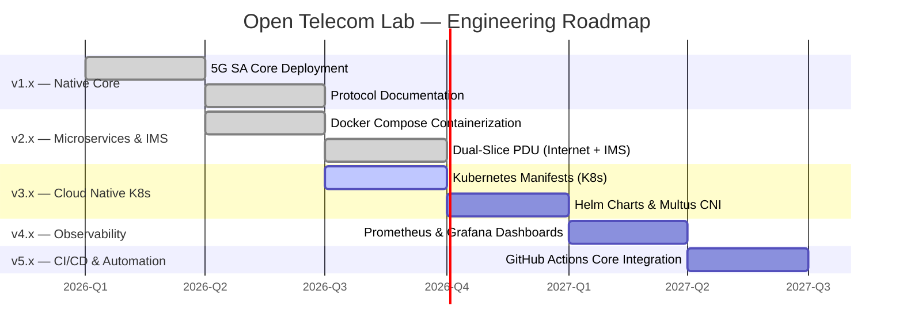

# Open Telecom Lab

<p align="center">
  
</p>

<h1 align="center">Open Telecom Lab</h1>

<p align="center">
  <strong>A Production-Grade 5G Core Network Laboratory for Hands-On Telecom Engineering</strong>
</p>

<p align="center">
  <a href="#-quick-start"></a>
  <a href="docs/architecture/README.md"></a>
  <a href="docs/README.md"></a>
  <a href="CONTRIBUTING.md"></a>
</p>

<p align="center">
  
  
  
  
  
  
  
  
  
</p>

---

## 📖 Overview

**Open Telecom Lab** is an end-to-end 5G Standalone (SA) network laboratory built with open-source network functions. It documents a complete engineering journey: from bare-metal 5G SA core deployments and dual-slice IMS bearer routing to containerized microservices orchestration and Kubernetes manifests.

> **Note:** This project is designed as an advanced engineering reference and production-grade lab environment. It serves as an evolving telecommunications portfolio rather than a basic introductory tutorial.

### What Makes This Different

| Aspect | This Project | Typical Tutorials |
| :--- | :--- | :--- |
| **Deployment** | Native Ubuntu + Docker Compose + Kubernetes | Single shell script setup |
| **Data Plane** | Dual-Slice PDU (Internet + IMS) with Policy Routing | Single default internet session |
| **Documentation** | Protocol-level PFCP/NGAP/SBA analysis | Surface-level installation commands |
| **Scope** | Full 5G SA end-to-end + Microservices | Isolated single components |
| **Evolution** | Versioned roadmap (Native → Docker → K8s) | Static, one-shot code dump |

---

## ✅ Current Features (v2.0 Implemented)

- **5G SA Core Network:** Open5GS v2.8.0 (AMF, SMF, UPF, NRF, AUSF, UDM, UDR, PCF, NSSF, BSF, SCP).
- **Microservices Orchestration:** Complete 12-container Docker Compose stack (`v2-docker-compose`) with multi-stage build optimization and healthchecks.
- **Kubernetes Deployment:** Kind-based cluster with full Open5GS deployment (v3.0 in active development).
- **Dual-Slice Data Plane:** Simultaneous PDU session support for `internet` (`10.45.0.0/16`) and `ims` (`10.46.0.0/16`) DNNs on a single UE.
- **Advanced Linux Routing:** Kernel tuning (`rp_filter=0`), priority-based `ip rules` (priority 100), and iptables NAT for asymmetric UPF flows.
- **Privileged Data Path:** Auto-provisioned `ogstun` TUN interface with Linux capabilities (`NET_ADMIN`) inside UPF containers.
- **RAN Simulation:** UERANSIM gNodeB + UE supporting dual PDU session establishment (`PSI[1]` + `PSI[2]`).
- **5G-AKA Authentication:** SUPI-based authentication with integrity/ciphering protection.
- **Protocol Analysis:** `tcpdump`/Wireshark PCAP analysis for NGAP (N2), PFCP (N4), GTP-U (N3), and HTTP/2 SBI.

---

## 🏗️ Architecture

### Containerized 5G SA Core Architecture (SBA Network: `172.20.0.0/24`)

```text
               +-------------------------------------------------------+
               |                  SBA BRIDGE NETWORK                   |
               |                    172.20.0.0/24                      |
               +---------------------------+---------------------------+
                                           |
  +-------------------+          +---------+---------+          +-------------------+
  |   open5gs-nrf     |          |   open5gs-amf     |          |   open5gs-smf     |
  |  172.20.0.10:7777 |          |   172.20.0.20     |          |   172.20.0.21     |
  +---------+---------+          +----+---------+----+          +---------+---------+
            |                         |         |                         |
  +---------+---------+               |         |               +---------+---------+
  | MongoDB 8.0 DB    |               |         |               |   open5gs-upf     |
  |  172.20.0.2:27017 |               |         |               |   172.20.0.30     |
  +-------------------+               |         |               +----+---------+----+
                                      |         |                    |         |
             +------------------------+         +----------+         |         |
             | NGAP / N2 (SCTP:38412)                      | PFCP/N4 |         | TUN: ogstun
             |                                             |         |         | Subnets:
  +----------+----------+                        +---------+---------+--+      | 10.45.0.0/16
  |   UERANSIM gNodeB   |                        |    GTP-U / N3        |      | 10.46.0.0/16
  |  NCI: 0x000000010   |========================|    (UDP:2152)        |      |
  +----------+----------+                        +----------------------+      |
             |                                                                 |
             | NR-Uu                                                           |
  +----------+----------+                                           +----------+----------+
  |    UERANSIM UE      |                                           |  N6 Data Networks   |
  | IMSI:001010000000001|                                           |  DNN: internet / ims|
  +---------------------+                                           +---------------------+
```

### Signal Flow: 5G-AKA Registration & Dual PDU Session Establishment

```text
📱 UE           📡 gNodeB          open5gs-amf        open5gs-nrf        open5gs-smf        open5gs-upf
  |                 |                  |                  |                  |                  |
  |=== Phase 1: 5G-AKA Registration ============================================================|
  |-- RRC Setup --->|                  |                  |                  |                  |
  |                 |-- NGAP Initial ->|                  |                  |                  |
  |                 |                  |-- SBI Discovery->|                  |                  |
  |<============== 5G-AKA Auth & Security Complete ============================================>|
  |                 |<-- Reg Accept ---|                  |                  |                  |
  |                 |                  |                  |                  |                  |
  |=== Phase 2: Primary PDU Session (DNN: internet) ============================================|
  |-- NAS PDU Estab Req (PSI[1], SST:1, DNN:internet) --->|                  |                  |
  |                 |                  |-- CreateSMContext ----------------->|                  |
  |                 |                  |                  |                  |-- N4 Estab Req ->|
  |                 |                  |                  |                  |<- N4 Estab Resp -|
  |                 |<-- N2 PDU Resource Setup Req -------|                  |                  |
  |<-- PDU Session Accept (IP: 10.45.0.x/16) -------------|                  |                  |
  |                 |                  |                  |                  |                  |
  |=== Phase 3: Secondary PDU Session (DNN: ims) ===============================================|
  |-- NAS PDU Estab Req (PSI[2], SST:1, DNN:ims) -------->|                  |                  |
  |                 |                  |-- CreateSMContext ----------------->|                  |
  |                 |                  |                  |                  |-- N4 Estab Req ->|
  |                 |                  |                  |                  |<- N4 Estab Resp -|
  |<-- PDU Session Accept (IP: 10.46.0.x/16) -------------|                  |                  |
```

### 🛠️ Microservices Architecture Stack

| Container Name | Service | SBA IP | Port(s) / Protocol | Healthcheck / Status |
| :--- | :--- | :--- | :--- | :--- |
| `mongodb` | MongoDB 8.0 | 172.20.0.2 | 27017/tcp | `mongosh --eval ping` |
| `open5gs-nrf` | NRF | 172.20.0.10 | 7777/tcp (HTTP/2) | `curl http://127.0.0.1:7777` |
| `open5gs-udr` | UDR | 172.20.0.11 | 7777/tcp | SBI Registered |
| `open5gs-udm` | UDM | 172.20.0.12 | 7777/tcp | SBI Registered |
| `open5gs-ausf` | AUSF | 172.20.0.13 | 7777/tcp | SBI Registered |
| `open5gs-pcf` | PCF | 172.20.0.14 | 7777/tcp | SBI Registered |
| `open5gs-nssf` | NSSF | 172.20.0.15 | 7777/tcp | SBI Registered |
| `open5gs-bsf` | BSF | 172.20.0.16 | 7777/tcp | SBI Registered |
| `open5gs-scp` | SCP | 172.20.0.17 | 7777/tcp | SBI Registered |
| `open5gs-amf` | AMF | 172.20.0.20 | 38412/sctp (N2) | SBI Registered |
| `open5gs-smf` | SMF | 172.20.0.21 | 8805/udp (PFCP) | PFCP Associated |
| `open5gs-upf` | UPF | 172.20.0.30 | 2152/udp (GTP-U) | TUN `ogstun` UP |

---

## 📁 Project Structure

```text
Open-Telecom-Lab/
├── docker-compose/            # 🐳 v2.0 Microservices Orchestration
│   ├── config/                # Open5GS NF configurations (AMF, SMF, UPF, NRF...)
│   │   ├── amf.yaml
│   │   ├── smf.yaml
│   │   ├── upf.yaml
│   │   └── upf-entrypoint.sh  # Script for TUN creation & NAT rules
│   ├── Dockerfile             # Optimized multi-stage build (Ubuntu 22.04)
│   └── docker-compose.yml     # Complete 12-container orchestration stack
├── v3-kubernetes/             # ☸️ v3.0 Kubernetes Manifests (In Active Development)
│   ├── 00-namespace.yaml
│   ├── 01-mongodb.yaml
│   ├── 02-configmap.yaml
│   ├── 03-control-plane.yaml
│   └── 04-upf.yaml
├── config/                    # 📱 UERANSIM Configuration Files
│   └── ueransim/
│       ├── gnb.yaml           # gNodeB configuration
│       └── ue.yaml            # UE configuration
├── configs/                   # Native deployment configuration files
├── docs/                      # Engineering notes & protocol documentation
├── labs/                      # Step-by-step lab exercises (Lab 01 - Lab 04)
├── scripts/                   # Automation, database seed, and helper tools
├── README.md
├── ROADMAP.md
└── CHANGELOG.md
```

---

## 🚀 Quick Start

### Option A: Kubernetes Deployment (Kind) - Recommended for v3.0

#### 1. Prerequisites

```bash
# Install Kind, kubectl, and Docker
curl -Lo ./kind https://kind.sigs.k8s.io/dl/v0.20.0/kind-linux-amd64
chmod +x ./kind && sudo mv ./kind /usr/local/bin/kind

# Install kubectl
curl -LO "https://dl.k8s.io/release/v1.28.0/bin/linux/amd64/kubectl"
chmod +x ./kubectl && sudo mv ./kubectl /usr/local/bin/kubectl
```

#### 2. Clone & Deploy

```bash
git clone https://github.com/khattabpi/Open-Telecom-Lab.git
cd Open-Telecom-Lab/v3-kubernetes

# Create Kind cluster
kind create cluster --config kind-config.yaml

# Deploy Open5GS Core
kubectl apply -f 00-namespace.yaml
kubectl apply -f 02-configmap.yaml
kubectl apply -f 01-mongodb.yaml
kubectl apply -f 04-upf.yaml
kubectl apply -f 03-control-plane.yaml

# Wait for all pods to be ready
kubectl wait --for=condition=ready pod --all -n open5gs --timeout=300s
```

#### 3. Start UERANSIM

```bash
# Start gNodeB (connects to AMF via N2)
cd ../config/ueransim
sudo nr-gnb -c gnb.yaml

# In a new terminal, start the UE
sudo nr-ue -c ue.yaml

# Verify successful registration and PDU session
ip addr show uesimtun0
# Expected: inet 10.45.0.2/16 (internet) & inet 10.46.0.2/16 (ims)
```

### Option B: Containerized Microservices Stack (Docker Compose)

#### 1. Clone & Navigate

```bash
git clone https://github.com/khattabpi/Open-Telecom-Lab.git
cd Open-Telecom-Lab/docker-compose
```

#### 2. Build & Launch the 5G Core Stack

```bash
# Build multi-stage container images
docker compose build

# Launch all services in detached mode
docker compose up -d
```

#### 3. Verify Health & PFCP Association

```bash
# Check container status
docker compose ps

# Check NRF registration
docker logs open5gs-nrf 2>&1 | grep "registered"

# Check SMF-UPF PFCP Association
docker logs open5gs-smf 2>&1 | grep -i "pfcp"
# Expected output: "PFCP associated [172.20.0.30]:8805"
```

#### 4. Simulate the RAN & Establish Dual-Slice Sessions

```bash
# Start the gNodeB (Connects to AMF via N2)
nr-gnb -c ../config/ueransim/gnb.yaml

# In a new terminal, start the UE (Establishes PDU Sessions)
nr-ue -c ../config/ueransim/ue.yaml

# Verify dual IP allocation on the UE
ip addr show uesimtun0
# Expected output: inet 10.45.0.x/16 (internet) & inet 10.46.0.x/16 (ims)
```

### Option C: Native Ubuntu Deployment (v1.0)

```bash
# 1. Install Open5GS
sudo add-apt-repository ppa:open5gs/latest
sudo apt update
sudo apt install -y open5gs

# 2. Configure Dual-Slice NAT Rules
sudo sysctl -w net.ipv4.ip_forward=1
sudo iptables -t nat -A POSTROUTING -s 10.45.0.0/16 ! -o ogstun -j MASQUERADE
sudo iptables -t nat -A POSTROUTING -s 10.46.0.0/16 ! -o ogstun -j MASQUERADE

# 3. Start Core Services
sudo systemctl restart open5gs-upfd open5gs-smfd open5gs-amfd
```

---

## 🗺️ Roadmap



| Milestone | Status | Version | Scope / Milestone |
| :--- | :--- | :--- | :--- |
| v1.0 | ✅ Implemented | Native | 5G SA Core + UERANSIM + Basic Internet Access |
| v2.0 | ✅ Implemented | Docker Compose | Stack + Dual-Slice (Internet + IMS) + Kernel Routing |
| v3.0 | 🔄 Active Progress | Kubernetes | Deployments (StatefulSets, ConfigMaps, Capabilities) |
| v4.0 | 📋 Planned | Observability | Prometheus + Grafana + eBPF metrics |
| v5.0 | 📋 Planned | CI/CD | Automated Protocol Verification Pipelines |

---

## 🔧 UERANSIM Configuration

The UERANSIM configuration files are located in `config/ueransim/`:

| File | Description |
| :--- | :--- |
| `gnb.yaml` | gNodeB configuration (PLMN, TAC, AMF address, NSSAI) |
| `ue.yaml` | UE configuration (IMSI, authentication keys, slices) |

### Sample gnb.yaml:
```yaml
mcc: '001'
mnc: '01'
nci: '0x000000010'
idLength: 32
tac: 1
linkIp: 127.0.0.1
ngapIp: 127.0.0.1
gtpIp: 127.0.0.2
amfConfigs:
  - address: 127.0.0.1
    port: 38412
slices:
  - sst: 1
    sd: 0xffffff
```

### Sample ue.yaml:
```yaml
supi: 'imsi-001010000000001'
mcc: '001'
mnc: '01'
key: '465B5CE8B199B49FAA5F0A2EE238A6BC'
opc: 'E8ED289DEBA952E4283B54E88E6183CA'
amf: '8000'
gnbSearchList:
  - 127.0.0.1
sessions:
  - type: 'IPv4'
    apn: 'internet'
    slice:
      sst: 1
      sd: 0xffffff
```

---

## 📚 Documentation

| Document | Description |
| :--- | :--- |
| [Architecture Overview](docs/architecture/README.md) | Detailed system design and component interactions |
| [Deployment Guide](docs/deployment/README.md) | Step-by-step installation instructions |
| [Protocol Analysis](docs/protocols/README.md) | NGAP, PFCP, GTP-U, and SBI deep dives |
| [Troubleshooting](docs/troubleshooting/README.md) | Common issues and resolution procedures |
| [Lab Exercises](labs/README.md) | Hands-on protocol analysis exercises |

---

## 🤝 Contributing

We welcome contributions! Please see our [Contributing Guidelines](CONTRIBUTING.md) for details on:

- Code of Conduct
- Development workflow
- Pull request process
- Documentation standards

---

## 📄 License

This project is licensed under the MIT License - see the [LICENSE](LICENSE) file for details.

---

## 🙏 Acknowledgments

- [Open5GS](https://open5gs.org/) - 5G Core implementation
- [UERANSIM](https://github.com/aligungr/UERANSIM) - RAN simulation
- [3GPP](https://www.3gpp.org/) - Specifications and standards

---

<p align="center">
  <strong>Built with ❤️ by telecommunications engineers, for telecommunications engineers.</strong>
</p>

<p align="center">
  <a href="https://github.com/khattabpi/Open-Telecom-Lab">GitHub</a> ·
  <a href="https://github.com/khattabpi/Open-Telecom-Lab/issues">Issues</a> ·
  <a href="https://github.com/khattabpi/Open-Telecom-Lab/discussions">Discussions</a>
</p>
