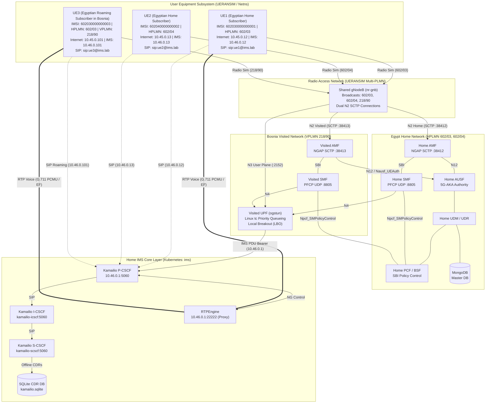

# 5G-IMS-Lab

**A software-based 5G Standalone (5G SA) + IMS laboratory validating a complete end-to-end telecom service path — from multi-PLMN RAN registration and inter-PLMN roaming to SIP voice calls.**


---

## Overview

5G-IMS-Lab is a self-contained 5G Standalone (5G SA) and IP Multimedia Subsystem (IMS) laboratory built entirely on open-source components: **Open5GS**, **UERANSIM**, **Kamailio**, **RTPEngine**, **MongoDB**, and **Kubernetes (kind)**.

The lab validates a complete, protocol-accurate service path:

```
5G RAN Selection → 5G-AKA Cross-PLMN Authentication → PDU Session Establishment (LBO)
→ PCF Policy Authorization & BSF Binding → 5QI / DiffServ QoS Prioritization
→ Internet Connectivity → IMS PDU Connectivity → SIP Digest Registration
→ SIP Call Establishment → SDP Negotiation → RTPEngine Media Proxying
→ Bidirectional RTP Voice Streams → Real-Time KPI & Service Assurance Telemetry
→ SQLite CDR Offline Charging & Usage Accounting → SIP Call Teardown
```

This is a **protocol-validation and research laboratory**, not a commercial carrier network. It is designed to demonstrate, in a reproducible way, how 5G SA transport, multi-PLMN roaming, and IMS signaling/media planes interoperate end-to-end with QoS scheduling and accounting.

---

## What the Lab Demonstrates

- **Multi-PLMN RAN Sharing**: A single simulated gNodeB broadcasting three PLMNs (`602/03`, `602/04`, `218/90`) with NNSF steering.
- **Home vs. Visited 5G Core Segregation**:
  - **Egypt Home Network (HPLMN 602/03, 602/04)**: Home AMF (SCTP 38412), Home SMF, AUSF, UDM, UDR, PCF, BSF, MongoDB master subscriber DB, Kamailio IMS Core.
  - **Bosnia Visited Network (VPLMN 218/90)**: Visited AMF (SCTP 38413), Visited SMF, Visited UPF Local Breakout (LBO).
- **Cross-PLMN 5G-AKA Authentication**: Visited AMF issues N12 `Nausf_UEAuthentication` toward Home AUSF with `servingNetworkName: 5G:mnc090.mcc218.3gppnetwork.org`.
- **5G QoS & DiffServ User-Plane Prioritization**:
  - 5QI 9 (Internet Default Non-GBR) and 5QI 5 (IMS Signaling) provisioned in UDR and negotiated in NAS/NGAP.
  - Sockets set `IP_TOS 0xA0` (CS5 / DSCP 40) for SIP and `IP_TOS 0xB8` (EF / DSCP 46) for G.711 PCMU conversational voice.
  - Linux `tc prio` 3-band queueing on UPF `ogstun` prioritizing conversational voice (EF) and signaling (CS5) above best-effort traffic.
- **Service-Based Policy Control (PCF & BSF)**:
  - HTTP/2 `POST /npcf-smpolicycontrol/v1/sm-policies` session establishment for Home and Visited SMFs.
  - HTTP/2 `POST /nbsf-management/v1/pcfBindings` session binding discovery for UE1, UE2, and UE3.
- **Dual PDU Sessions per UE**: Independent Internet (Local Breakout) and IMS Bearers.
- **IMS Roaming Registration**: Roaming UE3 registers to Home IMS (`sip:ue3@ims.lab`) over the visited IMS PDU bearer.
- **Domestic & Inter-PLMN IMS Voice Calls**:
  - Domestic Call: UE1 (Egypt `602/03`) ↔ UE2 (Egypt `602/04`)
  - Inter-PLMN Roaming Call: UE1 (Egypt `602/03`) ↔ UE3 (Bosnia `218/90` Roaming)
- **Bidirectional RTP Media Stream**: RTPEngine SDP rewriting and 25/25 G.711 PCMU voice packet relay in each direction (0% loss).
- **IMS Offline Charging & User-Plane Usage Accounting**:
  - Kamailio S-CSCF `acc` + `dialog` + `sqlops` module recording persistent SQLite CDRs (`/etc/kamailio/db/kamailio.sqlite`).
  - Real Linux kernel network namespace interface accounting per SUPI and DNN via `scripts/collect-charging-records.sh`.
- **Service Assurance & Real-Time KPI Engine**:
  - `scripts/measure-kpis.sh` measuring real Post-Dial Delay (PDD < 200 ms), Call Setup Time (CST < 500 ms), CSSR (100%), RFC 3550 jitter (< 20 ms), and ITU-T G.107 estimated MOS (4.40).
- **Automated Regression Suite**: 91 automated checks covering 5GC, multi-PLMN roaming, user plane, QoS, PCF policy, SQLite CDRs, and KPIs.

---

## Multi-PLMN & Roaming Architecture

| UE | Subscriber Type | HPLMN | VPLMN | IMSI / SUPI | Serving AMF | Serving SMF | SIP Identity |
|---|---|---|---|---|---|---|---|
| **UE1** | Egyptian Domestic | 602/03 | 602/03 | 602030000000001 | Home AMF (:38412) | Home SMF | `sip:ue1@ims.lab` |
| **UE2** | Egyptian Domestic | 602/04 | 602/04 | 602040000000002 | Home AMF (:38412) | Home SMF | `sip:ue2@ims.lab` |
| **UE3** | Egyptian Roaming in Bosnia | 602/03 | 218/90 | 602030000000003 | Visited AMF (:38413) | Visited SMF | `sip:ue3@ims.lab` |

---

## Architecture Diagram



---

## Dual PDU Session Architecture

Each UE establishes **two** independent PDU Sessions:

| Session | Purpose | 5QI | DSCP / TOS | Address Allocation | UPF Gateway | Breakout Type |
|---|---|---|---|---|---|---|
| **Internet** | General IPv4 Data | 5QI 9 | Best-Effort (`0x00`) | Dynamic (`10.45.0.0/16`) | `10.45.0.1` | Local Breakout (LBO) |
| **IMS** | SIP Signaling & Media | 5QI 5 | CS5 (`0xA0`) / EF (`0xB8`) | Dynamic (`10.46.0.0/16`) | `10.46.0.1` | Dedicated Bearer |

Subnet allocation is segregated by SMF instance:
- **Home SMF IP Pool**: `10.45.0.10-99` (Internet) and `10.46.0.10-99` (IMS)
- **Visited SMF IP Pool**: `10.45.0.100-199` (Internet) and `10.46.0.100-199` (IMS)

---

## Quick Start

| Step | Command | Purpose |
|---|---|---|
| 1 | `scripts/start-lab.sh` | Starts 5G Core (Home + Visited NFs) and IMS Core |
| 2 | `scripts/run-gnb.sh` | Starts multi-PLMN gNodeB (`602/03`, `602/04`, `218/90`) |
| 3 | `scripts/run-ue.sh 1` | Starts UE1 (Home Egypt `602/03`) |
| 4 | `scripts/run-ue.sh 2` | Starts UE2 (Home Egypt `602/04`) |
| 5 | `scripts/run-ue.sh 3` | Starts UE3 (Roaming in Bosnia `218/90`) |
| 6 | `scripts/test-ims-call.sh all` | Executes multi-PLMN SIP registration and domestic + roaming voice calls |
| 7 | `scripts/collect-charging-records.sh` | Collects SQLite CDRs and per-UE user plane byte/packet usage |
| 8 | `scripts/measure-kpis.sh` | Generates real-time PDD, CST, CSSR, RTP jitter, and Estimated MOS report |
| 9 | `scripts/verify-lab.sh` | Runs full 91-check automated regression suite |

---

## Validation & Verification Summary

The complete stack is verified by `scripts/verify-lab.sh`:

```text
═══════════════════════════════════════════════════════════════════════
  Verification Summary: 91 Passed, 0 Failed, 0 Warnings
═══════════════════════════════════════════════════════════════════════
  >>> All 5G SA Core, Multi-PLMN Roaming & IMS Voice Call Tests Passed! <<<
```

### Breakdown of Verification Checks (91 Total)

1. **5G Core Health (12/12 Passed)**: Home NFs (`amf`, `smf`, `ausf`, `udm`, `udr`, `pcf`, `bsf`, `nrf`, `mongodb`) + Visited NFs (`v-amf`, `v-smf`, `upf`).
2. **Signaling & Interfaces (5/5 Passed)**: Home AMF SCTP 38412, Visited AMF SCTP 38413, UPF GTP-U UDP 2152, Home & Visited PFCP UDP 8805.
3. **Subscriber Provisioning (3/3 Passed)**: UE1, UE2, and UE3 provisioned in MongoDB.
4. **Host Networking (3/3 Passed)**: Kernel IP forwarding, rp_filter=0, UPF ogstun TUN device.
5. **RAN Simulation (8/8 Passed)**: gNodeB dual N2 setup, UE1/UE2/UE3 5G-AKA registration and dual PDU sessions.
6. **User Plane Connectivity (24/24 Passed)**: Internet GTP-U ping, 8.8.8.8 ping, HTTPS curl, IMS bearer ping across UE1, UE2, and UE3.
7. **IMS Infrastructure (6/6 Passed)**: P-CSCF, I-CSCF, S-CSCF, RTPEngine pods, P-CSCF OPTIONS ingress, RTPEngine NG control socket.
8. **Phase 3 IMS Roaming & Voice Calls (8/8 Passed)**:
   - `[IMS-ROAM-01]` UE3 IMS PDU Bearer Reachable (10.46.0.100 ↔ 10.46.0.1)
   - `[IMS-ROAM-02]` UE3 SIP Digest MD5 Registration (200 OK)
   - `[IMS-ROAM-03]` UE3 IMS Digest MD5 Authentication verified
   - `[IMS-ROAM-04]` Inter-PLMN SIP INVITE (UE1 602/03 → UE3 218/90)
   - `[IMS-ROAM-05]` Inter-PLMN Call Established (180 Ringing / 200 OK / ACK)
   - `[IMS-ROAM-06]` Inter-PLMN RTP Stream UE1 → UE3 (25/25 packets, 0% loss)
   - `[IMS-ROAM-07]` Inter-PLMN RTP Stream UE3 → UE1 (25/25 packets, 0% loss)
   - `[IMS-ROAM-08]` Domestic SIP Voice Call Regression UE1 ↔ UE2 (25/25 packets, 0% loss)
9. **Phase 4 Offline Charging & User-Plane Accounting (7/7 Passed)**:
   - `[CHG-01]` SQLite CDR Database active (`/etc/kamailio/db/kamailio.sqlite`)
   - `[CHG-02]` Kamailio CDR Accounting Schema (`cdrs` & `acc` tables)
   - `[CHG-03]` Domestic Voice Call CDR Recorded (UE1 → UE2: caller, callee, 200 OK)
   - `[CHG-04]` Roaming Voice Call CDR Recorded (UE1 → UE3: caller, callee, 200 OK)
   - `[CHG-05]` CDR Timestamps & Duration verified
   - `[CHG-06]` User-Plane Usage Accounting active across Internet & IMS PDU sessions
   - `[CHG-07]` Charging Records Collector Script (`collect-charging-records.sh` operational)
10. **Phase 4 Service Assurance & Real-Time KPI Engine (10/10 Passed)**:
    - `[ASSUR-01]` Post-Dial Delay (PDD) measured for Domestic Call (< 200 ms)
    - `[ASSUR-02]` Post-Dial Delay (PDD) measured for Roaming Call (< 200 ms)
    - `[ASSUR-03]` Call Setup Time (CST) measured for all sessions (< 500 ms)
    - `[ASSUR-04]` Call Setup Success Rate (CSSR) calculation verified (100.0%)
    - `[ASSUR-05]` RTP packet loss rate measured from real counters (0.0% loss)
    - `[ASSUR-06]` RTP sequence continuity validated (0 missing, 0 out-of-order)
    - `[ASSUR-07]` RFC 3550 RTP inter-arrival jitter measured (< 20.0 ms)
    - `[ASSUR-08]` R-factor & Estimated MOS calculated (ITU-T G.107 E-model approximation)
    - `[ASSUR-09]` Domestic Service Assurance & Real-Time KPI Report generated
    - `[ASSUR-10]` Roaming Service Assurance & Real-Time KPI Report generated

---

## 3GPP Technical Classification & Capabilities Matrix

This laboratory is classified as:

> **"5G Inter-PLMN Roaming Laboratory with Home-Network Authentication, Local Breakout, 5QI/DiffServ QoS Scheduling, Offline Charging, and Real-Time Service Assurance."**

### Technical Truth Matrix

| Domain | Implemented & Validated | Emulated / Laboratory Boundary | Not Supported in Open5GS 2.8.0 |
|---|---|---|---|
| **Radio (RAN)** | Multi-PLMN SIB1 broadcast (`602/03`, `602/04`, `218/90`), cell discovery, NNSF initial NAS steering | Software-simulated radio via UERANSIM | Real SDR / RF transmission |
| **Control Plane** | Segregated Home AMF / Visited AMF, N12 `Nausf_UEAuthentication` toward Home AUSF, PCF SMPolicyControl, BSF bindings | Direct Kubernetes DNS for SBI transport | 3GPP SEPP (TS 33.501 §5.9.3) / N32 PRAS encapsulation |
| **User Plane & QoS**| 5QI 9 / 5QI 5 negotiation, DiffServ CS5/EF socket classification, Linux `tc prio` 3-band queueing | Linux kernel TUN routing (`ogstun`) | 3GPP Home-Routed (HR) Roaming via N16 / N9 |
| **IMS & Voice** | Roaming SIP Digest registration, SDP rewriting via RTPEngine, bidirectional RTP audio relay (0% loss) | Emulated inter-operator IMS SIP routing | 3GPP IBCF / TrGW inter-IMS security gateway |
| **Charging** | Persistent SQLite CDR engine (`acc_cdrs`, `cdrs`), per-UE Linux namespace data accounting | Kamailio SQLite module + Linux kernel telemetry | 3GPP Converged Charging System (`open5gs-chfd` / Nchf) |
| **Assurance & KPIs**| Real socket PDD, CST, CSSR, RFC 3550 jitter, monotonic sequence validation, ITU-T G.107 estimated MOS | Socket timestamping + E-model approximation | Subjective MOS listening test panels (ITU-T P.800) |

---

## License

MIT License. See [LICENSE](LICENSE) for details.
