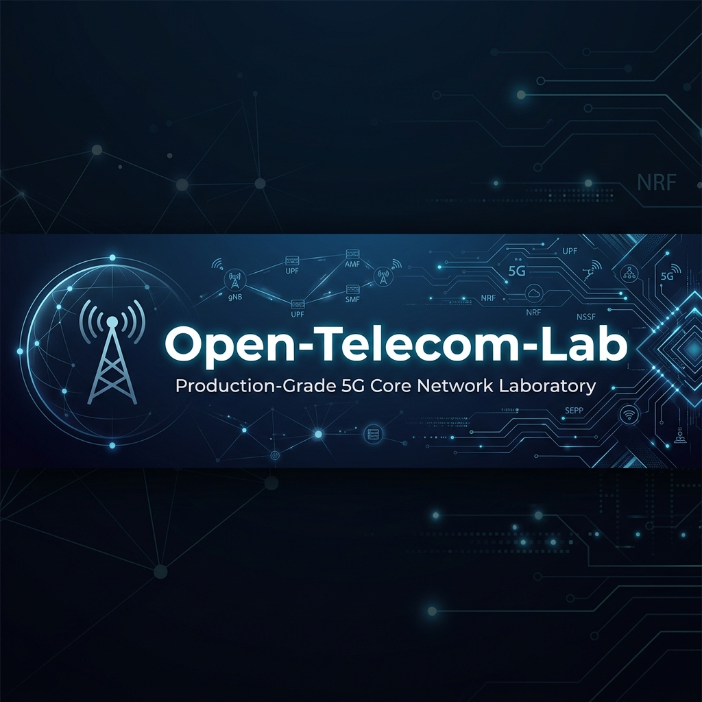
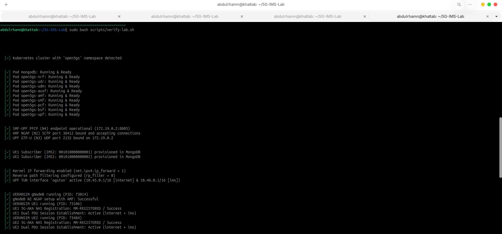
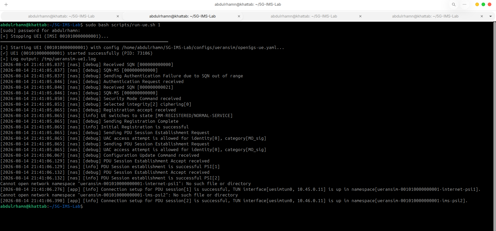
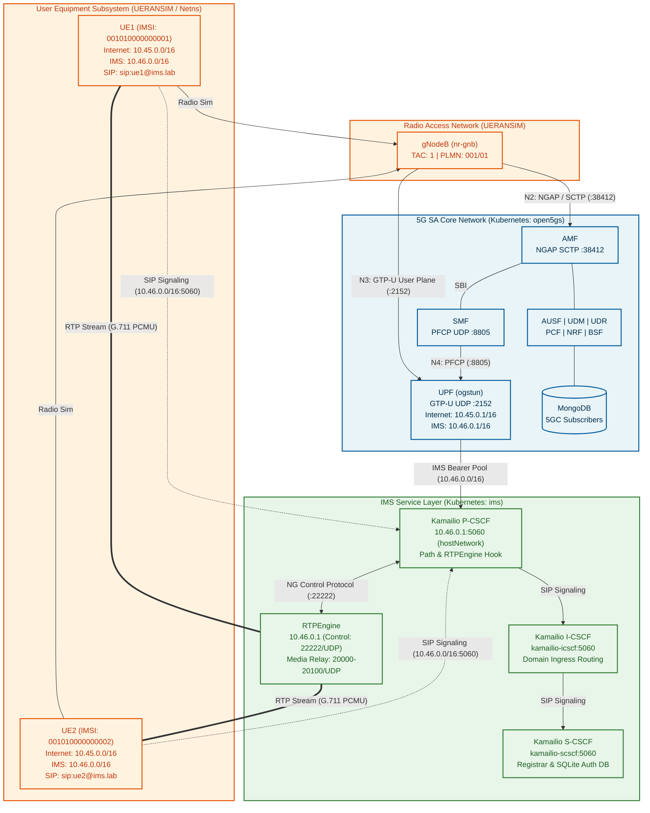

# 5G-IMS-Lab

<p align="center">
  
</p>

<!-- 
SCREENSHOT PLACEHOLDER: 
Add hero architecture diagram banner to docs/images/5g-ims-lab-architecture.png
-->

<p align="center">
  <a href="https://kubernetes.io/"></a>
  <a href="https://open5gs.org/"></a>
  <a href="https://www.kamailio.org/"></a>
  <a href="https://github.com/sipwise/rtpengine"></a>
  <a href="https://github.com/aligungr/UERANSIM"></a>
  <a href="scripts/verify-lab.sh"></a>
  <a href="LICENSE"></a>
</p>

5G-IMS-Lab is a software-based 5G Standalone (SA) and IP Multimedia Subsystem (IMS) laboratory built with Open5GS, UERANSIM, Kamailio, RTPEngine, and Kubernetes. The testbed deploys containerized core and service network functions alongside simulated radio and multi-UE nodes in Linux network namespaces, validating the complete functional path from 5G-AKA registration and dual PDU sessions through SIP registration, call signaling, SDP negotiation, and bidirectional RTP media proxying.

## Visual Evidence Gallery

<p align="center">
  
</p>

<!-- 
SCREENSHOT PLACEHOLDER: 
Add terminal output showing 55/55 regression pass to docs/images/validation-terminal.png
-->

| SIP Call Signaling Trace | Bidirectional RTP Media Flow |
|:---:|:---:|
|  |  |
| *SIP INVITE / 180 / 200 OK / ACK dialog* | *G.711 PCMU RTP stream via RTPEngine (0% loss)* |

<!-- 
SCREENSHOT PLACEHOLDERS:
- docs/images/sip-call-flow.png (Wireshark / SIP packet trace)
- docs/images/rtp-media.png (RTP stream capture confirmation)
- docs/images/kubectl-pods.png (Kubernetes pods running in open5gs & ims namespaces)
-->

## Architecture



The 5G SA core provides the underlying transport and QoS bearer connectivity for IMS traffic, while Kamailio maintains SIP session state and RTPEngine proxies the RTP voice media stream.

## Components

| Component | Role | Runtime / Namespace |
|---|---|---|
| Open5GS | 5G SA Core (AMF, SMF, UPF, AUSF, UDM, UDR, NRF, PCF, BSF) | Kubernetes (`open5gs`) |
| MongoDB | 5G subscriber identity and session profile store | Kubernetes (`open5gs`) |
| UERANSIM | Simulated gNodeB (`nr-gnb`) and multi-UE instances (`nr-ue`) | Linux host processes & netns |
| Kamailio P-CSCF | Ingress SIP proxy, Path header insertion, RTPEngine control | Kubernetes (`ims`) / `hostNetwork` |
| Kamailio I-CSCF | Interrogating proxy for home domain routing | Kubernetes (`ims`) |
| Kamailio S-CSCF | Registrar, Digest MD5 authentication, session routing | Kubernetes (`ims`) |
| RTPEngine | Media proxy for SDP rewriting and bidirectional RTP relay | Kubernetes (`ims`) / `hostNetwork` |
| kind | Kubernetes in Docker control-plane container | Docker (`open5gs-cluster-control-plane`) |

## Validation Results

The test suite executes automated protocol-level validations against the live testbed:

| Validation Item | Target | Result | Runtime Evidence |
|---|---|:---:|---|
| 5G SA Core Health | 10/10 Open5GS Network Functions | **PASS** | Pods Running & Ready (`amf`, `smf`, `upf`, `ausf`, `udm`, `udr`, `pcf`, `nrf`, `bsf`, `mongodb`) |
| N2 Interface Binding | AMF NGAP SCTP Port `38412` | **PASS** | Socket accepting connections on `172.19.0.2:38412` |
| N3 Interface Binding | UPF GTP-U UDP Port `2152` | **PASS** | Socket bound on `172.19.0.2:2152` |
| N4 Interface Binding | SMF-UPF PFCP UDP Port `8805` | **PASS** | Association established on `172.19.0.2:8805` |
| UE1 5G-AKA Registration | IMSI `001010000000001` | **PASS** | State `MM-REGISTERED`, NAS security context active |
| UE2 5G-AKA Registration | IMSI `001010000000002` | **PASS** | State `MM-REGISTERED`, NAS security context active |
| Dual PDU Sessions (UE1) | Internet (`10.45.0.0/16`) & IMS (`10.46.0.0/16`) | **PASS** | Two independent `uesimtun` interfaces established in isolated netns |
| Dual PDU Sessions (UE2) | Internet (`10.45.0.0/16`) & IMS (`10.46.0.0/16`) | **PASS** | Two independent `uesimtun` interfaces established in isolated netns |
| Internet Data Plane Egress | UE1 & UE2 -> `8.8.8.8` & Google | **PASS** | ICMP ping 0% loss, HTTPS `curl https://www.google.com` succeeded |
| IMS SIP Registration (UE1) | `sip:ue1@ims.lab` | **PASS** | `REGISTER` -> `401 Unauthorized` (Digest MD5) -> `200 OK` |
| IMS SIP Registration (UE2) | `sip:ue2@ims.lab` | **PASS** | `REGISTER` -> `401 Unauthorized` (Digest MD5) -> `200 OK` |
| CSeq Monotonicity | Repeated Registration Sequence | **PASS** | 5 consecutive registrations verified without registrar CSeq rejection |
| Location Directory Lookup | S-CSCF `usrloc` table | **PASS** | Confirmed active contact bindings via `kamcmd ul.dump` |
| SIP Call Setup Dialog | UE1 -> P-CSCF -> S-CSCF -> P-CSCF -> UE2 | **PASS** | `INVITE` -> `180 Ringing` -> `200 OK` -> `ACK` handshake completed |
| SDP Media Rewriting | P-CSCF RTPEngine Hook | **PASS** | SDP rewritten to `c=IN IP4 10.46.0.1` and dynamic ports `20000-20100` |
| Bidirectional RTP Stream | UE1 <-> RTPEngine <-> UE2 | **PASS** | 25/25 G.711 PCMU packets delivered in both directions (0% loss) |
| Session Teardown & Cleanup | Dialog Teardown | **PASS** | `BYE` -> `200 OK`, RTPEngine media session deleted |

```text
IMS validation suite:           22/22 passed (0 failed)
End-to-end SIP/RTP call test:   PASSED (0% packet loss)
Full 5G SA + IMS regression:    55/55 passed (0 failed, 0 warnings)
```

## Repository Structure

```text
5G-IMS-Lab/
├── configs/
│   ├── ueransim/             # gNodeB and UE profiles (UE1: ...001, UE2: ...002)
│   └── sipp/                 # SIP scenario templates and subscriber CSVs
├── docs/
│   ├── images/               # Architecture diagrams and test trace screenshots
│   ├── IMS-CALL-FLOW-VALIDATION.md  # Live SIP traces, packet captures, and root-cause fixes
│   └── engineering-notes/    # Deep-dive analyses on 5G NAS, PFCP, and network namespaces
├── k8s/
│   ├── control-plane.yaml    # Open5GS AMF, SMF, AUSF, UDM, UDR, PCF, NRF, BSF
│   ├── upf.yaml              # Open5GS UPF deployment and host TUN configuration
│   ├── mongodb.yaml          # MongoDB StatefulSet for subscriber provisioning
│   └── ims/                  # Kamailio P/I/S-CSCF and RTPEngine manifests
│       ├── configmap.yaml    # Routing scripts, module loading order, and SQLite init
│       ├── pcscf.yaml        # P-CSCF deployment with hostNetwork ingress
│       ├── icscf.yaml        # I-CSCF deployment and service
│       ├── scscf.yaml        # S-CSCF deployment and service
│       └── rtpengine.yaml    # RTPEngine media proxy deployment
├── scripts/
│   ├── start-lab.sh          # Initializes kind cluster, applies manifests, provisions UEs
│   ├── run-gnb.sh            # Starts UERANSIM gNodeB simulation
│   ├── run-ue.sh             # Launches UE instance (1 or 2) inside isolated netns
│   ├── test-ims-call.sh      # Executes automated SIP call dialog and RTP media flow
│   ├── validate-ims-call.sh  # Standalone 22-check IMS diagnostic tool
│   └── verify-lab.sh         # Complete 55-check 5G SA + IMS regression test suite
├── LICENSE                   # MIT License
└── README.md
```

## Requirements

- **Host Operating System**: Linux (Ubuntu 24.04 LTS tested)
- **Container Runtime**: Docker Engine (`>= 24.0`)
- **Kubernetes Platform**: `kind` (`>= v0.20.0`) and `kubectl` (`>= v1.28.0`)
- **RAN / UE Emulation**: UERANSIM (`v3.3.0`) built binaries (`nr-gnb`, `nr-ue`)
- **Kernel Modules**: `tun`, `sctp`, `ip_tables` with IPv4 forwarding enabled (`net.ipv4.ip_forward=1`)
- **Host Tools**: `python3` (standard library), `iproute2`, `iptables`, `curl`, `tcpdump`

## Quick Start

### Step 1: Start 5G Core Network and IMS Layer
Initializes the Kubernetes cluster, deploys all 5G SA and IMS pods, creates the UPF TUN interface (`ogstun`), and provisions subscriber credentials in MongoDB:
```bash
sudo bash scripts/start-lab.sh
```

### Step 2: Start Simulated gNodeB
Launches the simulated gNodeB connected to the AMF over SCTP port 38412:
```bash
bash scripts/run-gnb.sh
```

### Step 3: Start Simulated UEs
Launch UE1 and UE2 in separate terminals to establish 5G-AKA authentication and dual PDU sessions:
```bash
# Terminal 1: Launch UE1 (IMSI 001010000000001)
sudo bash scripts/run-ue.sh 1

# Terminal 2: Launch UE2 (IMSI 001010000000002)
sudo bash scripts/run-ue.sh 2
```

## Validation

Execute the automated test suites to verify system functionality:

```bash
# 1. Run standalone IMS diagnostic suite (pods, DNS, sockets, netns, and call flow)
sudo bash scripts/validate-ims-call.sh

# 2. Run targeted SIP call establishment and bidirectional RTP media verification
sudo bash scripts/test-ims-call.sh

# 3. Run complete 55-check 5G SA Core + Multi-UE + IMS regression suite
sudo bash scripts/verify-lab.sh
```

Expected summary output:
```text
═══════════════════════════════════════════════════════════════════════
  Verification Summary: 55 Passed, 0 Failed, 0 Warnings
═══════════════════════════════════════════════════════════════════════
  >>> All 5G SA Core, Multi-UE & IMS / SIP Call Verification Tests Passed! <<<
```

## Troubleshooting

- **SCTP Association**: If the gNodeB fails to connect to the AMF, verify that the host kernel `sctp` module is loaded (`lsmod | grep sctp`) and port `38412` is reachable on the node IP `172.19.0.2`.
- **P-CSCF Reachability**: Ensure the UE IMS namespace can ping the gateway address `10.46.0.1` over `uesimtun0`.
- **Dynamic IP Allocation**: UE IPv4 addresses are assigned dynamically by Open5GS SMF from configured subnets (`10.45.0.0/16` and `10.46.0.0/16`). Test scripts automatically resolve active IPs from `ip addr`.
- **RTPEngine Control Socket**: Verify that RTPEngine is listening on port `22222/UDP` using `hostNetwork: true`.

For detailed message traces, Wireshark/pcap analysis, and root-cause resolutions, see [docs/IMS-CALL-FLOW-VALIDATION.md](docs/IMS-CALL-FLOW-VALIDATION.md).

## Documentation

- [IMS Call Flow Validation & Live Traces](docs/IMS-CALL-FLOW-VALIDATION.md)
- [5G Registration Protocol Analysis](docs/engineering-notes/5g-registration-analysis.md)
- [Linux Networking & Namespace Architecture](docs/engineering-notes/linux-networking-behind-5g.md)
- [PDU Session Establishment & Debugging](docs/engineering-notes/debugging-pdu-session.md)
- [IMS Manifest Architecture](k8s/ims/README.md)

## Limitations

- **RAN Simulation**: UERANSIM is a software emulator; no physical radio frequency (RF) hardware or SDR equipment is used.
- **Media Testing**: RTP stream verification uses generated G.711 PCMU packets over the data plane to test proxy routing and packet loss rather than physical microphone/speaker audio.
- **Dynamic IP Allocation**: UE IP addresses are dynamically assigned by the SMF and may change across session re-establishments.
- **Lab Scope**: The testbed is designed for protocol validation and research rather than commercial carrier deployment.

## License

This project is licensed under the MIT License. See [LICENSE](LICENSE) for details.
