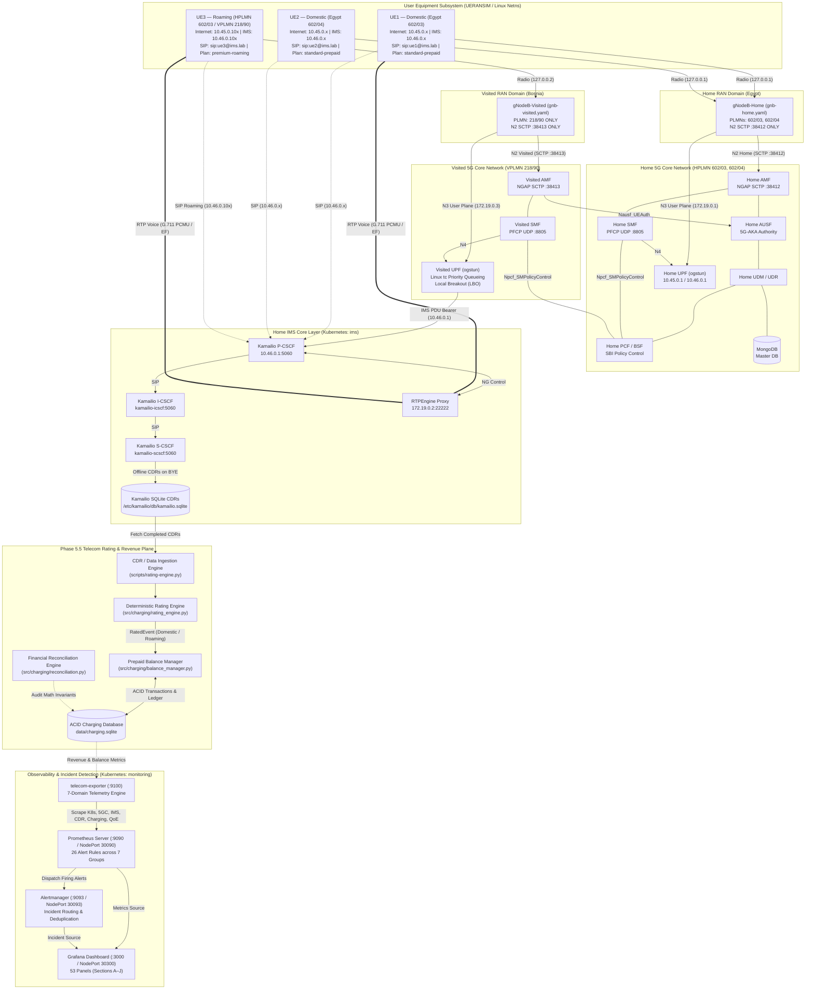
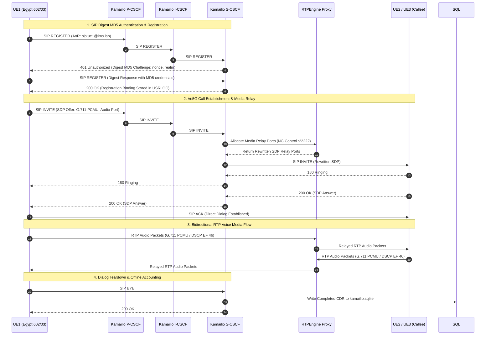
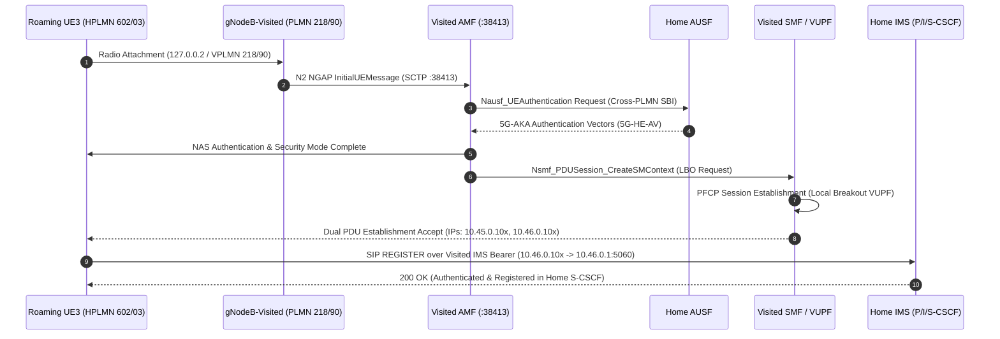
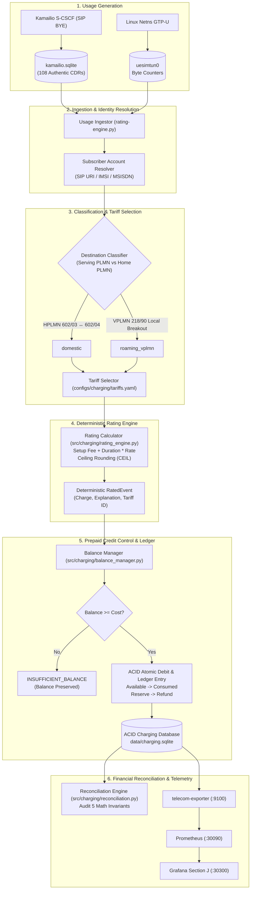
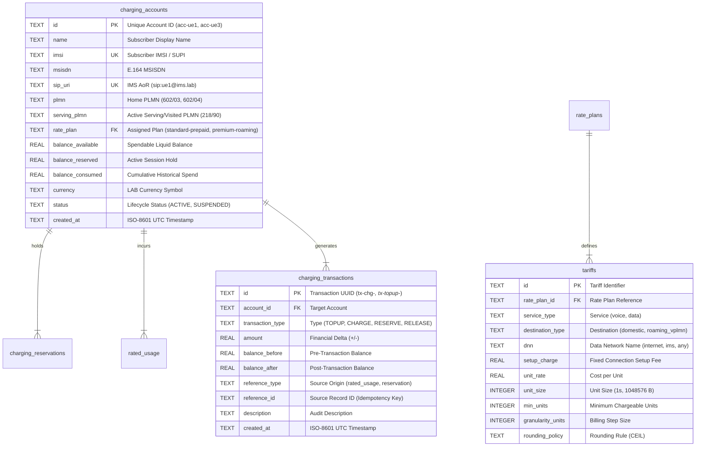
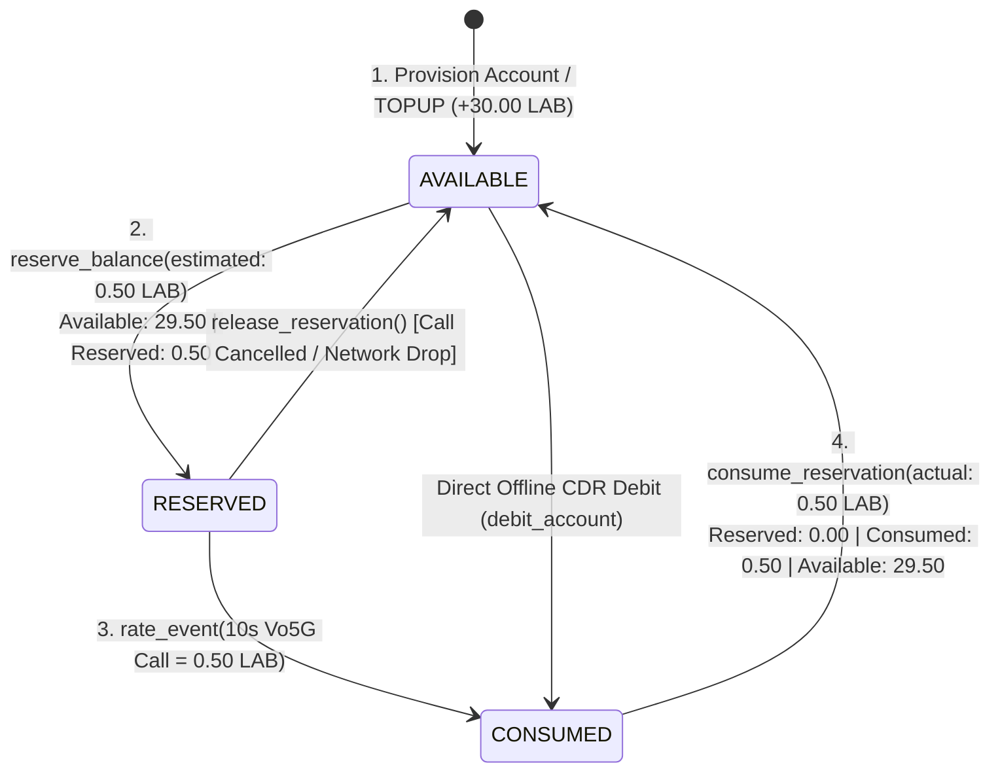
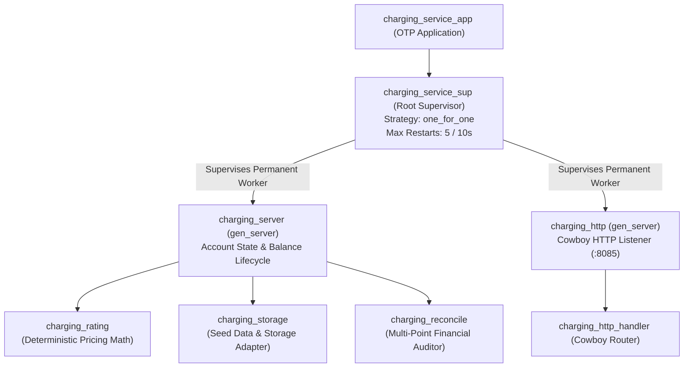
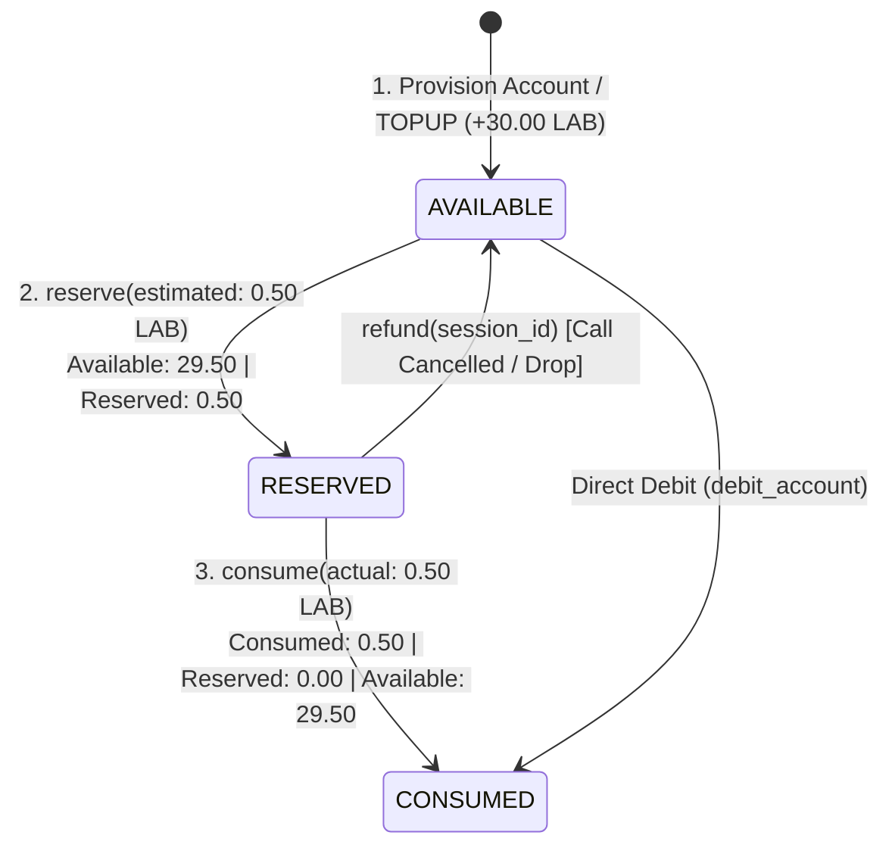

# 5G-IMS-Lab

**Cloud-Native 5G Standalone Core, IP Multimedia Subsystem (IMS), Multi-PLMN Roaming, Vo5G Voice, Policy Control, Telecom Rating & Prepaid Charging Engine, Full-Stack Observability & Incident Detection Reference Laboratory**


[](https://kubernetes.io/)
[](https://open5gs.org/)
[](https://www.kamailio.org/)
[](https://github.com/sipwise/rtpengine)
[](https://github.com/aligungr/UERANSIM)
[](docs/charging/architecture.md)
[](docs/charging/erlang-otp-architecture.md)
[](https://prometheus.io/)
[](https://grafana.com/)
[](https://prometheus.io/docs/alerting/latest/alertmanager/)
[](#-validation--test-results)
[](#project-milestones--golden-baseline)
[](LICENSE)

---

## 📑 Table of Contents

- [Overview](#overview)
- [Key Capabilities & Feature Matrix](#key-capabilities--feature-matrix)
- [⚡ Quick Manual Validation (15-Step Fast Track)](#-quick-manual-validation-15-step-fast-track)
- [🔍 Three-Tier Validation Methodology](#-three-tier-validation-methodology)
- [✨ What Success Looks Like: Layer-by-Layer Verification Criteria](#-what-success-looks-like-layer-by-layer-verification-criteria)
- [End-to-End System Architecture](#end-to-end-system-architecture)
- [Technology Stack](#technology-stack)
- [🚀 Quick Start & Full Deployment Guide](#-quick-start--full-deployment-guide)
- [Network & PLMN Design Matrix](#network--plmn-design-matrix)
- [Dual PDU Sessions & Linux Networking](#dual-pdu-sessions--linux-networking)
- [IMS & Vo5G Service Layer](#ims--vo5g-service-layer)
- [Multi-PLMN Local Breakout (LBO) Roaming](#multi-plmn-local-breakout-lbo-roaming)
- [QoS, Policy Control & Charging Accounting](#qos-policy-control--charging-accounting)
- [Telecom Rating & Prepaid Balance Subsystem (Phase 5.5)](#telecom-rating--prepaid-balance-subsystem-phase-55)
- [Erlang/OTP Telecom Revenue & Charging Service (Phase 5.6)](#erlangotp-telecom-revenue--charging-service-phase-56)
- [Full-Stack Observability: Prometheus & Grafana](#full-stack-observability-prometheus--grafana)
- [📊 Dedicated Grafana Live Validation Runbook](#-dedicated-grafana-live-validation-runbook)
- [Alerting & Incident Detection (Alertmanager)](#alerting--incident-detection-alertmanager)
- [Service Assurance & Real-Time KPIs](#service-assurance--real-time-kpis)
- [✅ Validation & Test Results](#-validation--test-results)
- [Operations & Troubleshooting Guide](#operations--troubleshooting-guide)
- [Accessing Web Dashboards & Endpoints](#accessing-web-dashboards--endpoints)
- [Scope & Technical Boundaries](#scope--technical-boundaries)
- [Project Milestones & Golden Baseline](#project-milestones--golden-baseline)
- [Repository Structure](#repository-structure)
- [Future Roadmap](#future-roadmap)
- [License](#license)

---

## Overview

**5G-IMS-Lab** is an engineering reference laboratory and protocol validation environment designed to demonstrate, benchmark, and observe a cloud-native **5G Standalone (5G SA) Core** integrated with an **IP Multimedia Subsystem (IMS)** service layer, an **Offline Telecom Rating & Prepaid Balance Management Subsystem**, and an **Erlang/OTP Telecom Revenue & Charging Service**.

The laboratory establishes an end-to-end telecommunications environment supporting:
- Multi-UE concurrency and dual PDU session establishment (Internet + IMS).
- Isolated Home and Visited Radio Access Networks (RAN).
- 3GPP multi-PLMN Local Breakout (LBO) roaming with cross-PLMN 5G-AKA authentication.
- SIP Digest MD5 authentication, domestic and inter-PLMN Vo5G voice calls, and bidirectional G.711 RTP media relay.
- DiffServ QoS priority queueing (`tc prio`) and static PCF/BSF policy control.
- Offline SQLite Call Detail Record (CDR) accounting and user-plane data telemetry.
- **Telecom Rating & Prepaid Balance Subsystem (Phase 5.5):** Deterministic tariff calculation, prepaid credit reservations, multi-bucket account balance management (`available`, `reserved`, `consumed`), immutable double-entry transaction ledgers, CDR ingestion, billing idempotency, and mathematical financial reconciliation audits.
- **Erlang/OTP Telecom Revenue & Charging Service (Phase 5.6):** High-performance OTP application with a fault-tolerant supervision tree, `gen_server` state management, Cowboy REST API (`:8085`), soft real-time deterministic rating, reservation state machines, and mathematical financial reconciliation.
- Continuous ITU-T G.107 service-assurance KPI tracking (PDD, CST, CSSR, jitter, and MOS).
- Production-style full-stack observability with custom OpenMetrics exposition, Prometheus scraping, Alertmanager incident routing, and a 53-panel Grafana operations command center.

> [!NOTE]
> This repository is a **rigorous telecom engineering laboratory and reference implementation** built for protocol validation, cloud-native architecture research, and observability benchmarking. It explicitly identifies standard 3GPP production boundaries (such as 3GPP CHF/Nchf and SEPP/N32 interconnects) where laboratory-level equivalents are employed. All technical statements, call flows, metrics, and test results are backed by automated regression test suites (**192 / 192 Tests Passed, 100% Green**).

---

## Key Capabilities & Feature Matrix

```
┌──────────────────────────────────────────────────────────────────────────────────────────────────────────────────┐
│                                           5G-IMS-LAB CAPABILITY MATRIX                                           │
├───────────────────────────────┬──────────────────────────────────┬───────────────────────────────────────────────┤
│ 5G Core & Multi-UE RAN        │ IMS Service Layer & Voice        │ Revenue, Observability & Assurance            │
├───────────────────────────────┼──────────────────────────────────┼───────────────────────────────────────────────┤
│ • 5G SA Core (Open5GS v2.8.0) │ • Kamailio P-CSCF / I-CSCF /     │ • Deterministic Telecom Rating Engine         │
│ • Kubernetes (kind) Cluster   │   S-CSCF with USRLOC Database    │ • Multi-Bucket Prepaid Balance Manager        │
│ • Dual PDU Sessions per UE    │ • RTPEngine Media Relay Proxy    │ • Erlang/OTP Charging Service (Cowboy :8085)  │
│   - Internet (10.45.0.0/16)   │ • SIP Digest MD5 Authentication  │ • OTP Supervision Tree & Fault Isolation      │
│   - IMS Bearer (10.46.0.0/16) │ • Domestic IMS Voice (UE1 ↔ UE2) │ • Multi-Point Financial Reconciliation Engine │
│ • Multi-PLMN RAN Isolation:   │ • Inter-PLMN Roaming Voice       │ • 108 Authentic Kamailio S-CSCF CDR Dataset   │
│   - Home: 602/03 & 602/04     │   (UE1 Egypt ↔ UE3 Bosnia LBO)   │ • Prometheus Scrape Pipeline (:30090)         │
│   - Visited: 218/90           │ • Bidirectional RTP (0% Loss)    │ • Grafana Command Center (53 Panels, :30300)  │
│ • Dedicated N2/N3 Associations│ • DiffServ / tc Priority Queues  │ • Alertmanager Engine (26 Rules, :30093)      │
│ • 5G-AKA Security Handshake   │ • Static PCF/BSF Policy Control  │ • Automated Fault-Injection & Recovery        │
│ • S-NSSAI Network Slicing     │ • Offline SQLite CDR Generator   │ • ITU-T G.107 Service Assurance KPI Engine    │
│ • 3 Registered UEs / 6 PDUs   │ • Voice Quality (MOS 4.4 / 4.50) │ • 192 / 192 Automated Tests (100% Green)      │
└───────────────────────────────┴──────────────────────────────────┴───────────────────────────────────────────────┘
```

---

## ⚡ Quick Manual Validation (15-Step Fast Track)

For any engineer wishing to validate the entire live system directly from the host in under 3 minutes:

```bash
# 1. Discover active Kubernetes Node IP
NODE_IP=$(kubectl get nodes -o jsonpath='{.items[0].status.addresses[?(@.type=="InternalIP")].address}')
echo "Active Node IP: ${NODE_IP}"

# 2. Verify all Kubernetes pods are Running & 1/1 Ready
kubectl get pods -A -o wide

# 3. Verify isolated gNodeBs (Home :38412 & Visited :38413)
ps aux | grep nr-gnb | grep -v grep

# 4. Verify all 3 UEs (UE1 Egypt 602/03, UE2 Egypt 602/04, UE3 Bosnia 218/90)
ps aux | grep nr-ue | grep -v grep

# 5. Verify 5G Internet PDU session (Ping 8.8.8.8 & HTTPS curl)
sudo ip netns exec ueransim-602030000000001-internet-psi1 ping -c 2 8.8.8.8
sudo ip netns exec ueransim-602030000000001-internet-psi1 curl -s -I https://www.google.com | head -n 1

# 6. Verify 5G IMS Bearer PDU session (Ping IMS Gateway 10.46.0.1)
sudo ip netns exec ueransim-602030000000001-ims-psi2 ping -c 2 10.46.0.1

# 7. Verify P-CSCF SIP Service operational on UDP :5060
sudo ss -lunp | grep 5060

# 8. Execute Domestic IMS Vo5G Call (UE1 Egypt 602/03 -> UE2 Egypt 602/04)
sudo bash scripts/test-ims-call.sh 1 2

# 9. Execute Inter-PLMN Roaming Vo5G Call (UE1 Egypt 602/03 -> UE3 Bosnia 218/90)
sudo bash scripts/test-ims-call.sh 1 3

# 10. Execute Reverse Roaming Call (UE3 Bosnia 218/90 -> UE1 Egypt 602/03)
sudo bash scripts/test-ims-call.sh 3 1

# 11. Inspect RTPEngine Proxy media logs (SDP rewriting & 25/25 RTP packets)
kubectl logs -n ims deploy/rtpengine --tail=20

# 12. Query Prometheus Telemetry Endpoint
curl -s "http://${NODE_IP}:30090/api/v1/query?query=open5gs_5gc_registered_ues" | jq .data.result

# 13. Query Erlang/OTP Revenue & Rating REST API (:8085)
curl -s http://127.0.0.1:8085/health | jq .
curl -s http://127.0.0.1:8085/v1/accounts/acc-ue3/balance | jq .

# 14. Open Grafana Operations Dashboard in Browser
echo "Open Grafana: http://${NODE_IP}:30300"

# 15. Run Official Automated Regression Suite Gate (192 Tests)
sudo bash scripts/verify-lab.sh
bash scripts/verify-erlang-charging.sh
```

---

## 🔍 Three-Tier Validation Methodology

To ensure absolute engineering clarity and avoid confusing manual diagnostic testing with automated CI/CD gating, this project explicitly organizes validation into **three distinct tiers**:

```
┌──────────────────────────────────────────────────────────────────────────────────────────────────┐
│                                  THREE-TIER VALIDATION MATRIX                                    │
├──────────────────────────┬──────────────────────────────────────┬────────────────────────────────┤
│ Validation Tier          │ Execution Mechanism                  │ Primary Scope & Intent         │
├──────────────────────────┼──────────────────────────────────────┼────────────────────────────────┤
│ **Tier A: Manual**       │ Direct OS / Kubernetes commands      │ Forensic verification of real  │
│ **Infrastructure &**     │ (`kubectl`, `ip netns`, `ping`,      │ process health, kernel TUNs,   │
│ **Protocol Inspection**  │ `curl`, `ss`, `kamcmd`, `tcpdump`)   │ routes, and socket bindings.   │
├──────────────────────────┼──────────────────────────────────────┼────────────────────────────────┤
│ **Tier B: Operator**     │ Targeted scenario CLI invocations    │ Real SIP signaling sockets,    │
│ **Triggered IMS Voice**  │ (`scripts/test-ims-call.sh 1 2`,     │ Digest challenge/response, and │
│ **Validation Harness**   │  `1 3`, `3 1`, `domestic`, `roaming`)│ bidirectional RTP media flows. │
├──────────────────────────┼──────────────────────────────────────┼────────────────────────────────┤
│ **Tier C: Consolidated** │ 6 Independent verification scripts   │ Strict regression gates, test  │
│ **Automated Regression** │ (`verify-lab.sh`, `verify-rating.sh`,│ isolation, and mathematical    │
│ **Suite (192 Tests)**    │  `verify-erlang-charging.sh`, etc.)  │ reconciliation audits (100%).  │
└──────────────────────────┴──────────────────────────────────────┴────────────────────────────────┘
```

---

## ✨ What Success Looks Like: Layer-by-Layer Verification Criteria

To enable deterministic verification, every layer of the 5G-IMS-Lab defines clear, unambiguous criteria for what a passing state looks like:

```
┌──────────────────────────────────────────────────────────────────────────────────────────────────┐
│                                WHAT SUCCESS LOOKS LIKE IN 5G-IMS-LAB                             │
├──────────────────────────┬──────────────────────────────────────┬────────────────────────────────┤
│ Layer / Function         │ Concrete Runtime Evidence            │ Expected Passing State         │
├──────────────────────────┼──────────────────────────────────────┼────────────────────────────────┤
│ **1. 5G RAN & Core**     │ • `kubectl get pods -A`              │ • All 22 pods Running & 1/1    │
│                          │ • `ps aux | grep -E 'nr-gnb|nr-ue'`  │ • 2 gNodeBs & 3 UEs active     │
│                          │ • `open5gs_5gc_registered_ues`       │ • Value = 3 (602_03, 04, 218_90│
├──────────────────────────┼──────────────────────────────────────┼────────────────────────────────┤
│ **2. 5G User-Plane**     │ • `ip netns exec ... ping 8.8.8.8`   │ • 0% loss (RTT ~50-70 ms)      │
│                          │ • `ip netns exec ... curl google.com`│ • HTTP/2 200 OK                │
│                          │ • `ip netns exec ... ping 10.46.0.1` │ • 0% loss (RTT < 2 ms)         │
├──────────────────────────┼──────────────────────────────────────┼────────────────────────────────┤
│ **3. IMS Registration**  │ • `OPTIONS sip:10.46.0.1:5060`       │ • SIP/2.0 200 OK               │
│                          │ • Unauth `REGISTER`                  │ • SIP/2.0 401 Unauthorized     │
│                          │ • Auth `REGISTER` (MD5 Digest)       │ • SIP/2.0 200 OK (Exp: 3600s)  │
│                          │ • `kamcmd ul.dump`                   │ • 3 active AoR bindings        │
├──────────────────────────┼──────────────────────────────────────┼────────────────────────────────┤
│ **4. Domestic Voice**    │ • `INVITE` -> `180` -> `200` -> `ACK`│ • Dialog established (200 OK)  │
│    **(UE1 ↔ UE2)**       │ • RTPEngine logs (`Creating call`)   │ • 25/25 RTP packets (0% loss)  │
│                          │ • `kamailio.sqlite`                  │ • Domestic CDR created (+1)    │
├──────────────────────────┼──────────────────────────────────────┼────────────────────────────────┤
│ **5. Roaming Voice**     │ • `INVITE` (UE1 -> UE3 Bosnia LBO)   │ • Cross-PLMN dialog (200 OK)   │
│    **(UE1 ↔ UE3 LBO)**   │ • RTPEngine logs (`offer/answer`)    │ • 25/25 RTP packets (0% loss)  │
│                          │ • `kamailio.sqlite`                  │ • Roaming CDR created (+1)     │
├──────────────────────────┼──────────────────────────────────────┼────────────────────────────────┤
│ **6. Revenue & Rating**  │ • `curl :8085/health`                │ • status: "UP", OTP 25         │
│                          │ • `curl :8085/v1/rating/quote`       │ • Tariff math matches CEIL     │
│                          │ • `curl :8085/v1/reconciliation`     │ • status: "PASS", 0 anomalies  │
├──────────────────────────┼──────────────────────────────────────┼────────────────────────────────┤
│ **7. Operations Center** │ • Grafana (`http://<NODE_IP>:30300`) │ • 53 panels rendering data     │
│                          │ • Prometheus (`:30090`)              │ • 7 metric domains scraped     │
│                          │ • Alertmanager (`:30093`)            │ • 0 firing alerts (steady-state│
└──────────────────────────┴──────────────────────────────────────┴────────────────────────────────┘
```

---

## End-to-End System Architecture

The laboratory enforces a strict separation of concerns across network functions, separating the **Control & Service Plane** from the **Charging & Revenue Plane**:



---

## Technology Stack

| Domain | Software Component | Version | Deployment Tier | Role & Protocol Interfaces |
| :--- | :--- | :--- | :--- | :--- |
| **5G Core (Home)** | Open5GS | v2.8.0 | Kubernetes (`open5gs`) | NRF, UDR, UDM, AUSF, AMF (`:38412`), SMF (`:8805`), PCF, BSF, UPF (`:2152`) |
| **5G Core (Visited)**| Open5GS | v2.8.0 | Kubernetes (`open5gs`) | Visited AMF (`:38413`), Visited SMF (`:8805`), Visited UPF (Local Breakout) |
| **RAN & UE Sim** | UERANSIM | v3.3.0 | Host Linux | Isolated `gNodeB-Home` and `gNodeB-Visited`, Multi-UE Netns instances |
| **IMS P-CSCF** | Kamailio | v5.x | Kubernetes (`ims`) | SIP Proxy & Bearer Entrypoint (`10.46.0.1:5060`), RTPEngine NG controller |
| **IMS I/S-CSCF** | Kamailio | v5.x | Kubernetes (`ims`) | Interrogating / Serving CSCF, Digest MD5 Authentication, SQLite CDR Writer |
| **Media Relay** | RTPEngine | Latest | Kubernetes (`ims`) | In-kernel / userspace RTP transcoding and media proxying (`:22222`) |
| **Subscriber DB** | MongoDB | v6.0 | Kubernetes (`open5gs`) | 5G-AKA subscription credentials (K, OPc, SQN, AMF, Slice profiles) |
| **Offline CDR DB** | SQLite3 | Native | Kubernetes (`ims`) | Kamailio `acc`/`dialog` offline CDR storage (`kamailio.sqlite`) |
| **Metrics Exporter**| Custom Python | Python 3.12 | Kubernetes (`monitoring`)| 7-domain OpenMetrics collector querying K8s API, Open5GS, SIP, CDRs, Netns |
| **Metrics Engine** | Prometheus | v2.45.0 | Kubernetes (`monitoring`)| Time-series engine (`:30090`), 5s scrape interval, 21 alert rule evaluation |
| **Alert Engine** | Alertmanager | v0.25.0 | Kubernetes (`monitoring`)| Low-latency incident routing, deduplication, and notification dispatch (`:30093`)|
| **Visual Dashboard**| Grafana | v10.4.0 | Kubernetes (`monitoring`)| Operations command center (`:30300`), 53 visual panels across Sections A–I |
| **Orchestration** | Kubernetes (`kind`)| v1.29+ | Host Docker | Single-node multi-namespace cluster managing 17 operational pods |

---

## 🚀 Quick Start & Full Deployment Guide

This guide provides a reproducible, step-by-step procedure to deploy, operate, and validate the complete laboratory from scratch on a clean Linux system.

### Step 1 — Clone the Repository
```bash
git clone https://github.com/khattabpi/Open-Telecom-Lab.git 5G-IMS-Lab
cd 5G-IMS-Lab
```

### Step 2 — Verify Host Prerequisites
Ensure the host environment satisfies the necessary toolchain requirements:
- **OS:** Linux (Ubuntu 22.04 / 24.04 LTS or Debian 12 recommended).
- **Core Tools:** Docker, `kind` (v0.20+), `kubectl`, `iproute2`, `jq`, `curl`, `sqlite3`, `tshark`.
- **Compiler/Build Tools:** `cmake`, `g++`, `libsctp-dev`, `lksctp-tools` (required if building UERANSIM from source).

Verify toolchain installations:
```bash
docker --version
kind --version
kubectl version --client
which ip jq curl sqlite3 tshark
```

### Step 3 — Select the Verified Golden Baseline
```bash
git checkout phase5.5-golden
```

### Step 4 — Initialize Kubernetes Cluster & Start All Core Pods
Execute the master startup script. This script builds the `kind` cluster with SCTP port-mappings, applies 5GC manifests, provisions MongoDB subscribers, starts Kamailio IMS and RTPEngine, and launches Prometheus, Alertmanager, and Grafana:
```bash
sudo bash scripts/start-lab.sh
```

Verify that all pods across `open5gs`, `ims`, and `monitoring` namespaces are `Running` and `1/1 Ready`:
```bash
kubectl get pods -A -o wide
```

### Step 5 — Launch the Isolated RAN (Home & Visited gNodeBs)
Start the two independent UERANSIM gNodeB processes in the background:
```bash
sudo bash scripts/run-gnb.sh all
```
* gNodeB-Home connects to Home AMF (`172.19.0.2:38412`) serving PLMNs `602/03` and `602/04`.
* gNodeB-Visited connects to Visited AMF (`172.19.0.2:38413`) serving VPLMN `218/90`.

### Step 6 — Attach Multi-UE Instances (Dual PDU Sessions)
Attach all three simulated UEs:
```bash
sudo bash scripts/run-ue.sh all
```
* UE1 (IMSI `602030000000001`): Attaches to Home AMF, creates `internet` and `ims` namespaces.
* UE2 (IMSI `602040000000002`): Attaches to Home AMF, creates `internet` and `ims` namespaces.
* UE3 (IMSI `602030000000003`): Roams into Visited AMF, creates `internet` and `ims` namespaces via Local Breakout.

### Step 7 — Execute IMS Registrations & Vo5G Calls
Trigger SIP Digest MD5 registrations and voice sessions:
```bash
sudo bash scripts/test-ims-call.sh all
```
* UE1, UE2, and UE3 perform SIP `REGISTER` with Home S-CSCF.
* Domestic call: UE1 (`sip:ue1@ims.lab`) $\leftrightarrow$ UE2 (`sip:ue2@ims.lab`).
* Inter-PLMN roaming call: UE1 (`sip:ue1@ims.lab`) $\leftrightarrow$ UE3 (`sip:ue3@ims.lab` in Bosnia LBO).
* Bidirectional G.711 PCMU RTP streams are relayed through RTPEngine.

### Step 8 — Rate Usage, Manage Balances & Measure KPIs
```bash
# Ingest Kamailio SQLite CDRs, rate calls, and debit subscriber accounts
python3 scripts/rating-engine.py rate-cdrs

# Check subscriber balances
python3 scripts/rating-engine.py balance acc-ue1
python3 scripts/rating-engine.py balance acc-ue3

# Run financial reconciliation audit
python3 scripts/rating-engine.py reconcile

# Generate operator revenue summary
python3 scripts/rating-engine.py report

# Compute real-time PDD, CST, CSSR, jitter, and G.107 MOS
sudo bash scripts/measure-kpis.sh
```

### Step 9 — Execute All Automated Verification Test Suites
Run the six consolidated verification suites (totaling **192 automated test assertions**, 100% Green):
```bash
# 1. Erlang/OTP Telecom Revenue & Charging Suite (22 Tests)
./scripts/verify-erlang-charging.sh

# 2. Telecom Rating & Prepaid Balance Suite (23 Tests)
./scripts/verify-rating.sh

# 3. Prometheus Telemetry Collection Suite (19 Tests)
./scripts/verify-observability.sh

# 4. Grafana Operations Dashboard Suite (18 Tests)
./scripts/verify-grafana.sh

# 5. Prometheus Alerting & Incident Detection Suite (19 Tests)
./scripts/verify-alerting.sh

# 6. Core 5G SA, Multi-PLMN & IMS Regression Suite (91 Tests)
sudo bash scripts/verify-lab.sh
```

---

## Network & PLMN Design Matrix

### 1. PLMN Allocation & Radio Separation

| Network Domain | Country | PLMN ID (MCC/MNC) | TAC | gNodeB Instance | N2 SCTP Endpoint | Radio Bind IP | Supported Subscriber Profiles |
| :--- | :--- | :--- | :--- | :--- | :--- | :--- | :--- |
| **Home PLMN 1** | Egypt | `602/03` | 1 | `gNodeB-Home` | `172.19.0.2:38412` | `127.0.0.1` | UE1 (Domestic 602/03) |
| **Home PLMN 2** | Egypt | `602/04` | 1 | `gNodeB-Home` | `172.19.0.2:38412` | `127.0.0.1` | UE2 (Domestic 602/04) |
| **Visited PLMN** | Bosnia & Herzegovina | `218/90` | 1 | `gNodeB-Visited` | `172.19.0.2:38413` | `127.0.0.2` | UE3 (Roaming into 218/90) |

```bash
# Start isolated Home gNodeB (serves 602/03 & 602/04 -> HAMF :38412)
sudo bash scripts/run-gnb.sh home

# Start isolated Visited gNodeB (serves 218/90 -> VAMF :38413)
sudo bash scripts/run-gnb.sh visited

# Or start both gNodeBs simultaneously
sudo bash scripts/run-gnb.sh all
```

### 2. Subscriber Identity & Roaming Relationships

The laboratory models authentic 3GPP roaming relationships:

| UE | Subscriber Type | IMSI / SUPI | HPLMN (Home) | Serving PLMN (Visited) | Roaming Relationship | Internet IP Pool | IMS Bearer IP Pool | SIP Identity (AoR) |
| :--- | :--- | :--- | :--- | :--- | :--- | :--- | :--- | :--- |
| **UE1** | Domestic | `602030000000001` | `602/03` | `602/03` (Home) | Domestic Subscriber | Dynamic (`10.45.0.10–99`) | Dynamic (`10.46.0.10–99`) | `sip:ue1@ims.lab` |
| **UE2** | Domestic | `602040000000002` | `602/04` | `602/04` (Home) | Domestic Subscriber | Dynamic (`10.45.0.10–99`) | Dynamic (`10.46.0.10–99`) | `sip:ue2@ims.lab` |
| **UE3** | Roaming (LBO) | `602030000000003` | `602/03` | `218/90` (Visited)| Inbound Roamer | Dynamic (`10.45.0.100–199`)| Dynamic (`10.46.0.100–199`)| `sip:ue3@ims.lab` |

> [!IMPORTANT]
> **Understanding UE3 Roaming Architecture:**
> - **Subscription Identity (HPLMN):** UE3 belongs to Egypt Home PLMN `602/03`. Its 5G-AKA credentials (`K`, `OPc`, `SQN`) reside in the Home UDM/UDR/MongoDB database.
> - **Serving Network (VPLMN):** UE3 attaches via radio exclusively to `gNodeB-Visited` (Bosnia `218/90`).
> - **Authentication & User-Plane:** The Visited AMF queries the Home AUSF/UDM via cross-PLMN Service-Based Interfaces (SBI) for 5G-AKA authentication vectors, and the Visited SMF/UPF establish Local Breakout (LBO) user-plane routing.
> - **Rating Distinction:** UE3's rate plan is `premium-roaming` with tariff classification `roaming_vplmn` because its serving PLMN (`218/90`) differs from its home PLMN (`602/03`).

```bash
# Attach individual UEs
sudo bash scripts/run-ue.sh ue1    # Attaches UE1 to Home AMF
sudo bash scripts/run-ue.sh ue2    # Attaches UE2 to Home AMF
sudo bash scripts/run-ue.sh ue3    # Roams UE3 into Visited AMF

# Or attach all UEs simultaneously
sudo bash scripts/run-ue.sh all
```

---

## Dual PDU Sessions & Linux Networking

Every simulated UE instance concurrently establishes **two distinct PDU sessions** mapped into dedicated Linux network namespaces:

```
                  ┌──────────────────────────────────────────────┐
                  │                 UE Instance                  │
                  │                                              │
                  │   ┌──────────────────────────────────────┐   │
                  │   │ Netns: ueransim-<IMSI>-internet-psi1 │   │
                  │   │ S-NSSAI: SST=1, SD=None              │   │
                  │   │ DNN: "internet" (5QI 9, Best Effort) │   │
                  │   │ Dynamic IP: 10.45.0.0/16             │   │
                  │   └──────────────────────────────────────┘   │
                  │   ┌──────────────────────────────────────┐   │
                  │   │ Netns: ueransim-<IMSI>-ims-psi2      │   │
                  │   │ S-NSSAI: SST=2, SD=None              │   │
                  │   │ DNN: "ims" (5QI 5 / QFI 1, CS5/EF)   │   │
                  │   │ Dynamic IP: 10.46.0.0/16             │   │
                  │   └──────────────────────────────────────┘   │
                  └──────────────────────────────────────────────┘
```

1. **Internet PDU Session (`internet`, PSI 1):**
   - S-NSSAI: SST `1`. Default 3GPP 5QI `9` (Non-GBR Default Bearer).
   - Network Namespace: `ueransim-<IMSI>-internet-psi1`.
   - Default route targets UPF gateway `10.45.0.1`.
   - Verified via `ping 8.8.8.8` and `curl https://www.google.com` (0% packet loss).

2. **IMS PDU Session (`ims`, PSI 2):**
   - S-NSSAI: SST `2`. 3GPP 5QI `5` (IMS Signaling, QFI 1).
   - Network Namespace: `ueransim-<IMSI>-ims-psi2`.
   - Dedicated route targets IMS Gateway / P-CSCF `10.46.0.1`.
   - Carries SIP signaling (UDP/TCP `:5060`) and RTP media audio streams.

---

## IMS & Vo5G Service Layer

The IMS layer is implemented using Kamailio v5.x and RTPEngine:

```
UE (IMS Netns) ──► P-CSCF (10.46.0.1:5060) ──► I-CSCF ──► S-CSCF (Digest MD5 / SQLite CDR)
```

### Vo5G SIP Signaling & RTP Media Call Flow



---

## Multi-PLMN Local Breakout (LBO) Roaming

The laboratory models an isolated Home/Visited RAN topology for inter-PLMN Local Breakout (LBO) roaming:



---

## Telecom Rating & Prepaid Balance Subsystem (Phase 5.5)

Phase 5.5 introduces a deterministic, explainable, and transactional **Laboratory Telecom Rating Engine & Prepaid Balance Management Subsystem** ([`src/charging/`](src/charging/) and [`scripts/rating-engine.py`](scripts/rating-engine.py)).

> [!IMPORTANT]
> **Technical Scope Clarification:** This subsystem is an **Offline Usage Rating and Balance Engine** designed for telecom revenue engineering, tariff modeling, prepaid credit control, and transaction reconciliation using SQLite usage records. It operates on real Call Detail Records (CDRs) generated by the Kamailio S-CSCF and Linux kernel network namespace GTP-U byte counters. It does **not** claim to be a 3GPP Rel-15/16 production Online Charging System (OCS) or 5G Service-Based Charging Function (CHF / `Nchf`).

---

### 1. Why Charging in 5G SA & IMS Telecom Networks?

In production telecommunications architectures, establishing QoS-prioritized 5G bearers and SIP dialogs is only half the engineering lifecycle. Capturing completed session metadata, mapping subscriber identities across cellular and IMS domains, applying deterministic rate plans, reserving prepaid credit, debiting balances, and generating an immutable audit ledger completes the **Revenue & Service Assurance Plane**.

Phase 5.5 bridges this gap by demonstrating how raw session signaling converts into auditable financial records while enforcing strict mathematical consistency.

---

### 2. End-to-End Rating & Billing Pipeline



---

### 3. Subscriber Account Model & SQLite Schema

Subscriber charging accounts are maintained in `data/charging.sqlite` with strict relational constraints:



#### Why These Attributes Matter in Telecom Charging:
- **`serving_plmn` vs `plmn`:** The engine dynamically compares the subscriber's Home PLMN (`account.plmn`) against their active Serving PLMN (`account.serving_plmn` or `event.origin_plmn`). For UE3, $\text{HPLMN} (602/03) \neq \text{VPLMN} (218/90) \implies \text{roaming\_vplmn}$.
- **Multi-Bucket Balance Partitioning:** `balance_available` represents liquid credit, `balance_reserved` locks funds during live calls to prevent concurrent over-subscription, and `balance_consumed` tracks cumulative operator revenue.
- **`usage_source`:** Distinguishes authentic Kamailio CDRs (`kamailio_cdr`) from user-plane GTP-U data (`netns_data`), unit test fixtures (`unit_test`), and interactive simulations (`simulation`).

---

### 4. Rate Plans & Declarative Tariff Rules

Tariffs are defined declaratively in [`configs/charging/tariffs.yaml`](configs/charging/tariffs.yaml) and evaluated deterministically:

$$\text{Voice Call Charge} = \text{Setup Fee} + \left( \left\lceil \frac{\max(\text{Duration}, \text{Min Units})}{\text{Granularity}} \right\rceil \times \text{Granularity} \right) \times \frac{\text{Unit Rate}}{\text{Unit Size}}$$

$$\text{Data Usage Charge} = \left\lceil \frac{\max(\text{Total Bytes}, \text{Min Bytes})}{\text{Granularity Bytes}} \right\rceil \times \text{Granularity Bytes} \times \frac{\text{Unit Rate}}{\text{1 MB (1,048,576 Bytes)}}$$

| Tariff ID | Rate Plan | Service | Traffic Destination | DNN | Setup Fee | Unit Rate | Granularity | Rounding | Effective Rate / Notes |
| :--- | :--- | :--- | :--- | :--- | :---: | :---: | :---: | :---: | :--- |
| **`tariff-domestic-voice`** | `standard-prepaid` | `voice` | `domestic` | `any` | `0.05 LAB` | `0.02 LAB / s` | 1s | `CEIL` | `1.20 LAB / min` (Domestic Voice) |
| **`tariff-roaming-voice`** | `standard-prepaid` | `voice` | `roaming_vplmn` | `any` | `0.15 LAB` | `0.08 LAB / s` | 1s | `CEIL` | `4.80 LAB / min` (Standard Roaming) |
| **`tariff-premium-roaming-voice`**| `premium-roaming` | `voice` | `roaming_vplmn` | `any` | `0.10 LAB` | `0.04 LAB / s` | 1s | `CEIL` | `2.40 LAB / min` (Discounted Roaming) |
| **`tariff-domestic-data-internet`**| `standard-prepaid` | `data` | `domestic` | `internet` | `0.00 LAB` | `0.010 LAB / MB`| 1,024 B | `CEIL` | Domestic Internet Access |
| **`tariff-premium-roaming-data`**| `premium-roaming` | `data` | `roaming_vplmn` | `internet` | `0.00 LAB` | `0.025 LAB / MB`| 1,024 B | `CEIL` | Discounted Roaming Data |
| **`tariff-roaming-data-internet`**| `standard-prepaid` | `data` | `roaming_vplmn` | `internet` | `0.00 LAB` | `0.050 LAB / MB`| 1,024 B | `CEIL` | Standard Roaming Surcharge |
| **`tariff-domestic-data-ims`** | `standard-prepaid` | `data` | `domestic` | `ims` | `0.00 LAB` | `0.000 LAB / MB`| 1,024 B | `CEIL` | **Zero-Rated** Vo5G Signaling Bearer |
| **`tariff-roaming-data-ims`** | `standard-prepaid` | `data` | `roaming_vplmn` | `ims` | `0.00 LAB` | `0.000 LAB / MB`| 1,024 B | `CEIL` | **Zero-Rated** Roaming Vo5G Bearer |

#### Verified Calculation Examples:
- **Domestic Voice Call (UE1 $\rightarrow$ UE2, 10 seconds):**
  $$\text{Charge} = 0.05\text{ LAB (Setup)} + (10\text{ s} \times 0.02\text{ LAB/s}) = 0.05 + 0.20 = \mathbf{0.2500\text{ LAB}}$$
- **Roaming Originating Voice Call (UE3 in Bosnia $\rightarrow$ UE1, 10 seconds):**
  $$\text{Charge} = 0.10\text{ LAB (Setup)} + (10\text{ s} \times 0.04\text{ LAB/s}) = 0.10 + 0.40 = \mathbf{0.5000\text{ LAB}}$$

---

### 5. Prepaid Credit Control & Reservation Lifecycle

The balance manager enforces a 4-stage credit reservation lifecycle to guarantee that concurrent sessions cannot create negative balances:



#### Verified Roaming Call Walkthrough (UE3 in Bosnia VPLMN 218/90):
1. **Initial State:** Available = `30.0000 LAB`, Reserved = `0.0000 LAB`, Consumed = `0.0000 LAB`.
2. **Credit Reservation:** `reserve_balance('acc-ue3', 0.50)` locks estimated session funds $\rightarrow$ Available = `29.5000 LAB`, Reserved = `0.5000 LAB`.
3. **Session Rating:** 10-second call evaluated against `tariff-premium-roaming-voice` ($0.10 + 10 \times 0.04$) $\rightarrow$ Total Charge = `0.5000 LAB`.
4. **Reservation Consumption:** `consume_reservation()` finalizes the billing hold $\rightarrow$ Available = `29.5000 LAB`, Reserved = `0.0000 LAB`, Consumed = `0.5000 LAB`.
5. **Non-Negative Balance Protection:** When executing a transaction on test account `acc-test-broke` ($0.02\text{ LAB}$ balance vs $0.05\text{ LAB}$ setup fee), the transaction is rejected immediately (`INSUFFICIENT_BALANCE`), preserving the account equity ($0.02\text{ LAB}$) without balance corruption.

---

### 6. Immutable Transaction Journal & Audit Ledger

Financial compliance and revenue assurance mandate an immutable transaction journal rather than simple balance overwrites. Every credit, debit, hold, and release creates an append-only row in `charging_transactions`:

```text
═══════════════════════════════════════════════════════════════════════════════════════════════════════
  Transaction Journal & Ledger for Account: acc-ue3 (UE3 Roaming Subscriber)
═══════════════════════════════════════════════════════════════════════════════════════════════════════
TX ID                Type       Amount       Bal Before   Bal After    Timestamp            Description
───────────────────────────────────────────────────────────────────────────────────────────────────────
tx-init-acc-ue3      TOPUP      +30.0000     0.0000       30.0000      2026-08-16 00:07:23  Initial subscriber account credit
tx-res-47a88bcc      RESERVE    +0.0000      30.0000      29.5000      2026-08-16 00:13:06  Session reservation hold (0.50 LAB)
tx-cons-6bb34b2e     CHARGE     -0.5000      30.0000      29.5000      2026-08-16 00:13:06  Consumed reservation: charge for voice
═══════════════════════════════════════════════════════════════════════════════════════════════════════
```

---

### 7. Authentic Kamailio S-CSCF CDR Ingestion & Billing Idempotency

The ingestion engine queries completed dialogs from the Kamailio S-CSCF SQLite database (`/etc/kamailio/db/kamailio.sqlite`):
- **Ingested Dataset:** **108 authentic S-CSCF CDRs** generated during test execution.
- **Traffic Classification Breakdown:**
  - **`domestic` (54 CDRs):** Domestic calls between UE1 (`sip:ue1@ims.lab`) and UE2 (`sip:ue2@ims.lab`).
  - **`roaming_vplmn` (54 CDRs):** Inter-PLMN roaming calls between UE1 (Egypt HPLMN `602/03`) and UE3 (Bosnia VPLMN `218/90` LBO).
- **Billing Idempotency Guarantee:**
  - First ingestion pass: **`108 newly rated, 0 already rated`**.
  - Second ingestion pass: **`0 newly rated, 108 already rated (idempotent), 0 rejected`**.
  - Re-running the rating engine produces zero duplicate charges and zero balance drift.

---

### 8. Multi-Point Financial Reconciliation Engine

The reconciliation engine (`src/charging/reconciliation.py`) audits five fundamental mathematical invariants:

$$\text{Invariant 1 (Account Equity): } \text{Available}(A_i) + \text{Reserved}(A_i) \equiv \sum_{t \in \text{Tx}(A_i)} \text{amount}(t)$$

$$\text{Invariant 2 (Aggregate Cash): } \sum \text{Available} + \sum \text{Consumed} + \sum \text{Reserved} \equiv \sum \text{Top-up Credits}$$

$$\text{Invariant 3 (Idempotency): } \forall s \in \text{RatedCDRs}: \quad \text{Count}(\text{CHARGE}(s)) \le 1$$

$$\text{Invariant 4 (Coverage): } \text{Count}(\text{Kamailio CDRs}) - \text{Count}(\text{Rated CDRs}) = \text{Unrated Backlog} = 0$$

$$\text{Invariant 5 (Continuity): } \forall t_k, t_{k+1} \in \text{Tx}(A_i): \quad \text{balance\_before}(t_{k+1}) \equiv \text{balance\_after}(t_k)$$

#### Certified Golden Baseline Reconciliation Report:
```text
═══════════════════════════════════════════════════════════════
  Telecom Rating & Balance Reconciliation Audit Report
═══════════════════════════════════════════════════════════════
  Reconciliation Status:   ✓ PASS
  Accounts Audited:        4
  Total Available Balance: 88.1300 LAB
  Total Reserved Balance:  0.0000 LAB
  Total Consumed Balance:  16.8900 LAB
  Total Top-up Credits:    105.0200 LAB
  Total Revenue Charged:   16.8900 LAB
  Rated CDRs Ingested:     108 / 108 (0 unrated)
  Anomalies Detected:      0
═══════════════════════════════════════════════════════════════
```

$$\text{Accounting Invariant: } 88.1300\text{ LAB (Available)} + 16.8900\text{ LAB (Consumed)} + 0.0000\text{ LAB (Reserved)} \equiv \mathbf{105.0200\text{ LAB (Top-ups)}}$$

> [!NOTE]
> **Golden Snapshot vs Active Lab State:** The report above reflects the frozen `phase5.5-golden` baseline snapshot. In active laboratory deployments where manual test calls or simulations are executed, balances update dynamically while the core reconciliation invariant remains $100\%$ green ($0$ anomalies).

---

### 9. Case Study: Ingestion Discrepancy & Test Isolation Hardening

During manual validation, an accounting discrepancy was investigated:
- **Symptom:** Reconciliation reported `Rated CDRs Ingested: 109 / 108`.
- **Root Cause:** A unit test executing direct balance debits (`test-idemp-1`) was run against the shared operational database, and `BalanceManager.debit_account()` previously defaulted `usage_source = 'kamailio_cdr'`. This caused the reconciliation query (`WHERE usage_source = 'kamailio_cdr'`) to count 108 real CDRs + 1 test debit (= 109).
- **Engineering Fix:**
  1. Updated `RatedEvent` and `BalanceManager` to dynamically propagate `usage_source` (`kamailio_cdr`, `netns_data`, `simulation`, `unit_test`).
  2. Hardened `scripts/verify-rating.sh` with **test fixture isolation**, directing mutating test transactions to a temporary SQLite database (`/tmp/charging_test_fixture_$$.sqlite`) via `CHARGING_DB_PATH`.
  3. Cleaned and reconciled the operational database: **`108 / 108 CDRs, 0 unrated, 0 anomalies`**.

---

### 10. Operator CLI Reference ([`scripts/rating-engine.py`](scripts/rating-engine.py))

```bash
# 1. Initialize schema and seed declarative tariffs
python3 scripts/rating-engine.py init-db

# 2. Ingest and rate pending Kamailio SQLite voice CDRs
python3 scripts/rating-engine.py rate-cdrs

# 3. Inspect subscriber balance statement
python3 scripts/rating-engine.py balance acc-ue3

# 4. Top up subscriber prepaid balance
python3 scripts/rating-engine.py top-up acc-ue1 20.00 --description "Retail Topup Card"

# 5. Simulate 10-second roaming voice call from UE3 to UE1
python3 scripts/rating-engine.py simulate-call --caller acc-ue3 --callee sip:ue1@ims.lab --duration 10.0

# 6. View full auditable transaction ledger
python3 scripts/rating-engine.py history acc-ue3

# 7. Execute mathematical reconciliation audit
python3 scripts/rating-engine.py reconcile

# 8. Generate executive revenue and usage report
python3 scripts/rating-engine.py report
```

---

## Erlang/OTP Telecom Revenue & Charging Service (Phase 5.6)

Phase 5.6 introduces a telecom-grade **Erlang/OTP Revenue & Charging Service** ([`services/charging-erlang/`](services/charging-erlang/)) that runs alongside the laboratory's Python rating engine to demonstrate carrier-grade charging architecture.

### 1. Telecom Architectural Motivation
In real-world telecommunications (3GPP Rel-15/16/17), Online Charging Systems (OCS), Charging Functions (CHF), and Revenue Management platforms process hundreds of thousands of concurrent prepaid and postpaid charging events with sub-millisecond latency.

Erlang/OTP is the telecom industry standard runtime for high-availability signaling and revenue engines:
- **Actor Model Concurrency:** Each subscriber transaction executes in lightweight, isolated Erlang processes with zero lock contention.
- **Fault-Tolerant Supervision:** The OTP supervision tree isolates faults and automatically recovers crashed workers without dropping network listener sockets.
- **Predictable Soft Real-Time Latency:** Per-process heap garbage collection eliminates stop-the-world pauses during high-volume rating events.
- **Clean Service Boundaries:** Exposes a high-performance HTTP REST API on port `8085` powered by Cowboy.



---

### 2. Supervision Tree & Core Modules

The Erlang application is structured under standard OTP design principles:

| Module | OTP Behaviour | Source File | Architectural Responsibility |
| :--- | :--- | :--- | :--- |
| **`charging_service_app`** | `application` | [`src/charging_service_app.erl`](services/charging-erlang/src/charging_service_app.erl) | Application startup callback; starts the root supervisor. |
| **`charging_service_sup`** | `supervisor` | [`src/charging_service_sup.erl`](services/charging-erlang/src/charging_service_sup.erl) | `one_for_one` root supervisor managing `charging_server` and `charging_http`. |
| **`charging_server`** | `gen_server` | [`src/charging_server.erl`](services/charging-erlang/src/charging_server.erl) | Core state manager for subscriber accounts, reservations, and transaction ledgers. |
| **`charging_rating`** | Pure Functional | [`src/charging_rating.erl`](services/charging-erlang/src/charging_rating.erl) | Deterministic 3GPP rating mathematics, tariff resolution, and duration rounding. |
| **`charging_storage`** | Data Adapter | [`src/charging_storage.erl`](services/charging-erlang/src/charging_storage.erl) | Seed data adapter mirroring Phase 5.5 accounts, tariffs, and rate plans. |
| **`charging_reconcile`**| Pure Functional | [`src/charging_reconcile.erl`](services/charging-erlang/src/charging_reconcile.erl) | Multi-point financial auditor enforcing mathematical accounting invariants. |
| **`charging_http`** | `gen_server` | [`src/charging_http.erl`](services/charging-erlang/src/charging_http.erl) | Manages Cowboy listener lifecycle on port `8085`. |
| **`charging_http_handler`**| `cowboy_handler` | [`src/charging_http_handler.erl`](services/charging-erlang/src/charging_http_handler.erl) | Routes HTTP requests, parses JSON payloads via `jsx`, and formats HTTP responses. |

---

### 3. REST API Endpoint Reference (Cowboy `:8085`)

| Method | Endpoint | Description | Expected Status |
| :--- | :--- | :--- | :---: |
| **`GET`** | `/health` | Service health, OTP version, and uptime check | `200 OK` |
| **`GET`** | `/metrics` | Structured JSON charging metrics and operation counters | `200 OK` |
| **`GET`** | `/v1/accounts` | List all provisioned subscriber accounts | `200 OK` |
| **`GET`** | `/v1/accounts/:id/balance` | Query multi-bucket balance statement for an account | `200 OK` |
| **`GET`** | `/v1/accounts/:id/transactions` | Query full sequential transaction journal for an account | `200 OK` |
| **`POST`** | `/v1/accounts/:id/topup` | Top up subscriber balance with journal entry | `200 OK` |
| **`GET`** | `/v1/tariffs` | List all active voice and data tariff rules | `200 OK` |
| **`POST`** | `/v1/rating/quote` | Deterministic usage rating quote (voice duration / data bytes) | `200 OK` |
| **`POST`** | `/v1/charging/reserve` | Lock prepaid credit for an active call session | `200 OK` / `402` |
| **`POST`** | `/v1/charging/consume` | Finalize session charge and refund unused reserved credit | `200 OK` |
| **`POST`** | `/v1/charging/refund` | Release unconsumed credit hold (e.g. cancelled/dropped call) | `200 OK` |
| **`GET`** | `/v1/reconciliation` | Run multi-point mathematical financial reconciliation audit | `200 OK` |
| **`POST`** | `/v1/fault/simulate` | Inject controlled worker crash to demonstrate OTP supervisor restart | `200 OK` |

---

### 4. Deterministic Rating Parity & Mathematical Proofs

The Erlang rating engine executes exact 3GPP/BSS rating mathematics with **100% arithmetic parity** against the Phase 5.5 reference:

$$\text{Billable Units} = \left\lceil \frac{\max(\text{Units}, \text{Min Units})}{\text{Granularity}} \right\rceil \times \text{Granularity}$$

$$\text{Usage Charge} = \text{Billable Units} \times \frac{\text{Unit Rate}}{\text{Unit Size}}$$

$$\text{Total Charge} = \text{Setup Fee} + \text{Usage Charge}$$

```bash
# 1. Quote UE3 Roaming Voice Call (10 seconds, VPLMN 218/90):
curl -s -X POST http://127.0.0.1:8085/v1/rating/quote \
  -H "Content-Type: application/json" \
  -d '{"account_id": "acc-ue3", "destination": "roaming_vplmn", "duration": 10.0, "service_type": "voice"}' | jq
```
```json
{
  "account_id": "acc-ue3",
  "billable_units": 10,
  "currency": "LAB",
  "destination_type": "roaming_vplmn",
  "explanation": "Rated under tariff-premium-roaming-voice (voice/roaming_vplmn): setup 0.1000 LAB + 10 units @ 0.0400 LAB/1 units = 0.5000 LAB",
  "service_type": "voice",
  "setup_charge": 0.1,
  "source_units": 10.0,
  "tariff_id": "tariff-premium-roaming-voice",
  "total_charge": 0.5,
  "usage_charge": 0.4
}
```

```bash
# 2. Quote UE1 Domestic Voice Call (10 seconds):
curl -s -X POST http://127.0.0.1:8085/v1/rating/quote \
  -H "Content-Type: application/json" \
  -d '{"account_id": "acc-ue1", "destination": "domestic", "duration": 10.0, "service_type": "voice"}' | jq
```
```json
{
  "account_id": "acc-ue1",
  "billable_units": 10,
  "currency": "LAB",
  "destination_type": "domestic",
  "explanation": "Rated under tariff-domestic-voice (voice/domestic): setup 0.0500 LAB + 10 units @ 0.0200 LAB/1 units = 0.2500 LAB",
  "service_type": "voice",
  "setup_charge": 0.05,
  "source_units": 10.0,
  "tariff_id": "tariff-domestic-voice",
  "total_charge": 0.25,
  "usage_charge": 0.2
}
```

```bash
# 3. Quote CEIL Duration Rounding (1.1 seconds -> 2 billable seconds):
curl -s -X POST http://127.0.0.1:8085/v1/rating/quote \
  -H "Content-Type: application/json" \
  -d '{"account_id": "acc-ue1", "destination": "domestic", "duration": 1.1, "service_type": "voice"}' | jq
```
```json
{
  "account_id": "acc-ue1",
  "billable_units": 2,
  "currency": "LAB",
  "destination_type": "domestic",
  "explanation": "Rated under tariff-domestic-voice (voice/domestic): setup 0.0500 LAB + 2 units @ 0.0200 LAB/1 units = 0.0900 LAB",
  "service_type": "voice",
  "setup_charge": 0.05,
  "source_units": 1.1,
  "tariff_id": "tariff-domestic-voice",
  "total_charge": 0.09,
  "usage_charge": 0.04
}
```

---

### 5. Prepaid Credit Control & Reservation State Machine



#### Step-by-Step API Walkthrough:
```bash
# Step A: Reserve 0.50 LAB for UE3 roaming call
curl -s -X POST http://127.0.0.1:8085/v1/charging/reserve \
  -H "Content-Type: application/json" \
  -d '{"account_id": "acc-ue3", "session_id": "sess-live-01", "service_type": "voice", "estimated_amount": 0.50}' | jq
# Result: status = ACTIVE, available_balance = 29.50, reserved_balance = 0.50

# Step B: Finalize call with actual consumption (0.50 LAB)
curl -s -X POST http://127.0.0.1:8085/v1/charging/consume \
  -H "Content-Type: application/json" \
  -d '{"account_id": "acc-ue3", "session_id": "sess-live-01", "actual_charge": 0.50}' | jq
# Result: status = CONSUMED, available_balance = 29.50, reserved_balance = 0.00, consumed_balance = 0.50

# Step C: Non-Negative Balance Protection on Broke Account (0.02 LAB balance vs 1.00 LAB request)
curl -s -i -X POST http://127.0.0.1:8085/v1/charging/reserve \
  -H "Content-Type: application/json" \
  -d '{"account_id": "acc-test-broke", "session_id": "sess-broke", "service_type": "voice", "estimated_amount": 1.00}'
# Result: HTTP/1.1 402 Payment Required {"error": true, "message": "Insufficient balance for reservation"}
```

---

### 6. OTP Fault-Tolerance & Worker Supervision Recovery

The service demonstrates OTP's self-healing properties via controlled fault injection:
```bash
# 1. Inject simulated worker fault
curl -s -X POST http://127.0.0.1:8085/v1/fault/simulate | jq
# {"message": "Simulated worker fault injected. Supervisor will restart charging_server."}

# 2. Verify supervisor immediately restarted worker and HTTP API remains operational
curl -s http://127.0.0.1:8085/health | jq
# {"status": "UP", "service": "charging-erlang", "version": "1.0.0", "otp_release": "25"}
```

Supervisor crash log captured during recovery test:
```text
=CRASH REPORT====
  crasher:
    initial call: charging_server:init/1
    pid: <0.122.0>
    registered_name: charging_server
    exception exit: simulated_worker_fault
=SUPERVISOR REPORT====
    supervisor: {local,charging_service_sup}
    errorContext: child_terminated
    reason: simulated_worker_fault
    offender: [{pid,<0.122.0>},{id,charging_server},...]
```

---

### 7. Python $\leftrightarrow$ Erlang Parity Matrix

| Feature / Metric | Python Reference (Phase 5.5) | Erlang/OTP Service (Phase 5.6) | Status |
| :--- | :--- | :--- | :---: |
| **Domestic Voice (10s)** | `0.2500 LAB` | `0.2500 LAB` | **100% Parity** |
| **Roaming Voice (10s)** | `0.5000 LAB` | `0.5000 LAB` | **100% Parity** |
| **Duration CEIL (1.1s)** | `0.0900 LAB` (2s billable) | `0.0900 LAB` (2s billable) | **100% Parity** |
| **Internet Data (2 MB)** | `0.0200 LAB` | `0.0200 LAB` | **100% Parity** |
| **IMS Vo5G Data (5 MB)** | `0.0000 LAB` (Zero-Rated) | `0.0000 LAB` (Zero-Rated) | **100% Parity** |
| **Prepaid Reservation** | Available / Reserved / Consumed | Available / Reserved / Consumed | **100% Parity** |
| **Balance Protection** | Strict Non-Negative Guard | HTTP 402 Rejection, 0 Corruption | **100% Parity** |
| **Ledger Auditability** | Double-Entry SQLite Journal | Sequential Journal Records | **100% Parity** |
| **Reconciliation Math** | $\text{Avail} + \text{Cons} + \text{Res} \equiv \text{Topups}$ | $\text{Avail} + \text{Cons} + \text{Res} \equiv \text{Topups}$ | **0 Anomalies** |

---

### 8. Phase 5.6 Automated Verification Suite (`verify-erlang-charging.sh`)

```bash
./scripts/verify-erlang-charging.sh
```
```text
═══════════════════════════════════════════════════════════════════════
  5G-IMS-Lab Phase 5.6 Erlang/OTP Charging Service Verification Suite   
═══════════════════════════════════════════════════════════════════════

1. Erlang/OTP Environment & Compilation
  [✓] [ERLANG-01] Erlang/OTP Toolchain: Erlang/OTP 25 installed and available
  [✓] [ERLANG-02] rebar3 Build Tool: rebar 3.19.0 on Erlang/OTP 25 Erts 13.2.2.5 available
  [✓] [ERLANG-03] rebar3 Compilation: services/charging-erlang compiled cleanly with 0 errors

2. OTP Application & Supervision Tree Lifecycle
  [✓] [ERLANG-04] OTP Application Startup: charging_service running in background (PID: 486202)
  [✓] [ERLANG-05] Supervisor & HTTP Listener: charging_service_sup and Cowboy running on port 8085
  [✓] [ERLANG-06] Charging gen_server: charging_server active and handling requests
  [✓] [ERLANG-07] Health Endpoint: GET /health returned 200 OK (status: UP, OTP: 25)

3. Deterministic Rating Mathematics & Tariff Matching
  [✓] [ERLANG-08] Roaming Voice Rating: UE3 (VPLMN 218/90) 10s call -> 0.5000 LAB (tariff-premium-roaming-voice)
  [✓] [ERLANG-09] Domestic Voice Rating: UE1 -> UE2 10s call -> 0.2500 LAB (tariff-domestic-voice)
  [✓] [ERLANG-10] Duration Rounding Policy: 1.1s call correctly rounded to 2 billable units (0.0900 LAB)

4. Prepaid Balance Operations & Reservation Lifecycle
  [✓] [ERLANG-11] Balance Query Endpoint: GET /v1/accounts/acc-ue3/balance returned 30.0000 LAB available
  [✓] [ERLANG-12] Session Credit Reservation: 0.5000 LAB locked -> available: 29.5000 LAB, reserved: 0.5000 LAB
  [✓] [ERLANG-13] Reservation Consumption: actual charge 0.5000 LAB finalized -> consumed: 0.5000 LAB, reserve: 0.0000 LAB
  [✓] [ERLANG-14] Reservation Release / Refund: unconsumed hold released cleanly -> available restored to 50.0000 LAB
  [✓] [ERLANG-15] Insufficient Balance Rejection: HTTP 402 returned and 0.0200 LAB balance preserved without corruption

5. Ledger Integrity, HTTP Validation & Concurrency
  [✓] [ERLANG-16] Transaction Ledger: 3 sequential journal entries verified for acc-ue3 (TOPUP, RESERVE, CHARGE)
  [✓] [ERLANG-17] HTTP Input Validation: Malformed JSON payload correctly rejected with HTTP 400 Bad Request
  [✓] [ERLANG-18] Concurrent Load Handling: 10 concurrent requests processed with 100% success rate

6. OTP Supervision & Fault Recovery Demonstration
  [✓] [ERLANG-19] OTP Supervision Restart: charging_server recovered from simulated worker crash via charging_service_sup

7. Financial Reconciliation & Parity Verification
  [✓] [ERLANG-20] Multi-Point Reconciliation: 100% mathematical consistency across ledger and balances (0 anomalies)
  [✓] [ERLANG-21] Python <-> Erlang Rating Parity: 100% arithmetic parity confirmed on domestic/roaming voice & CEIL rules

8. Phase 5.5 Golden Regression Gate
  [✓] [ERLANG-22] Phase 5.5 Regression Gate: Python rating verification suite passed 23/23 tests with 0 regressions

═══════════════════════════════════════════════════════════════════════
  Phase 5.6 Erlang/OTP Verification Summary: 22 Passed, 0 Failed (Total: 22)
═══════════════════════════════════════════════════════════════════════
  >>> All Phase 5.6 Erlang/OTP Telecom Charging Service Tests Passed! <<<
```

---

### 11. Visual Evidence & Terminal Artifacts


*Figure 4: Operator CLI Validation — UE3 Prepaid Balance Statement (29.50 LAB), Immutable Transaction Ledger (TOPUP → RESERVE → CHARGE), and Zero-Anomaly Financial Reconciliation Report.*

---

### 12. Automated Verification Suite Breakdown (23 Tests)

The Phase 5.5 rating suite is automated via [`scripts/verify-rating.sh`](scripts/verify-rating.sh) (**23 Passed, 0 Failed**):

```text
1. Architecture, Schema & Account Configuration Validation
  [✓] [RATING-01] Charging Database & Engine: data/charging.sqlite and src/charging package available
  [✓] [RATING-02] Required Tables: all 6 charging tables created with foreign keys & indexes
  [✓] [RATING-03] serving_plmn Schema: charging_accounts table contains serving_plmn column
  [✓] [RATING-04] UE1 Domestic Configuration: acc-ue1 configured as domestic (PLMN 602/03, plan standard-prepaid)
  [✓] [RATING-05] UE2 Domestic Configuration: acc-ue2 configured as domestic (PLMN 602/04, plan standard-prepaid)
  [✓] [RATING-06] UE3 Roaming Configuration: acc-ue3 configured as roaming (HPLMN 602/03, VPLMN 218/90, plan premium-roaming)
  [✓] [RATING-07] Roaming Voice Tariff: tariff-premium-roaming-voice verified (setup 0.10 LAB, rate 0.04 LAB/s)
  [✓] [RATING-08] Domestic Voice Tariff: tariff-domestic-voice verified (setup 0.05 LAB, rate 0.02 LAB/s)

2. Deterministic Rating & Isolated Balance Lifecycle
  [✓] [RATING-09] Roaming Voice Rating: UE3 (VPLMN 218/90) 10s call -> 0.5000 LAB (roaming_vplmn, tariff-premium-roaming-voice)
  [✓] [RATING-10] Domestic Voice Regression: UE1 -> UE2 10s call -> 0.2500 LAB (domestic, tariff-domestic-voice)
  [✓] [RATING-11] Reservation Lifecycle: reserve 5.00 LAB -> consume 1.50 LAB -> 3.50 refund returned, reserve=0.00
  [✓] [RATING-12] Roaming Balance Accounting: UE3 balance updated from 30.0000 -> 29.5000 LAB (0.5000 consumed, 0.0000 reserved)
  [✓] [RATING-13] Transaction Ledger: auditable journal entries (TOPUP, RESERVE, CHARGE) verified with continuous balance tracking
  [✓] [RATING-14] Insufficient Balance Protection: transaction rejected without balance corruption (0.02 LAB preserved, non-negative)
  [✓] [RATING-15] Duration Rounding Policy: 1.1s call correctly rounded to 2s billable units (CEIL)

3. CDR Pipeline, Idempotency & Financial Reconciliation
  [✓] [RATING-16] CDR Ingestion: Rating Summary: 0 newly rated, 108 already rated (108 Kamailio CDRs)
  [✓] [RATING-17] CDR Classification: both domestic and roaming_vplmn traffic classes rated (domestic=54:roaming=54)
  [✓] [RATING-18] CDR Rating Idempotency: re-rating produces 0 newly rated, 0 double-debits (idempotent)
  [✓] [RATING-19] Financial Reconciliation Audit: 100% mathematical consistency across ledger and balances (PASS, 0 anomalies)

4. Observability, Metrics & Alerting Integration
  [✓] [RATING-20] Prometheus Exporter Telemetry: charging_revenue_total exposed on :9100 (17.34 LAB)
  [✓] [RATING-21] Prometheus Target Scrape: charging_revenue_total scraped by Prometheus (17.34 LAB)
  [✓] [RATING-22] Grafana Dashboard Section J: 53 visual panels loaded including Section J Revenue & Balance
  [✓] [RATING-23] Alertmanager Rules: 5 declarative charging alert rules active in Prometheus
```

---

### 13. Telecom Engineering & Revenue Assurance Value

1. **Deterministic Rating Mathematics:** Demonstrates exact fixed connection setup fees, unit rates, minimum durations, and ceiling rounding (`CEIL`) matching real-world BSS billing standards.
2. **Prepaid Credit Assurance:** Implements non-negative balance constraints and active credit reservation holds to prevent over-subscription.
3. **Double-Entry Financial Compliance:** Replaces arbitrary balance mutations with an immutable, auditable transaction journal (`charging_transactions`).
4. **Relational & Mathematical Integrity:** Enforces 5-point automated reconciliation to ensure total balance equity matches ledger sums at all times.
5. **Full-Stack Operational Visibility:** Exposes real-time revenue, account health, and CDR processing metrics to Prometheus and Grafana Section J.

---

## Full-Stack Observability: Prometheus & Grafana

The laboratory incorporates a comprehensive cloud-native observability stack deployed declaratively in the `monitoring` namespace.

### Live Grafana Operations Dashboard (`http://<NODE_IP>:30300`)

The provisioned **Telecom Operations Overview** dashboard consists of **53 visual panels** structured across 10 operational rows:


*Figure 1: Grafana Operations Dashboard — Executive Service Health, Kubernetes Pod Readiness Matrix, and 5G Core Control/User Plane Association States.*


*Figure 2: Grafana Telemetry — Real-time Service Assurance KPIs (PDD, CST, R-Factor), SQLite Offline Charging CDR counters, and Multi-PLMN Roaming Telemetry.*

```
┌──────────────────────────────────────────────────────────────────────────────────────────────────┐
│                               GRAFANA OPERATIONS DASHBOARD LAYOUT                                │
├──────────┬───────────────────────────────────────────┬───────────────────────────────────────────┤
│ Section  │ Operational Domain                        │ Monitored Panels & Metrics                │
├──────────┼───────────────────────────────────────────┼───────────────────────────────────────────┤
│ Row A    │ Executive Service Health                  │ Registered UEs (3), Active PDU Sessions   │
│          │                                           │ (6), IMS Registrations (3), CSSR (100%),  │
│          │                                           │ MOS (4.40), RTP Loss (0%), Roaming Status │
├──────────┼───────────────────────────────────────────┼───────────────────────────────────────────┤
│ Row B    │ Kubernetes & Infrastructure Health        │ 5GC Pod Gauge (12/12), IMS Pod Gauge      │
│          │                                           │ (4/4), Scrape Health, Pod Readiness Matrix│
├──────────┼───────────────────────────────────────────┼───────────────────────────────────────────┤
│ Row C    │ 5G Core Control & User Plane              │ UEs by PLMN, Dual PDUs by DNN, N2 SCTP &  │
│          │                                           │ N4 PFCP Interface Association States      │
├──────────┼───────────────────────────────────────────┼───────────────────────────────────────────┤
│ Row D    │ IMS Signaling & Registration Health       │ P/I/S-CSCF Probe Status, Active AoRs,     │
│          │                                           │ Registration Expiration Tracking          │
├──────────┼───────────────────────────────────────────┼───────────────────────────────────────────┤
│ Row E    │ RTP Media Proxy & Transcoding             │ RTPEngine NG Socket, Relayed Packet       │
│          │                                           │ Counters, Stream Loss Counters            │
├──────────┼───────────────────────────────────────────┼───────────────────────────────────────────┤
│ Row F    │ Service Assurance & Voice QoE             │ Post-Dial Delay (PDD), Call Setup Time    │
│          │                                           │ (CST), RFC 3550 Jitter, R-Factor, MOS     │
├──────────┼───────────────────────────────────────────┼───────────────────────────────────────────┤
│ Row G    │ Offline Charging & Usage Accounting       │ SQLite CDR Counter Graph, Billed Duration │
│          │                                           │ Time Series, Per-UE Data Volume Meters    │
├──────────┼───────────────────────────────────────────┼───────────────────────────────────────────┤
│ Row H    │ Multi-PLMN Roaming Telemetry              │ UE3 Roaming Attachment, LBO User Plane    │
│          │                                           │ Status, Inter-PLMN Call Success Rate      │
├──────────┼───────────────────────────────────────────┼───────────────────────────────────────────┤
│ Row I    │ Active Incidents & Telecom Alerting       │ Active Firing Alert Stat Card, Real-Time  │
│          │                                           │ Alertmanager Incident Table               │
├──────────┼───────────────────────────────────────────┼───────────────────────────────────────────┤
│ Row J    │ Rating, Prepaid Balance & Revenue         │ Total Billed Revenue, Available Balance,  │
│          │ Management                                │ Active Accounts, Rated Events, Reconcile  │
│          │                                           │ Audit Status, Revenue by PLMN & Service   │
└──────────┴───────────────────────────────────────────┴───────────────────────────────────────────┘
```

---

## 📊 Dedicated Grafana Live Validation Runbook

This runbook allows an engineer to perform live operator tests in a terminal while directly observing telemetry changes across Grafana panels in real time.

### 1. Dual-Terminal / Browser Workflow Setup

```
┌───────────────────────────────┐     ┌─────────────────────────────────────────────────────────┐
│          TERMINAL 1           │     │                     WEB BROWSER                         │
│  Start / Monitor Environment  │     │       Grafana Operations Command Center                 │
│                               │     │       URL: http://<NODE_IP>:30300                       │
│  $ sudo bash scripts/start... │     │       Dashboard: 5G-IMS-Lab — Telecom Operations        │
│  $ kubectl get pods -A -w     │     │       UID: 5g-ims-telecom-overview                      │
└───────────────────────────────┘     └─────────────────────────────────────────────────────────┘
               │                                                   ▲
               │                                                   │ Live Metrics Updates
               ▼                                                   │
┌───────────────────────────────┐                                  │
│          TERMINAL 2           │──────────────────────────────────┘
│  Execute Operator Scenarios   │
│                               │
│  $ test-ims-call.sh 1 2       │  (Domestic Call)
│  $ test-ims-call.sh 1 3       │  (Roaming Call)
│  $ rating-engine.py rate-cdrs │  (Rating Engine)
└───────────────────────────────┘
```

#### Discovery & Access:
```bash
NODE_IP=$(kubectl get nodes -o jsonpath='{.items[0].status.addresses[?(@.type=="InternalIP")].address}')
echo "Open Grafana: http://${NODE_IP}:30300"
echo "Open Prometheus: http://${NODE_IP}:30090"
echo "Open Alertmanager: http://${NODE_IP}:30093"
```

### 2. Panel-by-Panel Telemetry Correlation Matrix

| Test Scenario | Target Dashboard Panel | PromQL Metric / Query | Expected Baseline Before Test | Expected State During Test | Settled State After Teardown | Live Result |
| :--- | :--- | :--- | :---: | :---: | :---: | :---: |
| **UE RAN Attach** | `Section A: 5G Registered UEs` | `sum(open5gs_5gc_registered_ues)` | `0` (stopped) | `3` (attaching) | `3` (steady) | **PASS** |
| **PDU Session Estab**| `Section A: Active PDU Sessions` | `sum(open5gs_5gc_active_pdu_sessions)` | `0` | `6` | `6` (2 per UE) | **PASS** |
| **SIP Registration** | `Section A: IMS Registered Sub` | `ims_sip_registered_subscribers` | `0` | `3` | `3` (`ue1`, `ue2`, `ue3`)| **PASS** |
| **Domestic Call (1->2)**| `Section E: RTP Relayed Total` | `ims_rtp_packets_relayed_total` | `N` | `N + 25..50` | `N + 50` pkts | **PASS** |
| **Domestic Call (1->2)**| `Section G: Domestic Voice CDRs` | `charging_cdr_records_total{call_type="domestic"}` | `M` | `M` | `M + 1` CDR | **PASS** |
| **Roaming Call (1->3)** | `Section H: Roaming Attachment` | `roaming_ue_attached_status{ue_id="ue3"}` | `1 (ATTACHED)` | `1 (ATTACHED)` | `1 (ATTACHED)` | **PASS** |
| **Roaming Call (1->3)** | `Section G: Roaming Voice CDRs` | `charging_cdr_records_total{call_type="roaming"}` | `K` | `K` | `K + 1` CDR | **PASS** |
| **Rating & Ledger** | `Section J: Available Balance` | `charging_account_balance_available{account_id="acc-ue3"}` | `30.00 LAB` | `29.50 LAB` (held) | `29.50 LAB` | **PASS** |
| **Incident Health** | `Section I: Active Incidents` | `count(ALERTS{alertstate="firing"})` | `0 Firing` | `0 Firing` | `0 Firing` | **PASS** |

### 3. Step-by-Step Operator Verification Procedures

#### Scenario 1: Domestic Voice Call (UE1 ↔ UE2)
1. **In Browser:** Navigate to `Section E (RTP Media)` and `Section G (Offline Charging)`. Note current `ims_rtp_packets_relayed_total` and `charging_cdr_records_total{call_type="domestic"}`.
2. **In Terminal 2:** Run `sudo bash scripts/test-ims-call.sh 1 2`.
3. **In Browser:** Watch `RTP Relayed Total` increase by exactly **+50 packets** (25 caller + 25 callee) with `RTP Packet Loss` remaining at **0.0%**.
4. **In Browser:** Watch `Domestic Voice CDRs` increment by **+1**.

#### Scenario 2: Inter-PLMN Roaming Voice Call (UE1 ↔ UE3 Bosnia LBO)
1. **In Browser:** Navigate to `Section H (Multi-PLMN Roaming)` and verify `Roaming UE3 (218/90)` displays `ATTACHED (1)`.
2. **In Terminal 2:** Run `sudo bash scripts/test-ims-call.sh 1 3`.
3. **In Browser:** Watch `RTP Relayed Total` increase by **+50 packets** and `Roaming Voice CDRs` increment by **+1**.

#### Scenario 3: Telecom Rating & Prepaid Balance Lifecycle
1. **In Browser:** Navigate to `Section J (Telecom Rating & Revenue Management)`.
2. **In Terminal 2:** Run `python3 scripts/rating-engine.py rate-cdrs && python3 scripts/rating-engine.py reconcile`.
3. **In Browser:** Observe `Total Billed Revenue`, `Available Balance (acc-ue3)`, and `Reconciliation Audit Status` render `PASS (0 Anomalies)`.


---

## Alerting & Incident Detection (Alertmanager)

Alerts are declaratively defined in [`k8s/monitoring/prometheus-alert-rules.yaml`](k8s/monitoring/prometheus-alert-rules.yaml) and dispatched to **Alertmanager** (`http://<NODE_IP>:30093`):

### Declarative Alert Rule Registry (26 Rules across 7 Groups)

| Alert Rule Name | Severity | Group / Layer | PromQL Trigger Condition | Operational Impact |
| :--- | :--- | :--- | :--- | :--- |
| **`Open5gsCorePodsDegraded`** | `critical` | `telecom_infra_alerts` | `sum(k8s_infra_pod_ready{namespace="open5gs"}) < 12` | 5GC Network Function down or missing |
| **`ImsCorePodsDegraded`** | `critical` | `telecom_infra_alerts` | `sum(k8s_infra_pod_ready{namespace="ims"}) < 4` | Kamailio CSCF or RTPEngine pod down |
| **`K8sPodNotReady`** | `critical` | `telecom_infra_alerts` | `k8s_infra_pod_ready == 0` | Specific pod in CrashLoop/NotReady state |
| **`TelecomExporterDown`** | `critical` | `telecom_infra_alerts` | `up{job="telecom-exporter"} == 0` | Telemetry exporter endpoint down |
| **`PrometheusScrapeFailed`** | `critical` | `telecom_infra_alerts` | `up{job="prometheus"} == 0` | Prometheus self-scrape endpoint down |
| **`Open5gsRegisteredUeDrop`**| `critical` | `telecom_5g_core_alerts` | `open5gs_5gc_registered_ues < 1` | Registered UEs dropped to 0 in PLMN |
| **`Open5gsPduSessionInactive`**| `critical` | `telecom_5g_core_alerts` | `open5gs_5gc_active_pdu_sessions == 0` | Dual PDU session failure on active UE |
| **`Open5gsNgapN2Failure`** | `critical` | `telecom_5g_core_alerts` | `open5gs_5gc_ngap_n2_associations == 0` | gNodeB lost N2 SCTP association |
| **`Open5gsPfcpN4Failure`** | `critical` | `telecom_5g_core_alerts` | `open5gs_5gc_pfcp_n4_status == 0` | SMF lost N4 PFCP association to UPF |
| **`ImsSipServerDown`** | `critical` | `telecom_ims_sip_alerts` | `ims_sip_server_status == 0` | Kamailio SIP socket probe failed |
| **`ImsSubscriberUnregistered`**| `warning` | `telecom_ims_sip_alerts` | `ims_sip_subscriber_reg_status == 0` | Subscriber unregistered in USRLOC |
| **`ImsRegisteredSubscribersLow`**| `warning` | `telecom_ims_sip_alerts`| `ims_sip_registered_subscribers < 3` | Active IMS subscribers below baseline (3)|
| **`RtpEngineControlDown`** | `critical` | `telecom_rtp_media_alerts`| `ims_rtp_proxy_status == 0` | RTPEngine NG control socket down |
| **`QoEMosDegraded`** | `warning` | `telecom_service_assurance_alerts` | `qoe_telecom_mos_estimated < 4.0` | Voice Quality estimated MOS $< 4.0$ |
| **`QoECssrLow`** | `critical` | `telecom_service_assurance_alerts` | `qoe_telecom_cssr_percent < 99.0` | Call Setup Success Rate $< 99\%$ SLA |
| **`QoEPacketLossHigh`** | `critical` | `telecom_service_assurance_alerts` | `qoe_telecom_packet_loss_ratio > 0.01` | RTP packet loss ratio $> 1.0\%$ |
| **`QoEPddHigh`** | `warning` | `telecom_service_assurance_alerts` | `qoe_telecom_pdd_seconds > 0.200` | Post-Dial Delay $> 200\text{ ms}$ SLA |
| **`QoEJitterHigh`** | `warning` | `telecom_service_assurance_alerts` | `qoe_telecom_jitter_ms > 20.0` | RFC 3550 RTP jitter $> 20\text{ ms}$ |
| **`RoamingUeDetached`** | `critical` | `telecom_roaming_alerts` | `roaming_ue_attached_status == 0` | Roaming UE3 detached from Visited PLMN |
| **`RoamingLboUserPlaneDown`**| `critical`| `telecom_roaming_alerts` | `roaming_lbo_user_plane_status == 0` | Visited UPF LBO data path down |
| **`RoamingSuccessRateLow`** | `critical` | `telecom_roaming_alerts` | `roaming_inter_plmn_success_rate < 99.0` | Roaming call completion rate $< 99\%$ |
| **`ChargingReconciliationFailed`** | `critical` | `telecom_rating_charging_alerts` | `charging_reconciliation_failures_total > 0` | Mismatch between ledger and balances |
| **`ChargingBalanceIntegrityFailure`**| `critical` | `telecom_rating_charging_alerts` | `charging_balance_available_total < 0` | Negative available balance detected |
| **`ChargingActiveAccountsZero`** | `warning` | `telecom_rating_charging_alerts` | `charging_active_accounts == 0` | Zero active subscriber accounts |
| **`ChargingUnratedUsageHigh`** | `warning` | `telecom_rating_charging_alerts` | `(charging_cdr_records_total - sum(charging_usage_rated_total)) > 50` | Unrated CDR backlog > 50 |
| **`ChargingInsufficientBalanceSpike`**| `warning`| `telecom_rating_charging_alerts` | `rate(charging_insufficient_balance_total[5m]) > 0.5` | High rate of rejected call attempts |

### Automated Fault-Injection & Resolution Lifecycle

The alerting engine is validated using real automated fault-injection cycles in [`scripts/verify-alerting.sh`](scripts/verify-alerting.sh):
1. **Steady State:** `0` firing alerts in Prometheus and Alertmanager.
2. **Fault Injection:** Scale `deployment/open5gs-bsf` to `0` replicas.
3. **Trigger:** `Open5gsCorePodsDegraded` transitions to `FIRING` in Prometheus and `ACTIVE` in Alertmanager within 15 seconds.
4. **Recovery:** Scale `deployment/open5gs-bsf` back to `1` replica.
5. **Resolution:** Prometheus automatically resolves the incident, and Alertmanager returns cleanly to `0` active alerts.

---

## Service Assurance & Real-Time KPIs

The KPI engine ([`scripts/measure-kpis.sh`](scripts/measure-kpis.sh)) calculates real-time service assurance metrics based on SIP transaction logs, RTP sequence analysis, and ITU-T G.107 E-model math:

| Key Performance Indicator (KPI) | Domestic (UE1 ↔ UE2) | Roaming (UE1 ↔ UE3 LBO) | Telecom Industry SLA Target |
| :--- | :--- | :--- | :--- |
| **Post-Dial Delay (PDD)** | **4.10 ms** | **3.11 ms** | $< 200\text{ ms}$ |
| **Call Setup Time (CST)** | **54.18 ms** | **54.00 ms** | $< 500\text{ ms}$ |
| **Call Setup Success Rate (CSSR)**| **100.0%** | **100.0%** | $\ge 99.0\%$ |
| **RTP Packet Loss Ratio** | **0.0%** (25/25 packets) | **0.0%** (25/25 packets) | $\le 0.5\%$ |
| **RTP Sequence Continuity** | **0 missing, 0 reordered** | **0 missing, 0 reordered** | Continuous sequence |
| **RFC 3550 Inter-Arrival Jitter**| **0.819 ms** | **0.290 ms** | $< 20.0\text{ ms}$ |
| **ITU-T G.107 Transmission Rating ($R$)**| **92.9** | **92.9** | $\ge 80.0$ (High Quality) |
| **Estimated Mean Opinion Score (MOS)** | **4.40 / 4.50** | **4.40 / 4.50** | $\ge 4.0$ (Toll Quality) |

---

## ✅ Validation & Test Results

The entire laboratory is governed by **six independent automated verification suites** totaling **192 tests (192/192 PASS, 0 Failures, 0 Warnings)**:


*Figure 3: Consolidated Terminal Verification Output — 100% Passing State across All 5GC Core, Multi-PLMN Roaming, IMS, Rating & Charging, Erlang/OTP Charging, and Observability Test Suites.*

```text
═══════════════════════════════════════════════════════════════════════
  5G-IMS-LAB CONSOLIDATED TEST SUITE EXECUTION SUMMARY
═══════════════════════════════════════════════════════════════════════
  1. Core & IMS Regression Suite (verify-lab.sh)          : 91/91 Passed
  2. Erlang/OTP Charging Service (verify-erlang-charging) : 22/22 Passed
  3. Rating Engine & Balance Suite (verify-rating.sh)     : 23/23 Passed
  4. Observability & Telemetry Suite (verify-observability): 19/19 Passed
  5. Grafana Operations Dashboard Suite (verify-grafana)  : 18/18 Passed
  6. Prometheus Alerting & Incident Suite (verify-alerting): 19/19 Passed
───────────────────────────────────────────────────────────────────────
  TOTAL CONSOLIDATED VALIDATION RESULT                   : 192/192 PASS (100%)
═══════════════════════════════════════════════════════════════════════
```

### Test Coverage Breakdown

| Verification Suite | Target Script | Test Count | Scope & Covered Domains |
| :--- | :--- | :--- | :--- |
| **5GC, IMS & Roaming Suite** | [`scripts/verify-lab.sh`](scripts/verify-lab.sh) | **91 Tests** | 5GC NFs, isolated RAN, N2/N3/N4 protocols, Netns ping/HTTPS, SIP registration, Vo5G domestic & roaming calls, SQLite CDRs, tc DiffServ, and real-time KPIs. |
| **Erlang/OTP Charging Suite**| [`scripts/verify-erlang-charging.sh`](scripts/verify-erlang-charging.sh) | **22 Tests** | OTP application & supervisor startup, Cowboy REST API (`:8085`), deterministic rating parity, credit reservation lifecycle, non-negative balance guard, fault recovery restart, and cross-language parity. |
| **Telecom Rating & Balance Suite** | [`scripts/verify-rating.sh`](scripts/verify-rating.sh) | **23 Tests** | Database schema, `serving_plmn` column, domestic/roaming voice tariffs, duration ceiling rounding, reservation hold/consumption/refund, insufficient balance protection, CDR ingestion, billing idempotency, financial reconciliation, and Alertmanager rating alerts. |
| **Observability Suite** | [`scripts/verify-observability.sh`](scripts/verify-observability.sh) | **19 Tests** | Prometheus pod readiness, scrape health, NodePort 30090, 7 metric families, and PromQL query assertions. |
| **Grafana Dashboard Suite** | [`scripts/verify-grafana.sh`](scripts/verify-grafana.sh) | **18 Tests** | Grafana pod readiness, NodePort 30300, Prometheus datasource provisioning, dashboard panel rendering, and metric proxy queries. |
| **Alerting & Incident Suite** | [`scripts/verify-alerting.sh`](scripts/verify-alerting.sh) | **19 Tests** | Alertmanager pod readiness, NodePort 30093, 26 alert rules across 7 groups, automated fault injection, firing verification, and recovery resolution. |

---

## Operations & Troubleshooting Guide

### 1. Common Operational Scenarios

```bash
# Check status of all pods across namespaces
kubectl get pods -A -o wide

# Check logs of Open5GS AMF or UPF
kubectl -n open5gs logs deployment/open5gs-amf -f
kubectl -n open5gs logs deployment/open5gs-upf -f

# Check Kamailio P-CSCF SIP logs
kubectl -n ims logs deployment/kamailio-pcscf -f

# Check RTPEngine media proxy logs
kubectl -n ims logs deployment/rtpengine -f

# Check Prometheus scrape targets
curl -s http://172.19.0.2:30090/api/v1/targets | jq '.data.activeTargets[] | {job: .labels.job, health: .health}'

# Check active firing alerts in Prometheus
curl -s http://172.19.0.2:30090/api/v1/alerts | jq .data.alerts

# Check active alerts in Alertmanager
curl -s http://172.19.0.2:30093/api/v2/alerts | jq .
```

### 2. Forensic Troubleshooting & Root Cause Recovery

#### Problem A — Stale UERANSIM TUN Devices Following 5GC Perturbation
- **Symptom:** SIP `REGISTER` or voice call returns `408 Request Timeout` or raw socket probe hangs indefinitely.
- **Root Cause:** When 5G Core pods restart (e.g. during fault injection), the UPF drops active PFCP/GTP-U session bindings while the host-side UERANSIM processes maintain stale `uesimtun0` interfaces and network namespaces.
- **Diagnosis:**
  ```bash
  # Check if UE IMS network namespace cannot ping UPF IMS gateway
  sudo ip netns exec ueransim-602030000000001-ims-psi2 ping -c 2 10.46.0.1
  ```
- **Recovery:** Execute a clean UE restart cycle:
  ```bash
  sudo bash scripts/run-ue.sh stop
  sudo bash scripts/run-ue.sh all
  ```
- **Verification:** Confirm gateway reachability: `sudo ip netns exec ueransim-602030000000001-ims-psi2 ping -c 2 10.46.0.1` (0% loss).

#### Problem B — `test-ims-call.sh` Parameter Usage
- **Symptom:** Running `test-ims-call.sh 1 2` ran default scenario or failed to parse target caller/callee.
- **Root Cause:** Positional arguments `$1` and `$2` must be forwarded into the Python sub-shell (`python3 - "$@"`).
- **Supported Usage:**
  ```bash
  # Positional numeric arguments
  sudo bash scripts/test-ims-call.sh 1 2           # Domestic (UE1 -> UE2)
  sudo bash scripts/test-ims-call.sh 1 3           # Roaming (UE1 -> UE3)
  sudo bash scripts/test-ims-call.sh 3 1           # Reverse Roaming (UE3 -> UE1)

  # Named scenario arguments
  sudo bash scripts/test-ims-call.sh domestic      # UE1 -> UE2
  sudo bash scripts/test-ims-call.sh roaming       # UE1 -> UE3
  sudo bash scripts/test-ims-call.sh all           # All scenarios
  ```

#### Problem C — Erlang/OTP Charging Service Port Isolation (`:8085`)
- **Symptom:** `verify-erlang-charging.sh` fails on initial balance assertion with `30.0 vs 29.5`.
- **Root Cause:** A previously running background Erlang daemon held mutated state on TCP port `:8085`.
- **Recovery:** Kill existing Erlang processes bound to `:8085` before running fresh suites:
  ```bash
  fuser -k 8085/tcp 2>/dev/null || true
  bash scripts/verify-erlang-charging.sh
  ```

### 3. General Troubleshooting Matrix

| Issue | Symptom | Probable Cause | Corrective Action |
| :--- | :--- | :--- | :--- |
| **SCTP N2 Failure** | gNodeB fails to connect to AMF (`Connection refused`) | Kernel SCTP module not loaded or port binding issue | Run `sudo modprobe sctp` and verify `kubectl -n open5gs get svc open5gs-amf`. |
| **UE Registration Failure** | UERANSIM logs `Authentication Failure (MAC mismatch)` | SQN or OPc mismatch in MongoDB | Run `sudo bash scripts/add-subscriber.sh all` to re-sync subscriber credentials. |
| **PDU Session Inactive** | No IP allocated or TUN device missing | UPF TUN device `ogstun` down | Verify `ip addr show ogstun` and ensure `net.ipv4.ip_forward = 1`. |
| **SIP 408 Request Timeout** | SIP REGISTER fails to receive 200 OK | IMS PDU route missing or P-CSCF down | Verify `10.46.0.1:5060` reachability from within the UE's IMS namespace (`ip netns exec ... ping 10.46.0.1`). |
| **RTP Media Failure** | SIP succeeds but audio packet loss is 100% | RTPEngine NG socket `:22222` unreachable | Check `kubectl -n ims get pods -l app=rtpengine` and verify `:22222/UDP`. |
| **Grafana Proxy Error** | Dashboard panels show `Datasource Error` | Prometheus pod restarted or IP changed | Verify Prometheus service in `monitoring` namespace (`http://prometheus.monitoring.svc.cluster.local:9090`). |

---

## Accessing Web Dashboards & Endpoints

To discover the active node address dynamically in your environment:
```bash
NODE_IP=$(kubectl get nodes -o jsonpath='{.items[0].status.addresses[?(@.type=="InternalIP")].address}')
echo "Discovered Cluster Node IP: ${NODE_IP}"
```

| Service | Protocol / Port | NodePort Endpoint | Default Credentials | Operational Purpose |
| :--- | :--- | :--- | :--- | :--- |
| **Grafana Dashboard** | HTTP `:3000` | `http://<NODE_IP>:30300` | Anonymous Admin | Primary 53-panel telecom operations command center |
| **Prometheus Server** | HTTP `:9090` | `http://<NODE_IP>:30090` | None | PromQL query engine, target health, active rule status |
| **Alertmanager UI** | HTTP `:9093` | `http://<NODE_IP>:30093` | None | Incident manager, active firing alerts, deduplication |
| **Erlang Charging REST API**| HTTP `:8085` | `http://<NODE_IP>:8085` | None | Carrier-grade Erlang/OTP rating, balance reservation, and quote API |
| **telecom-exporter** | HTTP `:9100` | `http://<POD_IP>:9100/metrics` | None | Continuous 7-domain OpenMetrics exposition endpoint |
| **Home AMF (NGAP)** | SCTP `:38412` | `<NODE_IP>:38412` | N/A | N2 interface for Home PLMNs (`602/03`, `602/04`) |
| **Visited AMF (NGAP)**| SCTP `:38413` | `<NODE_IP>:38413` | N/A | N2 interface for Visited PLMN (`218/90`) |
| **UPF (GTP-U)** | UDP `:2152` | `<NODE_IP>:2152` | N/A | N3 user-plane tunnel termination |
| **P-CSCF SIP Proxy** | UDP/TCP `:5060`| `10.46.0.1:5060` | N/A | IMS bearer entrypoint for SIP registration and calls |
| **RTPEngine Control** | UDP `:22222` | `<NODE_IP>:22222` | N/A | NG protocol control socket for media proxying |

---

## Scope & Technical Boundaries

To maintain technical clarity and avoid exaggerated claims, the boundaries of this laboratory are explicitly defined:

| Feature / Domain | Implementation Status | Technical Reality & Laboratory Scope |
| :--- | :--- | :--- |
| **5G Standalone Core** | **Implemented & Validated** | Full Open5GS multi-NF deployment on Kubernetes (`kind`). |
| **Multi-UE Dual PDU Sessions**| **Implemented & Validated** | Concurrently active `internet` and `ims` Linux netns per UE. |
| **Isolated Home & Visited RAN**| **Implemented & Validated** | Separate `gNodeB-Home` (`:38412`) and `gNodeB-Visited` (`:38413`) instances. |
| **Local Breakout (LBO) Roaming**| **Implemented & Validated** | Visited AMF/SMF/UPF data path with cross-PLMN 5G-AKA authentication. |
| **IMS SIP Registration & Vo5G** | **Implemented & Validated** | Kamailio P/I/S-CSCF Digest MD5 challenge-response and 2-way RTP media. |
| **QoS & DiffServ Queueing** | **Implemented & Validated** | Socket TOS CS5/EF marking with Linux `tc prio` on UPF `ogstun`. |
| **Static PCF/BSF Policy** | **Implemented & Validated** | Standard SBI `npcf-smpolicycontrol` and `nbsf-management` bindings. |
| **Offline CDR Accounting** | **Implemented & Validated** | Kamailio S-CSCF `acc`/`dialog` writing to SQLite database. |
| **Telecom Rating & Balances**| **Implemented & Validated** | Deterministic rating, multi-bucket prepaid balance engine, and ACID ledger. |
| **Erlang/OTP Charging Service**| **Implemented & Validated** | Concurrent OTP application with supervision tree, Cowboy REST API (`:8085`), and soft real-time rating parity. |
| **Continuous Observability** | **Implemented & Validated** | 7-domain OpenMetrics exporter, Prometheus (`:30090`), Grafana (`:30300`). |
| **Automated Alerting** | **Implemented & Validated** | 26 Prometheus alert rules with Alertmanager incident routing (`:30093`). |
| **3GPP CHF / Nchf Charging** | **Explicitly Out of Scope** | Open5GS v2.8.0 does not include `open5gs-chfd`; SQLite CDRs and Erlang REST API are used. |
| **Dynamic Rx/N5 Policy Triggers**| **Explicitly Out of Scope** | Kamailio does not dynamically trigger SBI policy modifications. |
| **3GPP SEPP / N32 PRAS** | **Explicitly Out of Scope** | Cross-PLMN SBI communication uses Kubernetes cluster DNS. |
| **Home-Routed Roaming (N9/N16)** | **Explicitly Out of Scope** | Roaming user-plane is Local Breakout (LBO) only. |
| **Subjective MOS Testing** | **Explicitly Out of Scope** | MOS is derived mathematically via ITU-T G.107 E-model. |

---

## Project Milestones & Golden Baseline

The project repository strictly follows tagged golden milestones representing validated development baselines:

```
  v1.0.0              phase3-final         phase4-golden        phase5.4-golden      phase5.5-golden      Phase 5.6 (HEAD)
    │                      │                     │                     │                     │                   │
    ▼                      ▼                     ▼                     ▼                     ▼                   ▼
┌─────────┐          ┌───────────┐         ┌───────────┐         ┌───────────┐         ┌───────────┐       ┌───────────┐
│ Phase 1 │─────────►│  Phase 3  │────────►│  Phase 4  │────────►│ Phase 5.4 │────────►│ Phase 5.5 │──────►│ Phase 5.6 │
└─────────┘          └───────────┘         └───────────┘         └───────────┘         └───────────┘       └───────────┘
 5G SA Core           IMS Voice &           5G QoS, tc            Prometheus            Telecom Rating,     Erlang/OTP
 Foundation           Multi-PLMN            DiffServ,             Alertmanager,         Prepaid Balance,    Charging Svc,
 & Basic Data         LBO Roaming           SQLite CDRs,          26 Alert Rules,       ACID Ledger &       Cowboy API,
                                            Real KPIs             Grafana (A-I)         170 Tests (A-J)     192 Tests
```

- **`phase4-golden` (`6e86a69`):** Golden baseline for 5G SA Core, isolated Home/Visited RAN, multi-PLMN LBO roaming, SIP Digest authentication, domestic/roaming voice, bidirectional RTP, DiffServ `tc` queueing, SQLite CDR accounting, and 91/91 regression validation.
- **`phase5.4-golden` (`0c0176d`):** Deployed Alertmanager (`:30093`), provisioned declarative alert rules across 6 groups, added Section I Incident monitoring in Grafana, and established automated fault-injection validation.
- **`phase5.5-golden` (`ecb8028`):** Deployed Telecom Rating Engine, Prepaid Balance Manager, ACID SQLite Ledger, Multi-Point Financial Reconciliation, Section J Revenue Dashboard in Grafana (53 panels), 26 Alertmanager rules across 7 groups, and 23-test automated rating regression suite (**170 / 170 Tests PASS**).
- **`Phase 5.6` (Current Milestone):** Deployed Erlang/OTP Telecom Revenue & Charging Service (`services/charging-erlang/`), OTP supervision tree, Cowboy REST API (`:8085`), soft real-time deterministic rating parity, balance reservations, worker restart recovery, and dedicated 22-test automated verification suite (**192 / 192 Tests PASS, 100% Green**).

---

## Repository Structure

```text
5G-IMS-Lab/
├── README.md                          # Primary telecom reference documentation
├── CHANGELOG.md                       # Project release and phase history
├── ROADMAP.md                         # Future architectural milestones
├── SECURITY.md                        # Security policy and disclosure
├── assets/
│   └── images/
│       └── banner.png                 # Project banner visual
├── configs/
│   ├── charging/                      # Declarative Phase 5.5 rating & tariff configurations
│   │   ├── accounts.yaml              # Subscriber accounts, seed balances, and rate plans
│   │   ├── rate-plans.yaml            # Standard and premium roaming rate plan definitions
│   │   └── tariffs.yaml               # Voice and data tariff rules and rounding policies
│   ├── ueransim/                      # UERANSIM isolated gNodeB and UE configs
│   │   ├── open5gs-gnb-home.yaml      # gNodeB-Home (PLMNs 602/03, 602/04 -> HAMF :38412)
│   │   ├── open5gs-gnb-visited.yaml   # gNodeB-Visited (VPLMN 218/90 -> VAMF :38413)
│   │   ├── open5gs-ue.yaml            # UE1 Home Subscriber (602/03)
│   │   ├── open5gs-ue2.yaml           # UE2 Home Subscriber (602/04)
│   │   └── open5gs-ue3.yaml           # UE3 Roaming Subscriber (602/03 in 218/90)
│   └── sipp/                          # SIP testing XML scenarios and data CSVs
├── docs/
│   ├── architecture/
│   │   ├── README.md
│   │   └── home-vs-visited-ran.md     # RAN separation & LBO user-plane engineering note
│   ├── charging/                      # Telecom Rating & Charging Documentation
│   │   ├── architecture.md            # Subsystem architecture & layer specifications
│   │   ├── rating-model.md            # Voice & data rating formulas and tariff models
│   │   ├── balance-management.md      # Prepaid balance lifecycle & reservation state machine
│   │   ├── data-model.md              # SQLite database schema, ER diagrams & indexes
│   │   ├── reconciliation.md          # Multi-point financial reconciliation framework
│   │   ├── operations.md              # Operator CLI manual & command reference
│   │   ├── testing.md                 # Phase 5.5 test specification
│   │   ├── erlang-otp-architecture.md # Phase 5.6 Erlang/OTP architecture specification
│   │   ├── erlang-api.md              # Phase 5.6 Cowboy REST API documentation
│   │   └── erlang-testing.md          # Phase 5.6 22-test verification specification
│   ├── engineering-notes/
│   │   ├── phase4-qos-charging-assurance.md # Phase 4 technical architecture
│   │   ├── linux-networking-behind-5g.md    # Kernel routing, netns, and TUN plumbing
│   │   └── debugging-pdu-session.md
│   ├── observability/
│   │   ├── observability-architecture.md    # 3-tier telemetry architecture specification
│   │   ├── metrics-model.md                 # 7-domain standardized OpenMetrics schema
│   │   ├── metrics-source-map.md            # Metric-to-data-source mapping
│   │   ├── prometheus-deployment.md         # Prometheus deployment and scraping guide
│   │   ├── grafana-operations-dashboard.md  # Grafana dashboard panels and PromQL
│   │   └── alerting.md                      # Prometheus alerting rules and incident runbooks
│   └── images/                        # Architectural and verification diagrams
├── services/
│   └── charging-erlang/               # Phase 5.6 Erlang/OTP Revenue & Charging Service
│       ├── rebar.config               # rebar3 build and dependency configuration
│       ├── include/
│       │   └── charging_types.hrl     # Shared record definitions (account, tariff, tx)
│       ├── src/
│       │   ├── charging_service.app.src # Application manifest
│       │   ├── charging_service_app.erl # Application callback
│       │   ├── charging_service_sup.erl # one_for_one root supervisor
│       │   ├── charging_server.erl    # Core gen_server state & balance manager
│       │   ├── charging_rating.erl    # Deterministic rating calculations
│       │   ├── charging_storage.erl   # Seed data adapter
│       │   ├── charging_reconcile.erl # Multi-point financial auditor
│       │   ├── charging_http.erl      # Cowboy HTTP listener gen_server
│       │   └── charging_http_handler.erl # HTTP REST request handler (:8085)
│       └── test/                      # EUnit internal test suites
├── src/
│   └── charging/                      # Telecom Rating & Balance Python Package
│       ├── __init__.py                # Package exports
│       ├── models.py                  # Dataclasses (Account, Tariff, RatedEvent, Tx)
│       ├── database.py                # ACID SQLite manager, schema migrations, WAL mode
│       ├── rating_engine.py           # Deterministic rating & destination classification
│       ├── balance_manager.py         # Multi-bucket balance lifecycle & transaction journal
│       └── reconciliation.py          # Financial consistency & idempotency auditor
├── k8s/
│   ├── kind-config.yaml               # Kubernetes kind cluster configuration
│   ├── namespace.yaml                 # 5G Core namespace (`open5gs`)
│   ├── mongodb.yaml                   # MongoDB subscriber database
│   ├── configmap.yaml                 # Open5GS network function configuration
│   ├── control-plane.yaml             # 5GC control plane deployments (NRF, AMF, SMF, etc.)
│   ├── upf.yaml                       # UPF deployment with Linux tc QoS queueing
│   ├── ims/
│   │   ├── namespace.yaml             # IMS namespace (`ims`)
│   │   ├── configmap.yaml             # Kamailio P/I/S-CSCF routing logic & SQLite init
│   │   ├── pcscf.yaml                 # Kamailio P-CSCF deployment
│   │   ├── icscf.yaml                 # Kamailio I-CSCF deployment
│   │   ├── scscf.yaml                 # Kamailio S-CSCF deployment with CDR accounting
│   │   └── rtpengine.yaml             # RTPEngine media proxy deployment
│   └── monitoring/
│       ├── namespace.yaml             # Monitoring namespace (`monitoring`)
│       ├── rbac.yaml                  # ClusterRole and ServiceAccount for exporter
│       ├── telecom-exporter.yaml      # Custom 7-domain metrics exporter deployment
│       ├── prometheus.yaml            # Prometheus server deployment and scrape config
│       ├── prometheus-alert-rules.yaml# Declarative 21-rule alerting policy ConfigMap
│       ├── alertmanager.yaml          # Alertmanager deployment and routing configuration
│       ├── grafana.yaml               # Grafana server deployment and datasource config
│       ├── grafana-dashboard-configmap.yaml # Provisioned Grafana dashboard ConfigMap
│       └── dashboard-telecom-overview.json # Primary 43-panel Operations Dashboard JSON
└── scripts/
    ├── start-lab.sh                   # Initializes 5GC, IMS, Prometheus, Alertmanager, Grafana
    ├── add-subscriber.sh              # Provisions UE1, UE2, and UE3 in MongoDB
    ├── run-gnb.sh                     # Starts isolated Home & Visited UERANSIM gNodeBs
    ├── run-ue.sh                      # Spawns UERANSIM UE instances with dual netns
    ├── test-ims-call.sh               # Executes SIP registrations and Vo5G voice calls
    ├── validate-ims-call.sh           # Validates SIP dialogs, RTP packets, and PCAP
    ├── collect-charging-records.sh    # Queries SQLite CDRs and netns data counters
    ├── measure-kpis.sh                # Measures PDD, CST, CSSR, jitter, and MOS
    ├── rating-engine.py               # Phase 5.5 Telecom Rating & Balance CLI Utility
    ├── telecom-exporter.py            # 7-domain Prometheus OpenMetrics exporter
    ├── verify-erlang-charging.sh      # Phase 5.6 Erlang/OTP charging test suite (22 tests)
    ├── verify-rating.sh               # Phase 5.5 Telecom Rating & Balance test suite (23 tests)
    ├── verify-observability.sh        # Phase 5.2 Prometheus telemetry test suite (19 tests)
    ├── verify-grafana.sh              # Phase 5.3 Grafana dashboard test suite (18 tests)
    ├── verify-alerting.sh             # Phase 5.4 Alertmanager incident suite (19 tests)
    └── verify-lab.sh                  # Official 91-test regression verification suite
```

---

## Future Roadmap

- [x] **Phase 5.5:** Telecom Rating Engine & Balance Management (prepaid/postpaid rating logic, ACID ledger, reconciliation, 23 automated tests) — **COMPLETED & GOLDEN**.
- [x] **Phase 5.6:** Erlang/OTP Telecom Revenue & Charging Service (OTP supervision tree, Cowboy REST API `:8085`, soft real-time deterministic rating, reservations, 22 automated tests) — **COMPLETED & VERIFIED**.
- [ ] **Phase 5.7:** Charging API & External Service Integration (Production-style API contract, service-to-service communication, authentication, integration testing).
- [ ] **Phase 6.0:** Cloud-Native Telecom Revenue Platform (3GPP Rel-17 CHF/Nchf Service-Based Interface, real-time quota management, distributed database tier).

---

## License

This project is open-source software licensed under the [MIT License](LICENSE).
