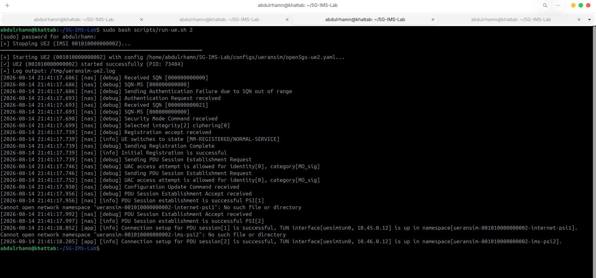
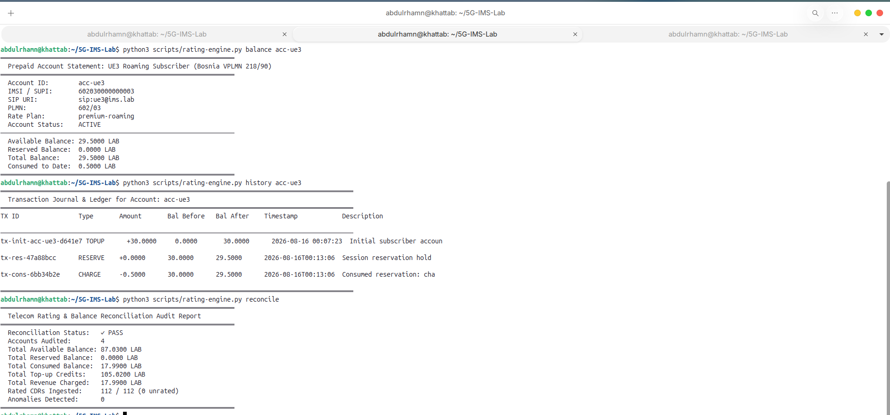
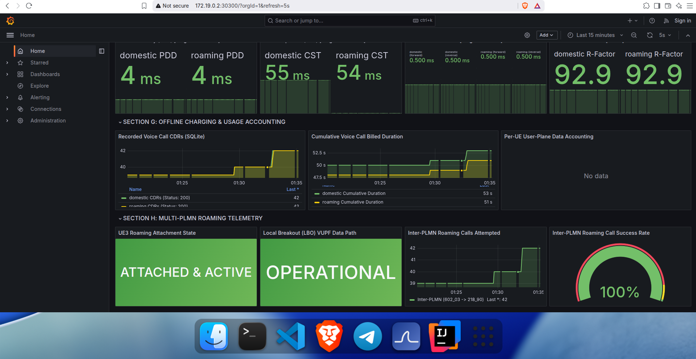

# 5G-IMS-Lab

[](https://open5gs.org/)
[](https://www.kamailio.org/)
[](https://github.com/sipwise/rtpengine)
[](services/charging-erlang/)
[](services/telecom-gui/)
[](k8s/)
[](k8s/monitoring/)
[](scripts/)

**5G-IMS-Lab** is an engineering-grade reference laboratory showcasing a full-stack, cloud-native telecommunications service chain. This project provides a robust, fully automated environment for simulating 5G Standalone (SA) architecture, IMS Vo5G signaling, real-time Erlang-based charging, an interactive operations control center GUI, and full-stack observability.

Ideal for research, education, integration testing, and proof-of-concept deployments.

---

## 📖 Architecture & Service Chain

The laboratory integrates open-source telecommunications components deployed atop a Kubernetes (`kind`) cluster:

* **5G Standalone Core (Open5GS):** Full 3GPP Rel-16 Control and User Plane (AMF, SMF, UPF, UDM, UDR, AUSF, PCF, NRF, BSF) with multi-PLMN network isolation.
* **RAN Simulation (UERANSIM):** Dual gNodeB deployments (Home on `:38412` and Visited on `:38413`) supporting Local Breakout (LBO) roaming and concurrent dual-slice PDU sessions (Internet on `10.45.0.0/16` and IMS on `10.46.0.0/16`).
* **IMS Service Layer (Kamailio & RTPEngine):** P-CSCF, I-CSCF, and S-CSCF nodes handling SIP Digest MD5 authentication, routing, and NAT traversal, backed by an RTPEngine media proxy for bidirectional G.711 PCMU voice streams.
* **Charging & Revenue (Erlang/OTP):** Soft-real-time prepaid charging engine exposing a Cowboy REST API (`:8085`), featuring an immutable double-entry ledger, multi-bucket balances, and voice/data rating algorithms.
* **Control Center GUI (`:8088`):** Modern, minimalistic light management dashboard with an interactive End-to-End Service Chain Visualizer, Multi-PLMN subscriber manager, interactive call execution, and automated reconciliation audits.
* **Observability Stack:** Comprehensive monitoring using Prometheus (metrics scraping), Grafana (53-panel dashboard), and Alertmanager for real-time service assurance and KPI tracking.


---

## 📱 RAN Simulation & Multi-UE Registration

The laboratory emulates isolated radio environments with independent gNodeB instances connected to dedicated AMFs via SCTP N2 associations:

* **gNodeB-Home (`127.0.0.1:38412`):** Serves Home PLMNs `602/03` (UE1) and `602/04` (UE2).
* **gNodeB-Visited (`127.0.0.2:38413`):** Serves Visited PLMN `218/90` (UE3 In-Roaming).

Each subscriber authenticates via 5G-AKA and establishes dual PDU sessions into isolated Linux network namespaces:

| Subscriber | IMSI | PLMN Role | Rate Plan | Internet Slice (`SST:1`) | IMS Slice (`SST:1`) |
| :--- | :--- | :--- | :--- | :--- | :--- |
| **UE1** | `602030000000001` | Egypt `602/03` (Home) | `standard-prepaid` | `10.45.0.10` | `10.46.0.10` |
| **UE2** | `602040000000002` | Egypt `602/04` (Home) | `standard-prepaid` | `10.45.0.11` | `10.46.0.11` |
| **UE3** | `602030000000003` | Bosnia `218/90` (Roaming) | `premium-roaming` | `10.45.0.100` | `10.46.0.100` |




---

## 📞 IMS Vo5G Signaling & Media Flows

Kamailio S-CSCF performs SIP Digest MD5 challenge-response authentication for all registered subscribers. Voice sessions traverse RTPEngine with SDP offer/answer rewriting to ensure zero packet loss across isolated network namespaces.


---

## 💰 Erlang/OTP Revenue & Real-Time Charging

The laboratory features a soft-real-time Charging Function (CHF) built with Erlang/OTP 25 and Cowboy:

* **Deterministic Tariffs:** Domestic voice ($0.05\text{ setup} + 0.02/\text{s}$), Roaming voice ($0.10\text{ setup} + 0.04/\text{s}$), and Data ($0.01/\text{MB}$).
* **ACID Double-Entry Ledger:** Audit trail tracking `TOPUP`, `CHARGE`, `RESERVE`, `CONSUME`, and `RELEASE` operations.
* **Automated Reconciliation:** Invariant verification ensuring $\sum \text{Balances} = \text{Total Top-Ups} - \text{Total Consumed}$ ($PASS$, $0\text{ anomalies}$).

```bash
# Query balance for UE1
curl -s http://127.0.0.1:8085/v1/accounts/acc-ue1/balance | jq .

# Query full double-entry transaction ledger
curl -s http://127.0.0.1:8085/v1/accounts/acc-ue1/transactions | jq .

# Run live financial reconciliation audit
curl -s http://127.0.0.1:8085/v1/reconciliation | jq .
```



---

## 📊 Operations Dashboards & Control Center

Access the user interfaces directly in your browser:

* **Telecom Control Center GUI:** [http://127.0.0.1:8088](http://127.0.0.1:8088)
  *(Minimalist light interface, interactive service chain visualizer, live call execution, and Erlang ledger)*
* **Grafana Operations Dashboard:** [http://172.19.0.2:30300](http://172.19.0.2:30300)
  *(53 pre-configured telecom metric panels across Sections A–J)*
* **Prometheus Target Status:** [http://172.19.0.2:30090/targets](http://172.19.0.2:30090/targets)
* **Alertmanager Notifications:** [http://172.19.0.2:30093](http://172.19.0.2:30093)




---

## 📦 Prerequisites

Ensure your host environment meets the following requirements before deploying:

| Tool | Minimum Version | Note |
| :--- | :--- | :--- |
| **Docker** | 20.10+ | Required for `kind` |
| **kubectl** | 1.27+ | Cluster interaction |
| **kind** | 0.22+ | Kubernetes-in-Docker |
| **Python** | 3.9+ | For GUI and test validation scripts |
| **Erlang/OTP** | 25+ | Required for the charging engine |
| **jq / curl / bash** | — | Standard Linux utilities |

---

## 🚀 Quick Start

Spinning up the complete environment is fully automated:

```bash
# 1. Clone the repository
git clone https://github.com/khattabpi/Open-Telecom-Lab.git 5G-IMS-Lab
cd 5G-IMS-Lab

# 2. Start the Erlang charging service (runs in detached mode on port 8085)
bash scripts/run-erlang-charging.sh start

# 3. Bootstrap the 5G Core, IMS, and Observability cluster
# Handles kernel networking (ip_forward, rp_filter), Kind cluster creation,
# Kubernetes manifests application, and MongoDB subscriber provisioning.
sudo bash scripts/start-lab.sh

# 4. Launch the RAN (gNodeBs) and UEs (User Equipment)
sudo bash scripts/run-gnb.sh all
sudo bash scripts/run-ue.sh all

# 5. Launch the Telecom Operations & Revenue Control Center GUI (port 8088)
bash scripts/run-gui.sh start
```

---

## 🧪 Automated Testing & Verification

The project ships with a comprehensive regression test suite (**212 / 212 tests passing**) validating every layer of the architecture:


### 1. Master Verification Suite (91 Tests)
Validates all 11 domains (K8s pods, PFCP/GTP interfaces, MongoDB subscribers, UE netns connectivity, Inter-PLMN roaming SIP calls, and QoS/Assurance KPIs):

```bash
sudo bash scripts/verify-lab.sh
```

### 2. Standalone IMS & SIP Call Testing
Trigger Multi-PLMN SIP call tests (Domestic UE1 ↔ UE2 and Roaming UE1 ↔ UE3) and verify RTP streams:

```bash
sudo bash scripts/test-ims-call.sh all
```

### 3. Subsystem Validation Suites

* **Telecom Control Center GUI:** `bash scripts/verify-gui.sh` (18/18 Tests)
* **Erlang Charging Engine & Parity:** `bash scripts/verify-erlang-charging.sh` (24/24 Tests)
* **Python Rating Engine:** `bash scripts/verify-rating.sh` (23/23 Tests)
* **Grafana Dashboards:** `bash scripts/verify-grafana.sh` (18/18 Tests)
* **Prometheus & Alerting:** `bash scripts/verify-alerting.sh` (19/19 Tests)
* **Metrics Exporters:** `bash scripts/verify-observability.sh` (19/19 Tests)

---

## 🧹 Teardown

To cleanly stop the laboratory, remove the Kubernetes cluster, and halt background services:

```bash
# Stop Control Center GUI
bash scripts/run-gui.sh stop

# Stop UEs and gNodeBs
sudo bash scripts/run-ue.sh stop
sudo bash scripts/run-gnb.sh stop

# Stop the Erlang charging engine
bash scripts/run-erlang-charging.sh stop

# Destroy the Kubernetes cluster
kind delete cluster --name open5gs-cluster
```

---

## 🤝 Contributing & Licensing

Contributions are welcome! Please review `CONTRIBUTING.md` and `ROADMAP.md` for planned features.

This project is licensed under the **MIT License**. See [`LICENSE`](LICENSE) for details.
