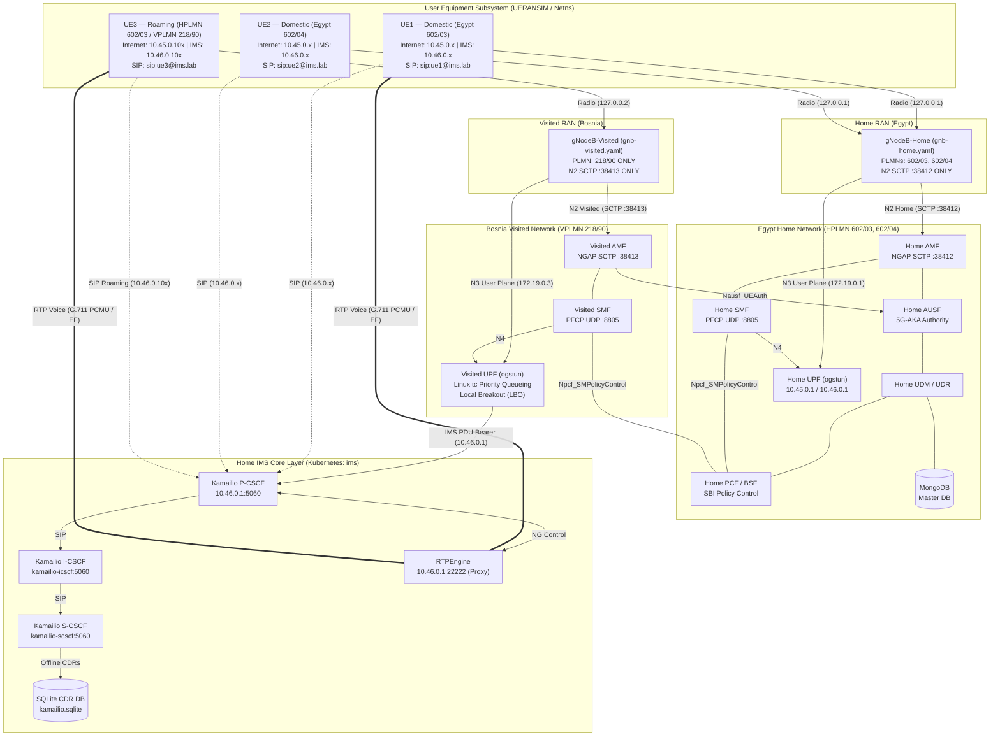

# 5G-IMS-Lab

A 5G Standalone (5G SA) + IMS research and validation laboratory validating multi-UE operation, multi-PLMN roaming with isolated Home/Visited RAN, SIP voice, QoS classification, policy control, offline charging, and service-assurance KPIs using Open5GS, UERANSIM, Kamailio, and RTPEngine.


---

## Overview

5G-IMS-Lab is an engineering laboratory designed to demonstrate and validate a working 5G Standalone core alongside an IP Multimedia Subsystem (IMS) service layer. The project validates a layered set of telecom engineering concerns across four development phases:

- **Phase 1:** 5G SA Core foundation and basic connectivity.
- **Phase 2:** Multi-UE operation and dual-PDU-session validation.
- **Phase 3:** IMS integration, SIP registration/voice, multi-PLMN operation, and inter-PLMN roaming.
- **Phase 4:** 5G QoS/DiffServ, PCF/BSF policy validation, offline charging/accounting, and service-assurance KPI engine.

This is a **research and validation laboratory**. It is not a production carrier network, a complete 3GPP charging system, or a complete roaming interconnect. All technical claims in this document are supported by runtime evidence and automated regression tests.

---

## Architecture

The 5G Core runs inside Kubernetes (`kind`), while the UERANSIM gNodeB and UE processes run on the host. The laboratory isolates the Home (Egypt) and Visited (Bosnia) radio domains using two independent UERANSIM gNodeB processes, each maintaining dedicated N2 SCTP and N3 GTP-U interfaces.



---

## Technology Stack

- **5G Core:** Open5GS v2.8.0
- **RAN/UE Simulator:** UERANSIM v3.3.0
- **IMS Core:** Kamailio (P-CSCF, I-CSCF, S-CSCF)
- **Media Relay:** RTPEngine
- **Database:** MongoDB (5G Core), SQLite (IMS CDRs)
- **Orchestration:** Kubernetes / `kind`

---

## 5G SA Core

The Open5GS 5G SA Core includes the standard network function set, alongside a visited-network deployment for the roaming scenario.

- **Home Network (HPLMN 602/03, 602/04):** AMF, SMF, UPF, AUSF, UDM, UDR, NRF, PCF, BSF, MongoDB.
- **Visited Network (VPLMN 218/90):** Visited AMF, Visited SMF, Visited UPF (Local Breakout).

Manual runtime connectivity validation was executed from the actual UE Linux network namespaces to prove user-plane data connectivity:

| UE | Reachability Check | Result |
|----|----------------------|--------|
| **UE1** | HTTPS request to Google | HTTP/2 200 |
| **UE1** | Ping 8.8.8.8 | 0% packet loss |
| **UE2** | Ping 8.8.8.8 | 0% packet loss |
| **UE3** | Ping 8.8.8.8 | 0% packet loss |

---

## Multi-UE / Dual PDU Sessions

The laboratory operates three simulated UEs. Each UE establishes two independent PDU sessions: one for general Internet data and a dedicated session for IMS signaling and RTP media.

IP addresses are dynamically allocated by Open5GS SMF from designated pool ranges:

| UE | Subscriber Role | Home PLMN | Serving PLMN | Internet Subnet Pool | IMS Subnet Pool | SIP Identity |
|----|-----------------|-----------|--------------|----------------------|-----------------|--------------|
| **UE1** | Domestic | 602/03 | 602/03 (Home) | Dynamic (`10.45.0.10–99`) | Dynamic (`10.46.0.10–99`) | `sip:ue1@ims.lab` |
| **UE2** | Domestic | 602/04 | 602/04 (Home) | Dynamic (`10.45.0.10–99`) | Dynamic (`10.46.0.10–99`) | `sip:ue2@ims.lab` |
| **UE3** | Roaming | 602/03 | 218/90 (Visited)| Dynamic (`10.45.0.100–199`)| Dynamic (`10.46.0.100–199`)| `sip:ue3@ims.lab` |

---

## Multi-PLMN & Roaming

The laboratory models an isolated Home/Visited RAN topology for inter-PLMN Local Breakout (LBO) roaming:

- **Home RAN (`gNodeB-Home`):** Broadcasts PLMNs `602/03` and `602/04`, establishing N2 SCTP connectivity exclusively with Home AMF (`:38412`). Serves domestic subscribers UE1 and UE2.
- **Visited RAN (`gNodeB-Visited`):** Broadcasts VPLMN `218/90` only, establishing N2 SCTP connectivity exclusively with Visited AMF (`:38413`). Serves roaming subscriber UE3.

UE3 operates in an inter-PLMN roaming scenario (HPLMN `602/03`, VPLMN `218/90`):
1. UE3 attaches exclusively through `gNodeB-Visited` on simulated radio link `127.0.0.2`.
2. Visited AMF receives the initial NAS registration over N2 SCTP port 38413.
3. Cross-PLMN 5G-AKA authentication is executed toward Home AUSF via N12 `Nausf_UEAuthentication`.
4. Visited SMF and Visited UPF allocate local user-plane IP addresses and handle Local Breakout (LBO).
5. User-plane N3 GTP-U packets flow directly between `gNodeB-Visited` (`172.19.0.3:2152`) and `VUPF` (`172.19.0.2:2152`), bypassing `gNodeB-Home`.
6. Roaming UE3 registers directly to Home IMS (`sip:ue3@ims.lab`) over the visited IMS PDU bearer.

*Home-Routed roaming (N9/N16) and production SEPP/N32 interconnects are explicitly out of scope.*

---

## IMS Service Layer

The IMS signaling path is validated as:

```
UE → P-CSCF (10.46.0.1:5060) → I-CSCF → S-CSCF
```

RTPEngine provides media relay and SDP handling. All three UEs successfully performed SIP Digest authentication and registration:

| UE | SIP URI | Contact Interface | Result |
|----|----------|-------------------|--------|
| **UE1** | `sip:ue1@ims.lab` | `10.46.0.x:5060` | 200 OK |
| **UE2** | `sip:ue2@ims.lab` | `10.46.0.x:5060` | 200 OK |
| **UE3** | `sip:ue3@ims.lab` | `10.46.0.10x:5060`| 200 OK |

### Voice Call Validation

Two end-to-end voice scenarios were exercised. RTPEngine logs confirmed live PCMU/8000 media sessions with matching packet counters.

| Scenario | Path | Signaling | RTP Result |
|----------|------|-----------|------------|
| **Domestic Call** | UE1 (`602/03`) ↔ UE2 (`602/04`) | INVITE / 180 Ringing / 200 OK / ACK | 25/25 packets each direction, 0% loss, G.711 PCMU |
| **Inter-PLMN Roaming Call** | UE1 (`602/03`) ↔ UE3 (`218/90` Roaming) | INVITE / 180 Ringing / 200 OK / ACK | 25/25 packets each direction, 0% loss, G.711 PCMU |

*This validates the SIP/RTP protocol and media path. It is not a subjective voice-quality test.*

---

## QoS & Traffic Classification

Phase 4 introduced traffic classification and Linux traffic-control enforcement on the UPF data path. The implementation distinguishes between 3GPP QoS classification/signaling and Linux DSCP/`tc` traffic treatment.

**3GPP Classification & Signaling:**
- **Internet:** 5QI 9 (Non-GBR)
- **IMS Signaling (SIP):** 5QI 5, QFI 1

**DSCP Marking:**
- **IMS Signaling:** DSCP 40 (CS5), `IP_TOS 0xA0`
- **RTP Voice:** DSCP 46 (EF), `IP_TOS 0xB8`

**Linux Traffic Control (`tc`):**
- `prio` qdisc with three priority bands on UPF `ogstun`
- `u32` DiffServ classifiers

Scheduling priority is enforced as: **1) RTP / EF (Band 1:1) → 2) SIP / CS5 (Band 1:2) → 3) Default Best-Effort (Band 1:3)**.

---

## Policy Control

PCF and BSF are deployed as part of the Open5GS architecture. The laboratory validates:
- HTTP/2 `POST /npcf-smpolicycontrol/v1/sm-policies` session establishment
- HTTP/2 `POST /nbsf-management/v1/pcfBindings` session binding discovery for all 3 UEs
- Subscriber policy provisioning via UDR/MongoDB

**Limitation:** Kamailio does not dynamically trigger Rx/N5 policy changes in this implementation. Policy is statically provisioned through subscriber profile configuration.

---

## Charging & Usage Accounting

Offline charging and accounting are implemented at the laboratory level. Kamailio S-CSCF accounting writes Call Detail Records (CDRs) into a local SQLite database (`/etc/kamailio/db/kamailio.sqlite`) on dialog teardown (`BYE`).

**CDRs Record:**
- Call-ID, Caller (`$fu`), and Callee (`$ru`)
- Start time, end time, and duration
- SIP response status (e.g., `200 OK`) and source IP

User-plane usage is separately tracked via Linux network namespace counters, keyed by SUPI, serving PLMN, DNN, allocated IP, and direction (uplink/downlink bytes and packets).

**Technical Boundary:** Open5GS v2.8.0 as deployed here does **not** provide a 3GPP CHF implementation (`open5gs-chfd`). SQLite CDRs and namespace telemetry are laboratory accounting mechanisms, not 3GPP Nchf services.

---

## Service Assurance / KPIs

A KPI engine measures Post-Dial Delay (PDD), Call Setup Time (CST), Call Setup Success Rate (CSSR), RTP packet loss, RTP sequence continuity, RFC 3550 jitter, R-factor, and estimated MOS.

| Metric | Domestic (UE1 ↔ UE2) | Roaming (UE1 ↔ UE3) | SLA Target |
|--------|----------------------|----------------------|------------|
| **Post-Dial Delay (PDD)** | 4.10 ms | 3.11 ms | < 200 ms |
| **Call Setup Time (CST)** | 54.18 ms | 54.00 ms | < 500 ms |
| **Call Setup Success (CSSR)** | 100.0% | 100.0% | 100% |
| **RTP Packet Loss** | 0.0% (25/25 packets) | 0.0% (25/25 packets) | 0% |
| **RTP Sequence Continuity** | 0 missing, 0 out-of-order | 0 missing, 0 out-of-order | Continuous |
| **RFC 3550 Jitter** | 0.819 ms | 0.290 ms | < 20.0 ms |
| **Estimated MOS** | 4.40 / 4.50 | 4.40 / 4.50 | $\ge$ 4.0 |

*Note: MOS is an ITU-T G.107 E-model approximation for G.711 PCMU ($I_e=0, B_{pl}=4.3$). It is not a subjective ITU-T P.800 listening-panel result.*

---

## Validation Results

The laboratory is validated by a 91-test automated regression suite:


```text
═══════════════════════════════════════════════════════════════════════
  Verification Summary: 91 Passed, 0 Failed, 0 Warnings
═══════════════════════════════════════════════════════════════════════
  >>> All 5G SA Core, Multi-PLMN Roaming & IMS Voice Call Tests Passed! <<<
```

### Test Coverage Breakdown

| Section | Coverage | Result |
|---------|----------|--------|
| **Sections 1–5** | 5GC Deployments, MongoDB, Kernel & UPF Interfaces | 24/24 PASS |
| **Section 6** | Isolated gNodeB-Home & gNodeB-Visited, Multi-UE NAS/PDU | 11/11 PASS |
| **Section 7** | End-to-End Multi-UE User Plane Connectivity (Ping/HTTPS) | 24/24 PASS |
| **Section 8** | IMS Core Network Functions (Kamailio & RTPEngine) | 7/7 PASS |
| **Section 9** | Phase 3 IMS Roaming & Multi-PLMN Voice Calls | 8/8 PASS |
| **Section 10** | Phase 4 Offline Charging & Usage Accounting | 7/7 PASS |
| **Section 11** | Phase 4 Service Assurance & Real-Time KPI Engine | 10/10 PASS |
| **Total** | | **91/91 PASS** |

---

## Technical Limitations / Scope

To ensure technical maturity and avoid exaggerated claims, the boundaries of this laboratory are explicitly defined below:

| Feature | Status | Engineering Reality |
|---|---|---|
| **5G SA Core** | Implemented and validated | Full Open5GS multi-NF deployment on Kubernetes (kind) |
| **Isolated RAN Domains** | Implemented and validated | Independent `gNodeB-Home` (602/03, 602/04) and `gNodeB-Visited` (218/90) |
| **Multi-UE & Dual PDU** | Implemented and validated | UERANSIM multi-UE with isolated netns per PDU session |
| **IMS SIP Registration** | Implemented and validated | Kamailio P/I/S-CSCF Digest MD5 challenge-response |
| **Domestic & Roaming Voice** | Implemented and validated | End-to-end SIP call setup with bidirectional RTP media |
| **LBO Roaming** | Implemented and validated | Visited AMF/SMF with Local Breakout at Visited UPF |
| **QoS / DiffServ Classification** | Implemented and validated | DSCP CS5/EF socket marking and Linux `tc prio` on `ogstun` |
| **PCF / BSF Static Policy** | Implemented and validated | Standard SBI `npcf-smpolicycontrol` and `nbsf-management` |
| **IMS Offline CDR Accounting** | Implemented | Kamailio S-CSCF `acc`/`dialog` writing to SQLite |
| **User-Plane Telemetry** | Implemented | Linux netns RX/TX byte and packet counters per SUPI/DNN |
| **3GPP CHF / Nchf** | **NOT implemented** | Open5GS v2.8.0 does not include `open5gs-chfd` |
| **Dynamic Rx/N5 Policy Triggering** | **NOT implemented** | Kamailio does not trigger dynamic PCF policy modifications |
| **3GPP SEPP / N32 PRAS** | **NOT implemented** | Inter-PLMN SBI communication uses Kubernetes cluster DNS |
| **Home-Routed Roaming / N9 / N16** | **NOT implemented** | User-plane roaming is Local Breakout (LBO) only |
| **Subjective MOS Testing** | **NOT implemented** | Voice quality is calculated via ITU-T G.107 E-model math |
| **Production Carrier Deployment** | **NOT claimed** | Research, protocol validation, and educational lab |

---

## Repository Structure

```text
5G-IMS-Lab/
├── README.md
├── CHANGELOG.md
├── ROADMAP.md
├── SECURITY.md
├── configs/
│   ├── ueransim/                      # Isolated gNodeB and UE YAML configurations
│   │   ├── open5gs-gnb-home.yaml      # gNodeB-Home (PLMNs 602/03, 602/04 -> HAMF :38412)
│   │   ├── open5gs-gnb-visited.yaml   # gNodeB-Visited (VPLMN 218/90 -> VAMF :38413)
│   │   ├── open5gs-ue.yaml            # UE1 Home Subscriber (602/03)
│   │   ├── open5gs-ue2.yaml           # UE2 Home Subscriber (602/04)
│   │   └── open5gs-ue3.yaml           # UE3 Roaming Subscriber (602/03 in 218/90)
│   └── sipp/                          # SIP testing scenarios
├── docs/
│   ├── architecture/
│   │   └── home-vs-visited-ran.md     # Engineering note on RAN separation & LBO path
│   ├── engineering-notes/
│   │   ├── phase4-qos-charging-assurance.md  # Detailed Phase 4 engineering documentation
│   │   ├── linux-networking-behind-5g.md
│   │   └── debugging-pdu-session.md
│   └── images/                        # Architectural and verification diagrams
├── k8s/
│   ├── configmap.yaml                 # 5GC configuration ConfigMap (PCF/BSF debug)
│   ├── control-plane.yaml             # 5GC core NF deployments
│   ├── upf.yaml                       # UPF deployment with Linux tc QoS
│   ├── mongodb.yaml                   # Subscriber database
│   ├── kind-config.yaml               # Kubernetes kind cluster manifest
│   └── ims/
│       ├── configmap.yaml             # Kamailio configurations & SQLite init
│       ├── pcscf.yaml                 # P-CSCF deployment
│       ├── icscf.yaml                 # I-CSCF deployment
│       ├── scscf.yaml                 # S-CSCF deployment (CDR accounting)
│       └── rtpengine.yaml             # RTPEngine media proxy
└── scripts/
    ├── start-lab.sh                   # Initializes 5GC and IMS pods
    ├── run-gnb.sh                     # Starts isolated Home & Visited UERANSIM gNodeBs
    ├── run-ue.sh                      # Manages UERANSIM UE instances (1, 2, 3)
    ├── test-ims-call.sh               # Executes multi-PLMN SIP registrations and calls
    ├── collect-charging-records.sh    # Queries SQLite CDRs and netns usage counters
    ├── measure-kpis.sh                # Real-time PDD, CST, CSSR, jitter, and MOS engine
    ├── add-subscriber.sh              # Adds subscribers to MongoDB
    ├── validate-ims-call.sh           # Validates IMS call signaling and logs
    └── verify-lab.sh                  # Official 91-test regression verification suite
```

---

## Running / Validating the Lab

Execute the complete end-to-end operational workflow using `sudo`:

```bash
# 1. Start the 5G Core and IMS infrastructure on Kubernetes
sudo bash scripts/start-lab.sh

# 2. Launch the isolated Home and Visited gNodeB instances
sudo bash scripts/run-gnb.sh all

# 3. Launch all three UERANSIM UEs (UE1 Home, UE2 Home, UE3 Roaming)
sudo bash scripts/run-ue.sh all

# 4. Execute SIP registrations and domestic/roaming voice calls
sudo bash scripts/test-ims-call.sh all

# 5. Collect offline charging records (CDRs) and data usage
sudo bash scripts/collect-charging-records.sh

# 6. Measure real-time service assurance KPIs
sudo bash scripts/measure-kpis.sh

# 7. Run the official 91-test automated regression suite
sudo bash scripts/verify-lab.sh
```

---

## Project Phases

Development was structured across four engineering milestones:

1. **Phase 1: 5G SA Core Foundation.** Established basic 5G connectivity, 5G-AKA authentication, and single-UE Internet access.
2. **Phase 2: Multi-UE & Dual PDU Sessions.** Expanded to three UEs and established parallel Internet (`10.45.0.0/16`) and IMS (`10.46.0.0/16`) PDU sessions.
3. **Phase 3: IMS & Roaming Integration.** Deployed Kamailio P/I/S-CSCF, RTPEngine, SIP registration, domestic voice, and inter-PLMN LBO roaming (`602/03` ↔ `218/90`) with isolated Home/Visited RAN domains.
4. **Phase 4: QoS, Charging & Assurance.** Implemented Linux `tc` 3-band queueing, PCF/BSF static policy validation, offline SQLite CDR accounting, user-plane telemetry, and the real-time KPI engine.

---

## Conclusion

5G-IMS-Lab demonstrates a real, multi-component, end-to-end telecom laboratory. It validates 5G SA, multi-UE operation, dual PDU sessions, isolated Home/Visited RAN domains, multi-PLMN LBO roaming, IMS SIP registration, domestic and inter-PLMN voice, bidirectional RTP, QoS/DiffServ classification, PCF/BSF static policy, offline CDR accounting, user-plane usage telemetry, and service assurance KPIs.

The project is validated by a 91/91 automated regression suite, with explicit engineering boundaries documented where production-scope 3GPP functionality is intentionally out of scope.
