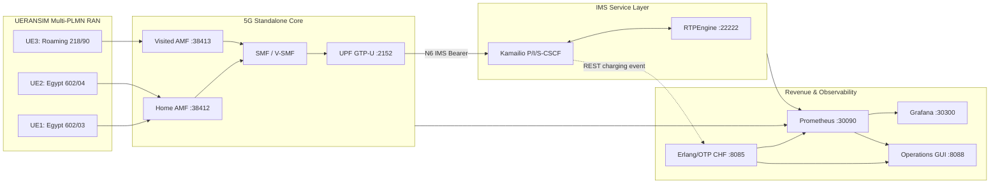
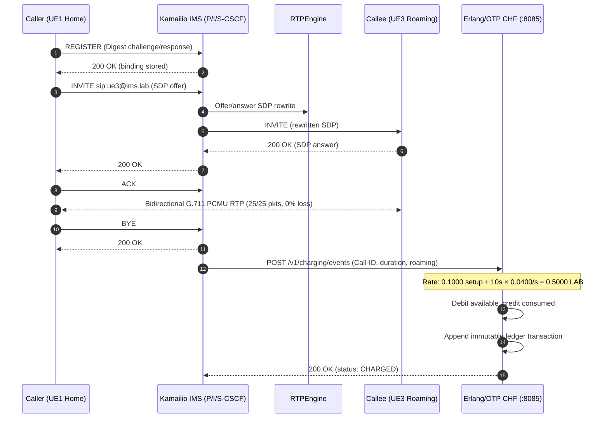
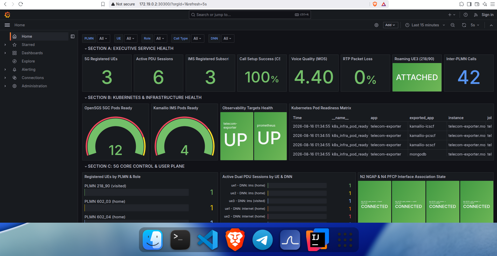

# 5G-IMS-Lab

[](https://open5gs.org/)
[](https://www.kamailio.org/)
[](https://github.com/sipwise/rtpengine)
[](services/charging-erlang/)
[](services/telecom-gui/)
[](k8s/)
[](k8s/monitoring/)
[](scripts/)

**5G-IMS-Lab** is an engineering-grade reference laboratory that wires together a full telecom service chain: a 3GPP-style 5G Standalone Core, multi-PLMN roaming, Kamailio IMS with real Vo5G voice calls, an Erlang/OTP real-time charging engine, and an operations control center — all containerized, observable, and regression-tested end to end.


---

## 🏛️ Architecture



* **5G SA Core (Open5GS):** AMF, Visited AMF, SMF, Visited SMF, UPF, UDM, UDR, AUSF, PCF, BSF, NRF, plus MongoDB as the subscriber store — 12 pods total on a `kind` Kubernetes cluster.
* **IMS Service Layer (Kamailio + RTPEngine):** P-CSCF, I-CSCF, S-CSCF handling SIP Digest MD5 auth, backed by RTPEngine for bidirectional G.711 PCMU media relay.
* **Charging & Revenue (Erlang/OTP):** a Cowboy REST API (`:8085`) with prepaid balances, double-entry ledger, and financial reconciliation.
* **Control Center GUI (`:8088`):** a zero-dependency Python + SPA console that visualizes and drives the whole chain.
* **Observability:** Prometheus + Grafana + Alertmanager across 7 telemetry categories.

---

## 🌐 Multi-PLMN & Roaming

| Subscriber | IMSI | Home PLMN | Serving PLMN | Roaming Type | Internet PDU | IMS PDU |
| :--- | :--- | :--- | :--- | :--- | :--- | :--- |
| **UE1** | `602030000000001` | `602/03` (Egypt) | `602/03` | Home Domestic | `10.45.0.10` | `10.46.0.10` |
| **UE2** | `602040000000002` | `602/04` (Egypt) | `602/04` | Home Domestic | `10.45.0.11` | `10.46.0.11` |
| **UE3** | `602030000000003` | `602/03` (Egypt) | `218/90` (Bosnia) | Visited LBO Roaming | `10.45.0.100` | `10.46.0.100` |

UE3 keeps its Egyptian home identity (`602/03`) but attaches over radio to the **Visited AMF** serving `218/90`. Because `serving_plmn` ≠ `plmn`, both the rating engine and the GUI classify every session from UE3 as roaming and apply the `premium-roaming` tariff — this single mismatch is what drives Local Breakout routing, roaming call classification, and roaming charging throughout the stack.

* **Home gNodeB (`127.0.0.1:38412`):** serves domestic subscribers UE1 and UE2.
* **Visited gNodeB (`127.0.0.2:38413`):** serves the inbound roaming subscriber UE3 via Local Breakout.

---

## 🔄 End-to-End Call & Charging Flow



---

## 💰 Revenue & Real-Time Charging

The Erlang/OTP charging service (`services/charging-erlang/`) runs a `gen_server`-based core under a `one_for_one` supervisor, exposed over a Cowboy REST API on `:8085`.

* **Prepaid balance buckets:** `available`, `reserved`, `consumed` per subscriber account.
* **Deterministic tariffs:** domestic voice at `0.05` LAB setup + `0.02` LAB/s; roaming voice at `0.10` LAB setup + `0.04` LAB/s.
* **Worked example (UE3, 10s roaming call):** `0.1000 LAB setup + 10 × 0.0400 LAB/s = 0.5000 LAB`, debited from `available` and credited to `consumed` in one atomic transaction.
* **Double-entry ledger:** every operation (`TOPUP`, `CHARGE`, `RESERVE`, `CONSUME`, `RELEASE`) is recorded as an immutable, auditable transaction.
* **Idempotency:** duplicate charging events for the same `Call-ID` are detected and rejected — no double debits on retry.
* **Reconciliation:** a standing invariant check confirms `available + consumed + reserved ≡ total top-ups`, with 0 anomalies.

```bash
curl -s http://127.0.0.1:8085/v1/accounts/acc-ue1/balance | jq .
curl -s http://127.0.0.1:8085/v1/reconciliation | jq .
```

---

## 🖥️ Operations & Revenue Control Center

A Python + single-page-app console on `:8088` gives a live, interactive view over the whole lab with no external runtime dependencies.

* **Overview:** an animated pipeline visualizer tracing UE → 5GC → IMS → RTPEngine → charging → ledger → reconciliation, plus top-line health (NFs online, active UEs, IMS status, ledger audit, voice QoS).
* **Subscribers & Slices:** per-UE PLMN role, dual PDU session state, and live namespace RX/TX counters, with a direct top-up action.
* **IMS Calls & Media:** one-click triggers for domestic (UE1↔UE2) and roaming (UE1↔UE3) calls, with live SIP/RTP log streaming.
* **Revenue & Charging:** account balances, the tariff table, a quote calculator, the full ledger, and an on-demand reconciliation trigger.
* **Network Topology:** the Multi-PLMN node map with live port/interface status.

---

## 📊 Observability

Prometheus scrapes a custom `telecom-exporter` across 7 telemetry categories (infra, 5GC, IMS/SIP, RTP media, charging, QoE, roaming), rendered on a 53-panel Grafana dashboard spanning Sections A–J, with 26 Alertmanager rules covering infra, 5GC, IMS, RTP, QoE, roaming, and charging faults.



* **Signaling KPIs (measured, not simulated):** Post-Dial Delay ~3–4ms and Call Setup Time ~54–56ms, both well inside their `<200ms` / `<500ms` targets; Call Setup Success Rate 100%.
* **Voice quality:** RFC 3550 inter-arrival jitter measured at ~0.28–0.29ms (target `<20ms`); 0% RTP packet loss on both call legs.
* **Estimated MOS:** ~4.4 / 4.5, computed as an ITU-T G.107 E-model approximation from measured loss, delay, and jitter — an estimate, not a subjective MOS survey.

---

## 🧪 Validation Evidence

Every layer ships with its own automated regression suite:

| Domain | Verified Result | Suite |
| :--- | :--- | :--- |
| 5G SA Core & RAN | 12/12 pods ready, dual-PLMN UEs registered, dual PDU sessions active | `verify-lab.sh` (91 checks) |
| IMS voice | SIP Digest auth, 25/25 RTP packets, 0% loss | `verify-lab.sh` / `test-ims-call.sh` |
| Service assurance KPIs | PDD, CST, jitter, MOS within target on domestic & roaming calls | `measure-kpis.sh` |
| Erlang/OTP charging | Rating parity, ACID balance mutations, idempotency | `verify-erlang-charging.sh` (24 checks) |
| Rating & ledger | Reconciliation PASS, 0 anomalies | `verify-rating.sh` (23 checks) |
| Operations GUI | All REST endpoints responsive, live actions working | `verify-gui.sh` (18 checks) |
| Grafana dashboards | 53 panels provisioned and query-valid | `verify-grafana.sh` (18 checks) |
| Alerting | 26 rules loaded, fault injection + recovery verified | `verify-alerting.sh` (19 checks) |
| Metrics exporters | 7 telemetry categories scraped | `verify-observability.sh` (19 checks) |
| **Total baseline** | **212 / 212 tests passing (100% green)** | All 7 suites combined |

---

## 🚀 Quick Start

```bash
git clone https://github.com/khattabpi/Open-Telecom-Lab.git 5G-IMS-Lab
cd 5G-IMS-Lab

# Start the Erlang charging engine (:8085)
bash scripts/run-erlang-charging.sh start

# Bootstrap the 5GC, IMS, and observability stack on a kind cluster
sudo bash scripts/start-lab.sh

# Bring up the RAN (gNodeBs) and UEs
sudo bash scripts/run-gnb.sh all
sudo bash scripts/run-ue.sh all

# Launch the Operations Control Center GUI (:8088)
bash scripts/run-gui.sh start
```

**Endpoints:** GUI → `http://127.0.0.1:8088` · Erlang charging API → `http://127.0.0.1:8085` · Grafana → `http://172.19.0.2:30300` · Prometheus → `http://172.19.0.2:30090/targets` · Alertmanager → `http://172.19.0.2:30093`

```bash
# Full regression suite (91 checks)
sudo bash scripts/verify-lab.sh

# Standalone SIP/RTP call test (domestic + roaming)
sudo bash scripts/test-ims-call.sh all

# GUI + REST endpoint checks (18 checks)
bash scripts/verify-gui.sh
```


## 📄 License

Distributed under the **MIT License**. See [`LICENSE`](LICENSE) for details. Built on [Open5GS](https://open5gs.org/), [Kamailio](https://www.kamailio.org/), [RTPEngine](https://github.com/sipwise/rtpengine), [UERANSIM](https://github.com/aligungr/UERANSIM), [Erlang/OTP](https://www.erlang.org/), and [Prometheus](https://prometheus.io/)/[Grafana](https://grafana.com/).
