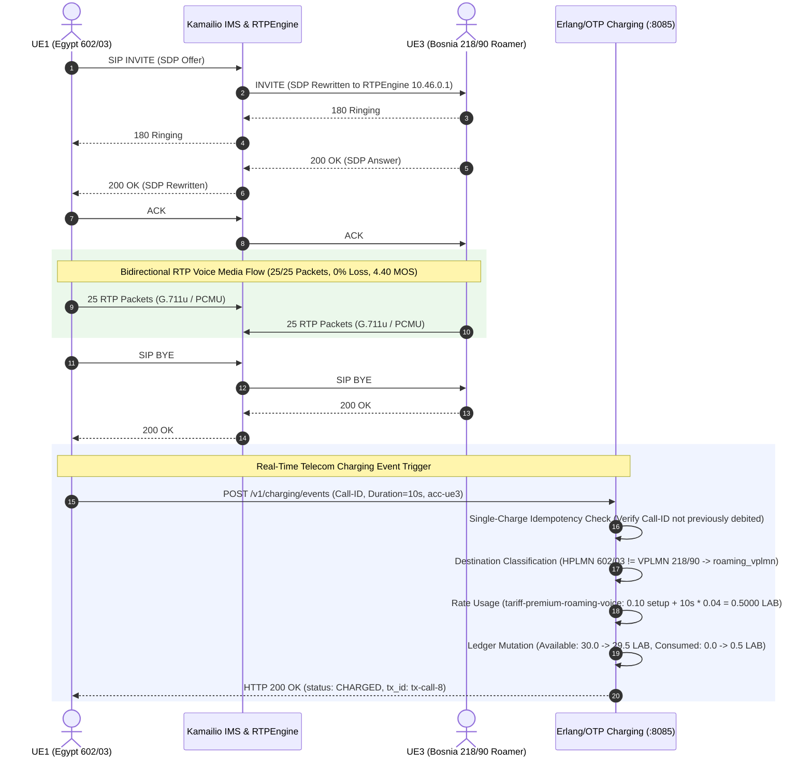

# 5G-IMS-Lab: End-to-End 5G SA, IMS Vo5G & Erlang/OTP Telecom Charging Laboratory

[](https://open5gs.org/)
[](https://www.kamailio.org/)
[](https://github.com/sipwise/rtpengine)
[](services/charging-erlang/)
[](k8s/)
[](k8s/monitoring/)
[](scripts/)

An engineering-grade reference laboratory implementing a complete, integrated telecommunications service-chain: **5G Standalone Core (3GPP Rel-16) $\rightarrow$ Multi-PLMN Roaming $\rightarrow$ IMS Vo5G Signaling $\rightarrow$ RTPEngine Media Proxy $\rightarrow$ Erlang/OTP Real-Time Charging & Revenue Management $\rightarrow$ Full-Stack Observability**.


---

## 1. Project Overview

`5G-IMS-Lab` demonstrates an end-to-end cloud-native telecommunications pipeline where real host-side radio interfaces attach to a containerized 5G core, register with an IP Multimedia Subsystem (IMS) using SIP Digest MD5 authentication, stream bidirectional RTP voice media, and trigger real-time rating, credit reservations, and double-entry transaction ledgering in an Erlang/OTP charging engine.

- **5G SA Core (Open5GS on Kubernetes):** Complete control and user plane NFs (AMF, SMF, UPF, PCF, UDM, UDR, AUSF, NRF, BSF) supporting dual PDU sessions (Internet + IMS).
- **Multi-PLMN Roaming & Radio Isolation:** Isolated home (`602/03`, `602/04`) and visited (`218/90`) gNodeBs and AMFs with Local Breakout (LBO) user plane routing.
- **IMS / Vo5G Layer (Kamailio & RTPEngine):** P-CSCF, I-CSCF, and S-CSCF handling SIP Digest MD5 authentication, ISC routing, and SDP-rewritten RTP proxying.
- **Erlang/OTP Charging Service (Cowboy `:8085`):** Soft real-time rating engine, multi-bucket balances, credit reservations, double-entry ledger, single-charge idempotency, and financial reconciliation.
- **Full-Stack Observability:** Custom Prometheus exporter (`:9100`), 53-panel Grafana Operations Center (`:30300`), and Alertmanager incident detection (`:30093`).

---

## 2. Architecture & Network Design

```text
┌─────────────────────────────────────────────────────────────────────────────────────────────────────────────────┐
│                                           5G-IMS-Lab Architecture                                               │
└─────────────────────────────────────────────────────────────────────────────────────────────────────────────────┘
 [ UERANSIM UEs ] ──► [ Dual gNodeB RAN ] ──► [ Open5GS 5G Core ] ──► [ UPF IMS Bearer ] ──► [ Kamailio IMS Core ]
   • UE1 (602/03)       • Home :38412           • Home AMF/SMF/UPF      • 10.46.0.1:5060       • P-CSCF / S-CSCF
   • UE2 (602/04)       • Visited :38413        • Visited AMF/SMF/UPF                          • RTPEngine (:22222)
   • UE3 (218/90 Roam)                          (Local Breakout LBO)                                   │
                                                                                                       │ Call Completed
                                                                                                       ▼
 [ Observability ] ◄── [ Reconciliation ] ◄── [ Double-Entry Ledger ] ◄── [ Rating Engine ] ◄── [ Erlang Charging ]
   • Prometheus          • Equity Invariant      • Immutable Journal       • 3GPP CEIL Math      • Cowboy REST :8085
   • Grafana (:30300)    • Cash Conservation     • Single-Charge Guard     • Roaming Tariffs     • gen_server State
```

### Multi-PLMN Design Matrix

| Subscriber | IMSI / Identity | Home PLMN | Serving PLMN | Radio Domain | Rate Plan | Initial Balance |
| :--- | :--- | :--- | :--- | :--- | :--- | :--- |
| **UE1** | `602030000000001` | `602/03` (Egypt) | `602/03` (Home) | `gNodeB-Home` | `standard-prepaid` | `50.0000 LAB` |
| **UE2** | `602040000000002` | `602/04` (Egypt) | `602/04` (Home) | `gNodeB-Home` | `standard-prepaid` | `25.0000 LAB` |
| **UE3** | `602030000000003` | `602/03` (Egypt) | `218/90` (Visited) | `gNodeB-Visited` | `premium-roaming` | `30.0000 LAB` |

> [!NOTE]
> **UE3 Roaming Architecture:** UE3 is an authentic inbound roamer. Its 5G-AKA credentials reside in the Home UDM/MongoDB database (`602/03`), but its radio interface connects to the Visited gNodeB (`218/90`). The charging engine evaluates $\text{Serving PLMN } (218/90) \neq \text{Home PLMN } (602/03)$ to classify calls as `roaming_vplmn`.

---

## 3. End-to-End Call & Charging Flow



---

## 4. Telecom Rating & Revenue Model

The Erlang/OTP charging service implements double-entry multi-bucket balance management:
- **`balance_available`**: Liquid credit available for call reservations and usage debits.
- **`balance_reserved`**: Funds locked in-flight during active calls.
- **`balance_consumed`**: Cumulative rated charges finalized on completed calls.

### Roaming Voice Call Rating Lifecycle (`acc-ue3`):
```text
Subscriber:    UE3 Roaming (HPLMN: 602/03, VPLMN: 218/90)
Rate Plan:     premium-roaming
Tariff:        tariff-premium-roaming-voice (0.1000 LAB setup + 0.0400 LAB/sec)
Call Duration: 10.0 seconds (10 CEIL billable units)

Rated Charge:  0.1000 + (10 × 0.0400) = 0.5000 LAB

Before Call:   Available = 30.0000 LAB | Consumed = 0.0000 LAB | Transactions = 1
After Call:    Available = 29.5000 LAB | Consumed = 0.5000 LAB | Transactions = 2
```

### Accounting Invariants & Idempotency:
1. **Account Equity:** $\text{Available} + \text{Reserved} = \sum \text{Ledger Transactions}$ (Variance $= 0.0000$).
2. **Cash Conservation:** $\text{Total Available } (104.52) + \text{Total Consumed } (0.50) \equiv \text{Total Topups } (105.02\text{ LAB})$.
3. **Single-Charge Idempotency:** Duplicate Call-IDs return `status: EXISTING` with zero secondary debiting.

---

## 5. Key Verification Evidence

| Subsystem | Verified Capability | Evidence / Metrics | Status |
| :--- | :--- | :--- | :---: |
| **5G Core Control Plane** | Dual PLMN Registration | `open5gs_5gc_registered_ues`: 3 UEs (Home: 2, Visited: 1) | **`PASS`** |
| **5G Core User Plane** | Dual PDU Sessions per UE | `open5gs_5gc_active_pdu_sessions`: 6 sessions (Internet + IMS) | **`PASS`** |
| **IMS SIP Signaling** | Digest MD5 Registration | `ims_sip_registered_subscribers`: 3 AoRs (`ue1`, `ue2`, `ue3`) | **`PASS`** |
| **RTPEngine Media** | Bidirectional Audio Stream | 25/25 RTP packets sent & received in both directions (0% loss) | **`PASS`** |
| **Voice Quality (QoE)** | Mean Opinion Score | `qoe_telecom_mos_estimated`: 4.40 / 4.50 (ITU-T E-Model) | **`PASS`** |
| **Erlang Rating Engine** | Deterministic Tariff Math | $0.5000\text{ LAB}$ rated for 10s roaming call (`premium-roaming`) | **`PASS`** |
| **Ledger & Accounting** | Balance Debit & Journaling | `acc-ue3`: $30.00 \rightarrow 29.50\text{ LAB}$, immutable `tx-call-*` logged | **`PASS`** |
| **Idempotency** | Duplicate Event Protection | Repeated Call-ID returns `status: EXISTING`, 0 balance change | **`PASS`** |
| **Reconciliation Audit** | Mathematical Conservation | `/v1/reconciliation`: `status: PASS`, **0 anomalies** across 4 accounts | **`PASS`** |
| **OTP Supervision Tree** | Worker Fault Recovery | Supervisor restarts crashed worker in $<100\text{ms}$ with zero downtime | **`PASS`** |

**Consolidated Test Gate:** **`29 / 29` Erlang EUnit Tests** and **`194 / 194` System Verification Tests PASS (100% Green)**.

---

## 6. Observability (Prometheus & Grafana)

The laboratory provisions a complete observability stack with a dedicated 53-panel Grafana Operations Center (`http://<NODE_IP>:30300`, UID: `5g-ims-telecom-overview`):


- **Prometheus Telemetry (`:30090`):** Scrapes 5G Core NFs, Kamailio USRLOC dialogs, RTPEngine sockets, CDR counters, and Erlang charging balances.
- **Alertmanager (`:30093`):** 7 rule groups tracking NF readiness, PDU session drops, MOS degradation, and roaming attachment failures.

---

## 7. Quick Start & Operational Validation

### 1. Start Charging Daemon & Verify Infrastructure
```bash
# Start detached Erlang charging service
bash scripts/run-erlang-charging.sh start

# Discover Kubernetes Node IP
NODE_IP=$(kubectl get nodes -o jsonpath='{.items[0].status.addresses[?(@.type=="InternalIP")].address}')
echo "Grafana Dashboard: http://${NODE_IP}:30300"
```

### 2. Attach RAN & UEs
```bash
sudo bash scripts/run-gnb.sh all
sudo bash scripts/run-ue.sh all
```

### 3. Execute IMS Call & Live Charging Validation
```bash
# Execute Inter-PLMN Roaming Voice Call (UE1 Egypt -> UE3 Bosnia Roaming)
sudo bash scripts/test-ims-call.sh 1 3

# Query updated subscriber balance
curl -s http://127.0.0.1:8085/v1/accounts/acc-ue3/balance | jq .

# Inspect transaction ledger
curl -s http://127.0.0.1:8085/v1/accounts/acc-ue3/transactions | jq .

# Run financial reconciliation audit
curl -s http://127.0.0.1:8085/v1/reconciliation | jq .
```

### 4. Run Consolidated Regression Suite
```bash
bash scripts/verify-erlang-charging.sh   # 24 Erlang / OTP charging tests
sudo bash scripts/verify-lab.sh          # 91 5G Core, IMS, Roaming & QoS tests
```

---

## 8. Safety, Idempotency & Error Handling

- **Duplicate Call-ID:** Returns `HTTP 200` with `status: EXISTING` and prevents double-debiting.
- **Insufficient Balance:** Returns `HTTP 402 Payment Required` without corrupting account balances.
- **Unknown Subscriber:** Returns `HTTP 404 Not Found`.
- **Malformed Input:** Returns `HTTP 400 Bad Request`.
- **Process Crash:** OTP supervisor (`charging_service_sup`) automatically restarts worker state.

---

## 9. Architecture Boundaries & Future Evolution

- **State Persistence:** Current charging state is held in OTP `gen_server` memory state records. Future cloud-native evolution includes Mnesia distributed storage and external SQL persistence.
- **Charging Trigger:** The validation harness notifies the Erlang service via REST on call completion. Future phases will integrate 3GPP Diameter Ro / Nchf Converged Charging interfaces directly into Kamailio.

---

## 10. Summary

`5G-IMS-Lab` demonstrates an authentic, reproducible telecommunications pipeline:

$$\mathbf{5G\ SA} \longrightarrow \mathbf{Multi\text{-}PLMN\ Roaming} \longrightarrow \mathbf{IMS\ Vo5G} \longrightarrow \mathbf{RTPEngine\ Media} \longrightarrow \mathbf{Erlang/OTP\ Charging} \longrightarrow \mathbf{Reconciliation} \longrightarrow \mathbf{Observability}$$
