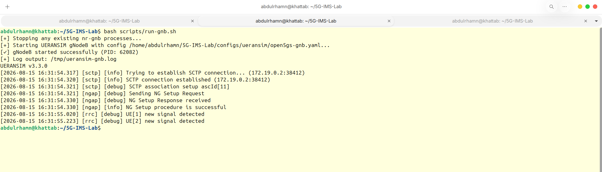
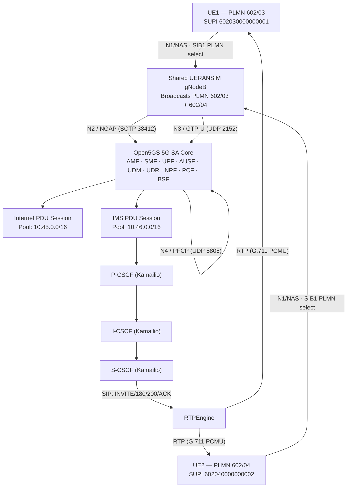
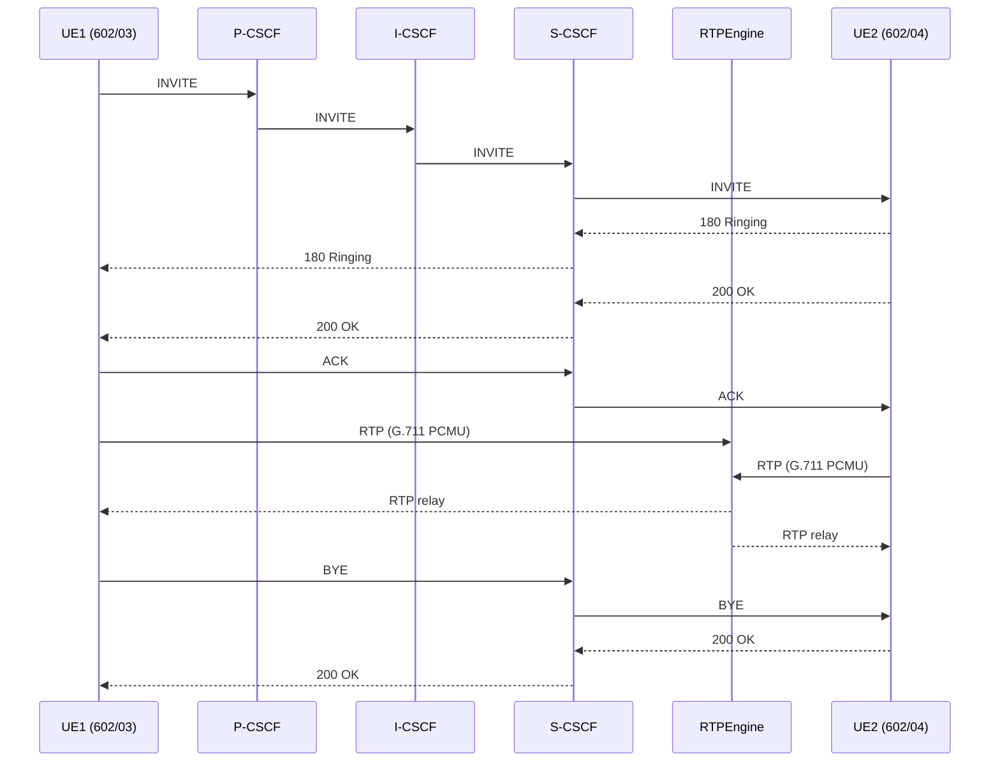
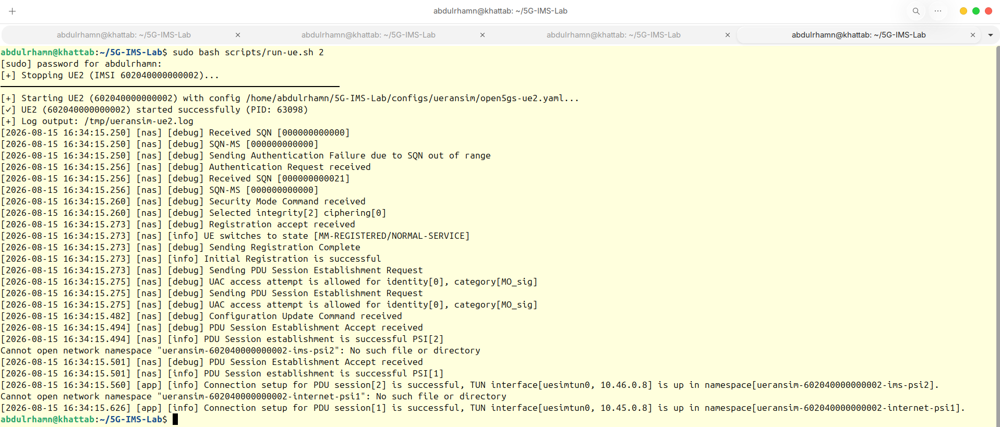
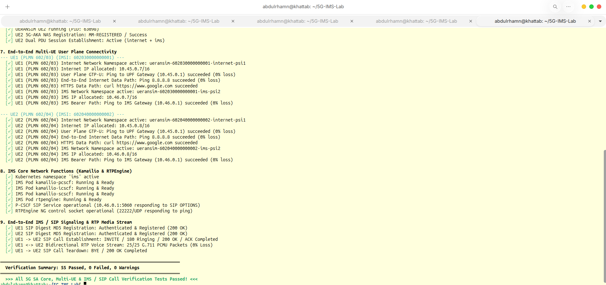
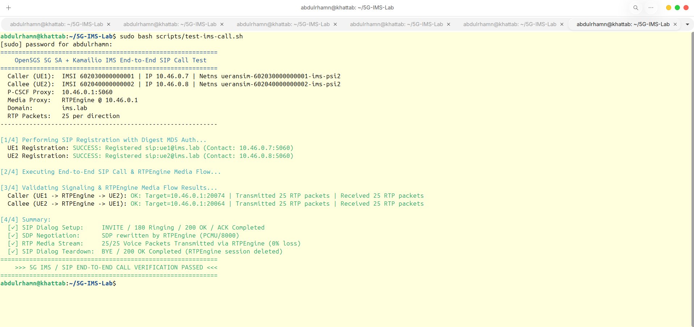

# 5G-IMS-Lab

**A software-based 5G Standalone (5G SA) + IMS laboratory validating a complete end-to-end telecom service path — from RAN registration to SIP voice calls.**


---

## Overview

5G-IMS-Lab is a self-contained 5G Standalone (5G SA) and IP Multimedia Subsystem (IMS) laboratory built entirely on open-source components: **Open5GS**, **UERANSIM**, **Kamailio**, **RTPEngine**, **MongoDB**, and **Kubernetes (kind)**.

The lab validates a complete, protocol-accurate service path:

```
5G Registration → 5G-AKA Authentication → PDU Session Establishment
→ Internet Connectivity → IMS PDU Connectivity → SIP Registration
→ SIP Call Establishment → SDP Negotiation → RTP Media Proxying
→ Bidirectional RTP → SIP Call Teardown
```

This is a **protocol-validation and research laboratory**, not a commercial carrier network. It is designed to demonstrate, in a reproducible way, how 5G SA transport and IMS signaling/media planes interoperate end-to-end.

---

## What the Lab Demonstrates

- Multi-PLMN RAN sharing on a single simulated gNodeB
- 5G-AKA authentication and NAS registration for two independent subscribers
- Dual PDU Session establishment per UE (Internet + IMS)
- Full IMS registration (P-CSCF / I-CSCF / S-CSCF) with SIP Digest authentication
- A real UE-to-UE SIP call, including SDP negotiation and RTPEngine-mediated bidirectional RTP
- A complete, scripted regression suite covering the entire stack

---

## Multi-PLMN Architecture

The lab originally ran on a single baseline PLMN, **001/01**. It has since been migrated to a **multi-PLMN, RAN-sharing configuration**, where one simulated gNodeB broadcasts two distinct PLMNs and each UE selects its own target network:

| UE  | MCC | MNC | PLMN     | IMSI / SUPI            | SIP Identity      |
|-----|-----|-----|----------|-------------------------|--------------------|
| UE1 | 602 | 03  | 602/03   | 602030000000001        | sip:ue1@ims.lab    |
| UE2 | 602 | 04  | 602/04   | 602040000000002        | sip:ue2@ims.lab    |

This is more than a configuration change — it exercises genuine **RAN-sharing behavior**, where a single radio access network serves multiple operators/PLMNs simultaneously, a pattern used in real-world neutral-host and shared-RAN deployments.

> Subscriber authentication material (K, OPc) and SIP credentials are **not** published here — see [Security & Secrets](#security--secrets).

### Engineering significance: Multi-PLMN UERANSIM enhancements

Migrating to multi-PLMN operation required source-level engineering changes in UERANSIM, not just YAML edits:

**gNodeB — multi-PLMN broadcast**
- gNodeB configured to hold and advertise a list of PLMNs (602/03, 602/04)
- SIB1 generation extended to carry multiple PLMN identities
- `NGSetupRequest` extended to advertise both broadcast PLMNs to the AMF

**UE — multi-PLMN discovery and selection**
- UE parses the multi-PLMN PLMN list from SIB1
- UE performs cell/PLMN discovery across all broadcast PLMNs
- UE compares broadcast PLMNs against its own configured target PLMN
- UE selects the correct target PLMN and signals it via `selectedPLMN_Identity` in `RRCSetupComplete`

**Core — AMF context handling**
- Open5GS AMF configured to support both PLMNs under a shared TAC (`TAC = 1`)
- S-NSSAI aligned across both PLMNs (`SST = 1`, `SD = 0xFFFFFF`)
- AMF context selection validated for both subscriber populations

This proves that a shared RAN can correctly steer independent subscribers to distinct home/serving PLMNs while preserving a single, unified 5G SA + IMS service chain behind it.


*The shared UERANSIM gNodeB establishing its N2/SCTP association and completing NG Setup with the AMF, then detecting both UE1 and UE2 signals.*

---

## Architecture Diagram



---

## 5G SA Core

Open5GS runs inside Kubernetes (kind) with the standard 5G SA network function set:

| NF     | Role                                   |
|--------|-----------------------------------------|
| AMF    | Access & Mobility Management            |
| SMF    | Session Management                      |
| UPF    | User Plane Function                     |
| AUSF   | Authentication Server Function          |
| UDM    | Unified Data Management                 |
| UDR    | Unified Data Repository                 |
| NRF    | Network Repository Function             |
| PCF    | Policy Control Function                 |
| BSF    | Binding Support Function                |
| MongoDB| Subscriber data store                   |

**Key interfaces**

| Interface | Path                       | Protocol         | Port         |
|-----------|-----------------------------|-------------------|--------------|
| N2        | gNodeB → AMF                | NGAP over SCTP    | 38412        |
| N3        | gNodeB → UPF                | GTP-U             | 2152         |
| N4        | SMF → UPF                   | PFCP              | 8805         |
| SBI       | NF ↔ NF                     | HTTP/2            | —            |

---

## Dual PDU Session Architecture

Each UE establishes **two** independent PDU Sessions:

| Session      | Purpose            | Address Pool     | UPF Gateway |
|--------------|---------------------|-------------------|-------------|
| Internet     | General data        | 10.45.0.0/16      | 10.45.0.1   |
| IMS          | SIP/RTP signaling & media | 10.46.0.0/16 | 10.46.0.1   |

The IMS PDU session is kept separate from the general Internet session because IMS traffic needs a dedicated, policy-controlled bearer toward the P-CSCF — mirroring how real operator networks isolate voice/IMS APNs or DNNs from best-effort data. All UE addresses in both pools are **dynamically allocated per session** and must not be treated as fixed identities — only PLMN and IMSI/SUPI are stable, configured identities.

---

## IMS Architecture

IMS signaling and media are implemented with Kamailio and RTPEngine:

| Component | Role |
|-----------|------|
| **P-CSCF** | IMS entry point; receives SIP signaling from UEs and forwards it into the IMS core; integrates with RTPEngine for media control |
| **I-CSCF** | Interrogating CSCF; routes incoming requests to the appropriate serving CSCF |
| **S-CSCF** | Registrar and session control; performs SIP authentication, user location, and session routing |
| **RTPEngine** | Media proxy; rewrites SDP/media addresses and relays RTP bidirectionally between endpoints |

---

## SIP Registration

Both UEs successfully register against the IMS core:

- `sip:ue1@ims.lab`
- `sip:ue2@ims.lab`

**Sequence:**

```
REGISTER → 401 Unauthorized → authenticated REGISTER → 200 OK
```

This validates SIP Digest authentication and full IMS registration for both subscribers.

---

## End-to-End Call: UE1 → UE2

The lab's core demonstration is a live SIP call across the multi-PLMN architecture: **UE1 (602/03) calls UE2 (602/04)**.



**Signaling:** `INVITE → 180 Ringing → 200 OK → ACK`
**Media:** SDP negotiated and rewritten by RTPEngine; codec **G.711 PCMU / 8000 Hz**
**Media validation:** 25/25 RTP packets received in each direction, **0% packet loss**
**Teardown:** `BYE → 200 OK`; RTPEngine media session cleanly deleted

> The RTP stream is generated test traffic used to validate the media plane — not physical microphone/speaker audio.

---

## Repository Structure

```
5G-IMS-Lab/
├── configs/     # UERANSIM, Open5GS, and IMS configuration
├── k8s/         # Kubernetes manifests (5G Core + IMS)
├── scripts/     # Deployment, run, and validation scripts
├── docs/        # Engineering notes, call-flow and architecture documentation
├── LICENSE
└── README.md
```

---

## Quick Start

| Step | Command | Purpose |
|------|----------|---------|
| 1 | `scripts/start-lab.sh` | Starts the 5G SA Core and IMS core (Kubernetes) |
| 2 | `scripts/run-gnb.sh` | Starts the shared UERANSIM gNodeB, broadcasting both PLMNs |
| 3 | `scripts/run-ue.sh 1` | Starts UE1 on PLMN 602/03 |
| 4 | `scripts/run-ue.sh 2` | Starts UE2 on PLMN 602/04 |
| 5 | `scripts/validate-ims-call.sh` | Validates registration and PDU session establishment |
| 6 | `scripts/test-ims-call.sh` | Runs the end-to-end UE1 → UE2 IMS call |
| 7 | `scripts/verify-lab.sh` | Runs the full regression suite |


*UE1 (602/03) completing 5G-AKA authentication, NAS registration, and establishing both PDU sessions (Internet: 10.45.0.7, IMS: 10.46.0.7).*


*UE2 (602/04) completing the same sequence on its own PLMN (Internet: 10.45.0.8, IMS: 10.46.0.8).*

---

## Validation

### A. Infrastructure / 5G Core

| Check | Result |
|-------|--------|
| Kubernetes deployment | PASS |
| AMF / SMF / UPF / AUSF / UDM / UDR / NRF / PCF / BSF up | PASS |
| N2 (NGAP/SCTP) | PASS |
| N3 (GTP-U) | PASS |
| N4 (PFCP) | PASS |
| MongoDB subscriber provisioning | PASS |

### B. Multi-PLMN / UE

| Check | Result |
|-------|--------|
| UE1 registration (602/03) | PASS |
| UE2 registration (602/04) | PASS |
| 5G-AKA authentication (both UEs) | PASS |

### C. PDU Sessions

| Check | Result |
|-------|--------|
| Internet PDU session (both UEs) | PASS |
| IMS PDU session (both UEs) | PASS |
| Internet connectivity | PASS |
| IMS bearer connectivity | PASS |

### D–G. IMS / SIP / RTP / Teardown

| Check | Result |
|-------|--------|
| SIP registration (both UEs) | PASS |
| SIP Digest authentication | PASS |
| SIP call setup (INVITE → 200 OK → ACK) | PASS |
| SDP negotiation | PASS |
| RTPEngine session handling | PASS |
| RTP media forwarding | PASS |
| Bidirectional RTP (25/25 packets, each direction) | PASS — 0% loss |
| SIP call teardown (BYE → 200 OK) | PASS |
| RTPEngine cleanup | PASS |

### H. Full Regression

```
55/55 Passed
0 Failed
0 Warnings
```


*Closing section of the full regression run: dual PDU session and IMS core validation for both UEs, end-to-end SIP/RTP verification, and the final 55 passed / 0 failed / 0 warnings summary.*

### Manual End-to-End Call Verification

The regression suite validates the fully integrated lab; the manual call test below provides direct, independent confirmation of the live UE1 → UE2 service path:

| Item | Value |
|------|-------|
| Caller | UE1 — IMSI 602030000000001 |
| Callee | UE2 — IMSI 602040000000002 |
| P-CSCF | reachable via IMS PDU session |
| Media proxy | RTPEngine |
| SIP dialog | INVITE / 180 Ringing / 200 OK / ACK — PASS |
| SDP | Rewritten by RTPEngine — PASS |
| RTP | 25/25 packets each direction, 0% loss — PASS |
| Teardown | BYE / 200 OK — PASS |
| **Overall** | **5G IMS / SIP end-to-end call verification: PASSED** |


*Output of `scripts/test-ims-call.sh`: SIP Digest registration for both UEs, INVITE/180/200/ACK signaling, RTPEngine-mediated 25/25 RTP packets with 0% loss in each direction, and clean BYE/200 OK teardown.*

> Runtime UE IP addresses observed during testing are dynamically allocated per session and are not documented here as fixed values.

---

## Troubleshooting

| Area | Common issue | Where to look |
|------|---------------|----------------|
| SCTP / gNodeB connectivity | gNodeB fails to establish N2 to AMF | AMF logs, SCTP association state, PLMN/TAC alignment |
| N2 (NGAP) | NGSetupFailure | Broadcast PLMN list vs. AMF-supported PLMN list |
| N3 (GTP-U) | No user-plane traffic after PDU session setup | UPF GTP-U tunnel state, routing on N3 interface |
| N4 (PFCP) | SMF/UPF session mismatch | PFCP association status between SMF and UPF |
| PDU sessions | PDU Session Establishment Reject | S-NSSAI/DNN alignment between UE, AMF, and SMF |
| IMS connectivity | UE cannot reach P-CSCF | IMS PDU session routing, P-CSCF discovery config |
| SIP registration | 401 loop / registration failure | SIP Digest credentials, S-CSCF auth configuration |
| RTPEngine | No RTP flow after call setup | RTPEngine control socket, SDP rewrite logs |
| RTP capture | Packet loss / no media | RTPEngine relay logs, UPF N3/N6 path |

---

## Engineering Notes / Documentation

Further engineering documentation lives under `docs/`, including:

- IMS call flow validation
- 5G registration analysis
- Linux networking / namespace design
- PDU session debugging notes
- IMS manifest architecture

---

## Engineering Story

The lab evolved from a single-PLMN baseline (**001/01**) to a **shared multi-PLMN RAN** (**602/03** + **602/04**) served by one gNodeB. The critical engineering result is that this migration — including source-level UERANSIM changes for multi-PLMN broadcast, discovery, and selection — did not break any part of the downstream service chain:

```
Multi-PLMN RAN + 5G SA Core + Dual PDU Sessions + IMS + SIP + RTP
```

all continue to function together end-to-end, validated by a full regression suite and a live UE-to-UE call.

---

## Limitations

- UERANSIM is a software RAN emulator — no physical RF hardware or SDR is used.
- RTP validation uses generated G.711 PCMU test packets, not live audio hardware.
- UE addresses are dynamically allocated and not treated as permanent identities.
- This is a research / protocol-validation laboratory, not a production carrier deployment.

---

## Security & Secrets

Subscriber authentication material and SIP credentials are **never** published in this repository's documentation:

- **K**: provisioned in MongoDB
- **OPc**: provisioned in MongoDB
- **SIP credentials**: provisioned by the lab's provisioning scripts

---

## Migration History

| Stage | PLMN Configuration |
|-------|----------------------|
| Original baseline | 001/01 (single PLMN) |
| Current architecture | Multi-PLMN — UE1: 602/03, UE2: 602/04, shared gNodeB |

---

## License

MIT License. See [LICENSE](LICENSE) for details.
