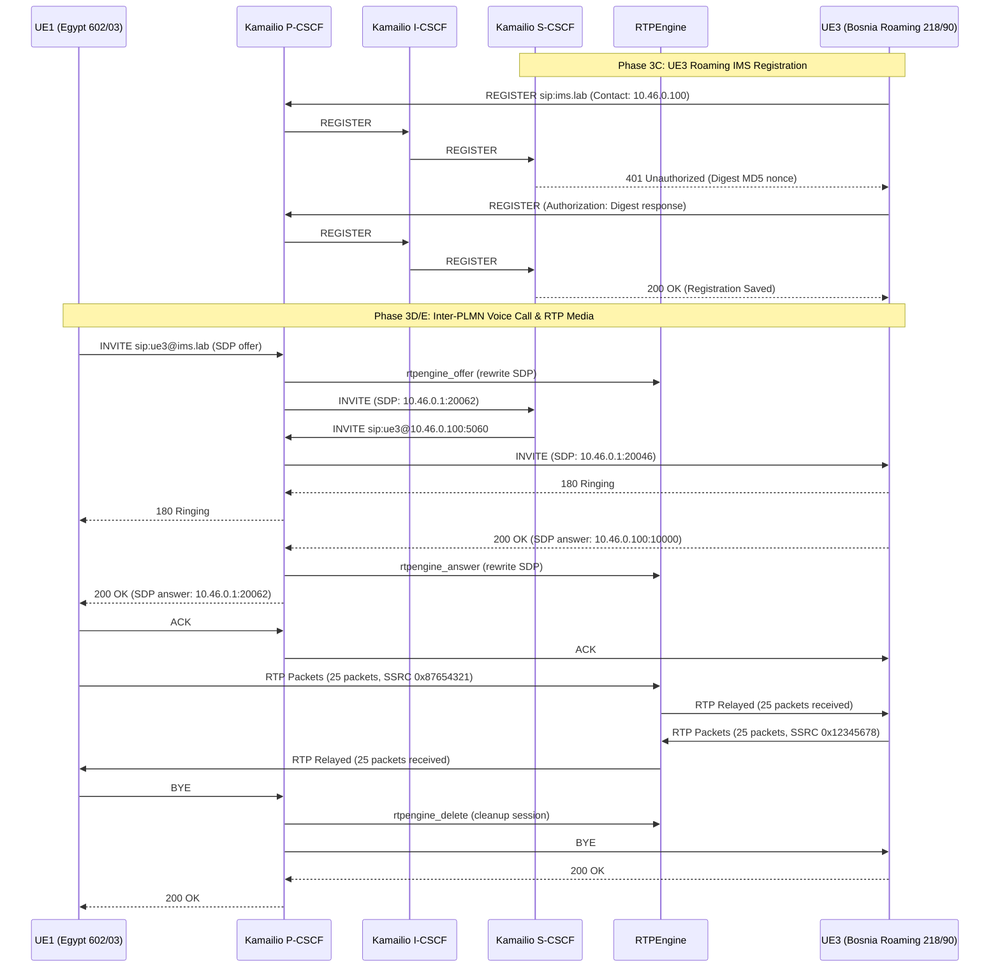

# 5G-IMS-Lab

**A software-based 5G Standalone (5G SA) + IMS laboratory validating a complete end-to-end telecom service path — from multi-PLMN RAN registration and inter-PLMN roaming to SIP voice calls.**


---

## Overview

5G-IMS-Lab is a self-contained 5G Standalone (5G SA) and IP Multimedia Subsystem (IMS) laboratory built entirely on open-source components: **Open5GS**, **UERANSIM**, **Kamailio**, **RTPEngine**, **MongoDB**, and **Kubernetes (kind)**.

The lab validates a complete, protocol-accurate service path:

```
5G RAN Selection → 5G-AKA Cross-PLMN Authentication → PDU Session Establishment (LBO)
→ Internet Connectivity → IMS PDU Connectivity → SIP Digest Registration
→ SIP Call Establishment → SDP Negotiation → RTPEngine Media Proxying
→ Bidirectional RTP Voice Streams → SIP Call Teardown
```

This is a **protocol-validation and research laboratory**, not a commercial carrier network. It is designed to demonstrate, in a reproducible way, how 5G SA transport, multi-PLMN roaming, and IMS signaling/media planes interoperate end-to-end.

---

## What the Lab Demonstrates

- **Multi-PLMN RAN Sharing**: A single simulated gNodeB broadcasting three PLMNs (`602/03`, `602/04`, `218/90`) with NNSF steering.
- **Home vs. Visited 5G Core Segregation**:
  - **Egypt Home Network (HPLMN 602/03, 602/04)**: Home AMF (SCTP 38412), Home SMF, AUSF, UDM, UDR, MongoDB master subscriber DB, Kamailio IMS Core.
  - **Bosnia Visited Network (VPLMN 218/90)**: Visited AMF (SCTP 38413), Visited SMF, Visited UPF Local Breakout (LBO).
- **Cross-PLMN 5G-AKA Authentication**: Visited AMF issues N12 `Nausf_UEAuthentication` toward Home AUSF with `servingNetworkName: 5G:mnc090.mcc218.3gppnetwork.org`.
- **Dual PDU Sessions per UE**: Independent Internet (Local Breakout) and IMS Bearers.
- **IMS Roaming Registration**: Roaming UE3 registers to Home IMS (`sip:ue3@ims.lab`) over the visited IMS PDU bearer.
- **Domestic & Inter-PLMN IMS Voice Calls**:
  - Domestic Call: UE1 (Egypt `602/03`) ↔ UE2 (Egypt `602/04`)
  - Inter-PLMN Roaming Call: UE1 (Egypt `602/03`) ↔ UE3 (Bosnia `218/90` Roaming)
- **Bidirectional RTP Media Stream**: RTPEngine SDP rewriting and 25/25 G.711 PCMU voice packet relay in each direction (0% loss).
- **Automated Regression Suite**: 74 automated checks covering 5GC, multi-PLMN roaming, user plane, and IMS/RTP services.

---

## Multi-PLMN & Roaming Architecture

| UE | Subscriber Type | HPLMN | VPLMN | IMSI / SUPI | Serving AMF | Serving SMF | SIP Identity |
|---|---|---|---|---|---|---|---|
| **UE1** | Egyptian Domestic | 602/03 | 602/03 | 602030000000001 | Home AMF (:38412) | Home SMF | `sip:ue1@ims.lab` |
| **UE2** | Egyptian Domestic | 602/04 | 602/04 | 602040000000002 | Home AMF (:38412) | Home SMF | `sip:ue2@ims.lab` |
| **UE3** | Egyptian Roaming in Bosnia | 602/03 | 218/90 | 602030000000003 | Visited AMF (:38413) | Visited SMF | `sip:ue3@ims.lab` |

---

## Architecture Diagram

```mermaid
flowchart TB
    subgraph UES["User Equipment Subsystem (UERANSIM / Netns)"]
        direction TB
        UE1["UE1 (Egyptian Home Subscriber)<br/>IMSI: 602030000000001 | HPLMN: 602/03<br/>Internet: 10.45.0.10 | IMS: 10.46.0.10<br/>SIP: sip:ue1@ims.lab"]
        UE2["UE2 (Egyptian Home Subscriber)<br/>IMSI: 602040000000002 | HPLMN: 602/04<br/>Internet: 10.45.0.11 | IMS: 10.46.0.11<br/>SIP: sip:ue2@ims.lab"]
        UE3["UE3 (Egyptian Roaming Subscriber in Bosnia)<br/>IMSI: 602030000000003 | HPLMN: 602/03 | VPLMN: 218/90<br/>Internet: 10.45.0.100 | IMS: 10.46.0.100<br/>SIP: sip:ue3@ims.lab"]
    end

    subgraph RAN["Radio Access Network (UERANSIM Multi-PLMN)"]
        GNB["Shared gNodeB (nr-gnb)<br/>Broadcasts: 602/03, 602/04, 218/90<br/>Dual N2 SCTP Connections"]
    end

    subgraph EGYPT_HPLMN["Egypt Home Network (HPLMN 602/03, 602/04)"]
        direction TB
        HAMF["Home AMF<br/>NGAP SCTP :38412"]
        HSMF["Home SMF<br/>PFCP UDP :8805"]
        HAUSF["Home AUSF<br/>5G-AKA Authority"]
        HUDM["Home UDM / UDR"]
        HMONGO[("MongoDB<br/>Master DB")]
    end

    subgraph BOSNIA_VPLMN["Bosnia Visited Network (VPLMN 218/90)"]
        direction TB
        VAMF["Visited AMF<br/>NGAP SCTP :38413"]
        VSMF["Visited SMF<br/>PFCP UDP :8805"]
        VUPF["Visited UPF (ogstun)<br/>Local Breakout (LBO)"]
    end

    subgraph IMS_CORE["Home IMS Core Layer (Kubernetes: ims)"]
        direction TB
        PCSCF["Kamailio P-CSCF<br/>10.46.0.1:5060"]
        ICSCF["Kamailio I-CSCF<br/>kamailio-icscf:5060"]
        SCSCF["Kamailio S-CSCF<br/>kamailio-scscf:5060"]
        RTPENG["RTPEngine<br/>10.46.0.1:22222 (Proxy)"]
    end

    UE1 -->|"Radio Sim (602/03)"| GNB
    UE2 -->|"Radio Sim (602/04)"| GNB
    UE3 -->|"Radio Sim (218/90)"| GNB

    GNB -->|"N2 Home (SCTP :38412)"| HAMF
    GNB -->|"N2 Visited (SCTP :38413)"| VAMF
    GNB -->|"N3 User Plane (:2152)"| VUPF

    HAMF ---|"N12"| HAUSF
    VAMF -->|"N12 / Nausf_UEAuth"| HAUSF
    HAUSF --- HUDM
    HUDM --- HMONGO

    HAMF ---|"SBI"| HSMF
    VAMF ---|"SBI"| VSMF
    HSMF -->|"N4"| VUPF
    VSMF -->|"N4"| VUPF

    VUPF -->|"IMS PDU Bearer (10.46.0.1)"| PCSCF
    PCSCF -->|"SIP"| ICSCF
    ICSCF -->|"SIP"| SCSCF
    PCSCF <-->|"NG Control"| RTPENG

    UE1 -.->|"SIP (10.46.0.10)"| PCSCF
    UE2 -.->|"SIP (10.46.0.11)"| PCSCF
    UE3 -.->|"SIP Roaming (10.46.0.100)"| PCSCF

    UE1 ===|"RTP Stream (G.711 PCMU)"| RTPENG
    UE3 ===|"RTP Stream (G.711 PCMU)"| RTPENG
```



---

## Dual PDU Session Architecture

Each UE establishes **two** independent PDU Sessions:

| Session | Purpose | Address Allocation | UPF Gateway | Breakout Type |
|---|---|---|---|---|
| **Internet** | General IPv4 Data | Dynamic (`10.45.0.0/16`) | `10.45.0.1` | Local Breakout (LBO) |
| **IMS** | SIP Signaling & Media | Dynamic (`10.46.0.0/16`) | `10.46.0.1` | Dedicated Bearer |

Subnet allocation is segregated by SMF instance:
- **Home SMF IP Pool**: `10.45.0.10-99` (Internet) and `10.46.0.10-99` (IMS)
- **Visited SMF IP Pool**: `10.45.0.100-199` (Internet) and `10.46.0.100-199` (IMS)

---

## Inter-PLMN IMS Voice Call Flow



---

## Quick Start

| Step | Command | Purpose |
|---|---|---|
| 1 | `scripts/start-lab.sh` | Starts 5G Core (Home + Visited NFs) and IMS Core |
| 2 | `scripts/run-gnb.sh` | Starts multi-PLMN gNodeB (`602/03`, `602/04`, `218/90`) |
| 3 | `scripts/run-ue.sh 1` | Starts UE1 (Home Egypt `602/03`) |
| 4 | `scripts/run-ue.sh 2` | Starts UE2 (Home Egypt `602/04`) |
| 5 | `scripts/run-ue.sh 3` | Starts UE3 (Roaming in Bosnia `218/90`) |
| 6 | `scripts/test-ims-call.sh all` | Executes multi-PLMN SIP registration and domestic + roaming voice calls |
| 7 | `scripts/verify-lab.sh` | Runs full 74-check automated regression suite |

---

## Validation & Verification Summary

The complete stack is verified by `scripts/verify-lab.sh`:

```text
═══════════════════════════════════════════════════════════════════════
  Verification Summary: 74 Passed, 0 Failed, 0 Warnings
═══════════════════════════════════════════════════════════════════════
  >>> All 5G SA Core, Multi-PLMN Roaming & IMS Voice Call Tests Passed! <<<
```

### Breakdown of Verification Checks

1. **5G Core Health (12/12 Passed)**: Home NFs (`amf`, `smf`, `ausf`, `udm`, `udr`, `pcf`, `bsf`, `nrf`, `mongodb`) + Visited NFs (`v-amf`, `v-smf`, `upf`).
2. **Signaling & Interfaces (5/5 Passed)**: Home AMF SCTP 38412, Visited AMF SCTP 38413, UPF GTP-U UDP 2152, Home & Visited PFCP UDP 8805.
3. **Subscriber Provisioning (3/3 Passed)**: UE1, UE2, and UE3 provisioned in MongoDB.
4. **Host Networking (3/3 Passed)**: Kernel IP forwarding, rp_filter=0, UPF ogstun TUN device.
5. **RAN Simulation (8/8 Passed)**: gNodeB dual N2 setup, UE1/UE2/UE3 5G-AKA registration and dual PDU sessions.
6. **User Plane Connectivity (24/24 Passed)**: Internet GTP-U ping, 8.8.8.8 ping, HTTPS curl, IMS bearer ping across UE1, UE2, and UE3.
7. **IMS Infrastructure (6/6 Passed)**: P-CSCF, I-CSCF, S-CSCF, RTPEngine pods, P-CSCF OPTIONS ingress, RTPEngine NG control socket.
8. **Phase 3 IMS Roaming & Voice Calls (8/8 Passed)**:
   - `[IMS-ROAM-01]` UE3 IMS PDU Bearer Reachable (10.46.0.100 ↔ 10.46.0.1)
   - `[IMS-ROAM-02]` UE3 SIP Digest MD5 Registration (200 OK)
   - `[IMS-ROAM-03]` UE3 IMS Digest MD5 Authentication verified
   - `[IMS-ROAM-04]` Inter-PLMN SIP INVITE (UE1 602/03 → UE3 218/90)
   - `[IMS-ROAM-05]` Inter-PLMN Call Established (180 Ringing / 200 OK / ACK)
   - `[IMS-ROAM-06]` Inter-PLMN RTP Stream UE1 → UE3 (25/25 packets, 0% loss)
   - `[IMS-ROAM-07]` Inter-PLMN RTP Stream UE3 → UE1 (25/25 packets, 0% loss)
   - `[IMS-ROAM-08]` Domestic SIP Voice Call Regression UE1 ↔ UE2 (25/25 packets, 0% loss)

---

## 3GPP Roaming Capabilities & Classification

This laboratory is classified as:

> **"5G Inter-PLMN Roaming Laboratory with Home-Network Authentication, Local Breakout, and IMS Roaming / Inter-PLMN Voice Service."**

### Technical Truth Matrix

| Domain | Implemented & Validated | Emulated / Laboratory Boundary | Not Supported in Open5GS 2.8.0 |
|---|---|---|---|
| **Radio (RAN)** | Multi-PLMN SIB1 broadcast (`602/03`, `602/04`, `218/90`), cell discovery, NNSF initial NAS steering | Software-simulated radio via UERANSIM | Real SDR / RF transmission |
| **Control Plane** | Segregated Home AMF / Visited AMF, N12 `Nausf_UEAuthentication` toward Home AUSF | Direct Kubernetes DNS for SBI transport | 3GPP SEPP (TS 33.501 §5.9.3) / N32 PRAS encapsulation |
| **User Plane** | Local Breakout (LBO) via Visited SMF & Visited UPF for Internet and IMS | Linux kernel TUN routing (`ogstun`) | 3GPP Home-Routed (HR) Roaming via N16 / N9 |
| **IMS & Voice** | Roaming SIP Digest registration, SDP rewriting via RTPEngine, bidirectional RTP audio relay | Emulated inter-operator IMS SIP routing | 3GPP IBCF / TrGW inter-IMS security gateway |

---

## License

MIT License. See [LICENSE](LICENSE) for details.
