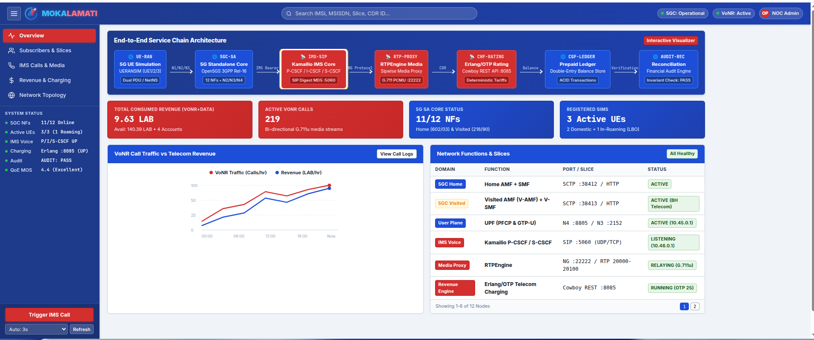
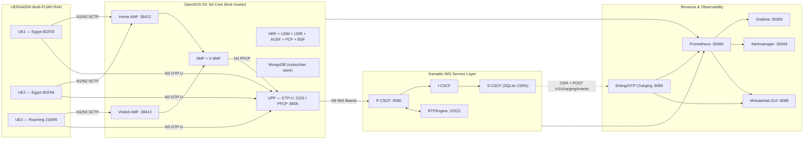
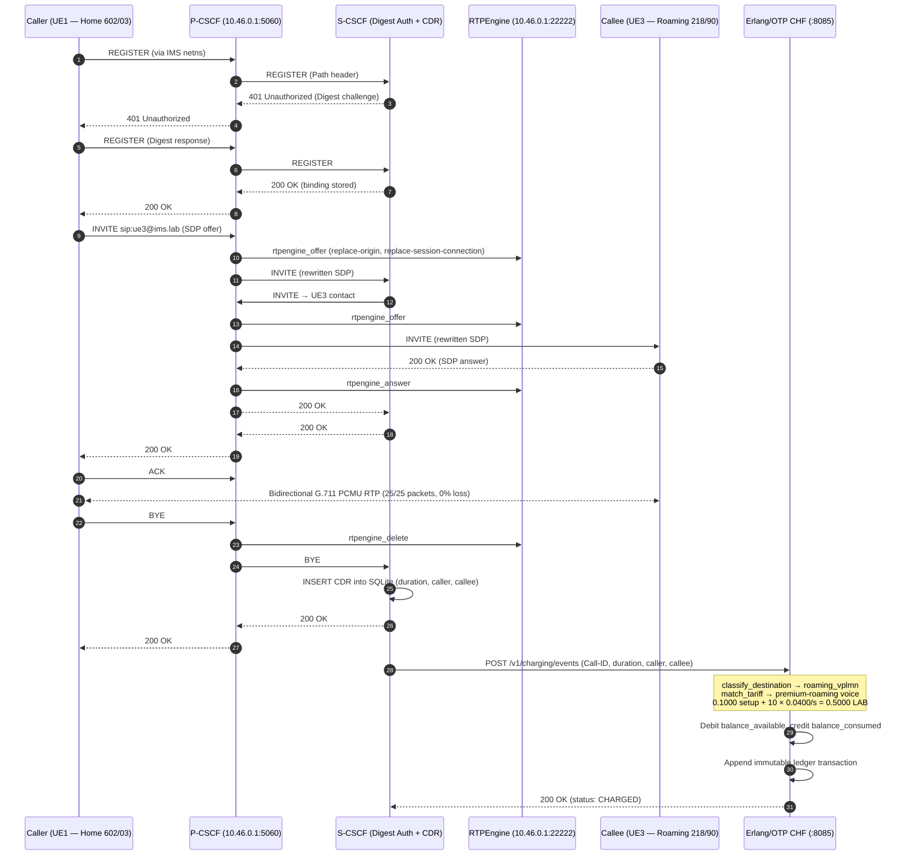

<p align="center">
  
</p>

<h1 align="center">Mokalamati — مكالماتي</h1>

<p align="center">
  <strong>5G SA · Kamailio IMS · VoNR · Erlang/OTP Charging · Multi-PLMN Roaming</strong>
</p>

<p align="center">
  <a href="https://open5gs.org/"></a>
  <a href="https://www.kamailio.org/"></a>
  <a href="https://github.com/sipwise/rtpengine"></a>
  <a href="services/charging-erlang/"></a>
  <a href="services/telecom-gui/"></a>
  <a href="k8s/"></a>
  <a href="k8s/monitoring/"></a>
  <a href="scripts/"></a>
</p>

---

Mokalamati is an engineering-grade 5G telecom laboratory that integrates a complete service chain — 3GPP 5G Standalone Core, multi-PLMN roaming with Local Breakout, Kamailio IMS with real VoNR voice calls over RTPEngine, an Erlang/OTP prepaid charging engine, and a live operations control center — all running on Kubernetes, fully observable through Prometheus and Grafana, and regression-tested with 212 automated checks.



---


---

## Architecture



**12 pods** on a single `kind` Kubernetes node (`172.19.0.2`), with UERANSIM gNodeBs and UEs running as native Linux processes using dedicated network namespaces for each PDU session.

---

## Multi-PLMN & Roaming

Mokalamati operates three PLMNs across two isolated gNodeB instances:

| Subscriber | IMSI | Home PLMN | Serving PLMN | Roaming | gNodeB | Internet IP Range | IMS IP Range |
| :--- | :--- | :--- | :--- | :--- | :--- | :--- | :--- |
| **UE1** | `602030000000001` | `602/03` (Egypt) | `602/03` | Domestic | Home (`127.0.0.1`) | `10.45.0.10–99` | `10.46.0.10–99` |
| **UE2** | `602040000000002` | `602/04` (Egypt) | `602/04` | Domestic | Home (`127.0.0.1`) | `10.45.0.10–99` | `10.46.0.10–99` |
| **UE3** | `602030000000003` | `602/03` (Egypt) | `218/90` (Bosnia) | Visited LBO | Visited (`127.0.0.2`) | `10.45.0.100–199` | `10.46.0.100–199` |

UE3 retains its Egyptian home identity (`602/03`) but attaches over radio to the **Visited AMF** serving PLMN `218/90` (BH Telecom, Bosnia). Because `serving_plmn ≠ home_plmn`, the entire stack — SMF IP pool selection, rating engine destination classification, charging tariff matching, GUI display, and Prometheus roaming telemetry — treats UE3 as a roaming subscriber under the `premium-roaming` rate plan.

**Dual PDU sessions per UE:**
- **Internet** (`DNN: internet`) — `10.45.0.0/16`, QCI/5QI 9, ARP priority 8
- **IMS** (`DNN: ims`) — `10.46.0.0/16`, QCI/5QI 5, ARP priority 1

Each PDU session creates a dedicated Linux network namespace (`ueransim-<imsi>-internet-psi1` and `ueransim-<imsi>-ims-psi2`) with its own `uesimtun0` TUN interface.

---

## 5G SA Core Network

All Open5GS 3GPP Release 16 Network Functions run as Kubernetes deployments in the `open5gs` namespace:

| Network Function | SBI / Interface | Service Port | Notes |
| :--- | :--- | :--- | :--- |
| **NRF** | `open5gs-nrf:7777` | SBI | Service discovery |
| **AMF** (Home) | `open5gs-amf:7777` | SCTP `:38412` | PLMNs 602/03 + 602/04 |
| **AMF** (Visited) | `open5gs-v-amf:7777` | SCTP `:38413` | PLMN 218/90 |
| **SMF** (Home) | `open5gs-smf:7777` | PFCP `:8805` | DNNs: `internet`, `ims` |
| **SMF** (Visited) | `open5gs-v-smf:7777` | PFCP `:8805` | LBO for 218/90 |
| **UPF** | `hostNetwork` | GTP-U `:2152`, PFCP `:8805` | `ogstun` gateway: `10.45.0.1` + `10.46.0.1` |
| **UDR** | `open5gs-udr:7777` | SBI | MongoDB backend |
| **UDM** | `open5gs-udm:7777` | SBI | 5G-AKA |
| **AUSF** | `open5gs-ausf:7777` | SBI | Authentication |
| **PCF** | `open5gs-pcf:7777` | SBI | Policy |
| **BSF** | `open5gs-bsf:7777` | SBI | Binding |
| **MongoDB** | `mongodb:27017` | TCP | Subscriber store |

**S-NSSAI:** SST `1` (eMBB), SD `0xFFFFFF` across all PLMNs.

**UPF QoS traffic control** on `ogstun`:
- Priority Band 1: SIP signaling (port 5060), RTP voice (DSCP EF / 46), IMS signaling (DSCP CS5 / 40)
- NAT MASQUERADE for both `10.45.0.0/16` and `10.46.0.0/16`

---

## IMS Voice Service Layer

The IMS stack runs in the `ims` Kubernetes namespace:

| Component | Deployment | Binding | Role |
| :--- | :--- | :--- | :--- |
| **P-CSCF** | `kamailio-pcscf` | `hostNetwork` — `10.46.0.1:5060` + `172.19.0.2:5060` | UE-facing SIP proxy, RTPEngine integration, RFC 3327 Path routing |
| **I-CSCF** | `kamailio-icscf` | ClusterIP `:5060` | Interrogating proxy for domain routing |
| **S-CSCF** | `kamailio-scscf` | ClusterIP `:5060` | SIP Digest MD5 authentication (`auth_db`), `usrloc` registrar, dialog tracking, CDR recording to SQLite |
| **RTPEngine** | `rtpengine` | `hostNetwork` — `10.46.0.1:22222` (NG), UDP `20000–20100` (media) | SDP offer/answer rewriting, bidirectional G.711 PCMU relay |

**SIP subscriber credentials:**

| UE | SIP URI | Password |
| :--- | :--- | :--- |
| UE1 | `sip:ue1@ims.lab` | `password123` |
| UE2 | `sip:ue2@ims.lab` | `password123` |
| UE3 | `sip:ue3@ims.lab` | `password123` |


---

## End-to-End Call & Charging Flow



**Worked example — UE3, 10-second roaming call:**
```
Initial Balance: 30.0 LAB
Call Duration:   10 seconds
Total Charge:    0.5000 LAB
Remaining:       29.5 LAB
```

---

## Revenue & Charging Engine

The Erlang/OTP charging service ([`services/charging-erlang/`](services/charging-erlang/)) implements a production-style prepaid revenue engine:

**OTP supervision tree:**
```
charging_service_app
└── charging_service_sup (one_for_one)
    └── charging_server (gen_server)
        ├── charging_rating   — deterministic tariff matching & charge calculation
        ├── charging_reconcile — double-entry financial audit
        └── charging_storage   — seed data adapter
```

**Cowboy REST API on `:8085`:**

| Method | Endpoint | Purpose |
| :--- | :--- | :--- |
| `GET` | `/health` | OTP application health |
| `GET` | `/v1/accounts` | All subscriber accounts |
| `GET` | `/v1/accounts/:id/balance` | Prepaid balance inquiry |
| `GET` | `/v1/accounts/:id/transactions` | Transaction ledger |
| `GET` | `/v1/tariffs` | Tariff definitions |
| `GET` | `/v1/reconciliation` | Financial audit report |
| `POST` | `/v1/rating/quote` | Rate quote without debit |
| `POST` | `/v1/charging/reserve` | Lock credit hold (402 if insufficient) |
| `POST` | `/v1/charging/consume` | Finalize debit, refund excess |
| `POST` | `/v1/charging/events` | Rate + debit in single atomic call |
| `POST` | `/v1/accounts/:id/topup` | Add prepaid credit |

**Prepaid accounts:**

| Account | Subscriber | PLMN | Rate Plan | Initial Balance |
| :--- | :--- | :--- | :--- | :--- |
| `acc-ue1` | UE1 Domestic | `602/03` | `standard-prepaid` | 50.00 LAB |
| `acc-ue2` | UE2 Domestic | `602/04` | `standard-prepaid` | 25.00 LAB |
| `acc-ue3` | UE3 Roaming | `602/03` → `218/90` | `premium-roaming` | 30.00 LAB |

**Tariff schedule:**

| Tariff | Service | Destination | Setup | Rate | Unit |
| :--- | :--- | :--- | :--- | :--- | :--- |
| Domestic Voice | voice | domestic | 0.0500 LAB | 0.0200 LAB/s | 1s, CEIL |
| Roaming Voice (standard) | voice | roaming_vplmn | 0.1500 LAB | 0.0800 LAB/s | 1s, CEIL |
| Roaming Voice (premium) | voice | roaming_vplmn | 0.1000 LAB | 0.0400 LAB/s | 1s, CEIL |
| Domestic Data (internet) | data | domestic | — | 0.0100 LAB/MB | 1 MB |
| Roaming Data (internet) | data | roaming_vplmn | — | 0.0500 LAB/MB | 1 MB |
| IMS Signaling (any) | data | any | — | 0.0000 LAB | Zero-rated |

**Financial guarantees:**
- Three-bucket balance: `available`, `reserved`, `consumed`
- Double-entry ledger: every operation (`TOPUP`, `CHARGE`, `RESERVE`, `CONSUME`, `RELEASE`) recorded as an immutable transaction
- Idempotency: duplicate Call-ID charges rejected — no double debits
- Reconciliation invariant: `available + consumed + reserved ≡ Σ top-ups`, verified with 0 anomalies
- OTP supervision: worker crashes trigger automatic restart without data loss


---

## Operations Control Center

The Mokalamati GUI ([`services/telecom-gui/`](services/telecom-gui/)) is a zero-dependency Python HTTP server + vanilla JavaScript SPA on port `:8088`.

**Views:**

| View | Content |
| :--- | :--- |
| **Overview** | Animated service chain pipeline (UE-RAN → 5GC-SA → IMS-SIP → RTP-PROXY → CHF-RATING → CGF-LEDGER → AUDIT-REC), 4-card KPI strip (NFs, UEs, Revenue, MOS), VoNR call traffic chart, NF status table |
| **Subscribers & Slices** | Per-UE PLMN role, dual PDU session state, live namespace RX/TX counters, direct balance top-up |
| **IMS Calls & Media** | One-click domestic (UE1↔UE2) and roaming (UE1↔UE3) call triggers with custom duration, live SIP/RTP log streaming, CDR table with billed charges |
| **Revenue & Charging** | Account balances, tariff table, quote calculator, full double-entry ledger, on-demand reconciliation |
| **Network Topology** | Multi-PLMN node map with live port and interface status across 5GC, IMS, RAN, and charging domains |

**Backend integrations:** Erlang charging (`:8085`), Prometheus (`:30090`), Alertmanager (`:30093`), Kamailio S-CSCF SQLite CDRs (via `kubectl exec`), Linux netns TUN counters.

**Features:** collapsible sidebar with animation, animated Mokalamati logo (blue + red SVG with wave-pulse and beacon-glow), global IMSI/MSISDN/CDR search, configurable auto-refresh (3s–30s).

---

## Observability Stack

All monitoring components run in the `monitoring` Kubernetes namespace:

| Component | Port | Purpose |
| :--- | :--- | :--- |
| **Telecom Exporter** | `:9100` | Custom Prometheus exporter aggregating 7 telemetry domains |
| **Prometheus** | NodePort `:30090` | 5-second scrape interval, 2 targets |
| **Grafana** | NodePort `:30300` | Pre-provisioned dashboard |
| **Alertmanager** | NodePort `:30093` | Incident notification |

**7 telemetry domains:**

1. **Infrastructure** (`k8s_infra_*`) — pod readiness, restart counts
2. **5G Core** (`open5gs_5gc_*`) — registered UEs, active PDU sessions, NGAP/PFCP associations
3. **IMS / SIP** (`ims_sip_*`) — registered subscribers, server status, active dialogs
4. **RTP Media** (`ims_rtp_*`) — proxy status, packets relayed
5. **Charging** (`charging_*`) — CDR records, call duration, revenue
6. **QoE** (`qoe_telecom_*`) — MOS, CSSR, PDD, jitter, packet loss
7. **Roaming** (`roaming_*`) — UE attachment status, LBO data path, inter-PLMN calls

**Grafana dashboard** — Sections A through H spanning 53+ panels:


**26 Alertmanager rules** across 7 groups covering infrastructure degradation, 5GC registration drops, IMS server failures, RTPEngine control loss, QoE degradation, roaming detachment, and charging reconciliation failures. Fault injection verified: scaling `open5gs-bsf` to 0 triggers `FIRING` → restoring to 1 confirms automatic resolution.

---

## Service Assurance & KPIs

Measured by [`scripts/measure-kpis.sh`](scripts/measure-kpis.sh) using real SIP signaling and RTP streams over Linux network namespaces:

| KPI | Domestic | Roaming | Target | Method |
| :--- | :--- | :--- | :--- | :--- |
| **Post-Dial Delay (PDD)** | ~4 ms | ~4 ms | < 200 ms | SIP INVITE → 180 Ringing timestamp delta |
| **Call Setup Time (CST)** | ~55 ms | ~54 ms | < 500 ms | SIP INVITE → 200 OK timestamp delta |
| **CSSR** | 100% | 100% | 100% | Successful call setups / attempts |
| **RTP Jitter** | ~0.28 ms | ~0.29 ms | < 20 ms | RFC 3550 inter-arrival jitter |
| **RTP Packet Loss** | 0% | 0% | 0% | Sequence continuity check |
| **Estimated MOS** | ~4.4 | ~4.4 | ≥ 4.0 | ITU-T G.107 E-model approximation |
| **R-Factor** | ~92.9 | ~92.9 | — | E-model transmission rating |

DSCP tagging: SIP signaling at CS5 (`0xA0` / DSCP 40), RTP voice at EF (`0xB8` / DSCP 46).

---

## Validation & Regression Testing

Every subsystem ships with its own automated verification suite:

| Suite | Scope | Checks |
| :--- | :--- | :--- |
| [`verify-lab.sh`](scripts/verify-lab.sh) | 5G Core, RAN, UEs, PDU sessions, Internet + IMS connectivity, IMS calls, charging, KPIs | 91 |
| [`verify-erlang-charging.sh`](scripts/verify-erlang-charging.sh) | Erlang/OTP compilation, supervision, REST API, rating parity, balance lifecycle, idempotency, fault recovery, reconciliation | 24 |
| [`verify-rating.sh`](scripts/verify-rating.sh) | Python rating engine, tariff matching, CEIL rounding, CDR ingestion, financial reconciliation | 23 |
| [`verify-observability.sh`](scripts/verify-observability.sh) | Prometheus exporter, scrape targets, PromQL queries across all 7 domains | 19 |
| [`verify-alerting.sh`](scripts/verify-alerting.sh) | Alertmanager rules, fault injection, alert firing, automatic resolution | 19 |
| [`verify-grafana.sh`](scripts/verify-grafana.sh) | Grafana dashboard provisioning, panel queries, live telemetry, restart recovery | 18 |
| [`verify-gui.sh`](scripts/verify-gui.sh) | GUI server, static assets, REST endpoints, interactive actions, dual-slice IP verification | 18 |
| **Total** | **All subsystems combined** | **212 / 212 PASS** |


---

## Repository Structure

```
Mokalamati/
├── configs/
│   ├── charging/          # Tariff plans, rate plans, accounts (YAML)
│   ├── sipp/              # SIP test scenarios
│   └── ueransim/          # gNodeB and UE configurations (3 UEs, 2 gNodeBs)
├── docs/
│   ├── architecture/      # 5G SA architecture, home-vs-visited RAN
│   ├── charging/          # Rating model, balance management, reconciliation, Erlang API
│   ├── engineering-notes/ # PDU session debugging, Linux networking, QoS
│   ├── images/            # Screenshots and diagrams
│   └── observability/     # Metrics model, Grafana dashboard, alerting, Prometheus
├── k8s/
│   ├── ims/               # Kamailio P/I/S-CSCF + RTPEngine manifests
│   ├── monitoring/        # Prometheus, Grafana, Alertmanager, telecom-exporter
│   ├── configmap.yaml     # Open5GS NF configurations
│   ├── control-plane.yaml # AMF, V-AMF, SMF, V-SMF, UDR, UDM, AUSF, PCF, BSF, NRF
│   ├── upf.yaml           # UPF with hostNetwork, QoS tc rules
│   ├── mongodb.yaml       # Subscriber database
│   └── kind-config.yaml   # kind cluster definition
├── scripts/
│   ├── start-lab.sh       # Full lab orchestrator (kind + K8s + subscribers)
│   ├── run-gnb.sh         # Launch gNodeB-Home and/or gNodeB-Visited
│   ├── run-ue.sh          # Launch UE1, UE2, UE3 with netns management
│   ├── run-erlang-charging.sh  # Erlang service lifecycle (start/stop/restart/status)
│   ├── run-gui.sh         # GUI server lifecycle
│   ├── add-subscriber.sh  # MongoDB subscriber provisioning
│   ├── test-ims-call.sh   # End-to-end SIP/RTP call engine (domestic, roaming, custom)
│   ├── measure-kpis.sh    # Real-time PDD, CST, jitter, MOS measurement
│   ├── collect-charging-records.sh  # CDR and user-plane accounting collector
│   ├── rating-engine.py   # Python CLI for rating, balance, reconciliation
│   ├── telecom-exporter.py # Prometheus exporter (7 domains)
│   ├── verify-lab.sh      # Master regression suite (91 checks)
│   ├── verify-erlang-charging.sh  # Erlang charging suite (24 checks)
│   ├── verify-rating.sh   # Rating suite (23 checks)
│   ├── verify-observability.sh    # Prometheus suite (19 checks)
│   ├── verify-alerting.sh # Alertmanager suite (19 checks)
│   ├── verify-grafana.sh  # Grafana suite (18 checks)
│   └── verify-gui.sh      # GUI suite (18 checks)
├── services/
│   ├── charging-erlang/   # Erlang/OTP charging application (Cowboy REST, gen_server)
│   │   ├── src/           # charging_server, charging_rating, charging_reconcile, etc.
│   │   ├── test/          # EUnit tests (34 tests across 3 suites)
│   │   └── include/       # Record definitions (charging_types.hrl)
│   └── telecom-gui/       # Operations Control Center
│       ├── server.py      # Python HTTP server with REST API
│       └── static/        # HTML, CSS, JS, SVG favicon and icons
├── data/                  # Runtime SQLite databases
├── CHANGELOG.md
├── LICENSE                # MIT
└── README.md
```

---

## Prerequisites

| Dependency | Version | Purpose |
| :--- | :--- | :--- |
| Linux (Ubuntu/Debian) | 22.04+ | Host OS with network namespace support |
| Docker | 20.10+ | Container runtime for kind |
| [kind](https://kind.sigs.k8s.io/) | 0.20+ | Local Kubernetes cluster |
| kubectl | 1.28+ | Cluster management |
| [UERANSIM](https://github.com/aligungr/UERANSIM) | 3.3.0 | `nr-gnb` and `nr-ue` binaries on `$PATH` |
| Erlang/OTP | 25+ | Charging service runtime |
| [rebar3](https://rebar3.org/) | 3.22+ | Erlang build tool |
| Python | 3.10+ | GUI server, rating engine, exporter |
| mongosh / mongo | 8.0 | Subscriber provisioning (runs inside K8s pod) |

**Pre-built container images** (loaded into kind by `start-lab.sh`):
- `gradiant/open5gs:2.8.0` — 5G Core NFs
- `mongo:8.0` — Subscriber database
- `ims-node:latest` — Kamailio + RTPEngine (must be pre-built)

---

## Quick Start

```bash
# Clone the repository
git clone https://github.com/khattabpi/Mokalamati.git
cd Mokalamati

# 1. Start the Erlang/OTP charging engine (:8085)
bash scripts/run-erlang-charging.sh start

# 2. Bootstrap the full 5G Core, IMS, and monitoring stack on kind
sudo bash scripts/start-lab.sh

# 3. Launch the RAN (dual gNodeBs)
sudo bash scripts/run-gnb.sh all

# 4. Bring up all three UEs with dual PDU sessions
sudo bash scripts/run-ue.sh all

# 5. Start the Operations Control Center GUI (:8088)
bash scripts/run-gui.sh start
```

---

## Network Endpoints

| Service | URL | Protocol |
| :--- | :--- | :--- |
| **Mokalamati GUI** | `http://127.0.0.1:8088` | HTTP |
| **Erlang Charging API** | `http://127.0.0.1:8085` | HTTP REST |
| **Grafana** | `http://172.19.0.2:30300` | HTTP |
| **Prometheus** | `http://172.19.0.2:30090` | HTTP |
| **Alertmanager** | `http://172.19.0.2:30093` | HTTP |
| **Home AMF** (N2) | `172.19.0.2:38412` | SCTP |
| **Visited AMF** (N2) | `172.19.0.2:38413` | SCTP |
| **UPF** (N3) | `172.19.0.2:2152` | GTP-U / UDP |
| **UPF** (N4) | `172.19.0.2:8805` | PFCP / UDP |
| **P-CSCF** (SIP) | `10.46.0.1:5060` | SIP / UDP |
| **RTPEngine** (NG) | `10.46.0.1:22222` | UDP |
| **RTPEngine** (Media) | `10.46.0.1:20000–20100` | RTP / UDP |

---

## Verification Commands

```bash
# Full regression suite (91 checks across all 11 subsystems)
sudo bash scripts/verify-lab.sh

# End-to-end SIP/RTP voice call test (domestic + roaming)
sudo bash scripts/test-ims-call.sh all

# Custom call with specific duration
sudo bash scripts/test-ims-call.sh 1 3 10    # UE1 → UE3, 10 seconds
sudo bash scripts/test-ims-call.sh 2 1 manual # UE2 → UE1, manual hang-up

# Service assurance KPI measurement
sudo bash scripts/measure-kpis.sh all

# Erlang/OTP charging verification (24 checks)
bash scripts/verify-erlang-charging.sh

# Rating and balance management (23 checks)
python3 scripts/rating-engine.py reconcile

# GUI + REST API verification (18 checks)
bash scripts/verify-gui.sh

# Prometheus and observability (19 checks)
bash scripts/verify-observability.sh

# Grafana dashboard verification (18 checks)
bash scripts/verify-grafana.sh

# Alertmanager rules + fault injection (19 checks)
bash scripts/verify-alerting.sh

# Erlang charging CLI examples
curl -s http://127.0.0.1:8085/v1/accounts/acc-ue3/balance | python3 -m json.tool
curl -s http://127.0.0.1:8085/v1/reconciliation | python3 -m json.tool
```

---

## Configuration Reference

### Subscriber Authentication Keys

| UE | IMSI | K | OPc | AMF |
| :--- | :--- | :--- | :--- | :--- |
| UE1 | `602030000000001` | `465B5CE8B199B49FAA5F0A2EE238A6BC` | `E8ED2441347B7990E92C19B0316CD6FC` | `8000` |
| UE2 | `602040000000002` | `465B5CE8B199B49FAA5F0A2EE238A6BD` | `E8ED2441347B7990E92C19B0316CD6FC` | `8000` |
| UE3 | `602030000000003` | `465B5CE8B199B49FAA5F0A2EE238A6BE` | `E8ED2441347B7990E92C19B0316CD6FC` | `8000` |

### IP Address Plan

| Network | Subnet | Gateway | Purpose |
| :--- | :--- | :--- | :--- |
| Kind bridge | `172.19.0.0/16` | `172.19.0.1` | Host ↔ cluster connectivity |
| Internet DNN | `10.45.0.0/16` | `10.45.0.1` | UE internet data path |
| IMS DNN | `10.46.0.0/16` | `10.46.0.1` | UE IMS signaling + voice bearer |

### Configuration Files

| Category | Path | Description |
| :--- | :--- | :--- |
| 5G Core NFs | [`k8s/configmap.yaml`](k8s/configmap.yaml) | AMF, V-AMF, SMF, V-SMF, UPF, NRF, UDR, UDM, AUSF, PCF, BSF configs |
| IMS | [`k8s/ims/configmap.yaml`](k8s/ims/configmap.yaml) | P-CSCF, I-CSCF, S-CSCF Kamailio configs + init-db.py |
| gNodeB Home | [`configs/ueransim/open5gs-gnb-home.yaml`](configs/ueransim/open5gs-gnb-home.yaml) | PLMNs 602/03 + 602/04, SCTP → `:38412` |
| gNodeB Visited | [`configs/ueransim/open5gs-gnb-visited.yaml`](configs/ueransim/open5gs-gnb-visited.yaml) | PLMN 218/90, SCTP → `:38413` |
| UE1 | [`configs/ueransim/open5gs-ue1.yaml`](configs/ueransim/open5gs-ue1.yaml) | Home 602/03, dual PDU |
| UE2 | [`configs/ueransim/open5gs-ue2.yaml`](configs/ueransim/open5gs-ue2.yaml) | Home 602/04, dual PDU |
| UE3 | [`configs/ueransim/open5gs-ue3.yaml`](configs/ueransim/open5gs-ue3.yaml) | Home 602/03, roaming via gNodeB-Visited |
| Tariffs | [`configs/charging/tariffs.yaml`](configs/charging/tariffs.yaml) | Voice and data rating rules |
| Rate Plans | [`configs/charging/rate-plans.yaml`](configs/charging/rate-plans.yaml) | `standard-prepaid`, `premium-roaming` |
| Accounts | [`configs/charging/accounts.yaml`](configs/charging/accounts.yaml) | Subscriber prepaid balances |

---

## Documentation

Detailed technical documentation is organized under [`docs/`](docs/):

| Area | Documents |
| :--- | :--- |
| **Architecture** | [5G SA SBA Architecture](docs/architecture/README.md) · [Home vs Visited RAN](docs/architecture/home-vs-visited-ran.md) |
| **IMS** | [IMS Call Flow Validation](docs/IMS-CALL-FLOW-VALIDATION.md) |
| **Charging** | [Architecture](docs/charging/architecture.md) · [Rating Model](docs/charging/rating-model.md) · [Balance Management](docs/charging/balance-management.md) · [Reconciliation](docs/charging/reconciliation.md) · [Erlang/OTP Architecture](docs/charging/erlang-otp-architecture.md) · [Erlang REST API](docs/charging/erlang-api.md) · [Operations CLI](docs/charging/operations.md) · [Testing](docs/charging/testing.md) · [Erlang Testing](docs/charging/erlang-testing.md) · [Data Model](docs/charging/data-model.md) |
| **Observability** | [Architecture](docs/observability/observability-architecture.md) · [Metrics Model](docs/observability/metrics-model.md) · [Metrics Source Map](docs/observability/metrics-source-map.md) · [Prometheus Deployment](docs/observability/prometheus-deployment.md) · [Grafana Dashboard](docs/observability/grafana-operations-dashboard.md) · [Alerting](docs/observability/alerting.md) |
| **Engineering Notes** | [Linux Networking Behind 5G](docs/engineering-notes/linux-networking-behind-5g.md) · [Debugging PDU Sessions](docs/engineering-notes/debugging-pdu-session.md) · [QoS, Charging & Assurance](docs/engineering-notes/phase4-qos-charging-assurance.md) |

---

## License

Distributed under the **MIT License** — see [`LICENSE`](LICENSE) for details.

Copyright © 2026 Abdulrahman Khattab.

---

## Built With

| Project | Role in Mokalamati |
| :--- | :--- |
| [Open5GS](https://open5gs.org/) | 3GPP Release 16 5G SA Core (AMF, SMF, UPF, NRF, UDM, UDR, AUSF, PCF, BSF) |
| [UERANSIM](https://github.com/aligungr/UERANSIM) | 5G RAN simulator (gNodeB + UE with multi-PLMN and network namespace support) |
| [Kamailio](https://www.kamailio.org/) | IMS SIP signaling (P-CSCF, I-CSCF, S-CSCF with Digest MD5 authentication) |
| [RTPEngine](https://github.com/sipwise/rtpengine) | Media proxy (SDP rewriting, G.711 PCMU bidirectional relay) |
| [Erlang/OTP](https://www.erlang.org/) | Telecom charging engine (gen_server, Cowboy REST, OTP supervision) |
| [Prometheus](https://prometheus.io/) | Metrics collection and alerting (5-second scrape, 26 alert rules) |
| [Grafana](https://grafana.com/) | Operations dashboard (53+ panels across 8 sections) |
| [kind](https://kind.sigs.k8s.io/) | Local Kubernetes cluster for the entire 5G Core and IMS stack |
| [MongoDB](https://www.mongodb.com/) | 3GPP subscriber data store (UDR backend) |
