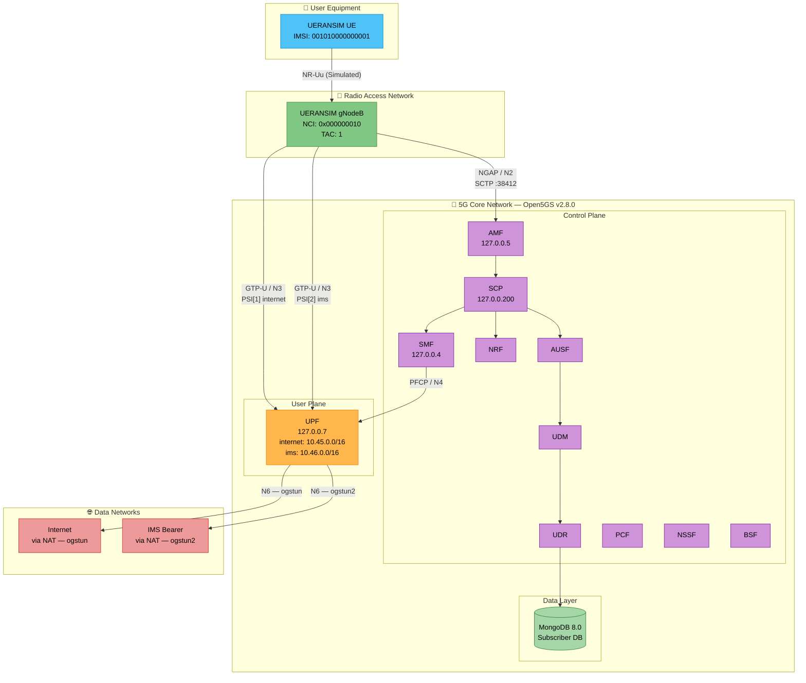
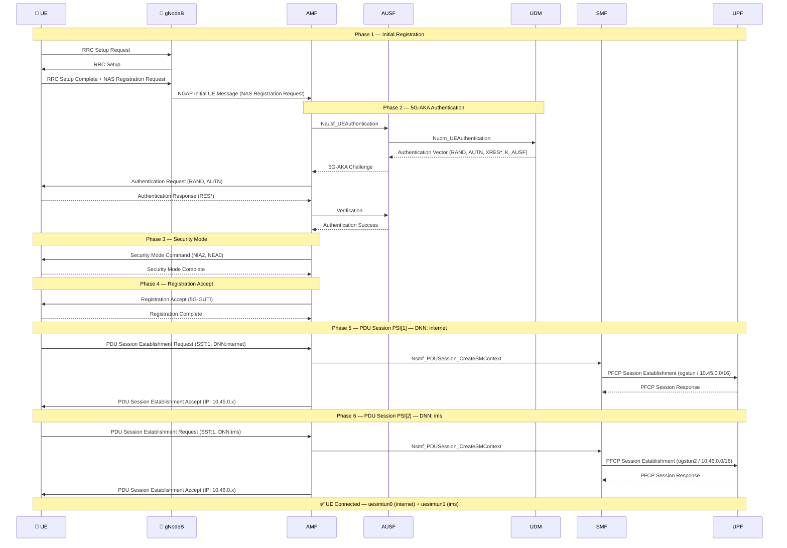
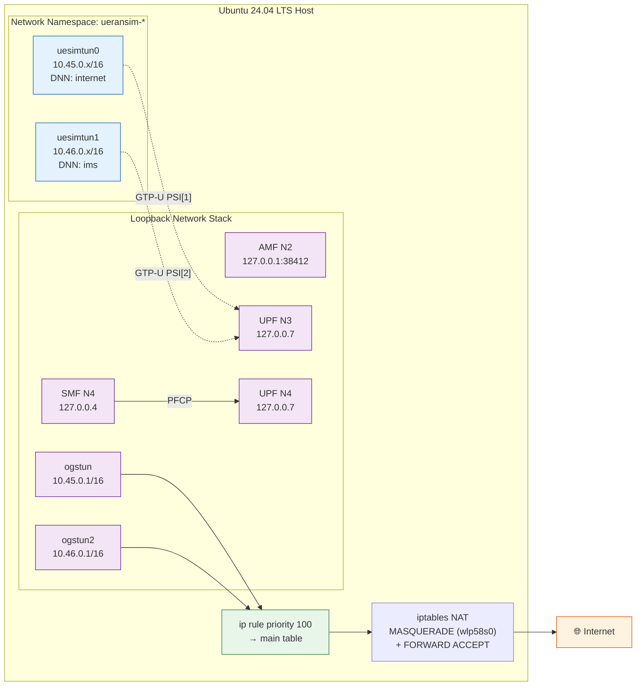

<p align="center">
  
</p>

<h1 align="center">Open Telecom Lab</h1>

<p align="center">
  <strong>A production-grade 5G Core Network laboratory for hands-on telecom engineering</strong>
</p>

<p align="center">
  <a href="#-quick-start"></a>
  <a href="docs/architecture/README.md"></a>
  <a href="docs/README.md"></a>
  <a href="CONTRIBUTING.md"></a>
</p>

<p align="center">
  
  
  
  
  
  
  
  
</p>

---

## 📖 Overview

**Open Telecom Lab** is a comprehensive, real-world 5G Standalone (SA) network laboratory built on Ubuntu 24.04 LTS using open-source network functions. This project documents a complete engineering journey — from deploying a functional 5G Core Network to analyzing protocol-level packet flows, and now extending into IMS bearer infrastructure.

This is **not a tutorial**. It is a living, evolving telecom engineering portfolio that grows as new technologies are integrated, tested, and documented.

### What Makes This Different

| Aspect | This Project | Typical Tutorials |
|--------|-------------|-------------------|
| **Deployment** | Native Ubuntu (production-like) | Docker copy-paste |
| **Documentation** | Protocol-level analysis | Surface-level setup |
| **Scope** | Full 5G SA + Dual-Slice + IMS Bearer | Single component |
| **Evolution** | Versioned roadmap (v1–v8) | One-shot guide |
| **Analysis** | Wireshark + tcpdump captures | No verification |

---

## ✅ Current Features (v2.0)

> **Status: Implemented and Verified**

### v1.0 — 5G SA Foundation
- [x] **5G SA Core Network** — Full Open5GS deployment (AMF, SMF, UPF, NRF, AUSF, UDM, UDR, PCF, NSSF, BSF, SCP)
- [x] **RAN Simulation** — UERANSIM gNodeB + UE with NR-SA support
- [x] **UE Registration** — Complete Initial Registration procedure with PLMN selection
- [x] **5G-AKA Authentication** — SUPI-based authentication with integrity/ciphering
- [x] **PDU Session Establishment** — IPv4 session with DNN `internet` on S-NSSAI (SST:1)
- [x] **User Plane Connectivity** — GTP-U tunnel with TUN interface (`uesimtun0`)
- [x] **Internet Access** — End-to-end data path via UPF with NAT
- [x] **Subscriber Management** — MongoDB-backed subscriber provisioning
- [x] **Protocol Captures** — tcpdump/Wireshark PCAP analysis (NGAP, NAS, PFCP, GTP-U)
- [x] **Network Namespace Isolation** — UE traffic isolation via Linux namespaces

### v2.0 — IMS Bearer & Dual-Slice Infrastructure
- [x] **Dual PDU Sessions** — Simultaneous `internet` (PSI[1]) and `ims` (PSI[2]) sessions on the same UE
- [x] **IMS UPF Interface** — Secondary TUN interface (`ogstun2`) on `10.46.0.0/16` for IMS slice traffic
- [x] **Dual-DNN SMF/UPF Config** — `pdu_session` and `subnet` entries extended for DNN `ims` in `smf.yaml` and `upf.yaml`
- [x] **Policy Routing Fix** — High-priority `ip rule` entries (`priority 100`) injected to route decapsulated GTP-U packets to the main table, eliminating routing loops through `uesimtun` interfaces
- [x] **Dual-Subnet NAT** — `iptables MASQUERADE` configured for both `10.45.0.0/16` and `10.46.0.0/16` over the WAN interface (`wlp58s0`)
- [x] **Kernel rp_filter Disabled** — Reverse path filtering turned off on TUN interfaces to allow asymmetric user-plane flows
- [x] **PLMN Synchronization** — `mcc: '001'` / `mnc: '01'` aligned between `open5gs-gnb.yaml`, UE config, and AMF subscriber DB
- [x] **Persistent iptables Rules** — All NAT and FORWARD rules saved via `netfilter-persistent`

---

## 🏗️ Architecture

### 5G Standalone Network Architecture (v2.0 — Dual Slice)



### UE Registration & Dual PDU Session Flow



---

## 🛠️ Technology Stack

| Component | Technology | Version | Purpose |
|-----------|-----------|---------|---------|
| **Operating System** | Ubuntu LTS | 24.04 (Noble) | Host platform |
| **5G Core** | Open5GS | 2.8.0 | 5G SA core network functions |
| **RAN Simulator** | UERANSIM | 3.3.0 | gNodeB + UE simulation |
| **Database** | MongoDB | 8.0.26 | Subscriber data store |
| **Packet Capture** | tcpdump / Wireshark | Latest | Protocol analysis |
| **Networking** | Linux Namespaces + iptables | Native | Traffic isolation & NAT |
| **Firewall Persistence** | netfilter-persistent | Latest | Persistent iptables rules across reboots |

---

## 📁 Project Structure

```
Open-Telecom-Lab/
├── .github/
│   ├── ISSUE_TEMPLATE/
│   │   ├── bug_report.md
│   │   ├── feature_request.md
│   │   └── lab_exercise.md
│   ├── PULL_REQUEST_TEMPLATE/
│   │   └── pull_request_template.md
│   └── workflows/            # CI/CD (planned v7.x)
├── assets/
│   ├── images/                # Banners, screenshots
│   ├── diagrams/              # Architecture diagrams
│   └── captures/              # Sample PCAP files
├── configs/
│   ├── open5gs/               # AMF, SMF, UPF, NRF configs
│   ├── ueransim/              # gNB and UE configs
│   └── mongodb/               # DB initialization scripts
├── docs/
│   ├── architecture/          # Network architecture docs
│   ├── engineering-notes/     # In-depth technical analysis
│   │   ├── why-open5gs.md
│   │   ├── understanding-amf.md
│   │   ├── 5g-registration-analysis.md
│   │   ├── debugging-pdu-session.md
│   │   └── linux-networking-behind-5g.md
│   ├── protocols/             # Protocol deep-dives
│   │   ├── nas/               # NAS procedures (planned v1.x)
│   │   ├── ngap/              # NGAP analysis (planned v1.x)
│   │   ├── pfcp/              # PFCP sessions (planned v1.x)
│   │   └── gtp-u/             # GTP-U tunneling (planned v1.x)
│   ├── wireshark/             # Packet capture walkthroughs
│   ├── troubleshooting/       # Common issues & fixes
│   └── learning-outcomes/     # Key takeaways per lab
├── labs/
│   ├── lab-01-5g-sa-setup/    # Core network deployment
│   ├── lab-02-ue-registration/# Registration procedure
│   ├── lab-03-pdu-session/    # PDU session establishment
│   ├── lab-04-user-plane/     # End-to-end data path
│   └── lab-05-ims-bearer/     # Dual-slice IMS bearer setup (v2.0)
├── scripts/                   # Automation & helper scripts
├── CHANGELOG.md
├── CODE_OF_CONDUCT.md
├── CONTRIBUTING.md
├── LICENSE
├── README.md
├── ROADMAP.md
└── SECURITY.md
```

---

## 🚀 Quick Start

### Prerequisites

| Requirement | Minimum |
|-------------|---------|
| Ubuntu | 22.04+ LTS |
| RAM | 4 GB |
| Disk | 20 GB |
| CPU | 2 cores |
| Network | Internet access |

### 1. Install Open5GS

```bash
sudo add-apt-repository ppa:open5gs/latest
sudo apt update
sudo apt install -y open5gs
```

### 2. Install MongoDB

```bash
# See: https://www.mongodb.com/docs/manual/tutorial/install-mongodb-on-ubuntu/
sudo apt install -y mongodb-org
sudo systemctl enable --now mongod
```

### 3. Build UERANSIM

```bash
sudo apt install -y make gcc g++ libsctp-dev lksctp-tools iproute2
git clone https://github.com/aligungr/UERANSIM
cd UERANSIM && make
```

### 4. Configure the Network

```bash
# Add subscriber via Open5GS WebUI (http://localhost:9999)
# Add both DNNs: internet and ims

# Enable IP forwarding
sudo sysctl -w net.ipv4.ip_forward=1

# Disable rp_filter on TUN interfaces (required for asymmetric UPF flows)
sudo sysctl -w net.ipv4.conf.ogstun.rp_filter=0
sudo sysctl -w net.ipv4.conf.ogstun2.rp_filter=0

# Policy routing — force GTP-U decapsulated packets to main table
sudo ip rule add from 10.45.0.0/16 lookup main priority 100
sudo ip rule add from 10.46.0.0/16 lookup main priority 100

# NAT for both slices (replace wlp58s0 with your WAN interface)
WAN=$(ip route show default | awk '{print $5}')
sudo iptables -t nat -A POSTROUTING -s 10.45.0.0/16 -o $WAN -j MASQUERADE
sudo iptables -t nat -A POSTROUTING -s 10.46.0.0/16 -o $WAN -j MASQUERADE

# Allow FORWARD for both TUN interfaces
sudo iptables -I FORWARD -i ogstun -j ACCEPT
sudo iptables -I FORWARD -o ogstun -m state --state RELATED,ESTABLISHED -j ACCEPT
sudo iptables -I FORWARD -i ogstun2 -j ACCEPT
sudo iptables -I FORWARD -o ogstun2 -m state --state RELATED,ESTABLISHED -j ACCEPT

# Persist rules
sudo apt install -y iptables-persistent
sudo netfilter-persistent save
```

### 5. Start the Lab

```bash
# Terminal 1 — Start gNodeB
cd UERANSIM
sudo ./build/nr-gnb -c config/open5gs-gnb.yaml

# Terminal 2 — Start UE
sudo ./build/nr-ue -c config/open5gs-ue.yaml
```

### 6. Verify Connectivity

```bash
# Expected log output:
# "Initial Registration is successful"
# "PDU Session establishment is successful PSI[1]"  ← internet
# "PDU Session establishment is successful PSI[2]"  ← ims

# Test internet slice
sudo ip netns exec ueransim-001010000000001-internet-psi1 ping -c 4 8.8.8.8

# Test IMS bearer slice
sudo ip netns exec ueransim-001010000000001-ims-psi2 ping -c 4 10.46.0.1

# Test DNS
sudo ip netns exec ueransim-001010000000001-internet-psi1 curl -I https://www.google.com
```

---

## ⚙️ Configuration Reference

### Network Parameters

| Parameter | internet Slice | ims Slice | Description |
|-----------|---------------|-----------|-------------|
| **PLMN** | 001/01 | 001/01 | Test PLMN (MCC/MNC) |
| **TAC** | 1 | 1 | Tracking Area Code |
| **SST** | 1 | 1 | Slice/Service Type (eMBB) |
| **SD** | 0xFFFFFF | 0xFFFFFF | Slice Differentiator |
| **DNN** | internet | ims | Data Network Name |
| **UE Subnet** | 10.45.0.0/16 | 10.46.0.0/16 | PDU session IP pool |
| **UE Gateway** | 10.45.0.1 (ogstun) | 10.46.0.1 (ogstun2) | UPF gateway address |
| **PDU Session** | PSI[1] / uesimtun0 | PSI[2] / uesimtun1 | UE TUN interface |

### Core Network Addresses

| NF | SBI Address | Service Port | Protocol |
|----|-------------|-------------|----------|
| **AMF** | 127.0.0.5 | 7777 | NGAP: SCTP/38412 |
| **SMF** | 127.0.0.4 | 7777 | PFCP: UDP |
| **UPF** | 127.0.0.7 | — | GTP-U: UDP/2152 |
| **SCP** | 127.0.0.200 | 7777 | HTTP/2 |

### Subscriber Credentials

| Field | Value |
|-------|-------|
| **SUPI** | imsi-001010000000001 |
| **K** | `465B5CE8B199B49FAA5F0A2EE238A6BC` |
| **OPc** | `E8ED2441347B7990E92C19B0316CD6FC` |
| **AMF** | `8000` |
| **IMEI** | 356938035643803 |
| **DNNs** | internet, ims |

### Security Algorithms

| Direction | Integrity | Ciphering |
|-----------|-----------|-----------|
| Selected | NIA2 (SNOW 3G) | NEA0 (Null) |
| Supported | NIA1, NIA2, NIA3 | NEA1, NEA2, NEA3 |

---

## 📡 Network Architecture Diagram



---

## 🔍 Packet Flow Analysis

### Registration & Dual PDU Session — Protocol Stack

```
┌─────────────────────────────────────────────────────────────────┐
│                    VERIFIED PACKET FLOW (from PCAP)             │
├──────┬──────────────────────────────────────────────────────────┤
│  #   │  Procedure                                               │
├──────┼──────────────────────────────────────────────────────────┤
│  1   │  RRC Setup Request / Setup Complete                      │
│  2   │  NGAP → Initial UE Message (NAS Registration Request)   │
│  3   │  NAS → Authentication Request (5G-AKA: RAND, AUTN)      │
│  4   │  NAS → Authentication Response (RES*)                    │
│  5   │  NAS → Security Mode Command (NIA2, NEA0)               │
│  6   │  NAS → Security Mode Complete                            │
│  7   │  NGAP → Initial Context Setup (Registration Accept)      │
│  8   │  NAS → Registration Complete                             │
│  9   │  NAS → PDU Session Establishment Request (DNN:internet)  │
│  10  │  PFCP → Session Establishment (SMF→UPF, ogstun)         │
│  11  │  NAS → PDU Session Establishment Accept (10.45.0.x)      │
│  12  │  GTP-U → Data via uesimtun0 ✅                           │
│  13  │  NAS → PDU Session Establishment Request (DNN:ims)       │
│  14  │  PFCP → Session Establishment (SMF→UPF, ogstun2)        │
│  15  │  NAS → PDU Session Establishment Accept (10.46.0.x)      │
│  16  │  GTP-U → IMS bearer via uesimtun1 ✅                     │
└──────┴──────────────────────────────────────────────────────────┘
```

### Capture Commands

```bash
# Capture NGAP (N2 interface)
sudo tcpdump -i lo -w ngap.pcap sctp port 38412

# Capture PFCP (N4 interface)
sudo tcpdump -i lo -w pfcp.pcap udp port 8805

# Capture GTP-U (N3 interface)
sudo tcpdump -i lo -w gtpu.pcap udp port 2152

# Capture IMS bearer traffic on ogstun2
sudo tcpdump -i ogstun2 -n -w ims_bearer.pcap

# Capture all 5G traffic
sudo tcpdump -i lo -w 5g_all.pcap \
  'sctp port 38412 or udp port 8805 or udp port 2152'
```

---

## 🔧 Troubleshooting

<details>
<summary><strong>UE fails to register — "PLMN not allowed"</strong></summary>

**Cause:** PLMN mismatch between UE config and AMF config.

**Fix:** Ensure `mcc`/`mnc` match across:
- `config/open5gs-ue.yaml` → `mcc: '001'`, `mnc: '01'`
- `config/open5gs-gnb.yaml` → `mcc: '001'`, `mnc: '01'`
- `/etc/open5gs/amf.yaml` → `plmn_id` under `tai` and `plmn_support`

</details>

<details>
<summary><strong>PDU Session fails — "No UPF available"</strong></summary>

**Cause:** SMF cannot reach UPF via PFCP, or S-NSSAI/DNN mismatch.

**Fix:**
1. Verify UPF is running: `sudo systemctl status open5gs-upfd`
2. Check PFCP addresses match: SMF client → `127.0.0.7`, UPF server → `127.0.0.7`
3. Verify `sd: ffffff` in `smf.yaml` matches the UE slice config
4. Confirm the DNN (`internet` or `ims`) exists in both `smf.yaml` `pdu_session` and subscriber DB

</details>

<details>
<summary><strong>UE has IP but no internet access — 100% packet loss</strong></summary>

**Cause 1 — Docker FORWARD DROP policy:**
Docker sets the kernel FORWARD chain policy to `DROP`, blocking UPF traffic before it reaches the NAT rule. Check with:
```bash
sudo nft list ruleset | grep "policy drop"
```

**Fix:**
```bash
sudo iptables -I FORWARD -i ogstun -j ACCEPT
sudo iptables -I FORWARD -o ogstun -m state --state RELATED,ESTABLISHED -j ACCEPT
sudo netfilter-persistent save
```

**Cause 2 — NAT rule targeting wrong interface:**
The MASQUERADE rule must target the actual WAN interface, not `ogstun`.
```bash
# Find your WAN interface
ip route show default | awk '{print $5}'

# Apply correct rule
sudo iptables -t nat -A POSTROUTING -s 10.45.0.0/16 -o <WAN_IFACE> -j MASQUERADE
```

**Cause 3 — IP forwarding disabled:**
```bash
sudo sysctl -w net.ipv4.ip_forward=1
```

</details>

<details>
<summary><strong>IMS PDU session established but packets dropped by kernel</strong></summary>

**Cause 1 — Policy routing loop:**
Decapsulated GTP-U packets from UPF match UERANSIM's policy routing rules and get re-injected into `uesimtun` interfaces, creating a loop.

**Fix:** Add high-priority rules to force packets to the main table:
```bash
sudo ip rule add from 10.45.0.0/16 lookup main priority 100
sudo ip rule add from 10.46.0.0/16 lookup main priority 100
```

**Cause 2 — rp_filter dropping asymmetric packets:**
The kernel drops packets arriving on `ogstun2` because the reverse path check fails for asymmetric UPF flows.

**Fix:**
```bash
sudo sysctl -w net.ipv4.conf.ogstun.rp_filter=0
sudo sysctl -w net.ipv4.conf.ogstun2.rp_filter=0
sudo sysctl -w net.ipv4.conf.all.rp_filter=0
```

</details>

<details>
<summary><strong>Authentication failure — "MAC failure"</strong></summary>

**Cause:** K/OPc mismatch between UE config and subscriber database.

**Fix:** Verify credentials match between `open5gs-ue.yaml` and MongoDB subscriber record.

</details>

---

## 🗺️ Roadmap

```mermaid
gantt
    title Open Telecom Lab — Development Roadmap
    dateFormat YYYY-Q
    axisFormat %Y-Q%q

    section v1.x — Foundation
    5G SA Core Deployment           :done,    v1a, 2026-Q2, 2026-Q3
    Protocol Documentation          :active,  v1b, 2026-Q3, 2026-Q4

    section v2.x — IMS & Voice
    IMS Bearer & Dual-Slice         :done,    v2a, 2026-Q3, 2026-Q4
    SIP / VoLTE / RTP Call Flow     :active,  v2b, 2026-Q4, 2027-Q2

    section v3.x — LTE Comparison
    EPC vs 5GC Architecture         :         v3a, 2027-Q2, 2027-Q3
    Mobility & Handover             :         v3b, 2027-Q3, 2027-Q3

    section v4.x — Containerization
    Docker Deployment               :         v4a, 2027-Q3, 2027-Q4

    section v5.x — Orchestration
    Kubernetes Deployment           :         v5a, 2027-Q4, 2028-Q1

    section v6.x — Observability
    Prometheus + Grafana            :         v6a, 2028-Q1, 2028-Q2

    section v7.x — Automation
    CI/CD with GitHub Actions       :         v7a, 2028-Q2, 2028-Q3

    section v8.x — Cloud
    OpenStack / K3s / AWS           :         v8a, 2028-Q3, 2028-Q4
```

### Version Status

| Version | Scope | Status |
|---------|-------|--------|
| **v1.0** | 5G SA Core + UE + PDU Session + Internet | ✅ **Implemented** |
| **v1.x** | Protocol walkthroughs (NAS, NGAP, PFCP, GTP-U) | 🔄 In Progress |
| **v2.0** | IMS Bearer + Dual-Slice + Kernel Routing Fixes | ✅ **Implemented** |
| **v2.x** | SIP Registration + VoLTE Call Flow + RTP Analysis | 🔄 In Progress |
| **v3.x** | LTE EPC comparison, Mobility, Handover | 📋 Planned |
| **v4.x** | Docker deployment | 📋 Planned |
| **v5.x** | Kubernetes deployment | 📋 Planned |
| **v6.x** | Monitoring (Prometheus + Grafana) | 📋 Planned |
| **v7.x** | CI/CD (GitHub Actions) | 📋 Planned |
| **v8.x** | Cloud (OpenStack, K3s, AWS) | 📋 Planned |

---

## 📝 Documentation

### Engineering Notes

In-depth technical analysis for 5G Core engineers:

| Document | Topics |
|----------|--------|
| [Why Open5GS](docs/engineering-notes/why-open5gs.md) | Selection rationale, architecture overview, lab vs. production |
| [Understanding AMF](docs/engineering-notes/understanding-amf.md) | AMF responsibilities, N1/N2/SBI interfaces, authentication coordination |
| [5G Registration Analysis](docs/engineering-notes/5g-registration-analysis.md) | 8-step registration procedure, protocol mapping, Wireshark filters |
| [Debugging PDU Session](docs/engineering-notes/debugging-pdu-session.md) | DNN/S-NSSAI mismatch, PFCP failures, NAT troubleshooting |
| [Linux Networking Behind 5G](docs/engineering-notes/linux-networking-behind-5g.md) | Namespaces, TUN devices, GTP-U tunnels, iptables NAT, rp_filter, policy routing |

> See [docs/README.md](docs/README.md) for the full documentation index.

---

## 📚 Learning Outcomes

After completing the v1.0 + v2.0 labs, you will understand:

- **3GPP 5G SA Architecture** — How NFs interact via SBI and reference points
- **NAS Protocol** — Registration, authentication, and session management procedures
- **NGAP** — N2 signaling between gNodeB and AMF over SCTP
- **PFCP** — N4 session management between SMF and UPF
- **GTP-U** — N3 user plane tunneling across dual PDU sessions
- **Network Slicing** — S-NSSAI configuration (SST/SD) and multi-DNN subscriber provisioning
- **IMS Bearer** — How a dedicated `ims` PDU session separates voice-plane traffic from data
- **Linux Networking** — Namespaces, TUN interfaces, iptables NAT, policy routing (`ip rule`), rp_filter, nftables/iptables-nft coexistence
- **Subscriber Provisioning** — MongoDB-based credential management with multi-DNN support

---

## 📖 References

| Resource | Link |
|----------|------|
| **3GPP TS 23.501** | [System Architecture for 5G](https://www.3gpp.org/dynareport/23501.htm) |
| **3GPP TS 23.502** | [Procedures for 5G System](https://www.3gpp.org/dynareport/23502.htm) |
| **3GPP TS 24.501** | [NAS Protocol for 5G](https://www.3gpp.org/dynareport/24501.htm) |
| **3GPP TS 38.413** | [NGAP Specification](https://www.3gpp.org/dynareport/38413.htm) |
| **3GPP TS 29.244** | [PFCP Specification](https://www.3gpp.org/dynareport/29244.htm) |
| **3GPP TS 23.228** | [IMS Architecture](https://www.3gpp.org/dynareport/23228.htm) |
| **3GPP TS 24.229** | [SIP & SDP for IMS](https://www.3gpp.org/dynareport/24229.htm) |
| **Open5GS Docs** | [open5gs.org/open5gs/docs](https://open5gs.org/open5gs/docs/) |
| **UERANSIM Wiki** | [github.com/aligungr/UERANSIM/wiki](https://github.com/aligungr/UERANSIM/wiki) |

---

## 🙏 Acknowledgements

- [**Open5GS**](https://github.com/open5gs/open5gs) — Open-source 5G Core implementation by Sukchan Lee
- [**UERANSIM**](https://github.com/aligungr/UERANSIM) — Open-source 5G UE and RAN simulator by Ali Güngör
- [**3GPP**](https://www.3gpp.org/) — Standards body for mobile telecommunications
- [**MongoDB**](https://www.mongodb.com/) — Document database for subscriber management
- [**Wireshark**](https://www.wireshark.org/) — Network protocol analyzer

---

## 📄 License

This project is licensed under the [MIT License](LICENSE) — see the LICENSE file for details.

---

<p align="center">
  <sub>Built with ❤️ by <a href="https://github.com/abdulrhamn">Abdulrahman Khattab</a> — Engineering one protocol at a time</sub>
</p>
