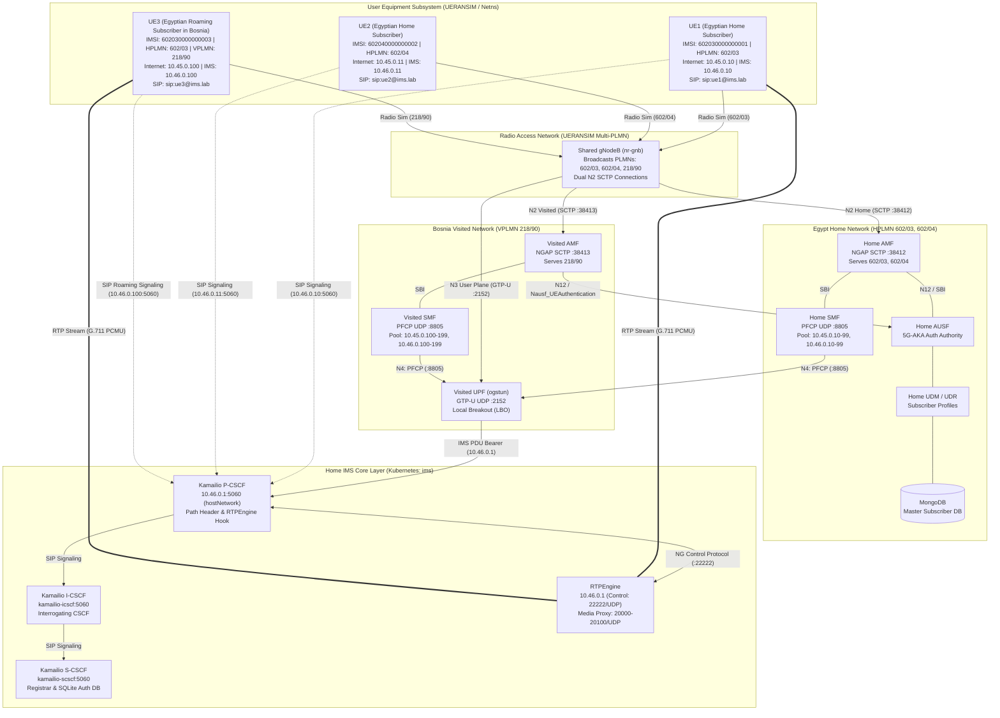

# 5G SA Network & IMS Architecture

## Overview

This document describes the 5G Standalone (SA) and IP Multimedia Subsystem (IMS) architecture deployed in 5G-IMS-Lab using **Open5GS v2.8.0**, **Kamailio v5.6**, **RTPEngine**, and **UERANSIM v3.3.0** orchestrated via **Kubernetes (`kind`)** on Ubuntu 24.04 LTS.

The laboratory implements an advanced multi-PLMN and inter-PLMN roaming architecture:
- **Home Network (🇪🇬 Egypt - HPLMN 602/03, 602/04)**: Containerized in Kubernetes (`open5gs` namespace), owning subscriber database (MongoDB), UDM, UDR, AUSF, Home AMF (port 38412), Home SMF, and Kamailio IMS Core (`ims` namespace).
- **Visited Network (🇧🇦 Bosnia & Herzegovina - VPLMN 218/90)**: Containerized in Kubernetes (`open5gs` namespace), owning Visited AMF (port 38413), Visited SMF, and Visited UPF Local Breakout (LBO) data path.
- **RAN & Multi-UE Simulation**: Executed as host processes with multi-PLMN broadcast/discovery and Linux network namespace isolation for independent subscriber data and IMS bearers.

---

## Architecture Diagram

---

## Network Functions & Components

| Component | Role | Namespace / Runtime | 3GPP / IETF Reference |
|---|---|---|---|
| **Home AMF** | Access & Mobility Management for PLMNs 602/03, 602/04 | Kubernetes (`open5gs`) / SCTP 38412 | TS 23.501, TS 23.502 |
| **Visited AMF** | Access & Mobility Management for VPLMN 218/90 | Kubernetes (`open5gs`) / SCTP 38413 | TS 23.501, TS 23.502 |
| **Home SMF** | Session Management for Egypt TAIs (602/03:1, 602/04:1) | Kubernetes (`open5gs`) | TS 23.502 |
| **Visited SMF** | Session Management for Bosnia TAI (218/90:1) | Kubernetes (`open5gs`) | TS 23.502 |
| **UPF** | User Plane Function (Local Breakout for Internet & IMS) | Kubernetes (`open5gs`) / `hostNetwork` | TS 23.501 |
| **AUSF** | Home Authentication Server Function (5G-AKA authority) | Kubernetes (`open5gs`) | TS 33.501 |
| **UDM / UDR** | Home Unified Data Management & Repository | Kubernetes (`open5gs`) | TS 29.503, TS 29.504 |
| **MongoDB** | Master Subscriber Database (K, OPc, SQN) | Kubernetes (`open5gs`) | — |
| **Kamailio P-CSCF** | Proxy-CSCF (Ingress SIP proxy, Path, RTPEngine control) | Kubernetes (`ims`) / `hostNetwork` | TS 23.228, RFC 3327 |
| **Kamailio I-CSCF** | Interrogating-CSCF (Domain query routing) | Kubernetes (`ims`) | TS 23.228 |
| **Kamailio S-CSCF** | Serving-CSCF (Registrar, SQLite Digest auth) | Kubernetes (`ims`) | TS 23.228, RFC 2617 |
| **RTPEngine** | Media Proxy (SDP rewriting, bidirectional RTP relay) | Kubernetes (`ims`) / `hostNetwork` | RFC 3550, RFC 4566 |
| **gNodeB** | Simulated Shared 5G RAN base station | Linux host process (`nr-gnb`) | TS 38.413 |
| **UE1 / UE2 / UE3** | Simulated 5G Multi-UEs with dual PDU sessions | Linux netns (`nr-ue`) | TS 24.501 |

---

## Reference Points & Protocols

| Interface | Protocol | Transport | Endpoints | Purpose |
|---|---|---|---|---|
| **N1** | NAS (5GMM / 5GSM) | SCTP via N2 | UE ↔ AMF | Control plane signaling & security |
| **N2 (Home)** | NGAP | SCTP :38412 | gNodeB ↔ Home AMF | Radio access control for 602/03 & 602/04 |
| **N2 (Visited)** | NGAP | SCTP :38413 | gNodeB ↔ Visited AMF | Radio access control for 218/90 |
| **N3** | GTP-U | UDP :2152 | gNodeB ↔ UPF | Encapsulated user plane bearer |
| **N4** | PFCP | UDP :8805 | SMF (Home/Visited) ↔ UPF | Packet forwarding session control |
| **N12** | Nausf_UEAuth | HTTP/2 (SBI) | Visited AMF ↔ Home AUSF | Cross-PLMN 5G-AKA authentication |
| **N6** | IP | Kernel Routing | UPF ↔ Data Network | Internet and IMS Local Breakout |
| **SIP Ingress** | SIP/2.0 | UDP/TCP :5060 | UE ↔ P-CSCF | IMS registration & session initiation |
| **SIP Core** | SIP/2.0 | UDP :5060 | P-CSCF ↔ I/S-CSCF | Internal domain routing & registrar |
| **NG Control** | Bencode / NG | UDP :22222 | P-CSCF ↔ RTPEngine | Dynamic SDP offer/answer rewriting |
| **RTP Media** | RTP / G.711 | UDP 20000-20100 | UEs ↔ RTPEngine | Bidirectional audio media proxying |

---

## IP Address & Subnet Plan

| Subnet / Endpoint | Target | Description |
|---|---|---|
| `172.19.0.2` | Kubernetes Kind Node | Bind IP for Home AMF (:38412), Visited AMF (:38413), UPF (:2152, :8805), and IMS (:5060) |
| `172.19.0.1` | Kind Bridge Gateway | Host bridge interface for gNodeB SCTP and GTP-U transport |
| `10.45.0.0/16` | Internet PDU Pool | Dynamically assigned IPv4 pool for `internet` DNN (Home: .10-.99, Visited: .100-.199) |
| `10.45.0.1` | Internet Gateway | UPF `ogstun` IP for Internet user plane Local Breakout |
| `10.46.0.0/16` | IMS PDU Pool | Dynamically assigned IPv4 pool for `ims` DNN (Home: .10-.99, Visited: .100-.199) |
| `10.46.0.1` | IMS Gateway & P-CSCF | UPF `ogstun` IP and P-CSCF / RTPEngine bind IP |
| `10.244.0.0/16` | Kubernetes Pod CIDR | Internal cluster overlay network for SBI and Core services |

---

## 3GPP Roaming Capabilities & Classification Matrix

| Capability | Lab Status | Technical Details |
|---|---|---|
| **Multi-PLMN RAN Sharing** | ✅ Implemented | UERANSIM SIB1 multi-PLMN broadcast (602/03, 602/04, 218/90) & NNSF routing |
| **Cross-PLMN 5G-AKA Auth** | ✅ Implemented | Visited AMF issues N12 `Nausf_UEAuthentication` to Home AUSF with `servingNetworkName: 5G:mnc090.mcc218.3gppnetwork.org` |
| **Local Breakout (LBO)** | ✅ Implemented | Visited SMF & Visited UPF terminate user plane locally for Internet & IMS |
| **IMS Roaming Voice Call** | ✅ Implemented | Roaming UE3 registers to Home IMS via visited bearer; UE1 ↔ UE3 call with RTPEngine proxying |
| **SEPP / N32 PRAS Boundary** | ⚠️ Emulated / Open5GS Limit | Direct Kubernetes DNS resolution for N12 SBI (Open5GS 2.8.0 does not implement SEPP/N32) |
| **Home-Routed Roaming (N16/N9)** | ❌ Not Supported | Open5GS 2.8.0 does not implement N16 (V-SMF ↔ H-SMF) or N9 user plane forwarding |
