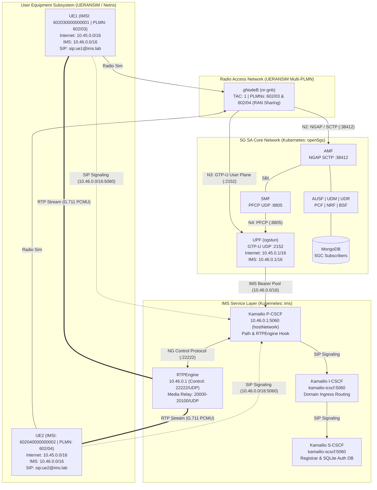

# 5G SA Network & IMS Architecture

## Overview

This document describes the 5G Standalone (SA) and IP Multimedia Subsystem (IMS) architecture deployed in 5G-IMS-Lab using **Open5GS v2.8.0**, **Kamailio v5.6**, **RTPEngine**, and **UERANSIM v3.3.0** orchestrated via **Kubernetes (`kind`)** on Ubuntu 24.04 LTS.

The laboratory implements a cloud-native hybrid architecture:
- **5G Core Network & IMS Service Layer**: Containerized in Kubernetes (`open5gs` and `ims` namespaces).
- **RAN & Multi-UE Simulation**: Executed as host processes with Linux network namespace isolation for independent subscriber data planes.

---

## Architecture Diagram

---

## Network Functions & Components

| Component | Role | Namespace / Runtime | 3GPP / IETF Reference |
|---|---|---|---|
| **AMF** | Access and Mobility Management Function | Kubernetes (`open5gs`) | TS 23.502 |
| **SMF** | Session Management Function | Kubernetes (`open5gs`) | TS 23.502 |
| **UPF** | User Plane Function | Kubernetes (`open5gs`) / `hostNetwork` | TS 23.501 |
| **NRF** | Network Repository Function | Kubernetes (`open5gs`) | TS 29.510 |
| **AUSF** | Authentication Server Function | Kubernetes (`open5gs`) | TS 33.501 |
| **UDM** | Unified Data Management | Kubernetes (`open5gs`) | TS 29.503 |
| **UDR** | Unified Data Repository | Kubernetes (`open5gs`) | TS 29.504 |
| **PCF** | Policy Control Function | Kubernetes (`open5gs`) | TS 29.512 |
| **BSF** | Binding Support Function | Kubernetes (`open5gs`) | TS 29.521 |
| **MongoDB** | Subscriber credentials and session store | Kubernetes (`open5gs`) | — |
| **Kamailio P-CSCF** | Proxy-CSCF (Ingress SIP proxy, Path, RTPEngine control) | Kubernetes (`ims`) / `hostNetwork` | TS 23.228, RFC 3327 |
| **Kamailio I-CSCF** | Interrogating-CSCF (Domain query routing) | Kubernetes (`ims`) | TS 23.228 |
| **Kamailio S-CSCF** | Serving-CSCF (Registrar, SQLite Digest auth) | Kubernetes (`ims`) | TS 23.228, RFC 2617 |
| **RTPEngine** | Media Proxy (SDP rewriting, bidirectional RTP relay) | Kubernetes (`ims`) / `hostNetwork` | RFC 3550, RFC 4566 |
| **gNodeB** | Simulated 5G RAN base station | Linux host process (`nr-gnb`) | TS 38.413 |
| **UE1 / UE2** | Simulated 5G Multi-UEs with dual PDU sessions | Linux netns (`nr-ue`) | TS 24.501 |

---

## Reference Points & Protocols

| Interface | Protocol | Transport | Endpoints | Purpose |
|---|---|---|---|---|
| **N1** | NAS (5GMM / 5GSM) | SCTP via N2 | UE ↔ AMF | Control plane signaling & security |
| **N2** | NGAP | SCTP :38412 | gNodeB ↔ AMF | Radio access network control |
| **N3** | GTP-U | UDP :2152 | gNodeB ↔ UPF | Encapsulated user plane bearer |
| **N4** | PFCP | UDP :8805 | SMF ↔ UPF | Packet forwarding session control |
| **N6** | IP | Kernel Routing | UPF ↔ Data Network | Internet and IMS breakout |
| **SBI** | HTTP/2 | TCP :7777 | Inter-NF | Service-Based Architecture |
| **SIP Ingress** | SIP/2.0 | UDP/TCP :5060 | UE ↔ P-CSCF | IMS registration & session initiation |
| **SIP Core** | SIP/2.0 | UDP :5060 | P-CSCF ↔ I/S-CSCF | Internal domain routing & registrar |
| **NG Control** | Bencode / NG | UDP :22222 | P-CSCF ↔ RTPEngine | Dynamic SDP offer/answer rewriting |
| **RTP Media** | RTP / G.711 | UDP 20000-20100 | UE1 ↔ RTPEngine ↔ UE2 | Bidirectional audio media proxying |

---

## IP Address & Subnet Plan

| Subnet / Endpoint | Target | Description |
|---|---|---|
| `172.19.0.2` | Kubernetes Kind Node | External bind IP for AMF (:38412), UPF (:2152, :8805), and IMS (:5060) |
| `172.19.0.1` | Kind Bridge Gateway | Host bridge interface for gNodeB SCTP and GTP-U transport |
| `10.45.0.0/16` | Internet PDU Pool | Dynamically assigned IPv4 pool for `internet` DNN |
| `10.45.0.1` | Internet Gateway | UPF `ogstun` IP for Internet user plane |
| `10.46.0.0/16` | IMS PDU Pool | Dynamically assigned IPv4 pool for `ims` DNN |
| `10.46.0.1` | IMS Gateway & P-CSCF | UPF `ogstun` IP and P-CSCF / RTPEngine bind IP |
| `10.244.0.0/16` | Kubernetes Pod CIDR | Internal cluster overlay network for SBI and Core services |
| `8.8.8.8, 8.8.4.4` | DNS Servers | Default nameservers configured in UE network namespaces |
