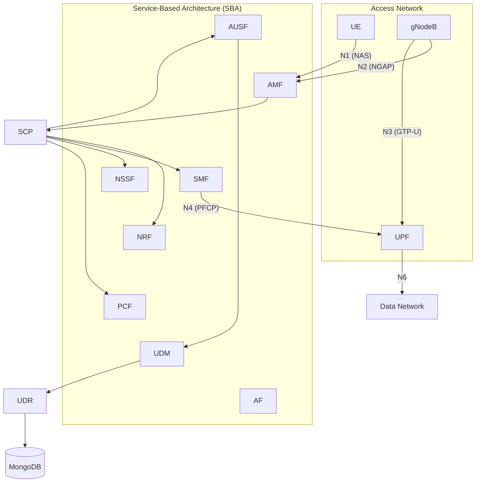

# 5G SA Network Architecture

## Overview

This document describes the 5G Standalone (SA) network architecture deployed in Open Telecom Lab using Open5GS v2.8.0 and UERANSIM v3.3.0 on Ubuntu 24.04 LTS.

## 3GPP Reference Architecture

The deployment follows the **3GPP TS 23.501** Service-Based Architecture (SBA):

## Network Functions

| NF | Full Name | Role | 3GPP Spec |
|----|-----------|------|-----------|
| **AMF** | Access and Mobility Management Function | Registration, connection, mobility management | TS 23.502 |
| **SMF** | Session Management Function | PDU session lifecycle management | TS 23.502 |
| **UPF** | User Plane Function | Packet routing, forwarding, QoS | TS 23.501 |
| **NRF** | Network Repository Function | NF discovery and registration | TS 29.510 |
| **AUSF** | Authentication Server Function | 5G-AKA authentication | TS 33.501 |
| **UDM** | Unified Data Management | Subscription management | TS 29.503 |
| **UDR** | Unified Data Repository | Subscription data storage | TS 29.504 |
| **PCF** | Policy Control Function | Policy rules and QoS | TS 29.512 |
| **NSSF** | Network Slice Selection Function | Slice selection | TS 29.531 |
| **BSF** | Binding Support Function | Session binding | TS 29.521 |
| **SCP** | Service Communication Proxy | Inter-NF communication proxy | TS 29.500 |

## Reference Points

| Interface | Protocol | Transport | Purpose |
|-----------|----------|-----------|---------|
| **N1** | NAS 5GMM/5GSM | — | UE ↔ AMF signaling |
| **N2** | NGAP | SCTP | gNB ↔ AMF signaling |
| **N3** | GTP-U | UDP/2152 | gNB ↔ UPF user plane |
| **N4** | PFCP | UDP/8805 | SMF ↔ UPF session control |
| **N6** | IP | — | UPF ↔ Data Network |
| **SBI** | HTTP/2 | TCP/7777 | Inter-NF service-based interface |

## IP Address Plan

| Component | Address | Notes |
|-----------|---------|-------|
| AMF (SBI) | 127.0.0.5:7777 | |
| AMF (NGAP) | 127.0.0.1:38412 | SCTP |
| SMF (SBI) | 127.0.0.4:7777 | |
| SMF (PFCP) | 127.0.0.4 | |
| UPF (PFCP) | 127.0.0.7 | |
| UPF (GTP-U) | 127.0.0.7 | |
| SCP | 127.0.0.200:7777 | |
| UE Pool | 10.45.0.0/16 | PDU session IPs |
| UE Gateway | 10.45.0.1 | ogstun interface |
| DNS | 8.8.8.8, 8.8.4.4 | Google DNS |
