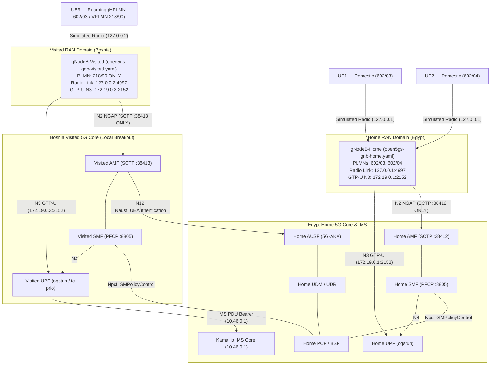

# Home vs. Visited RAN Topology & Architecture Note

## 1. Executive Summary & Context

In earlier iterations of this laboratory, a single "Shared gNodeB" process was used to broadcast all three PLMNs (`602/03`, `602/04`, and `218/90`) and maintain parallel N2 SCTP associations to both the Home AMF (`:38412`) and Visited AMF (`:38413`).

While multi-PLMN RAN sharing is a valid 3GPP concept (e.g., MOCN under TS 23.501 § 5.18), using a single shared gNodeB to represent both the Home domestic network (Egypt) and a foreign visited network (Bosnia) was an artificial laboratory simplification. It obscured the physical and logical boundaries between the Home and Visited serving-network domains.

To achieve genuine architectural fidelity for inter-PLMN roaming, the RAN topology has been refactored into **two completely independent UERANSIM gNodeB instances**:
1. **`gNodeB-Home`**: Dedicated to Egypt Home Network (PLMNs `602/03`, `602/04`).
2. **`gNodeB-Visited`**: Dedicated to Bosnia Visited Network (VPLMN `218/90`).

---

## 2. Target RAN Topology & Network Interfaces



---

## 3. Configuration Comparison: Home vs. Visited RAN

| Parameter | `gNodeB-Home` (`configs/ueransim/open5gs-gnb-home.yaml`) | `gNodeB-Visited` (`configs/ueransim/open5gs-gnb-visited.yaml`) |
|---|---|---|
| **Primary PLMN** | `602/03` | `218/90` |
| **Broadcast PLMN List** | `602/03`, `602/04` | `218/90` (Home PLMNs absent) |
| **NR Cell Identity (NCI)** | `0x000000010` (Cell 1) | `0x000000020` (Cell 2) |
| **Simulated Radio Bind (`linkIp`)** | `127.0.0.1` | `127.0.0.2` |
| **N2 Source IP (`ngapIp`)** | `172.19.0.1` | `172.19.0.3` |
| **N3 GTP-U Source IP (`gtpIp`)** | `172.19.0.1` (UDP 2152) | `172.19.0.3` (UDP 2152) |
| **Target AMF Connection** | `172.19.0.2:38412` (Home AMF ONLY) | `172.19.0.2:38413` (Visited AMF ONLY) |
| **Attached UEs** | UE1 (`602/03`), UE2 (`602/04`) | UE3 (`218/90` Roaming) |

---

## 4. UE3 Roaming Radio Attachment & User Plane Verification

### 4.1 Radio Attachment Isolation
- **UE1 & UE2 Configuration (`gnbSearchList`):** Configured with `127.0.0.1`, forcing radio search and discovery exclusively toward `gNodeB-Home`.
- **UE3 Configuration (`gnbSearchList`):** Configured with `127.0.0.2`, forcing radio search and discovery exclusively toward `gNodeB-Visited`.
- **Runtime Log Evidence:**
  - `gNodeB-Home` log (`/tmp/ueransim-gnb-home.log`) receives RRC setup only for UE1 and UE2.
  - `gNodeB-Visited` log (`/tmp/ueransim-gnb-visited.log`) receives RRC setup exclusively for UE3.

### 4.2 N3 GTP-U / Local Breakout (LBO) Separation
During user-plane transmission (e.g., ping, SIP, or RTP voice):
- **UE1 / UE2 Traffic Path:** Encapsulated in GTP-U between `172.19.0.1:2152` (`gNodeB-Home`) and `172.19.0.2:2152` (`Home UPF`).
- **UE3 Traffic Path:** Encapsulated in GTP-U between `172.19.0.3:2152` (`gNodeB-Visited`) and `172.19.0.2:2152` (`VUPF`).
- **GTP-U Packet Capture Evidence:**
  ```text
  IP 172.19.0.3.2152 > 172.19.0.2.2152: UDP, length 100  (Uplink GTP-U)
  IP 172.19.0.2.2152 > 172.19.0.3.2152: UDP, length 100  (Downlink GTP-U)
  ```
  `gNodeB-Home` (`172.19.0.1`) is completely bypassed for UE3 user plane.

---

## 5. Technical Limitations & Scope Boundaries

1. **Local Breakout Only:** Roaming user-plane traffic breaks out locally at Visited UPF. Home-Routed (HR) roaming via N9/N16 is not implemented.
2. **Security Edge Protection Proxy (SEPP):** Cross-PLMN SBI communication between Visited AMF/SMF and Home AUSF/UDM/PCF utilizes Kubernetes internal DNS rather than 3GPP N32-c/N32-f PRAS encapsulation.
3. **Static Policy & Lab Accounting:** PCF policy is statically derived from MongoDB subscriber profiles; charging records are written via Kamailio S-CSCF SQLite CDRs and Linux namespace telemetry rather than 3GPP Nchf.
