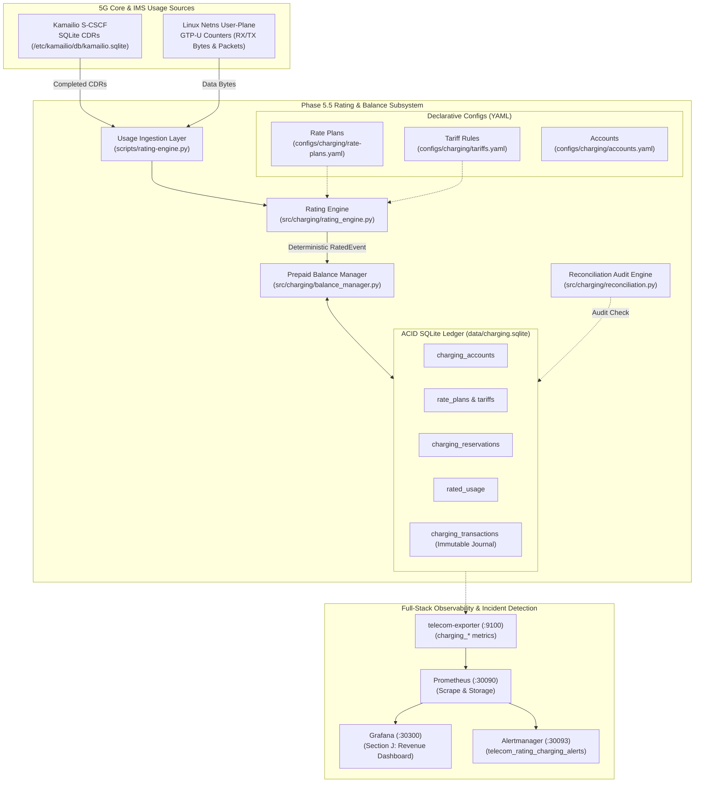

# Phase 5.5 — Telecom Rating Engine & Balance Management Architecture

## 1. Executive Summary

Phase 5.5 introduces a deterministic, explainable, and transactional **Laboratory Telecom Rating Engine & Prepaid Balance Management Subsystem** into the `5G-IMS-Lab` environment.

> [!IMPORTANT]
> **Technical Scope Clarification:** This subsystem is an **Offline Usage Rating and Balance Engine** designed for telecom revenue engineering, tariff experimentation, and balance lifecycle demonstration using SQLite-backed immutable transaction journals. It does **not** claim to be a 3GPP Rel-15/16 Online Charging System (OCS) or 5G Service-Based Charging Function (CHF / `Nchf`).

---

## 2. High-Level Subsystem Architecture

---

## 3. Subsystem Layer Breakdown

### Layer 1: Usage Generation & Ingestion
- **Voice Usage:** Real Call Detail Records (CDRs) generated by Kamailio S-CSCF dialog and acc modules upon `BYE` message completion. Captures `caller`, `callee`, `duration`, `start_time`, `sip_code`, and `sip_reason`.
- **Data Usage:** Real network namespace kernel network device byte counters (`ip -s link show uesimtun0`) sampled per SUPI and Data Network Name (`internet` and `ims`).

### Layer 2: Deterministic Rating Engine
- Resolves subscriber charging account by SIP URI (`sip:ue1@ims.lab`), IMSI (`602030000000001`), or MSISDN (`+201000000001`).
- Classifies traffic destination: `domestic` (Home PLMN `602/03` $\leftrightarrow$ Home PLMN `602/04`) vs `roaming_vplmn` (HPLMN `602/03` $\leftrightarrow$ Visited PLMN `218/90` Bosnia Local Breakout).
- Evaluates configured rate plan and selects exact matching tariff rule based on `(service_type, destination_type, dnn)`.
- Calculates fixed connection setup charges, unit-based duration/data charges, minimum billable increments, and ceiling rounding (`CEIL`).

### Layer 3: Prepaid Balance Manager & Transaction Journal
- Manages subscriber credit balances across three discrete buckets:
  - **`balance_available`**: Spendable credit available for new sessions or reservations.
  - **`balance_reserved`**: Temporary credit holds locked during active sessions.
  - **`balance_consumed`**: Cumulative historical credit billed to date.
- Enforces strict non-negative balance constraint: transactions fail immediately if required funds exceed available balance.
- Maintains an **immutable transaction journal** (`charging_transactions`) recording every financial credit (`TOPUP`), debit (`CHARGE`), hold (`RESERVE`), and release (`RELEASE`).

### Layer 4: Multi-Point Reconciliation Audit Engine
- Formally validates financial accounting integrity:
  $$\sum \text{Ledger Credits} - \sum \text{Ledger Debits} \equiv \text{Balance Available} + \text{Balance Reserved}$$
- Verifies that zero CDRs are charged more than once (Idempotency Audit).
- Detects orphaned transactions or unrated CDR backlogs.

### Layer 5: Observability & Alerting
- Exposes real-time revenue and balance metrics via `telecom-exporter` (`:9100`).
- Visualizes revenue distribution, account health, and transaction rates in Grafana Section J.
- Alerts on reconciliation drift, negative balance violations, or unrated CDR buildup via Alertmanager.
