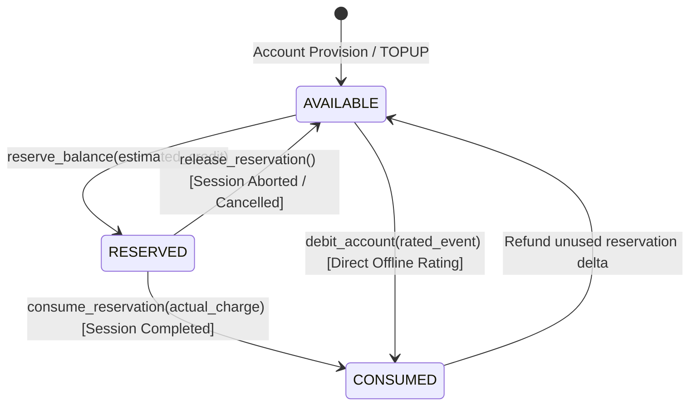

# Phase 5.5 — Prepaid Balance Management & Transaction Journal

## 1. Balance Bucket Architecture

Subscribers maintain a multi-bucket credit balance structure within `charging_accounts`:

```text
┌─────────────────────────────────────────────────────────────┐
│                      TOTAL ACCOUNT EQUITY                   │
│                                                             │
│   ┌───────────────────────────┐ ┌───────────────────────┐   │
│   │     balance_available     │ │   balance_reserved    │   │
│   │ (Spendable liquid credit) │ │ (Active session hold) │   │
│   └───────────────────────────┘ └───────────────────────┘   │
└─────────────────────────────────────────────────────────────┘
                               ▲
                               │ Historical Cumulative Metric
                               ▼
                ┌───────────────────────────────┐
                │       balance_consumed        │
                │ (Total billed debits to date) │
                └───────────────────────────────┘
```

---

## 2. Balance State Lifecycle



### 2.1 State Transitions

1. **`AVAILABLE` $\rightarrow$ `RESERVED` (`reserve_balance`)**:
   - Locks estimated funds before a session starts.
   - $\text{Available} \leftarrow \text{Available} - \text{Reserve}$
   - $\text{Reserved} \leftarrow \text{Reserved} + \text{Reserve}$
   - Records `RESERVE` transaction journal entry.

2. **`RESERVED` $\rightarrow$ `CONSUMED` (`consume_reservation`)**:
   - Finalizes session billing once actual CDR/usage is known.
   - If $\text{Actual} \le \text{Reserved}$:
     - $\text{Refund} = \text{Reserved} - \text{Actual}$
     - $\text{Available} \leftarrow \text{Available} + \text{Refund}$
     - $\text{Reserved} \leftarrow \text{Reserved} - \text{Reserved}$
     - $\text{Consumed} \leftarrow \text{Consumed} + \text{Actual}$
   - Records `CHARGE` transaction journal entry with `-Actual` amount.

3. **`RESERVED` $\rightarrow$ `AVAILABLE` (`release_reservation`)**:
   - Completely cancels a reservation hold if session is unestablished or dropped.
   - $\text{Available} \leftarrow \text{Available} + \text{Reserved}$
   - $\text{Reserved} \leftarrow 0$
   - Records `RELEASE` transaction journal entry.

4. **Direct Offline Debit (`debit_account`)**:
   - Directly charges completed offline CDRs or usage records.
   - $\text{Available} \leftarrow \text{Available} - \text{Charge}$
   - $\text{Consumed} \leftarrow \text{Consumed} + \text{Charge}$
   - Records `CHARGE` transaction journal entry.

---

## 3. ACID Atomicity & Idempotency Guarantees

### 3.1 Non-Negative Balance Enforcement
If $\text{Available} < \text{Required}$:
- Transaction is rejected with `Insufficient balance: available X < required Y`.
- Account balances remain unmodified.
- Record logged in `rated_usage` with `rating_status = 'INSUFFICIENT_BALANCE'`.
- Counter `charging_insufficient_balance_total` incremented.

### 3.2 Idempotency & Duplicate Protection
- Every CDR rating references its unique source identifier (`source_record_id`).
- Before performing any debit, the engine checks `charging_transactions` for `reference_id = source_record_id`.
- If already charged, the existing transaction is returned without double-charging.
