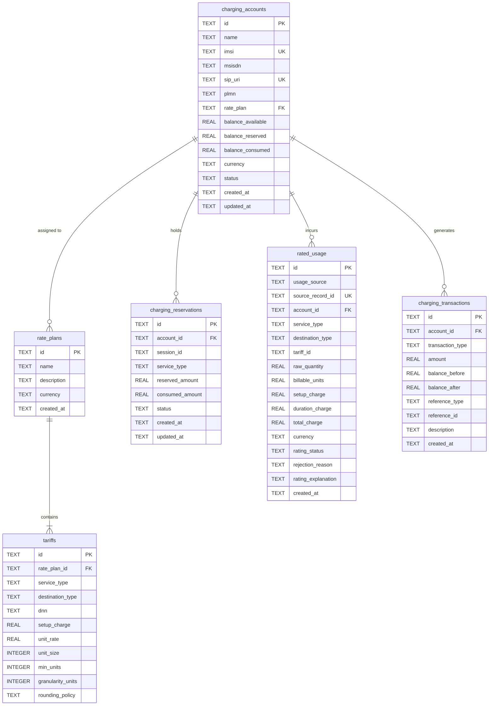

# Phase 5.5 — Charging Database Schema & Data Model

## 1. Database Specifications

- **Engine:** SQLite 3 with Write-Ahead Logging (`PRAGMA journal_mode = WAL`) and Foreign Key Enforcement (`PRAGMA foreign_keys = ON`).
- **File Location:** `data/charging.sqlite`.

---

## 2. Entity-Relationship Diagram

---

## 3. Table Schema Definitions

### 3.1 `charging_accounts`
| Column | Type | Constraints | Description |
| :--- | :--- | :--- | :--- |
| `id` | `TEXT` | `PRIMARY KEY` | Unique account ID (e.g. `acc-ue1`) |
| `imsi` | `TEXT` | `UNIQUE NOT NULL` | Subscriber IMSI / SUPI |
| `sip_uri` | `TEXT` | `UNIQUE` | Registered IMS SIP URI (`sip:ue1@ims.lab`) |
| `plmn` | `TEXT` | `NOT NULL` | Home PLMN (`602/03`, `602/04`) |
| `rate_plan` | `TEXT` | `NOT NULL` | Assigned rate plan ID (`standard-prepaid`) |
| `balance_available` | `REAL` | `CHECK(>= 0)` | Available liquid credit balance |
| `balance_reserved` | `REAL` | `CHECK(>= 0)` | Credit locked in active reservations |
| `balance_consumed` | `REAL` | `CHECK(>= 0)` | Cumulative historical spend |
| `currency` | `TEXT` | `DEFAULT 'LAB'` | Currency identifier |
| `status` | `TEXT` | `DEFAULT 'ACTIVE'`| Lifecycle status (`ACTIVE`, `SUSPENDED`) |

### 3.2 `charging_transactions` (Immutable Ledger)
| Column | Type | Description |
| :--- | :--- | :--- |
| `id` | `TEXT PRIMARY KEY` | Transaction ID (e.g. `tx-chg-xxxx`, `tx-topup-xxxx`) |
| `account_id` | `TEXT FK` | Target charging account ID |
| `transaction_type` | `TEXT` | Operation type (`TOPUP`, `CHARGE`, `RESERVE`, `RELEASE`) |
| `amount` | `REAL` | Financial delta ($>0$ credit, $<0$ debit, $0$ hold/release) |
| `balance_before` | `REAL` | Account balance immediately prior to execution |
| `balance_after` | `REAL` | Account balance immediately after execution |
| `reference_type` | `TEXT` | Reference origin (`rated_usage`, `reservation`, `manual`) |
| `reference_id` | `TEXT` | Source record ID (for idempotency and traceability) |
| `description` | `TEXT` | Operator audit description |
| `created_at` | `TEXT` | ISO-8601 UTC timestamp |
