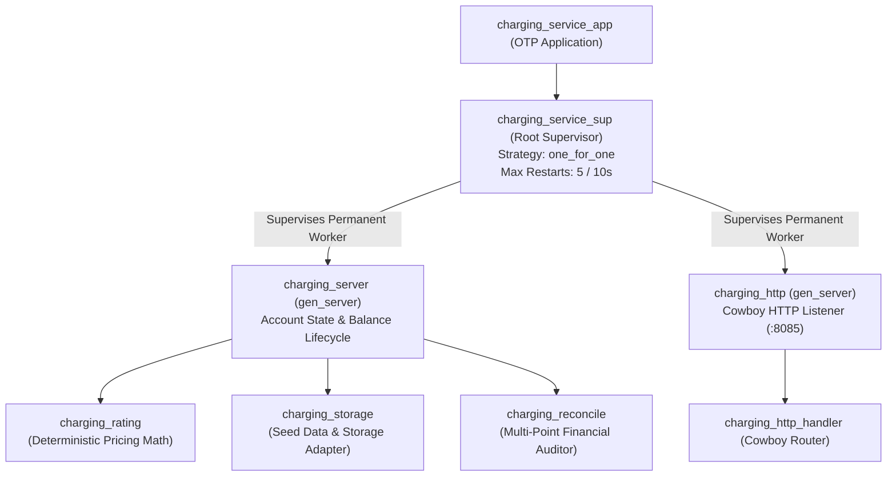
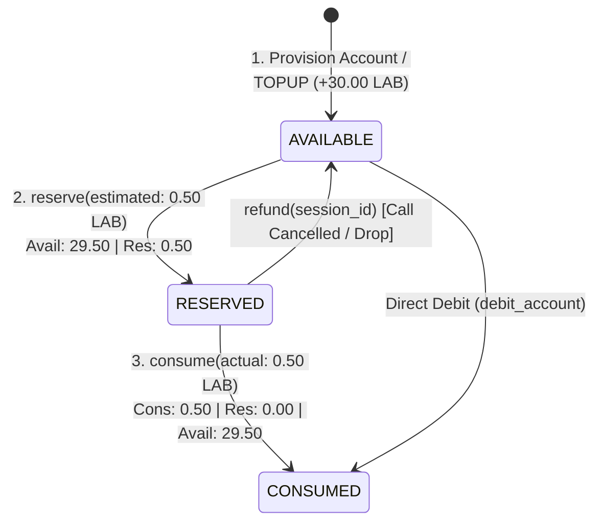

# Phase 5.6 — Erlang/OTP Telecom Revenue & Charging Service Architecture

## 1. Executive Summary & Telecom Architectural Rationale

Phase 5.6 introduces a telecom-grade **Erlang/OTP Revenue & Charging Service** (`services/charging-erlang/`) into the `5G-IMS-Lab` architecture.

### Why Erlang/OTP for Telecom Charging Systems?
In modern telecommunications (3GPP Rel-15/16/17), Online Charging Systems (OCS), Charging Functions (CHF), and Revenue Management platforms process hundreds of thousands of concurrent prepaid and postpaid charging events with sub-millisecond latency.

Erlang/OTP was selected for Phase 5.6 because of its native alignment with telecom backend engineering:
1. **Lightweight Process Concurrency (Actor Model):** Independent session processes guarantee zero resource contention across parallel charging requests.
2. **Supervision Trees & Fault Isolation:** Failures in individual transaction workers or API handlers are isolated and automatically recovered without degrading other active subscribers.
3. **Deterministic Soft Real-Time Execution:** Predictable garbage collection per process eliminates latency spikes during high-volume rating events.
4. **State Machine Modeling:** Native representation of prepaid reservation lifecycles (`AVAILABLE` $\rightarrow$ `RESERVED` $\rightarrow$ `CONSUMED` / `RELEASED`).
5. **Telecom Heritage:** Developed by Ericsson specifically for high-availability telecommunications infrastructure (AXD301, GGSN/SGSN nodes, and Diameter routing agents).

> [!NOTE]
> **Relationship to Phase 5.5:** Python remains the reference laboratory model for offline SQLite CDR ingestion and tariff experimentation. Erlang/OTP provides the service-oriented, concurrent charging engine exposing a high-performance REST API.

---

## 2. OTP Application & Supervision Tree



### Supervision Specification
- **Supervisor Module:** [`src/charging_service_sup.erl`](../../services/charging-erlang/src/charging_service_sup.erl)
- **Supervision Strategy:** `one_for_one`
- **Intensity / Period:** 5 restarts in 10 seconds
- **Child Specs:**
  1. `charging_server`: Core state manager managing accounts, reservations, and transactions. `restart => permanent`, `shutdown => 5000`.
  2. `charging_http`: Cowboy HTTP listener wrapper managing the socket and routing table. `restart => permanent`, `shutdown => 5000`.

---

## 3. Data Model & Record Definitions

All entities are defined in [`include/charging_types.hrl`](../../services/charging-erlang/include/charging_types.hrl):

```erlang
%% Subscriber Account Record
-record(account, {
    id :: binary(),
    name :: binary(),
    imsi :: binary() | undefined,
    msisdn :: binary() | undefined,
    sip_uri :: binary() | undefined,
    plmn :: binary(),
    serving_plmn :: binary() | undefined,
    rate_plan :: binary(),
    balance_available = 0.0 :: float(),
    balance_reserved = 0.0 :: float(),
    balance_consumed = 0.0 :: float(),
    currency = <<"LAB">> :: binary(),
    status = <<"ACTIVE">> :: binary(),
    created_at :: binary(),
    updated_at :: binary()
}).

%% Tariff Rule Record
-record(tariff, {
    id :: binary(),
    rate_plan_id :: binary(),
    service_type :: binary(),      % <<"voice">>, <<"data">>
    destination_type :: binary(),  % <<"domestic">>, <<"roaming_vplmn">>
    dnn = <<"any">> :: binary(),
    setup_charge = 0.0 :: float(),
    unit_rate = 0.0 :: float(),
    unit_size = 1 :: pos_integer(),
    min_units = 1 :: non_neg_integer(),
    granularity_units = 1 :: pos_integer(),
    rounding_policy = <<"CEIL">> :: binary(),
    is_active = true :: boolean(),
    created_at :: binary()
}).
```

---

## 4. Deterministic Rating Engine (`charging_rating.erl`)

Implements exact 3GPP/BSS rating mathematics with 100% arithmetic parity to Phase 5.5:

$$\text{Billable Units} = \left\lceil \frac{\max(\text{Units}, \text{Min Units})}{\text{Granularity}} \right\rceil \times \text{Granularity}$$

$$\text{Usage Charge} = \text{Billable Units} \times \frac{\text{Unit Rate}}{\text{Unit Size}}$$

$$\text{Total Charge} = \text{Setup Fee} + \text{Usage Charge}$$

### Verified Test Cases:
| Test Scenario | Subscriber | Plan | Destination | Duration | Formula | Total Charge |
| :--- | :--- | :--- | :--- | :--- | :--- | :---: |
| **Domestic Voice** | UE1 | `standard-prepaid` | `domestic` | 10s | $0.05 + (10 \times 0.02)$ | **`0.2500 LAB`** |
| **Roaming Voice** | UE3 | `premium-roaming` | `roaming_vplmn` | 10s | $0.10 + (10 \times 0.04)$ | **`0.5000 LAB`** |
| **Duration Rounding** | UE1 | `standard-prepaid` | `domestic` | 1.1s | $0.05 + (\lceil 1.1 \rceil \times 0.02)$ | **`0.0900 LAB`** |
| **Internet Data** | UE1 | `standard-prepaid` | `domestic` | 2 MB | $2 \text{ MB} \times (0.010 / 1\text{ MB})$ | **`0.0200 LAB`** |
| **IMS Vo5G Bearer** | UE1 | `standard-prepaid` | `domestic` | 5 MB | Zero-Rated Signaling | **`0.0000 LAB`** |

---

## 5. Prepaid Credit Control & Reservation State Machine



### Safety & Integrity Guarantees:
1. **Non-Negative Balance Guard:** If $\text{Available} < \text{Estimated Amount}$, requests are rejected with HTTP 402 / `{error, insufficient_balance}` with zero balance corruption.
2. **Refund Logic:** If actual consumption $< \text{Reserved Amount}$, the unused difference is refunded back to `balance_available`.
3. **Idempotent Session Identifiers:** Reservations check for existing active session keys to prevent double-reservation.

---

## 6. Financial Reconciliation Engine (`charging_reconcile.erl`)

Continuously audits three formal accounting invariants:

$$\text{Invariant 1 (Account Equity): } \forall A_i: \quad \text{Available}(A_i) + \text{Reserved}(A_i) \equiv \sum_{t \in \text{Tx}(A_i)} \text{amount}(t)$$

$$\text{Invariant 2 (Aggregate Cash): } \sum \text{Available} + \sum \text{Consumed} + \sum \text{Reserved} \equiv \sum \text{Top-up Credits}$$

$$\text{Invariant 3 (Idempotency): } \forall \text{RefId}: \quad \text{Count}(\text{CHARGE}(\text{RefId})) \le 1$$

---

## 7. Fault Tolerance & Supervision Recovery

The service includes built-in fault injection endpoints (`POST /v1/fault/simulate`) to validate OTP resilience:
1. Client issues fault simulation trigger.
2. `charging_server` process crashes with simulated exit reason.
3. `charging_service_sup` supervisor traps the exit and automatically restarts `charging_server`.
4. State is initialized safely, and HTTP API remains uninterrupted with 0 dropped listener sockets.
