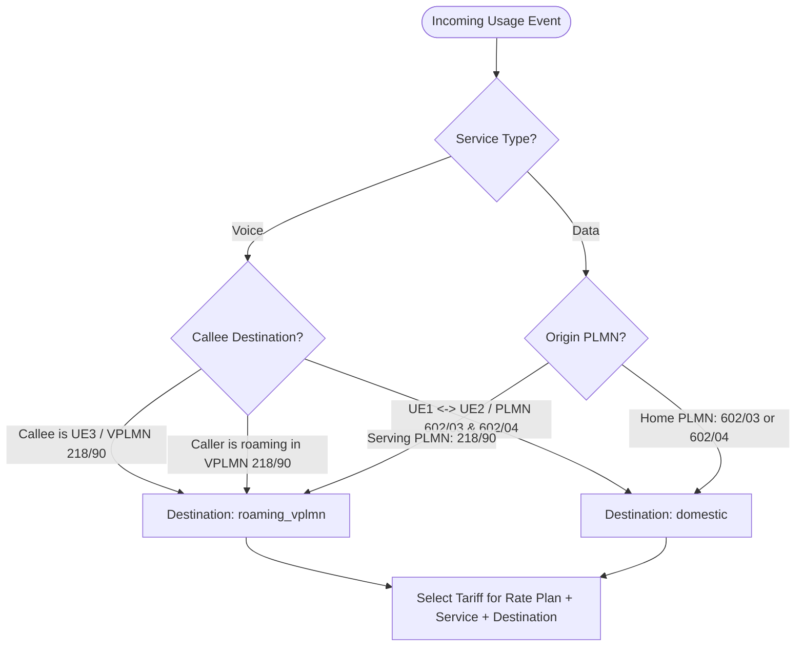

# Phase 5.5 — Telecom Rating Model & Tariff Specification

## 1. Overview

The `5G-IMS-Lab` rating engine employs a deterministic mathematical model supporting multi-service rating across domestic and inter-PLMN roaming boundaries.

---

## 2. Voice Rating Model

### 2.1 Formula & Arithmetic

$$\text{Call Cost} = \text{Setup Fee} + \left( \left\lceil \frac{\max(\text{Duration}, \text{Min Units})}{\text{Granularity}} \right\rceil \times \text{Granularity} \right) \times \frac{\text{Unit Rate}}{\text{Unit Size}}$$

Where:
- $\text{Setup Fee}$ is a fixed connection establishment charge.
- $\text{Min Units}$ is the minimum billable interval (e.g., 1 second).
- $\text{Granularity}$ defines increment rounding steps.
- $\text{Rounding Policy}$ defaults to `CEIL` (standard telecom ceiling rounding).

### 2.2 Voice Tariff Classes

| Tariff ID | Rate Plan | Service | Destination | Setup Charge | Unit Rate | Unit Size | Min Billable | Rounding | Effective Rate |
| :--- | :--- | :--- | :--- | :---: | :---: | :---: | :---: | :---: | :---: |
| `tariff-domestic-voice` | `standard-prepaid` | `voice` | `domestic` | `0.05 LAB` | `0.02 LAB` | 1 sec | 1 sec | `CEIL` | `1.20 LAB / min` |
| `tariff-roaming-voice` | `standard-prepaid` | `voice` | `roaming_vplmn` | `0.15 LAB` | `0.08 LAB` | 1 sec | 1 sec | `CEIL` | `4.80 LAB / min` |
| `tariff-premium-roaming-voice` | `premium-roaming` | `voice` | `roaming_vplmn` | `0.10 LAB` | `0.04 LAB` | 1 sec | 1 sec | `CEIL` | `2.40 LAB / min` |

---

## 3. Data Rating Model

### 3.1 Formula & Arithmetic

$$\text{Data Cost} = \left\lceil \frac{\max(\text{Total Bytes}, \text{Min Bytes})}{\text{Granularity Bytes}} \right\rceil \times \text{Granularity Bytes} \times \frac{\text{Unit Rate}}{\text{1 MB (1,048,576 Bytes)}}$$

### 3.2 Data Tariff Classes

| Tariff ID | Rate Plan | Service | Destination | DNN | Unit Rate | Unit Size | Granularity | Notes |
| :--- | :--- | :--- | :--- | :--- | :---: | :---: | :---: | :--- |
| `tariff-domestic-data-internet` | `standard-prepaid` | `data` | `domestic` | `internet` | `0.010 LAB` | 1 MB | 1,024 B (1 KB) | Domestic data access |
| `tariff-domestic-data-ims` | `standard-prepaid` | `data` | `domestic` | `ims` | `0.000 LAB` | 1 MB | 1,024 B (1 KB) | **Zero-Rated** Vo5G signaling bearer |
| `tariff-roaming-data-internet` | `standard-prepaid` | `data` | `roaming_vplmn` | `internet` | `0.050 LAB` | 1 MB | 1,024 B (1 KB) | Roaming data surcharge |
| `tariff-premium-roaming-data` | `premium-roaming` | `data` | `roaming_vplmn` | `internet` | `0.025 LAB` | 1 MB | 1,024 B (1 KB) | Discounted roaming data |
| `tariff-roaming-data-ims` | `standard-prepaid` | `data` | `roaming_vplmn` | `ims` | `0.000 LAB` | 1 MB | 1,024 B (1 KB) | **Zero-Rated** Roaming IMS bearer |

---

## 4. Destination Classification Logic



---

## 5. Billing Traceability & Rating Explanation

Every rated event produces a human-readable, auditable mathematical explanation stored in `rated_usage.rating_explanation`:

```text
[Voice Rating] Plan: standard-prepaid | Tariff: tariff-roaming-voice (roaming_vplmn) | 
Duration: 2.0s -> Billable: 2s | 
Setup: 0.15 LAB + Usage: 0.1600 LAB (@ 0.08/s) = Total: 0.3100 LAB
```
