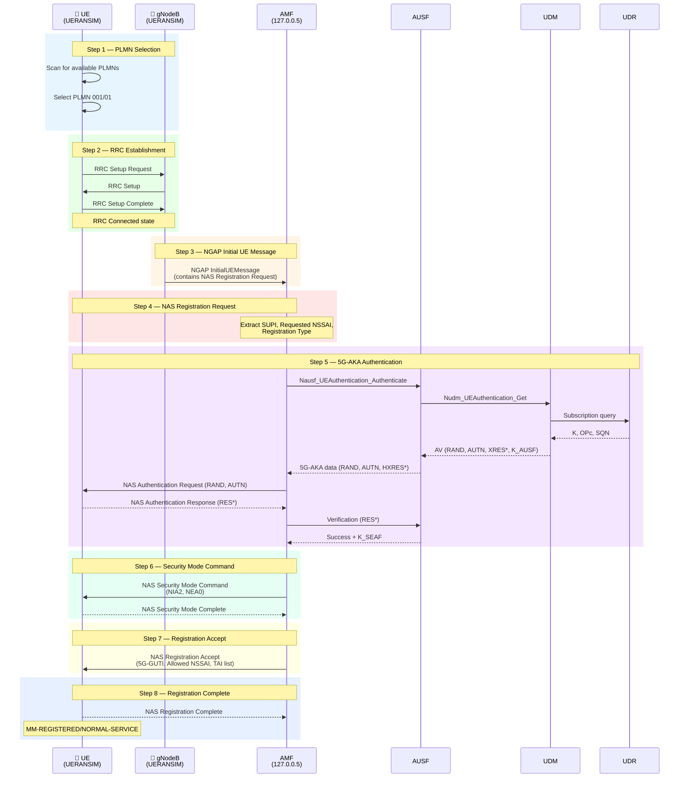

# 5G Registration Analysis

> Step-by-step analysis of the complete UE Initial Registration procedure as implemented in this lab, mapped to protocol messages and network functions.

---

## Overview

The UE Initial Registration procedure is defined in **3GPP TS 23.502 §4.2.2.2** and involves eight distinct phases. In this lab, the entire procedure completes in approximately 40 milliseconds (observable in UERANSIM timestamps from `20:41:15.394` to `20:41:15.431`).

This document analyzes each step: the protocol involved, the network functions participating, and the purpose of every message.

---

## Complete Registration Flow



---

## Step-by-Step Analysis

### Step 1 — PLMN Selection

| Attribute | Value |
|-----------|-------|
| **Protocol** | NAS 5GMM (internal UE procedure) |
| **Network Functions** | UE only |
| **3GPP Reference** | TS 23.122 §4.4 |

The UE scans for available PLMNs broadcast by nearby cells. In this lab, the UERANSIM gNB advertises PLMN `001/01` (MCC=001, MNC=01), which matches the UE's configured Home PLMN.

**UERANSIM log:**
```
[nas] UE switches to state [MM-DEREGISTERED/PLMN-SEARCH]
[rrc] New signal detected for cell[1], total [1] cells in coverage
[nas] Selected plmn[001/01]
[rrc] Selected cell plmn[001/01] tac[1] category[SUITABLE]
```

**Engineering insight:** PLMN selection determines which core network the UE will register with. In roaming scenarios, PLMN selection decides between HPLMN (Home) and VPLMN (Visited). In this lab, there is only one PLMN, so selection is straightforward. The cell is categorized as `SUITABLE` because the PLMN matches and the TAC (1) is not in any forbidden list.

---

### Step 2 — RRC Establishment

| Attribute | Value |
|-----------|-------|
| **Protocol** | RRC (Radio Resource Control) |
| **Network Functions** | UE ↔ gNodeB |
| **3GPP Reference** | TS 38.331 §5.3.3 |

RRC establishes the radio link between UE and gNB. After RRC Setup Complete, the UE transitions from `RRC-IDLE` to `RRC-CONNECTED`.

**UERANSIM log:**
```
[rrc] Sending RRC Setup Request
[rrc] RRC connection established
[rrc] UE switches to state [RRC-CONNECTED]
[nas] UE switches to state [CM-CONNECTED]
```

**Engineering insight:** In a real network, RRC Setup involves resource allocation (SRB1). In UERANSIM, the radio layer is simulated — there is no actual RF — but the state transitions are faithful to the 3GPP state machine. The CM-CONNECTED state means the UE has a signaling connection to the AMF via the gNB.

---

### Step 3 — NGAP Initial UE Message

| Attribute | Value |
|-----------|-------|
| **Protocol** | NGAP (N2 interface) |
| **Transport** | SCTP, port 38412 |
| **Network Functions** | gNodeB → AMF |
| **3GPP Reference** | TS 38.413 §8.6.1 |

The gNB wraps the NAS Registration Request inside an NGAP Initial UE Message and sends it to the AMF over SCTP. This is the first N2 message for this UE.

The NGAP message contains:
- **NAS-PDU:** The registration request from the UE
- **RAN-UE-NGAP-ID:** gNB's identifier for this UE context
- **User Location Information:** NR CGI (Cell Global Identity) and TAI
- **RRC Establishment Cause:** `mo-Signalling`

**Wireshark filter:**
```
ngap.procedureCode == 15    # initialUEMessage
```

---

### Step 4 — NAS Registration Request

| Attribute | Value |
|-----------|-------|
| **Protocol** | NAS 5GMM |
| **Network Functions** | UE → AMF (via gNB) |
| **3GPP Reference** | TS 24.501 §8.2.6 |

The Registration Request contains:

| IE | Value in This Lab | Purpose |
|----|-------------------|---------|
| 5GS Registration Type | Initial Registration | First registration to this PLMN |
| 5GS Mobile Identity | SUPI: `imsi-001010000000001` | Subscriber identity |
| UE Security Capability | IA1, IA2, IA3 / EA1, EA2, EA3 | Supported algorithms |
| Requested NSSAI | SST=1, SD=0xFFFFFF | Requested network slice |
| UE 5GMM Capability | Various capability bits | UE feature support |

**Engineering insight:** The SUPI is sent in cleartext here because `protectionScheme: 0` (null scheme) is configured. In production, the UE would encrypt the SUPI into a SUCI (Subscription Concealed Identifier) using the home network's public key, preventing IMSI catching attacks.

**Wireshark filter:**
```
nas-5gs.mm.message_type == 0x41    # Registration Request
```

---

### Step 5 — 5G-AKA Authentication

| Attribute | Value |
|-----------|-------|
| **Protocol** | NAS 5GMM + SBI (Nausf, Nudm) |
| **Network Functions** | AMF → AUSF → UDM → UDR → MongoDB |
| **3GPP Reference** | TS 33.501 §6.1.3 |

This is the most complex step. The authentication chain:

```
AMF → SCP → AUSF → UDM → UDR → MongoDB
                                    ↓
                              K, OPc, SQN
                                    ↓
                        Compute AV (RAND, AUTN, XRES*, K_AUSF)
```

**Authentication credentials from this lab:**

| Credential | Source | Value |
|------------|--------|-------|
| **K** | `open5gs-ue.yaml` + MongoDB | `465B5CE8B199B49FAA5F0A2EE238A6BC` |
| **OPc** | `open5gs-ue.yaml` + MongoDB | `E8ED2441347B7990E92C19B0316CD6FC` |
| **SQN** | MongoDB (incremented per auth) | Starts at 0, observed: `0x0000000000A1` |
| **AMF** | UE config | `8000` |

**The authentication exchange:**

1. **UDM** retrieves K, OPc, SQN from MongoDB via UDR
2. **UDM** computes the Authentication Vector: RAND, AUTN, XRES*, K_AUSF
3. **AUSF** stores XRES* and sends RAND, AUTN, HXRES* to AMF
4. **AMF** sends RAND, AUTN to UE in NAS Authentication Request
5. **UE** verifies AUTN (authenticates the network), computes RES*
6. **UE** sends RES* to AMF in NAS Authentication Response
7. **AMF** sends RES* to AUSF, which verifies HRES* == HXRES*

**UERANSIM log:**
```
[nas] Authentication Request received
[nas] Received SQN [0000000000A1]
```

**Wireshark filters:**
```
nas-5gs.mm.message_type == 0x56    # Authentication Request
nas-5gs.mm.message_type == 0x57    # Authentication Response
```

---

### Step 6 — Security Mode Command

| Attribute | Value |
|-----------|-------|
| **Protocol** | NAS 5GMM |
| **Network Functions** | AMF ↔ UE |
| **3GPP Reference** | TS 24.501 §8.2.25 |

The AMF activates NAS security by sending the Security Mode Command:

| Parameter | Selected Value | Meaning |
|-----------|---------------|---------|
| NAS Integrity Algorithm | NIA2 | 128-bit SNOW 3G integrity |
| NAS Ciphering Algorithm | NEA0 | No encryption |

The AMF selects from its priority list in `amf.yaml`:
```yaml
integrity_order: [ NIA2, NIA1, NIA0 ]
ciphering_order: [ NEA0, NEA1, NEA2 ]
```

**UERANSIM log:**
```
[nas] Security Mode Command received
[nas] Selected integrity[2] ciphering[0]    # 2=NIA2, 0=NEA0
```

**Engineering insight:** After this step, all subsequent NAS messages include a Message Authentication Code (MAC) computed with the integrity key (K_NASint). NEA0 was selected for ciphering because it is first in the AMF's preference list — this is a deliberate lab configuration to allow Wireshark to decode NAS messages without key provisioning.

**Wireshark filter:**
```
nas-5gs.mm.message_type == 0x5d    # Security Mode Command
nas-5gs.mm.message_type == 0x5e    # Security Mode Complete
```

---

### Step 7 — Registration Accept

| Attribute | Value |
|-----------|-------|
| **Protocol** | NAS 5GMM (inside NGAP Initial Context Setup) |
| **Network Functions** | AMF → UE |
| **3GPP Reference** | TS 24.501 §8.2.7 |

The AMF sends Registration Accept containing:

| IE | Purpose |
|----|---------|
| 5G-GUTI | Temporary identity assigned to UE (replaces SUPI for future signaling) |
| TAI List | Tracking Areas where UE can move without re-registering |
| Allowed NSSAI | Network slices the UE is permitted to use |
| T3512 Value | Periodic registration timer (540s in this lab) |

The Registration Accept is wrapped in an NGAP **Initial Context Setup Request**, which also establishes the UE's NGAP context on the gNB side.

**UERANSIM log:**
```
[nas] Registration accept received
[nas] UE switches to state [MM-REGISTERED/NORMAL-SERVICE]
```

---

### Step 8 — Registration Complete

| Attribute | Value |
|-----------|-------|
| **Protocol** | NAS 5GMM |
| **Network Functions** | UE → AMF |
| **3GPP Reference** | TS 24.501 §8.2.8 |

The UE acknowledges the Registration Accept. After this message:
- UE is in **MM-REGISTERED/NORMAL-SERVICE** state
- UE is in **CM-CONNECTED** state
- UE can initiate PDU sessions

**UERANSIM log:**
```
[nas] Sending Registration Complete
[nas] Initial Registration is successful
```

---

## Wireshark Troubleshooting Reference

| Issue | What to Check | Wireshark Filter |
|-------|---------------|------------------|
| No NGAP messages | gNB-AMF SCTP connection | `sctp && ip.addr == 127.0.0.1` |
| Registration Request not reaching AMF | NGAP Initial UE Message | `ngap.procedureCode == 15` |
| Authentication failure | Auth Request/Response pair | `nas-5gs.mm.message_type == 0x56 \|\| nas-5gs.mm.message_type == 0x57` |
| Security Mode failure | SMC/SMC Complete pair | `nas-5gs.mm.message_type == 0x5d \|\| nas-5gs.mm.message_type == 0x5e` |
| Registration rejected | Registration Reject message | `nas-5gs.mm.message_type == 0x44` |
| No Registration Accept | Initial Context Setup | `ngap.procedureCode == 14` |

### How to Capture the Complete Registration

```bash
# Start capture BEFORE launching gNB/UE
sudo tcpdump -i lo -w registration.pcap sctp port 38412

# Open in Wireshark and apply filter:
# ngap || nas-5gs
```

---

## Timing Reference (From Lab PCAP)

All timestamps from the UERANSIM log of a successful registration:

| Time (ms offset) | Event |
|-------------------|-------|
| 0 | PLMN Search started |
| +1 | Cell detected, PLMN selected |
| +2 | RRC Setup Request sent |
| +5 | RRC Connected, CM-Connected |
| +4 | Registration Request sent |
| +19 | Authentication Request received |
| +24 | Security Mode Command received |
| +37 | Registration Accept received |
| +37 | Registration Complete sent |

Total registration time: **~37 ms** (loopback — no real radio delay).

---

## References

- [3GPP TS 23.502 §4.2.2.2 — Registration Procedures](https://www.3gpp.org/dynareport/23502.htm)
- [3GPP TS 24.501 — NAS for 5GS](https://www.3gpp.org/dynareport/24501.htm)
- [3GPP TS 33.501 — 5G Security Architecture](https://www.3gpp.org/dynareport/33501.htm)
- [3GPP TS 38.413 — NGAP](https://www.3gpp.org/dynareport/38413.htm)
