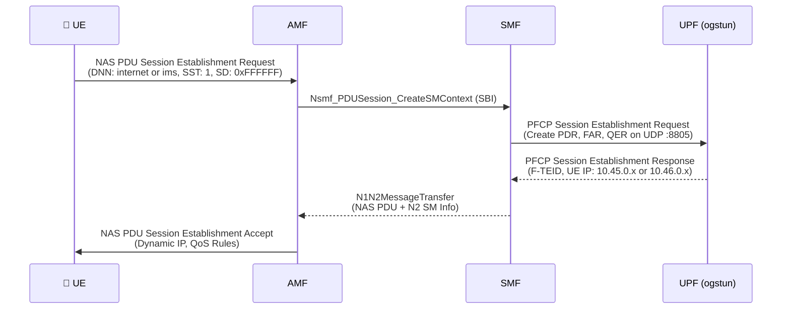
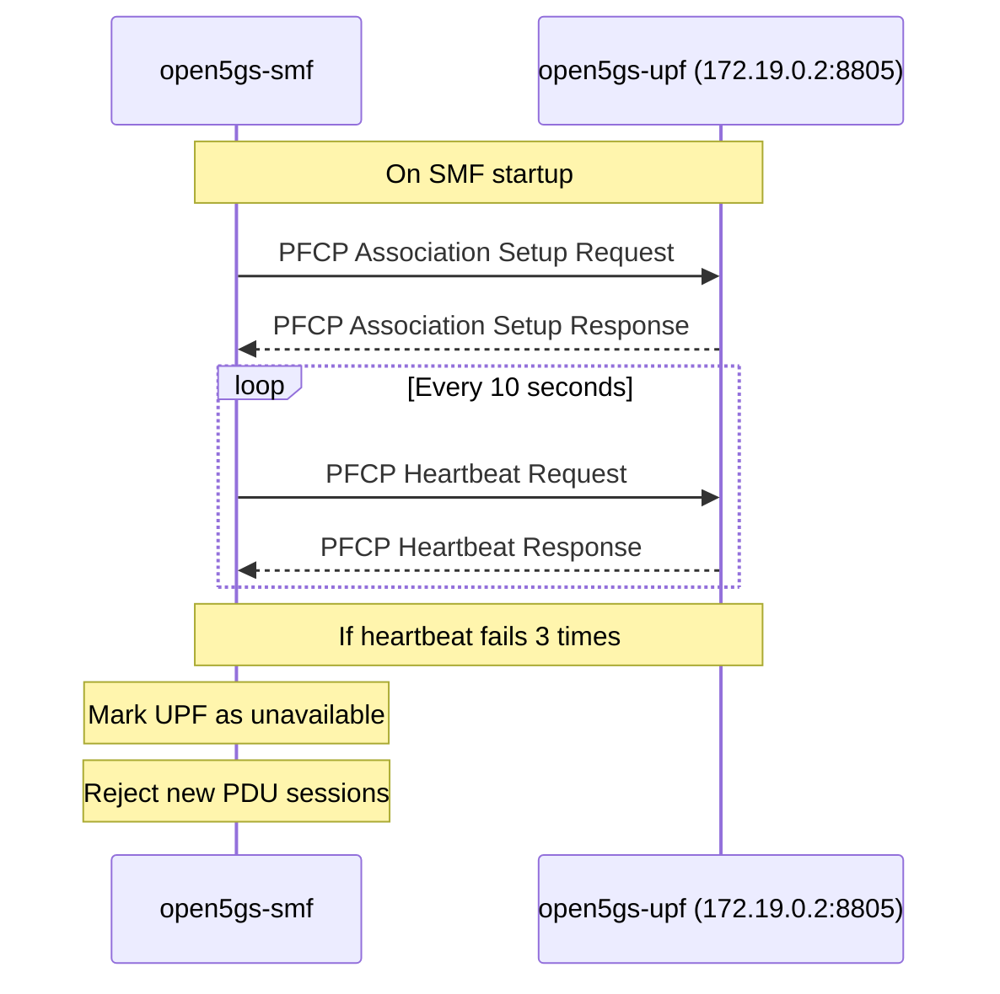
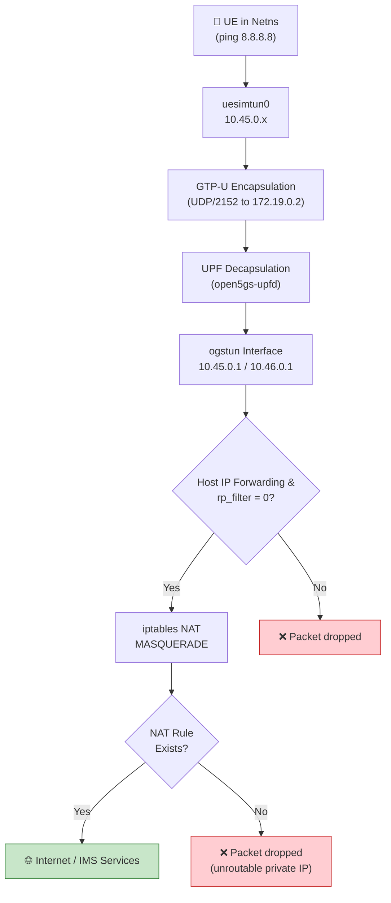

# Debugging PDU Session Failures

> Real troubleshooting scenarios encountered in this lab, with root cause analysis and resolution steps.

---

## How PDU Session Establishment Works

Before debugging failures, it is important to understand the success path. The PDU Session Establishment procedure involves three protocols across four network functions:



A failure at any point in this chain produces different symptoms. This document covers the three most common failure scenarios.

---

## Scenario 1: UE Registers Successfully but PDU Session Fails

The UE reaches `MM-REGISTERED/NORMAL-SERVICE` but the PDU Session Establishment Request is rejected or times out.

### Possible Cause A: DNN Mismatch

The DNN (Data Network Name) must match across configuration points:

| Location | Config File | Parameter | Expected Values |
|----------|-------------|-----------|-----------------|
| UE1 | `configs/ueransim/open5gs-ue.yaml` | `sessions[0,1].apn` | `internet`, `ims` |
| UE2 | `configs/ueransim/open5gs-ue2.yaml` | `sessions[0,1].apn` | `internet`, `ims` |
| SMF | `k8s/configmap.yaml` (smf.yaml) | `info[0].s_nssai[0].dnn` | `internet`, `ims` |
| UPF | `k8s/configmap.yaml` (upf.yaml) | `session[0,1].dnn` | `internet`, `ims` |

**How to verify:**

```bash
# Check UE config
grep -A2 'sessions:' configs/ueransim/open5gs-ue.yaml

# Check SMF config in Kubernetes ConfigMap
kubectl get configmap -n open5gs open5gs-config -o yaml | grep -A5 's_nssai:'
```

**Why this matters:** The SMF selects a UPF based on the DNN and S-NSSAI requested by the UE. If the DNN in the UE's request does not match any DNN configured in the SMF's `info` section, the SMF rejects the session with cause `#27 (Missing or unknown DNN)`.

### Possible Cause B: S-NSSAI Mismatch

The S-NSSAI (Single Network Slice Selection Assistance Information) consists of SST and SD. These must be consistent:

| Location | SST | SD | Notes |
|----------|-----|-----|-------|
| UE `configured-nssai` | 1 | `0xFFFFFF` | Hex formatted |
| UE `sessions[x].slice` | 1 | `0xFFFFFF` | Dual sessions (Internet & IMS) |
| AMF `plmn_support.s_nssai` | 1 | `ffffff` | Hex string in ConfigMap |
| SMF `info.s_nssai` | 1 | `ffffff` | Hex string in ConfigMap |

**How to verify:**

```bash
# Check SMF slice configuration
kubectl get configmap -n open5gs open5gs-config -o yaml | grep -B1 -A2 's_nssai:'
```

### Possible Cause C: SMF-UPF PFCP Failure

The SMF communicates with the UPF over PFCP (Packet Forwarding Control Protocol) on the N4 interface (port 8805). If this connection fails, the SMF cannot create a session on the UPF.

**Verification steps:**

```bash
# 1. Check UPF and SMF pods are running
kubectl get pods -n open5gs -l 'app in (open5gs-upf,open5gs-smf)'

# 2. Check for PFCP socket binding on the node
ss -ulnp | grep 8805

# 3. Check SMF logs for PFCP errors
kubectl logs -n open5gs deployment/open5gs-smf --tail=50 | grep -i "pfcp\|upf\|error"

# 4. Check UPF logs
kubectl logs -n open5gs deployment/open5gs-upf --tail=50
```

**PFCP Association lifecycle:**



If the UPF deployment is restarted, the SMF should also be restarted to refresh the PFCP association:

```bash
kubectl -n open5gs rollout restart deployment/open5gs-upf deployment/open5gs-smf
```

---

## Scenario 2: UE Gets IP but No Internet or IMS Access

The UE receives an IP address (e.g., `10.45.0.4` for Internet or `10.46.0.4` for IMS), but ping to `10.45.0.1` / `10.46.0.1` fails.

### Understanding the Data Path



### Check 1: UPF Forwarding (ogstun interface)

```bash
# Verify ogstun interface inside kind node has both Internet & IMS IPs
docker exec open5gs-cluster-control-plane ip addr show ogstun
# Expected output:
#   inet 10.45.0.1/16 scope global ogstun
#   inet 10.46.0.1/16 scope global ogstun
```

The `ogstun` interface is a TUN device managed by the UPF container. It represents the N6 interface. Packets arriving via GTP-U are decapsulated by the UPF and placed onto `ogstun`.

### Check 2: Linux IP Forwarding & rp_filter

```bash
# Verify host forwarding and rp_filter
sudo sysctl net.ipv4.ip_forward net.ipv4.conf.all.rp_filter
# Expected:
#   net.ipv4.ip_forward = 1
#   net.ipv4.conf.all.rp_filter = 0
```

### Check 3: iptables NAT

```bash
# Verify MASQUERADE rules exist on host and kind node
sudo iptables -t nat -L POSTROUTING -n -v | grep -E "10.45.0.0|10.46.0.0"
```

### Check 4: Verify End-to-End

```bash
# Test from UE1 Internet namespace
sudo ip netns exec ueransim-602030000000001-internet-psi1 ping -c 2 10.45.0.1
sudo ip netns exec ueransim-602030000000001-internet-psi1 ping -c 2 8.8.8.8
sudo ip netns exec ueransim-602030000000001-internet-psi1 curl -s -I https://www.google.com

# Test from UE1 IMS namespace
sudo ip netns exec ueransim-602030000000001-ims-psi2 ping -c 2 10.46.0.1
```

---

## Scenario 3: Authentication Failure

The UE sends a Registration Request but receives an Authentication Reject or encounters a MAC failure.

### Credential Reference for This Lab

| Subscriber | IMSI | K | OPc | AMF |
|---|---|---|---|---|
| **UE1 (PLMN 602/03)** | `602030000000001` | `465B5CE8B199B49FAA5F0A2EE238A6BC` | `E8ED2441347B7990E92C19B0316CD6FC` | `8000` |
| **UE2 (PLMN 602/04)** | `602040000000002` | `465B5CE8B199B49FAA5F0A2EE238A6BD` | `E8ED2441347B7990E92C19B0316CD6FC` | `8000` |

### Verification

```bash
# Check MongoDB subscriber records in Kubernetes
kubectl -n open5gs exec mongodb-0 -- mongosh --quiet --eval '
  db = db.getSiblingDB("open5gs");
  db.subscribers.find({}, {imsi: 1, "security.k": 1, "security.opc": 1});
'
```

### Subscriber Provisioning Helper

If subscriber records are missing or corrupted, re-provision using the lab script:

```bash
bash scripts/add-subscriber.sh all
```

---

## Diagnostic Checklist

```text
PDU Session Failure:
├── UE registered (MM-REGISTERED)?
│   ├── Yes → Check DNN match (UE ↔ SMF ↔ UPF)
│   │         Check S-NSSAI match (SST: 1, SD: 0xFFFFFF)
│   │         Check PFCP association (SMF ↔ UPF on :8805)
│   └── No  → Check 5G-AKA authentication (K / OPc / SQN in MongoDB)
│
├── UE has dynamic IP?
│   ├── Yes → Check ogstun interface in kind node (10.45.0.1 / 10.46.0.1)
│   │         Check IP forwarding (sysctl net.ipv4.ip_forward = 1)
│   │         Check reverse path filtering (rp_filter = 0)
│   └── No  → Check UPF session pool exhaustion or SMF routing
│
└── Services reachable?
    ├── Internet: ping 8.8.8.8 / curl https://www.google.com
    └── IMS: ping 10.46.0.1 / validate SIP OPTIONS on 10.46.0.1:5060
```

---

## References

- [3GPP TS 23.502 §4.3.2 — PDU Session Establishment](https://www.3gpp.org/dynareport/23502.htm)
- [3GPP TS 29.244 — PFCP Specification](https://www.3gpp.org/dynareport/29244.htm)
- [3GPP TS 33.501 — 5G Security Architecture](https://www.3gpp.org/dynareport/33501.htm)
- [Open5GS Troubleshooting Guide](https://open5gs.org/open5gs/docs/troubleshoot/01-simple-issues/)
