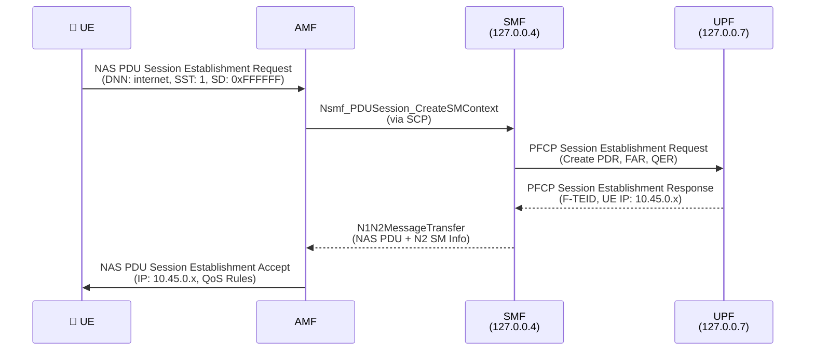
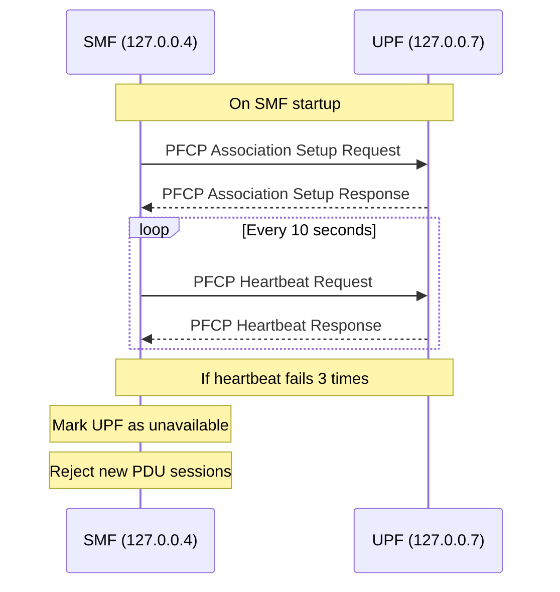
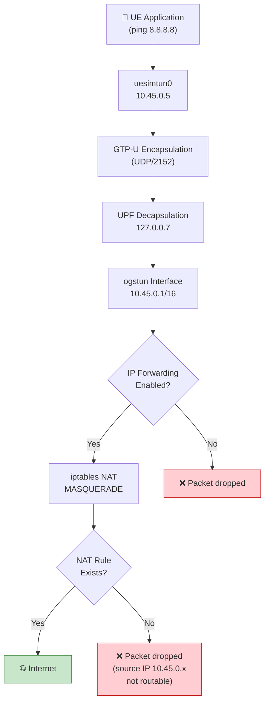

# Debugging PDU Session Failures

> Real troubleshooting scenarios encountered in this lab, with root cause analysis and resolution steps.

---

## How PDU Session Establishment Works

Before debugging failures, it is important to understand the success path. The PDU Session Establishment procedure involves three protocols across four network functions:



A failure at any point in this chain produces different symptoms. This document covers the three most common failure scenarios.

---

## Scenario 1: UE Registers Successfully but PDU Session Fails

The UE reaches `MM-REGISTERED/NORMAL-SERVICE` but the PDU Session Establishment Request is rejected or times out.

### Possible Cause A: DNN Mismatch

The DNN (Data Network Name) must match across three configuration points:

| Location | Config File | Parameter | Expected Value |
|----------|-------------|-----------|----------------|
| UE | `configs/ueransim/open5gs-ue.yaml` | `sessions[0].apn` | `internet` |
| SMF | `/etc/open5gs/smf.yaml` | `info[0].s_nssai[0].dnn` | `internet` |
| UPF | `/etc/open5gs/upf.yaml` | `session[0].dnn` | `internet` |

**How to verify:**

```bash
# Check UE config
grep 'apn:' configs/ueransim/open5gs-ue.yaml
# Expected: apn: 'internet'

# Check SMF config
grep -A2 'dnn:' /etc/open5gs/smf.yaml
# Expected: - internet

# Check UPF config
grep 'dnn:' /etc/open5gs/upf.yaml
# Expected: dnn: internet
```

**Why this matters:** The SMF selects a UPF based on the DNN and S-NSSAI requested by the UE. If the DNN in the UE's request does not match any DNN configured in the SMF's `info` section, the SMF rejects the session with cause `#27 (Missing or unknown DNN)`.

### Possible Cause B: S-NSSAI Mismatch

The S-NSSAI (Single Network Slice Selection Assistance Information) consists of SST and SD. These must be consistent:

| Location | SST | SD | Notes |
|----------|-----|-----|-------|
| UE `configured-nssai` | 1 | 16777215 | Decimal for 0xFFFFFF |
| UE `sessions[0].slice` | 1 | 16777215 | |
| AMF `plmn_support.s_nssai` | 1 | *(not set = 0xFFFFFF)* | |
| SMF `info.s_nssai` | 1 | ffffff | Hex string |
| UPF | *(inherited from SMF)* | | |

**Common mistake:** The SD value `ffffff` (hex string in SMF) must equal `16777215` (decimal integer in UERANSIM) and `0xffffff` (hex in gNB config). These are three representations of the same value.

**How to verify:**

```bash
# Check SMF slice config
grep -B1 -A2 's_nssai' /etc/open5gs/smf.yaml
# Expected: sst: 1, sd: ffffff

# Check AMF slice config
grep -B1 -A2 's_nssai' /etc/open5gs/amf.yaml
# Expected: sst: 1
```

### Possible Cause C: SMF-UPF PFCP Failure

The SMF communicates with the UPF over PFCP (Packet Forwarding Control Protocol) on the N4 interface. If this connection fails, the SMF cannot create a session on the UPF.

**Verification steps:**

```bash
# 1. Check UPF is running
sudo systemctl status open5gs-upfd
# Must show: active (running)

# 2. Verify PFCP addresses match
grep -A2 'pfcp:' /etc/open5gs/smf.yaml
# SMF PFCP client should point to UPF: address: 127.0.0.7

grep -A2 'pfcp:' /etc/open5gs/upf.yaml
# UPF PFCP server should listen on: address: 127.0.0.7

# 3. Check for PFCP association
sudo tcpdump -i lo -c 5 udp port 8805
# Should see PFCP Heartbeat Request/Response if association is active

# 4. Check SMF logs for errors
sudo journalctl -u open5gs-smfd --since "5 min ago" | grep -i "pfcp\|upf\|error"
```

**PFCP Association lifecycle:**



If the UPF process is restarted but the SMF is not, the PFCP association may be stale. **Restart the SMF** after restarting the UPF:

```bash
sudo systemctl restart open5gs-upfd
sudo systemctl restart open5gs-smfd    # Must restart after UPF
```

---

## Scenario 2: UE Gets IP but No Internet Access

The UE receives an IP address (e.g., `10.45.0.5`) and the TUN interface is up, but `ping 8.8.8.8` from the UE namespace fails.

### Understanding the Data Path



A failure at any point in this chain breaks internet access.

### Check 1: UPF Forwarding (ogstun interface)

```bash
# Verify ogstun interface exists and has the correct IP
ip addr show ogstun
# Expected output:
#   inet 10.45.0.1/16 scope global ogstun

# If ogstun is missing, the UPF did not create it
# Check UPF configuration:
grep -A4 'session:' /etc/open5gs/upf.yaml
# Expected:
#   - subnet: 10.45.0.0/16
#     gateway: 10.45.0.1
#     dnn: internet
```

The `ogstun` interface is a TUN device created by the UPF process. It represents the N6 interface — the exit point from the 5G network toward the data network. Packets arriving via GTP-U are decapsulated by the UPF and placed on `ogstun`.

### Check 2: Linux IP Forwarding

```bash
# Check current state
sysctl net.ipv4.ip_forward
# Must show: net.ipv4.ip_forward = 1

# If disabled, enable it:
sudo sysctl -w net.ipv4.ip_forward=1

# Make it persistent across reboots:
echo 'net.ipv4.ip_forward=1' | sudo tee -a /etc/sysctl.d/99-open5gs.conf
sudo sysctl -p /etc/sysctl.d/99-open5gs.conf
```

**Why this is needed:** The Linux kernel receives packets on `ogstun` (destination: `8.8.8.8`) that need to be forwarded out through the host's physical interface. Without `ip_forward=1`, the kernel drops these packets silently.

### Check 3: iptables NAT

```bash
# Check if NAT rule exists
sudo iptables -t nat -L POSTROUTING -n -v
# Look for a MASQUERADE rule with source 10.45.0.0/16

# If missing, add it:
sudo iptables -t nat -A POSTROUTING -s 10.45.0.0/16 ! -o ogstun -j MASQUERADE
```

**What MASQUERADE does:** It replaces the source IP (`10.45.0.5`) with the host's outgoing interface IP before sending the packet to the internet. Without this, the return traffic from `8.8.8.8` has no route back to `10.45.0.0/16` (a private subnet).

**The `! -o ogstun` clause** prevents NAT from being applied to packets that stay within the UPF subnet (e.g., UE-to-UE traffic). Without this exclusion, intra-UPF traffic would be unnecessarily NATed.

### Check 4: Verify End-to-End

```bash
# Test from UE namespace
sudo ip netns exec ueransim-001010000000001-internet-psi1 \
  ping -c 3 10.45.0.1          # Can UE reach UPF gateway?

sudo ip netns exec ueransim-001010000000001-internet-psi1 \
  ping -c 3 8.8.8.8            # Can UE reach internet?

# If gateway ping works but internet fails, the issue is NAT/forwarding
# If gateway ping fails, the issue is GTP-U or UPF
```

---

## Scenario 3: Authentication Failure

The UE sends a Registration Request but receives an Authentication Reject or encounters a MAC failure.

### Understanding the Authentication Chain

```
UE (K, OPc)  ←→  Network (K, OPc from MongoDB)
```

Both sides must have **identical** values for K and OPc. The authentication algorithm (Milenage for 5G-AKA) uses these to compute challenge-response values. Any mismatch produces a MAC failure.

### Credential Reference for This Lab

| Credential | UE Config (`open5gs-ue.yaml`) | MongoDB Subscriber |
|------------|-------------------------------|-------------------|
| **SUPI** | `imsi-001010000000001` | `imsi: '001010000000001'` |
| **K** | `465B5CE8B199B49FAA5F0A2EE238A6BC` | `security.k` |
| **OPc** | `E8ED2441347B7990E92C19B0316CD6FC` | `security.opc` |
| **AMF** | `8000` | `security.amf` |

### Verification

```bash
# Check UE-side credentials
grep -E 'key:|op:|opType:|amf:' configs/ueransim/open5gs-ue.yaml

# Check network-side credentials (MongoDB)
mongosh --quiet --eval '
  db = db.getSiblingDB("open5gs");
  sub = db.subscribers.findOne({imsi: "001010000000001"});
  print("K:   " + sub.security.k);
  print("OPc: " + sub.security.opc);
  print("AMF: " + sub.security.amf);
'
```

### Common Authentication Issues

| Symptom | Likely Cause | Fix |
|---------|-------------|-----|
| `MAC failure` in UE logs | K or OPc mismatch | Align credentials between UE config and MongoDB |
| `SQN failure` | Sequence number out of sync | Reset SQN in MongoDB or re-provision subscriber |
| `Authentication Reject` from AMF | SUPI not found in subscriber DB | Add subscriber using `scripts/add-subscriber.sh` |
| No Authentication Request received | AUSF or UDM not running | Check `systemctl status open5gs-ausfd open5gs-udmd` |

### SQN Synchronization Issue

The Sequence Number (SQN) is a counter that prevents replay attacks. The UE and network each maintain a SQN. If the network's SQN gets too far ahead of the UE's (e.g., after database restoration), authentication fails.

```bash
# Check current SQN in MongoDB
mongosh --quiet --eval '
  db = db.getSiblingDB("open5gs");
  sub = db.subscribers.findOne({imsi: "001010000000001"});
  print("SQN: " + sub.security.sqn);
'

# Reset SQN if needed (use with caution)
mongosh --quiet --eval '
  db = db.getSiblingDB("open5gs");
  db.subscribers.updateOne(
    {imsi: "001010000000001"},
    {$set: {"security.sqn": NumberLong(0)}}
  );
  print("SQN reset to 0");
'
```

---

## Diagnostic Checklist

A quick-reference checklist for systematic debugging:

```
PDU Session Failure:
├── UE registered?
│   ├── Yes → Check DNN match (UE ↔ SMF ↔ UPF)
│   │         Check S-NSSAI match (SST/SD across all configs)
│   │         Check PFCP association (SMF ↔ UPF)
│   └── No  → Check authentication (see Scenario 3)
│
├── UE has IP?
│   ├── Yes → Check ogstun interface (ip addr show ogstun)
│   │         Check IP forwarding (sysctl net.ipv4.ip_forward)
│   │         Check iptables NAT (iptables -t nat -L)
│   └── No  → Check UPF session config (subnet, gateway)
│
└── Internet works?
    ├── Yes → Done ✅
    └── No  → Check DNS (try ping by IP first)
              Check default route in UE namespace
              Check host's internet connectivity
```

---

## References

- [3GPP TS 23.502 §4.3.2 — PDU Session Establishment](https://www.3gpp.org/dynareport/23502.htm)
- [3GPP TS 29.244 — PFCP Specification](https://www.3gpp.org/dynareport/29244.htm)
- [3GPP TS 33.501 — 5G Security Architecture](https://www.3gpp.org/dynareport/33501.htm)
- [Open5GS Troubleshooting Guide](https://open5gs.org/open5gs/docs/troubleshoot/01-simple-issues/)
