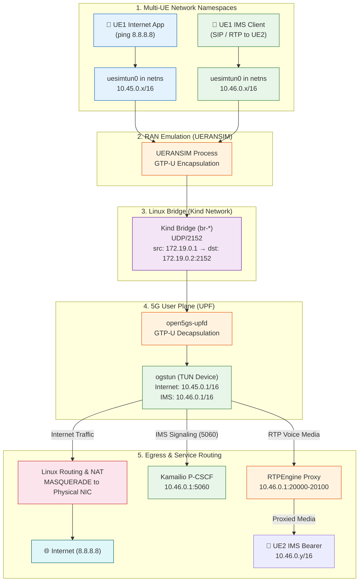

# Linux Networking Behind 5G

> How Linux kernel networking primitives implement the 5G multi-UE user plane and IMS service layer — namespaces, TUN devices, GTP-U tunnels, and NAT.

---

## Why This Matters

In a production 5G network, the user plane runs on specialized hardware (SmartNICs, DPDK/VPP-accelerated UPFs). In this lab, the entire user plane — from multi-UE applications to internet and IMS voice services — runs on **standard Linux networking primitives** combined with **Kubernetes container networking**. Understanding these primitives explains both how the lab works and what production systems are optimizing away.

---

## The Complete Packet Journey



---

## Network Namespaces

### What They Are

A Linux network namespace is an **isolated copy of the network stack**. Each namespace has its own network devices, IP addresses, routing tables, socket bindings, and iptables rules.

### How UERANSIM Uses Multi-Namespaces

When `useNamespace: true` is configured in `open5gs-ue.yaml` and `open5gs-ue2.yaml`, UERANSIM provisions isolated network namespaces for each PDU session:

```text
Namespace Naming Convention: ueransim-{IMSI}-{DNN}-psi{PSI}

Active Lab Namespaces:
├── UE1 (001010000000001):
│   ├── Internet: ueransim-001010000000001-internet-psi1  (IP: 10.45.0.x)
│   └── IMS:      ueransim-001010000000001-ims-psi2       (IP: 10.46.0.x)
└── UE2 (001010000000002):
    ├── Internet: ueransim-001010000000002-internet-psi1  (IP: 10.45.0.y)
    └── IMS:      ueransim-001010000000002-ims-psi2       (IP: 10.46.0.y)
```

This ensures complete traffic isolation between subscribers and across network slices.

```bash
# List all active UE namespaces
sudo ip netns list

# Execute commands inside UE1's Internet namespace
sudo ip netns exec ueransim-001010000000001-internet-psi1 ip addr
sudo ip netns exec ueransim-001010000000001-internet-psi1 ping -c 2 8.8.8.8

# Execute SIP diagnostics inside UE1's IMS namespace
sudo ip netns exec ueransim-001010000000001-ims-psi2 ping -c 2 10.46.0.1
```

---

## TUN Interfaces

### What They Are

A TUN (network TUNnel) device is a **virtual Layer 3 network interface**. Instead of sending and receiving packets over a physical wire, a TUN device passes raw IP frames directly to and from a userspace process.

### TUN Devices in This Lab

| TUN Device | Created By | Namespace / Node | IP Address | Purpose |
|---|---|---|---|---|
| `uesimtun0` | UERANSIM UE | `ueransim-*` netns | `10.45.0.x` or `10.46.0.x` | UE data plane interface (N3 endpoint, UE side) |
| `ogstun` | Open5GS UPF | Kind node (`172.19.0.2`) | `10.45.0.1/16` & `10.46.0.1/16` | UPF user plane exit (N6 interface for Internet & IMS) |

### Ingress & Egress Packet Flow via TUN

1. **UE Transmit**: Application inside the netns writes an IP packet to `uesimtun0`.
2. **Encapsulation**: UERANSIM process reads the raw IP frame, wraps it in a **GTP-U header** with the session TEID, and transmits it over UDP port `2152` to the UPF at `172.19.0.2:2152`.
3. **Decapsulation**: `open5gs-upfd` receives the GTP-U datagram, strips outer UDP/GTP headers, and writes the inner IP frame to `ogstun`.
4. **Service Dispatch**:
   - **Internet**: Forwarded to the physical interface with iptables `MASQUERADE`.
   - **IMS**: Routed locally on `ogstun` to P-CSCF (`10.46.0.1:5060`) or RTPEngine (`10.46.0.1:20000-20100`).

---

## GTP-U Tunneling (N3 Interface)

### Protocol Encapsulation

```text
┌───────────────────────────────────────────────────────────┐
│ Outer IP Header                                           │
│   src: 172.19.0.1 (gNodeB transport addr)                │
│   dst: 172.19.0.2 (UPF node addr)                         │
├───────────────────────────────────────────────────────────┤
│ Outer UDP Header                                          │
│   src port: ephemeral  │  dst port: 2152 (GTP-U)          │
├───────────────────────────────────────────────────────────┤
│ GTP-U Header (3GPP TS 29.281)                             │
│   Version: 1 │ Msg Type: 0xFF (T-PDU) │ TEID: 0x...       │
├───────────────────────────────────────────────────────────┤
│ Inner IP Header                                           │
│   src: 10.45.0.x (UE IP)  │  dst: 8.8.8.8 (Internet)      │
│   (or src: 10.46.0.x      │  dst: 10.46.0.1 for IMS)      │
├───────────────────────────────────────────────────────────┤
│ Payload (ICMP, TCP, UDP SIP, or RTP Audio)                │
└───────────────────────────────────────────────────────────┘
```

### Capturing N3 GTP-U Traffic

```bash
# Capture outer GTP-U frames on the kind bridge
sudo tcpdump -i any -w n3-gtpu.pcap udp port 2152

# Capture inner decapsulated frames inside the kind container
docker exec open5gs-cluster-control-plane tcpdump -i ogstun -w ogstun.pcap 2>/dev/null || true
```

---

## IP Forwarding & NAT MASQUERADE

### Kernel Parameters

To enable user plane packet forwarding across interfaces without drops:

```bash
# Enable IPv4 packet forwarding
sudo sysctl -w net.ipv4.ip_forward=1

# Disable reverse path filtering to allow asymmetric routing over TUN devices
sudo sysctl -w net.ipv4.conf.all.rp_filter=0
sudo sysctl -w net.ipv4.conf.default.rp_filter=0
```

### NAT MASQUERADE Rules

```bash
# MASQUERADE Internet pool traffic exiting to physical network
sudo iptables -t nat -A POSTROUTING -s 10.45.0.0/16 ! -o ogstun -j MASQUERADE

# MASQUERADE IMS pool traffic
sudo iptables -t nat -A POSTROUTING -s 10.46.0.0/16 ! -o ogstun -j MASQUERADE
```

---

## Summary of Linux Networking Mappings

| Linux Primitive | 5G / IMS Concept | Role in This Lab |
|---|---|---|
| `ip netns` | UE / Subscriber Isolation | Separates UE1 and UE2 data planes |
| `uesimtun0` | UE Radio Bearer (L3) | Userspace IP interface per PDU session |
| UDP `:2152` | N3 GTP-U Tunnel | Transports encapsulated user plane between gNB and UPF |
| `ogstun` | N6 Reference Point | UPF termination point for Internet and IMS networks |
| `sysctl ip_forward=1` | Router Gateway | Forwards decapsulated packets toward destinations |
| `rp_filter=0` | Asymmetric Route Acceptance | Prevents kernel drops on virtual TUN interfaces |
| `iptables MASQUERADE` | NAT Gateway | Translates private UE subnets for public internet egress |

---

## References

- [Linux Network Namespaces — man ip-netns(8)](https://man7.org/linux/man-pages/man8/ip-netns.8.html)
- [TUN/TAP Interfaces — Linux Kernel Documentation](https://www.kernel.org/doc/html/latest/networking/tuntap.html)
- [3GPP TS 29.281 — GTP-U Protocol Specification](https://www.3gpp.org/dynareport/29281.htm)
- [3GPP TS 23.501 — 5G System Architecture](https://www.3gpp.org/dynareport/23501.htm)
