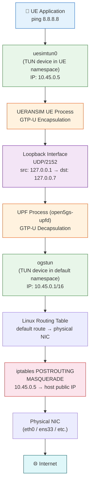
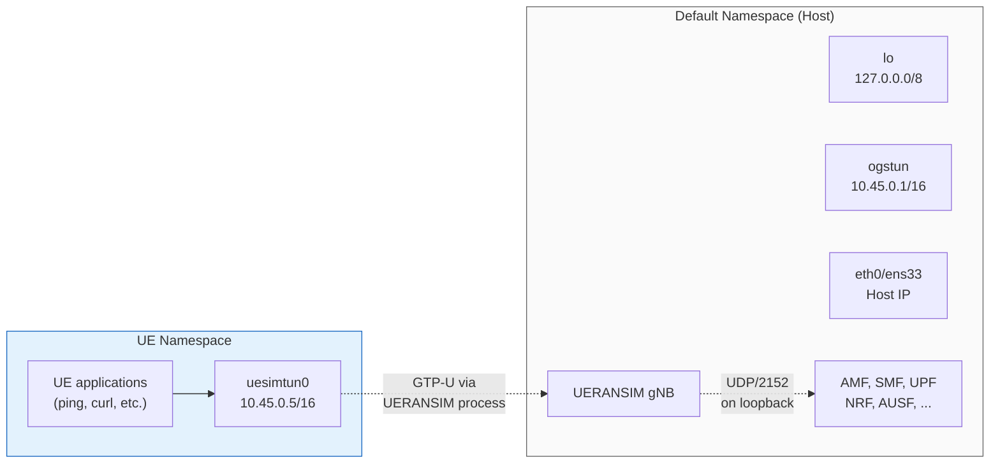
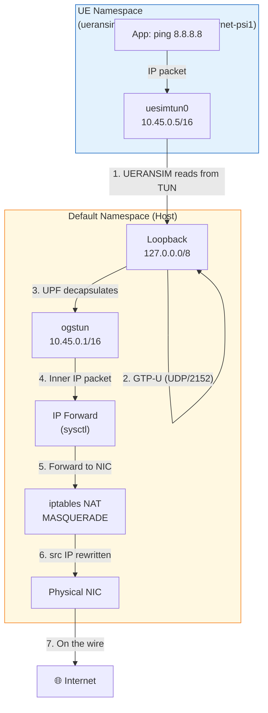

# Linux Networking Behind 5G

> How Linux kernel networking primitives implement the 5G user plane — namespaces, TUN devices, GTP-U tunnels, and NAT.

---

## Why This Matters

In a production 5G network, the user plane runs on specialized hardware (SmartNICs, DPDK-accelerated UPFs). In this lab, the entire user plane — from UE application to internet — runs on **standard Linux networking primitives**. Understanding these primitives explains both how the lab works and what production systems are optimizing away.

---

## The Complete Packet Journey



Each layer in this diagram maps to a specific Linux networking concept.

---

## Network Namespaces

### What They Are

A Linux network namespace is an **isolated copy of the network stack**. Each namespace has its own interfaces, routing tables, iptables rules, and socket bindings. Processes inside a namespace cannot see or interact with interfaces in other namespaces unless explicitly connected.

### How UERANSIM Uses Them

When `useNamespace: true` is set in `open5gs-ue.yaml`, UERANSIM creates a dedicated namespace for the UE's data traffic:

```
Namespace name: ueransim-{IMSI}-{DNN}-psi{PSI}
In this lab:    ueransim-001010000000001-internet-psi1
```

This isolates UE traffic from host traffic, simulating how a real UE would have its own IP stack independent of the network infrastructure.

```bash
# List all namespaces
sudo ip netns list
# Output: ueransim-001010000000001-internet-psi1

# Execute commands inside the UE namespace
sudo ip netns exec ueransim-001010000000001-internet-psi1 ip addr
sudo ip netns exec ueransim-001010000000001-internet-psi1 ip route
sudo ip netns exec ueransim-001010000000001-internet-psi1 ping 8.8.8.8
```

### Namespace Layout



**Key insight:** The UERANSIM UE process straddles both namespaces. It reads packets from `uesimtun0` in the UE namespace, encapsulates them in GTP-U, and sends them via the default namespace's loopback to the UPF.

---

## TUN Interfaces

### What They Are

A TUN (network TUNnel) device is a **virtual network interface** that operates at Layer 3 (IP). Instead of receiving packets from a physical wire, a TUN device receives packets from a userspace process (and vice versa). Any packet routed to a TUN interface is delivered to the process that created it.

### TUN Devices in This Lab

| TUN Device | Created By | Namespace | IP Address | Purpose |
|------------|-----------|-----------|------------|---------|
| `uesimtun0` | UERANSIM UE | `ueransim-*` | 10.45.0.x | UE data interface (N3 endpoint, UE side) |
| `ogstun` | Open5GS UPF | Default | 10.45.0.1/16 | UPF data interface (N6 endpoint) |

### How uesimtun0 Works

1. UE application sends a packet (e.g., ICMP echo to `8.8.8.8`)
2. The packet is routed to `uesimtun0` (default route in UE namespace)
3. The UERANSIM UE process reads the raw IP packet from the TUN device
4. UERANSIM wraps it in a **GTP-U header** (TEID, sequence number)
5. UERANSIM sends the GTP-U packet as UDP to the UPF (`127.0.0.7:2152`)

### How ogstun Works

1. The UPF process receives the GTP-U packet on `127.0.0.7:2152`
2. UPF strips the GTP-U header, extracting the inner IP packet
3. UPF writes the inner IP packet to the `ogstun` TUN device
4. The Linux kernel receives the packet on `ogstun` and routes it normally
5. IP forwarding + NAT sends it to the internet

---

## GTP-U Tunneling

### Protocol Stack

When the UE sends an ICMP ping, the packet on the wire (loopback) looks like:

```
┌──────────────────────────────────────────────────────┐
│ IP Header (Outer)                                    │
│   src: 127.0.0.1 (gNB GTP-U addr)                   │
│   dst: 127.0.0.7 (UPF GTP-U addr)                   │
├──────────────────────────────────────────────────────┤
│ UDP Header                                           │
│   src port: (ephemeral)                              │
│   dst port: 2152 (GTP-U)                             │
├──────────────────────────────────────────────────────┤
│ GTP-U Header                                         │
│   Version: 1                                         │
│   Message Type: 0xFF (T-PDU)                         │
│   TEID: (assigned during PDU session establishment)  │
├──────────────────────────────────────────────────────┤
│ IP Header (Inner)                                    │
│   src: 10.45.0.5 (UE IP)                             │
│   dst: 8.8.8.8                                       │
├──────────────────────────────────────────────────────┤
│ ICMP Echo Request                                    │
│   Payload data                                       │
└──────────────────────────────────────────────────────┘
```

### Capturing GTP-U Traffic

```bash
# Capture GTP-U on loopback
sudo tcpdump -i lo -w gtpu.pcap udp port 2152

# Capture the inner (decapsulated) traffic on ogstun
sudo tcpdump -i ogstun -w ogstun.pcap

# Wireshark filter for GTP-U user data
# gtp && ip.addr == 10.45.0.5
```

---

## Routing Tables

### Default Namespace (Host)

```bash
ip route
# Key routes:
# 10.45.0.0/16 dev ogstun  proto kernel  scope link  src 10.45.0.1
# default via <gateway> dev <physical NIC>
```

The `10.45.0.0/16` route ensures that return traffic destined for UE IPs is routed to `ogstun`, where the UPF picks it up and tunnels it back via GTP-U.

### UE Namespace

```bash
sudo ip netns exec ueransim-001010000000001-internet-psi1 ip route
# Key routes:
# default dev uesimtun0
```

The UE namespace has a single default route pointing to `uesimtun0`. Every packet the UE application sends goes through the TUN device and into the GTP-U tunnel.

---

## iptables NAT

### The Rule

```bash
sudo iptables -t nat -A POSTROUTING -s 10.45.0.0/16 ! -o ogstun -j MASQUERADE
```

Breaking this down:

| Component | Meaning |
|-----------|---------|
| `-t nat` | Operate on the NAT table |
| `-A POSTROUTING` | Apply after routing decision, just before leaving the host |
| `-s 10.45.0.0/16` | Match packets with source IP in the UE subnet |
| `! -o ogstun` | Only if the outgoing interface is NOT ogstun |
| `-j MASQUERADE` | Replace source IP with the outgoing interface's IP |

### Why MASQUERADE and Not SNAT

`MASQUERADE` automatically uses the outgoing interface's current IP address. This is preferable over `SNAT` (which requires specifying a fixed IP) because:
- The host's public IP may change (DHCP)
- It works regardless of which physical interface is used
- No reconfiguration needed if network topology changes

### Packet Transformation

```
Before NAT:  src=10.45.0.5  dst=8.8.8.8  → leaving via eth0
After NAT:   src=192.168.1.100  dst=8.8.8.8  → leaving via eth0

Return path:
Incoming:    src=8.8.8.8  dst=192.168.1.100  → arriving on eth0
After NAT:   src=8.8.8.8  dst=10.45.0.5  → conntrack reverses the NAT
             → routed to ogstun → UPF → GTP-U → uesimtun0 → UE app
```

---

## IP Forwarding

```bash
# Check status
sysctl net.ipv4.ip_forward
# Must be: net.ipv4.ip_forward = 1

# Enable (runtime)
sudo sysctl -w net.ipv4.ip_forward=1

# Enable (persistent)
echo 'net.ipv4.ip_forward=1' | sudo tee /etc/sysctl.d/99-open5gs.conf
```

**Why it is required:** When a packet arrives on `ogstun` (destined for `8.8.8.8`), the kernel must **forward** it to the physical NIC. By default, Linux drops packets not addressed to the host itself. `ip_forward=1` tells the kernel to act as a router and forward packets between interfaces.

---

## Relationship Summary



### Summary Table

| Component | Linux Primitive | 5G Equivalent | Role in This Lab |
|-----------|----------------|---------------|------------------|
| `uesimtun0` | TUN device | UE radio interface (simulated) | UE sends/receives IP packets |
| Network namespace | `ip netns` | UE isolation | Separates UE traffic from host |
| GTP-U encapsulation | UDP socket (port 2152) | N3 user plane tunnel | Carries UE packets between gNB and UPF |
| `ogstun` | TUN device | N6 interface | UPF exit point to data network |
| IP forwarding | `sysctl ip_forward` | Router function | Forwards packets between ogstun and NIC |
| iptables NAT | `MASQUERADE` | NAT gateway | Makes UE traffic internet-routable |
| Routing tables | `ip route` | Forwarding rules | Directs packets to correct interfaces |

---

## References

- [Linux Network Namespaces — man ip-netns(8)](https://man7.org/linux/man-pages/man8/ip-netns.8.html)
- [TUN/TAP — Linux Kernel Documentation](https://www.kernel.org/doc/html/latest/networking/tuntap.html)
- [iptables NAT — netfilter.org](https://www.netfilter.org/documentation/HOWTO/NAT-HOWTO.html)
- [3GPP TS 29.281 — GTP-U](https://www.3gpp.org/dynareport/29281.htm)
