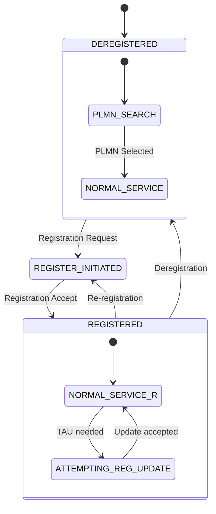
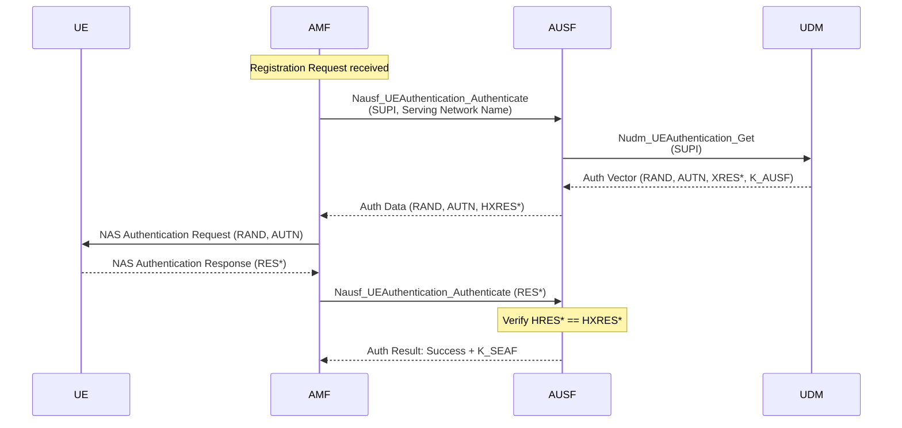
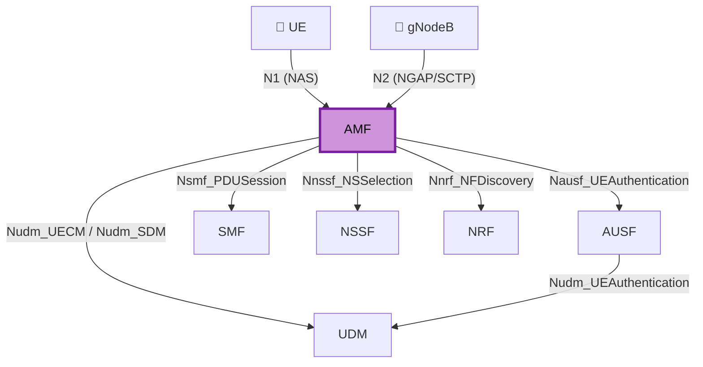

# Understanding AMF

> A deep-dive into the Access and Mobility Management Function — the central control plane NF in the 5G Core.

---

## What AMF Does and Why It Matters

The AMF (Access and Mobility Management Function) is the **first point of contact** between the UE/gNodeB and the 5G Core Network. Every UE that wants to use the network must go through the AMF. It is defined in **3GPP TS 23.501** §6.2.1 and its procedures are specified in **3GPP TS 23.502**.

In this lab, the AMF runs as `open5gs-amfd` and listens on:
- **NGAP (N2):** `127.0.0.1:38412` (SCTP) — for gNodeB signaling
- **SBI:** `127.0.0.5:7777` (HTTP/2) — for inter-NF communication via SCP

---

## AMF Responsibilities

### 1. Registration Management

The AMF owns the UE's **registration state**. When a UE powers on, it sends a Registration Request to the AMF, which orchestrates the entire registration procedure — authentication, security, and context creation.

In this lab, the UERANSIM UE sends a Registration Request with:
- **SUPI:** `imsi-001010000000001`
- **Requested NSSAI:** SST=1, SD=0xFFFFFF

The AMF maintains the **5GMM (5G Mobility Management)** state machine per UE:



Observable in UERANSIM logs:
```
[nas] UE switches to state [MM-DEREGISTERED/PLMN-SEARCH]
[nas] Selected plmn[001/01]
[nas] UE switches to state [MM-DEREGISTERED/NORMAL-SERVICE]
[nas] UE switches to state [MM-REGISTER-INITIATED]
[nas] Registration accept received
[nas] UE switches to state [MM-REGISTERED/NORMAL-SERVICE]
```

### 2. NAS Signaling Termination

The AMF is the **NAS termination point** in the network. NAS (Non-Access Stratum) messages travel transparently through the gNodeB — the gNB does not inspect NAS content. It only wraps/unwraps NAS PDUs inside NGAP messages.

```
UE  ←— NAS (5GMM/5GSM) —→  AMF
         (transparent to gNB)
```

The AMF handles two NAS sub-protocols:
- **5GMM (Mobility Management):** Registration, authentication, security
- **5GSM (Session Management):** Forwarded to SMF — AMF acts as a relay

This is why the PDU Session Establishment Request goes to AMF first, even though session management is the SMF's responsibility. The AMF extracts the SM NAS PDU and forwards it to the SMF via SBI.

### 3. Authentication Coordination

The AMF does not perform authentication itself. It **coordinates** the 5G-AKA procedure by:

1. Receiving the Registration Request with SUPI/SUCI
2. Requesting authentication vectors from AUSF (`Nausf_UEAuthentication_Authenticate`)
3. Sending the Authentication Request (RAND, AUTN) to the UE
4. Forwarding the UE's response (RES*) to AUSF for verification
5. Receiving the anchor key (K_SEAF) upon success



In this lab's logs:
```
[nas] Authentication Request received
[nas] Received SQN [0000000000A1]
```

### 4. Mobility Management

The AMF tracks the UE's **location** at the Tracking Area level. When the UE moves to a new Tracking Area, it performs a Tracking Area Update (Mobility Registration Update).

In this lab, periodic registration is observable when timer T3512 expires (configured to 540 seconds in `amf.yaml`):
```
[nas] NAS timer[3512] expired [1]
[nas] Mobility registration updating required due to [T3512-EXPIRY]
[nas] Sending Periodic Registration with update cause [T3512-EXPIRY]
```

The AMF also manages the **CM (Connection Management)** state:
- **CM-IDLE:** No N2 connection, UE is paged when data arrives
- **CM-CONNECTED:** Active N2 connection via gNB

### 5. Security Context Handling

After authentication, the AMF initiates the **Security Mode Command** procedure to activate NAS security:

| Parameter | This Lab's Value | Meaning |
|-----------|-----------------|---------|
| Integrity Algorithm | NIA2 | 128-bit SNOW 3G based |
| Ciphering Algorithm | NEA0 | Null ciphering (no encryption) |

The AMF negotiates algorithms based on its `security` configuration in `amf.yaml`:
```yaml
security:
  integrity_order: [ NIA2, NIA1, NIA0 ]
  ciphering_order: [ NEA0, NEA1, NEA2 ]
```

The AMF selects the **first algorithm from its ordered list** that the UE also supports. Since NEA0 (null) is listed first for ciphering, NAS messages are integrity-protected but not encrypted in this lab.

> **Engineering Note:** NEA0 is useful for debugging because Wireshark can decode NAS messages without keys. In production, NEA1 or NEA2 would be used, making NAS decryption require key provisioning in the dissector.

---

## AMF Interfaces

### N1 — UE ↔ AMF (NAS)

The N1 interface carries NAS messages between UE and AMF. It is a **logical** interface — NAS PDUs are transported inside NGAP messages over the N2 interface. There is no direct transport protocol for N1.

### N2 — gNodeB ↔ AMF (NGAP)

The N2 interface uses **SCTP** (Stream Control Transmission Protocol) for reliable, ordered delivery. NGAP (Next Generation Application Protocol) is defined in **3GPP TS 38.413**.

In this lab:
- gNB connects to AMF at `127.0.0.1:38412`
- SCTP provides multi-streaming (separate streams for different UE contexts)

Key NGAP procedures observable in this lab:

| NGAP Procedure | Direction | When |
|----------------|-----------|------|
| NG Setup | gNB → AMF | gNB startup |
| Initial UE Message | gNB → AMF | UE Registration Request |
| Downlink NAS Transport | AMF → gNB | Auth Request, SMC, Reg Accept |
| Uplink NAS Transport | gNB → AMF | Auth Response, SMC Complete |
| Initial Context Setup | AMF → gNB | After registration success |
| PDU Session Resource Setup | AMF → gNB | After PDU session creation |
| UE Context Release | AMF ↔ gNB | When UE goes idle |

### SBI — AMF ↔ Other NFs

The AMF communicates with other NFs over **HTTP/2** via the SCP:

| Service | Target NF | Purpose |
|---------|-----------|---------|
| `Nausf_UEAuthentication` | AUSF | 5G-AKA authentication |
| `Nudm_UECM` | UDM | UE context management |
| `Nudm_SDM` | UDM | Subscriber data |
| `Nsmf_PDUSession` | SMF | PDU session lifecycle |
| `Nnssf_NSSelection` | NSSF | Slice selection |

All SBI traffic in this lab flows through `SCP (127.0.0.200:7777)`.

---

## AMF Interaction Map



---

## How to Observe AMF in This Lab

```bash
# View AMF logs in real time
sudo journalctl -u open5gs-amfd -f

# Check AMF status
sudo systemctl status open5gs-amfd

# Capture NGAP traffic
sudo tcpdump -i lo -w amf-ngap.pcap sctp port 38412

# Capture SBI traffic
sudo tcpdump -i lo -w amf-sbi.pcap tcp port 7777 and host 127.0.0.5

# AMF configuration
cat /etc/open5gs/amf.yaml
```

---

## References

- [3GPP TS 23.501 §6.2.1 — AMF](https://www.3gpp.org/dynareport/23501.htm)
- [3GPP TS 23.502 — Procedures for 5GS](https://www.3gpp.org/dynareport/23502.htm)
- [3GPP TS 24.501 — NAS for 5GS](https://www.3gpp.org/dynareport/24501.htm)
- [3GPP TS 38.413 — NGAP](https://www.3gpp.org/dynareport/38413.htm)
- [3GPP TS 33.501 — Security Architecture](https://www.3gpp.org/dynareport/33501.htm)
