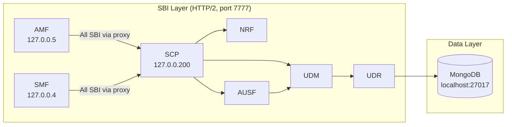

# Why Open5GS

> Engineering rationale behind selecting Open5GS as the 5G Core implementation for this laboratory.

---

## The Selection Problem

Building a 5G SA lab requires a 5G Core Network that implements the 3GPP Service-Based Architecture. The choice of core network software determines what you can learn, how deep you can go, and whether the lab reflects real-world engineering or remains a toy environment.

Three categories of 5GC implementations exist:

| Category | Examples | Cost | Source Access | 3GPP Fidelity |
|----------|----------|------|---------------|---------------|
| **Commercial** | Ericsson, Nokia, Huawei | $M+ licensing | Closed | Full compliance |
| **Open-Source (Production)** | Open5GS, free5GC, Aether | Free | Full | Substantial |
| **Academic / Proof-of-Concept** | my5G-RANTester, sim5G | Free | Full | Partial |

For an engineering lab that needs to teach **real 3GPP procedures** while remaining **inspectable and modifiable**, commercial solutions are inaccessible and academic tools are insufficient.

---

## Why Open5GS Specifically

### Comparison: Open5GS vs. free5GC vs. Aether

| Criterion | Open5GS | free5GC | Aether (ONF) |
|-----------|---------|---------|--------------|
| **Language** | C | Go | Go + Helm |
| **Maturity** | Since 2017 (NextEPC) | Since 2019 | Since 2020 |
| **NF Coverage** | AMF, SMF, UPF, NRF, AUSF, UDM, UDR, PCF, NSSF, BSF, SCP + EPC | AMF, SMF, UPF, NRF, AUSF, UDM, UDR, PCF, NSSF, N3IWF | Full 5G + SD-Core |
| **Installation** | `apt install open5gs` | Build from source | Kubernetes-only |
| **Native Ubuntu** | ✅ PPA available | ⚠️ Manual build | ❌ Requires K8s |
| **UERANSIM Tested** | ✅ Primary target | ✅ Supported | ⚠️ Indirect |
| **SBI via SCP** | ✅ Supported | ❌ Direct NF-to-NF | ✅ Supported |
| **EPC Support** | ✅ MME, SGW, PGW | ❌ 5GC only | ❌ 5GC only |
| **Community** | Active GitHub + mailing list | Active GitHub | ONF managed |

### Decision Factors

**1. Native Deployment**

Open5GS installs via Ubuntu PPA (`apt install open5gs`), deploying each NF as a separate systemd service. This mirrors how production NFs are managed — as independent processes with their own lifecycle, logs, and configuration. Docker-first deployments (like Aether) hide this operational reality.

**2. Complete SBA Implementation**

Open5GS v2.8.0 implements the full SBA with **SCP (Service Communication Proxy)**, meaning inter-NF communication follows the 3GPP TS 29.500 indirect communication model:

```
AMF → SCP → NRF    (NF Discovery)
AMF → SCP → AUSF   (Authentication)
AMF → SCP → SMF    (Session Management)
```

This is the architecture deployed in this lab (SCP at `127.0.0.200:7777`).

**3. Protocol-Level Visibility**

Since all NFs run on loopback addresses (`127.0.0.x`), every protocol interaction is capturable via `tcpdump -i lo`:

- **NGAP** over SCTP on port 38412
- **PFCP** over UDP on port 8805
- **GTP-U** over UDP on port 2152
- **SBI** over HTTP/2 on port 7777

This is far more instructive than containerized deployments where inter-NF traffic crosses Docker bridges.

**4. LTE + 5G in One Package**

Open5GS includes EPC components (MME, SGW-C, SGW-U, PGW-C, PGW-U, HSS, PCRF). This enables the v3.x roadmap (EPC vs 5GC comparison) without introducing a second project.

---

## Open5GS Architecture in This Lab

### NF Deployment Model

Each network function runs as an independent systemd service:

```
open5gs-amfd     →  /etc/open5gs/amf.yaml
open5gs-smfd     →  /etc/open5gs/smf.yaml
open5gs-upfd     →  /etc/open5gs/upf.yaml
open5gs-nrfd     →  /etc/open5gs/nrf.yaml
open5gs-ausfd    →  /etc/open5gs/ausf.yaml
open5gs-udmd     →  /etc/open5gs/udm.yaml
open5gs-udrd     →  /etc/open5gs/udr.yaml
open5gs-pcfd     →  /etc/open5gs/pcf.yaml
open5gs-nssfd    →  /etc/open5gs/nssf.yaml
open5gs-bsfd     →  /etc/open5gs/bsf.yaml
open5gs-scpd     →  /etc/open5gs/scp.yaml
```

### Internal Communication Path



Every NF that needs to communicate with another NF does so **through the SCP**. The SCP handles NF discovery (via NRF) and message routing. This is the **Model D** indirect communication pattern defined in 3GPP TS 29.500.

---

## Role in Learning 3GPP Concepts

Open5GS makes abstract 3GPP concepts tangible:

| 3GPP Concept | Open5GS Mapping | Where to Observe |
|--------------|-----------------|------------------|
| Service-Based Architecture | Each NF as a separate process | `systemctl status open5gs-*` |
| NF Discovery | NRF registration at startup | NRF logs, SBI captures |
| N2 (NGAP) | AMF SCTP listener on 38412 | `tcpdump sctp port 38412` |
| N4 (PFCP) | SMF ↔ UPF UDP session control | `tcpdump udp port 8805` |
| N3 (GTP-U) | UPF GTP tunnel endpoint | `tcpdump udp port 2152` |
| Subscription Data | MongoDB documents per IMSI | `mongosh open5gs` |
| Network Slicing | S-NSSAI in AMF/SMF config | `amf.yaml` → `s_nssai` |
| UE Pool | UPF session subnet | `upf.yaml` → `10.45.0.0/16` |

---

## Lab Limitations vs. Production Networks

> Understanding what this lab **does not** replicate is as important as understanding what it does.

| Aspect | This Lab | Production 5GC |
|--------|----------|----------------|
| **Scale** | 1 UE, 1 gNB, 1 UPF | Millions of UEs, multi-site |
| **Redundancy** | Single instance per NF | Active-standby, geo-redundant |
| **Transport** | Loopback (127.0.0.x) | Physical/virtual networks, VLAN, VxLAN |
| **Radio** | Simulated (UERANSIM) | Real RF with licensed spectrum |
| **QoS** | Basic (QCI 9, default bearer) | Multi-QoS, GBR/non-GBR, 5QI mapping |
| **Roaming** | Not supported | SEPP, inter-PLMN, HPLMN/VPLMN |
| **Lawful Intercept** | Not present | Mandatory in production |
| **Performance** | Not benchmarked | Throughput SLAs, latency budgets |
| **Security** | Test credentials, null ciphering | HSM-backed keys, SUCI encryption |

### What This Means for Engineers

This lab is ideal for learning **protocols, procedures, and architecture**. It is not a substitute for performance testing, capacity planning, or production deployment experience. Treat it as a dissection table — the anatomy is real, but the patient is not alive.

---

## References

- [Open5GS Documentation](https://open5gs.org/open5gs/docs/)
- [Open5GS GitHub](https://github.com/open5gs/open5gs)
- [3GPP TS 23.501 — System Architecture for 5GS](https://www.3gpp.org/dynareport/23501.htm)
- [3GPP TS 29.500 — 5GC SBI Framework](https://www.3gpp.org/dynareport/29500.htm)
