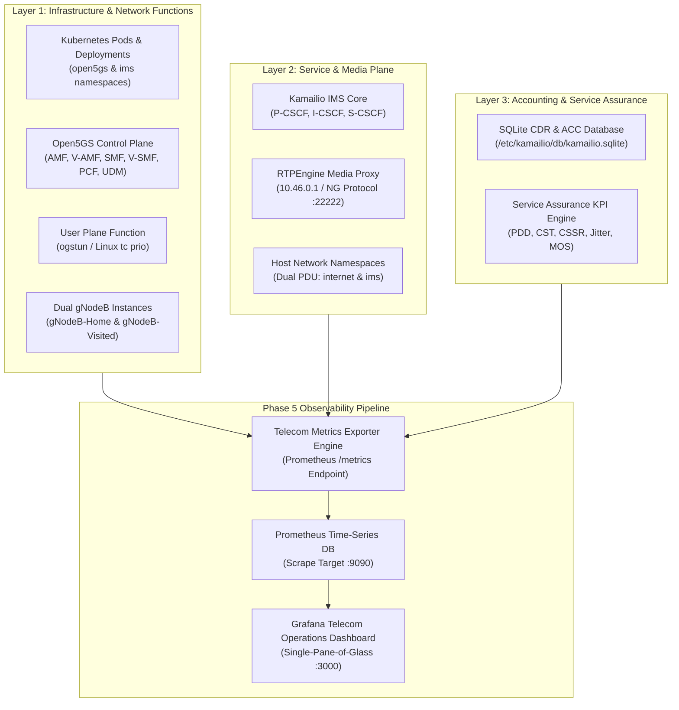

# 5G-IMS-Lab — Telecom Observability Architecture

## 1. Executive Summary & Vision

The **5G-IMS-Lab Observability Framework** provides unified, end-to-end telemetry across all layers of a 5G Standalone (5G SA) Core, Multi-PLMN Roaming architecture, and IP Multimedia Subsystem (IMS) voice service layer.

In telecom and mission-critical cloud-native environments, observability extends beyond generic container health. It requires deep correlation across three distinct domains:
1. **Control Plane Signaling & Network Function Health** (3GPP 5GC NFs, N2 NGAP, N4 PFCP, SIP registration/dialogs).
2. **User Plane Transport & Media Quality** (N3 GTP-U tunnels, RTP packet flow, RFC 3550 jitter, packet loss, ITU-T G.107 MOS).
3. **Usage Accounting & Revenue Assurance** (Offline CDR generation, session duration, per-UE dual-PDU data volumes).



---

## 2. Telemetry Domains & Data Sources

### Domain 1: 5G Core & Infrastructure
- **Source of Truth**: Kubernetes API (`apps/v1`, `core/v1`), Linux socket listeners (`sctp :38412/:38413`, `udp :2152`, `udp :8805`), and UERANSIM process runtime.
- **Monitored Entities**:
  - NF availability and readiness across all 12 core pods.
  - Isolated N2 NGAP associations to Home AMF (`:38412`) and Visited AMF (`:38413`).
  - N4 PFCP associations from Home SMF and Visited SMF to UPF.
  - Active simulated UEs (UE1, UE2, UE3) and dual-PDU session lifecycle.

### Domain 2: IMS / Vo5G Service Layer
- **Source of Truth**: Kamailio RPC interface (`kamcmd ul.dump`, `kamcmd dlg.list`), P-CSCF SIP health checks (`OPTIONS sip:10.46.0.1:5060`), and S-CSCF registration tables.
- **Monitored Entities**:
  - Active SIP registrations (AoR count, contact URI, expiration).
  - Active SIP dialogs and call routing states.
  - Digest MD5 challenge-response outcomes.
  - Cross-PLMN SIP routing status (Domestic 602/03 $\rightarrow$ 602/04 vs. Roaming 602/03 $\rightarrow$ 218/90).

### Domain 3: RTP Media & Voice Quality
- **Source of Truth**: RTPEngine NG control protocol socket (`command: statistics` on UDP `172.19.0.2:22222` / `127.0.0.1:22222`) and real-time packet stream probes.
- **Monitored Entities**:
  - Managed, active, and terminated media sessions.
  - Relayed RTP packets and bytes.
  - RTP packet loss and sequence continuity errors.
  - Inter-arrival jitter calculated per RFC 3550.
  - ITU-T G.107 E-model R-Factor and Estimated MOS (1.0 - 4.4+ scale).

### Domain 4: Charging & Usage Accounting
- **Source of Truth**: S-CSCF SQLite CDR database (`/etc/kamailio/db/kamailio.sqlite`) and Linux network namespace interface counters (`ip -s link show uesimtun0`).
- **Monitored Entities**:
  - Total CDR count and breakdown by call classification (Domestic Vo5G vs. Roaming Vo5G).
  - Realized call durations (start/end timestamps).
  - Per-UE UL/DL bytes and packets for `internet` (PSI 1) and `ims` (PSI 2) PDU sessions.
  - UPF aggregate user-plane throughput on TUN interface `ogstun`.

---

## 3. Metric Design & Cardinality Guidelines

To ensure high performance and long-term stability in time-series databases like Prometheus:

1. **Strict Cardinality Control**:
   - **Allowed Dimensions**: Categorical attributes with fixed, low cardinality:
     - `ue`: Normalized UE identifier (`ue1`, `ue2`, `ue3`).
     - `plmn`: Serving PLMN identifier (`602_03`, `602_04`, `218_90`).
     - `role`: Network domain role (`home`, `visited`).
     - `call_type`: Call routing type (`domestic`, `roaming`).
     - `dnn`: Data Network Name (`internet`, `ims`).
     - `direction`: Traffic flow (`uplink`, `downlink`).
   - **Prohibited Dimensions**: Unbounded dynamic strings MUST NOT be used as metric labels:
     - Raw dynamic Call-IDs (e.g., `call-run-24249@10.46.0.18`).
     - Dynamic SIP branch IDs or ephemeral socket ports.
     - Microsecond timestamps.
2. **Metric Type Standards**:
   - **Counters (`_total`)**: Monotonically increasing values (e.g., `ims_sip_register_requests_total`, `charging_cdr_records_total`).
   - **Gauges**: Real-time instantaneous values (e.g., `ims_sip_registered_subscribers`, `qoe_voice_mos_estimated`, `open5gs_5gc_active_pdu_sessions`).
   - **Histograms / Summaries (`_seconds`)**: Latency distributions (e.g., `qoe_sip_post_dial_delay_seconds`).

---

## 4. Phase 5 Implementation Roadmap

```text
Phase 5.0: Golden Baseline Confirmation & Freeze (91/91 PASS, tag: phase4-golden) [COMPLETE]
    │
    ▼
Phase 5.1: Observability Foundation & Metrics Model Definition [CURRENT]
    │
    ▼
Phase 5.2: Prometheus Collector & Telecom Exporter Deployment
    │
    ▼
Phase 5.3: Grafana Operations Dashboard Provisioning
    │
    ▼
Phase 5.4: Telecom Rating Engine & Revenue Assurance Extension
    │
    ▼
Phase 5.5: Controlled Fault Injection & Recovery Validation
    │
    ▼
Phase 5.6: Phase 5 End-to-End Orchestration & Automation
```
