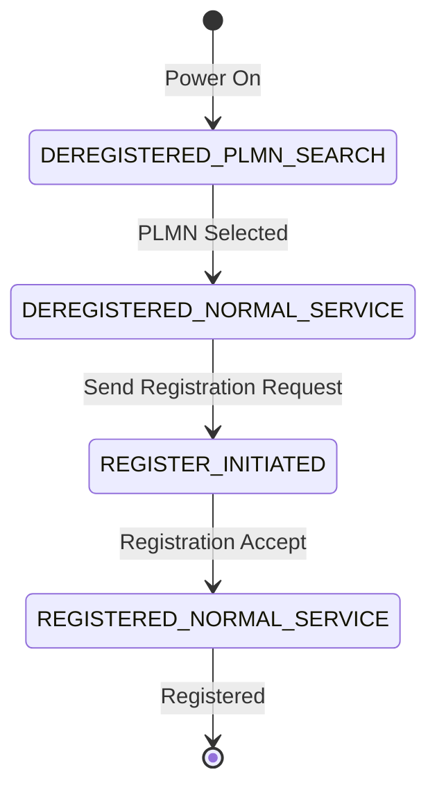

# Lab 02 — UE Registration Procedure

## Objective

Execute and analyze the complete UE Initial Registration procedure including PLMN selection, 5G-AKA authentication, and NAS security setup.

## Prerequisites

- Lab 01 completed (5G SA core running)
- Subscriber provisioned in MongoDB (use `scripts/add-subscriber.sh`)
- tcpdump or Wireshark available

## Theory

The UE Registration procedure involves:



## Steps

### 1. Start Packet Capture

```bash
# Terminal 1 — Capture NGAP + NAS on N2 interface
sudo tcpdump -i lo -w registration.pcap sctp port 38412
```

### 2. Start gNodeB

```bash
# Terminal 2
cd UERANSIM
sudo ./build/nr-gnb -c config/open5gs-gnb.yaml
```

### 3. Start UE

```bash
# Terminal 3
cd UERANSIM
sudo ./build/nr-ue -c config/open5gs-ue.yaml
```

### 4. Observe Registration Logs

Expected log sequence:
```
[nas] UE switches to state [MM-DEREGISTERED/PLMN-SEARCH]
[nas] Selected plmn[001/01]
[nas] Sending Initial Registration
[rrc] RRC connection established
[nas] Authentication Request received
[nas] Security Mode Command received
[nas] Selected integrity[2] ciphering[0]    ← NIA2/NEA0
[nas] Registration accept received
[nas] Initial Registration is successful
```

## Verification

- [ ] UE reaches `MM-REGISTERED/NORMAL-SERVICE` state
- [ ] Authentication uses 5G-AKA (check RAND/AUTN in logs)
- [ ] NAS security: NIA2 (integrity) and NEA0 (ciphering)
- [ ] PCAP shows NGAP Initial UE Message, Authentication, Security Mode, Registration Accept

## Wireshark Filters

```
# All NGAP messages
ngap

# NAS Registration messages
nas-5gs.mm.message_type == 0x41    # Registration Request
nas-5gs.mm.message_type == 0x42    # Registration Accept

# Authentication
nas-5gs.mm.message_type == 0x56    # Authentication Request
nas-5gs.mm.message_type == 0x57    # Authentication Response
```

## Key Takeaways

- The UE goes through multiple NAS states during registration
- 5G-AKA uses AUSF→UDM for authentication vector generation
- Security Mode establishes integrity and ciphering algorithms
- A 5G-GUTI is assigned upon successful registration
