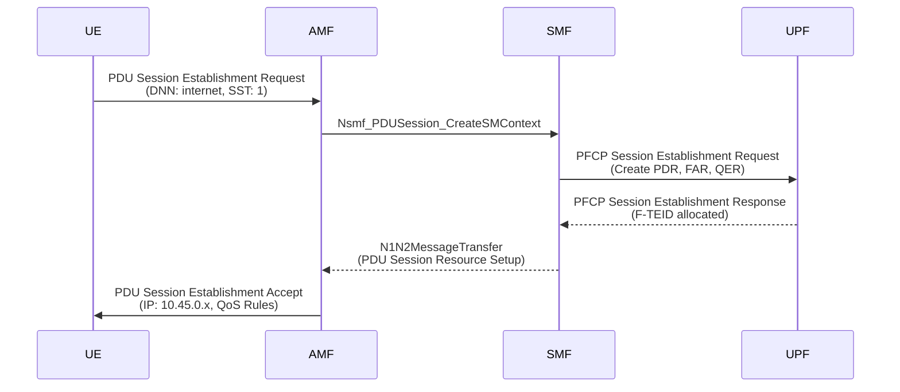

# Lab 03 — PDU Session Establishment

## Objective

Analyze the PDU Session Establishment procedure including NAS signaling, PFCP session creation, and GTP-U tunnel setup.

## Prerequisites

- Lab 02 completed (UE registered)
- Understanding of N4 (PFCP) and N3 (GTP-U) interfaces

## Steps

### 1. Capture PFCP and GTP-U Traffic

```bash
# Capture PFCP (N4) and GTP-U (N3)
sudo tcpdump -i lo -w pdu-session.pcap \
  'udp port 8805 or udp port 2152 or sctp port 38412'
```

### 2. Start gNB and UE

The PDU Session Establishment Request is sent automatically after successful registration (configured in `open5gs-ue.yaml` under `sessions`).

### 3. Expected Log Output

```
[nas] Sending PDU Session Establishment Request
[nas] PDU Session Establishment Accept received
[nas] PDU Session establishment is successful PSI[1]
[app] TUN interface[uesimtun0, 10.45.0.x] is up
```

## Protocol Flow



## Verification

- [ ] PDU Session ID (PSI) = 1
- [ ] UE receives IP from pool `10.45.0.0/16`
- [ ] TUN interface `uesimtun0` is created
- [ ] PFCP Session Establishment Request/Response visible in PCAP

## Wireshark Filters

```
# PFCP messages
pfcp

# PDU Session NAS messages
nas-5gs.sm.message_type == 0xc1    # PDU Session Establishment Request
nas-5gs.sm.message_type == 0xc2    # PDU Session Establishment Accept

# GTP-U
gtp
```
