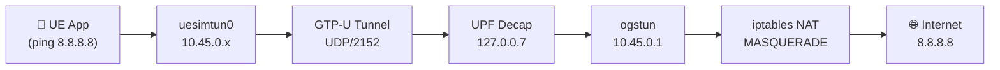

# Lab 04 — User Plane & Internet Connectivity

## Objective

Verify end-to-end user plane data path from UE through GTP-U tunnel to the internet, and analyze the traffic encapsulation.

## Prerequisites

- Lab 03 completed (PDU session established, TUN interface up)

## Data Path



## Steps

### 1. Verify UE Has an IP Address

```bash
# Check the network namespace
sudo ip netns list
# Expected: ueransim-001010000000001-internet-psi1

# Check UE IP address
sudo ip netns exec ueransim-001010000000001-internet-psi1 \
  ip addr show uesimtun0
```

### 2. Test Connectivity

```bash
# Ping through UE namespace
sudo ip netns exec ueransim-001010000000001-internet-psi1 \
  ping -c 4 8.8.8.8

# Test DNS resolution
sudo ip netns exec ueransim-001010000000001-internet-psi1 \
  curl -s -o /dev/null -w "%{http_code}" https://www.google.com

# Test with traceroute
sudo ip netns exec ueransim-001010000000001-internet-psi1 \
  traceroute -n 8.8.8.8
```

### 3. Capture User Plane Traffic

```bash
# Capture GTP-U encapsulated traffic
sudo tcpdump -i lo -w user-plane.pcap udp port 2152

# Capture decapsulated traffic on ogstun
sudo tcpdump -i ogstun -w ogstun.pcap icmp
```

## Verification

- [ ] `ping 8.8.8.8` succeeds from UE namespace
- [ ] `curl` returns HTTP 200 from Google
- [ ] GTP-U packets visible on loopback (UDP/2152)
- [ ] ICMP packets visible on ogstun (decapsulated)

## Key Takeaways

- UE traffic is encapsulated in GTP-U between gNB and UPF
- UPF decapsulates and routes through `ogstun` interface
- iptables MASQUERADE provides NAT for internet access
- Network namespace isolates UE traffic from host
