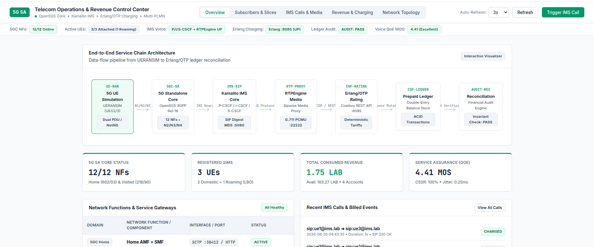

# Telecom Operations & Revenue Control Center GUI

[](http://127.0.0.1:8088)
[](#)
[](http://127.0.0.1:8085)
[](http://172.19.0.2:30090)
[](../../scripts/verify-gui.sh)

A professional, engineering-grade web management console providing real-time visibility and interactive control over the entire 5G Standalone Core, Kamailio IMS service layer, UERANSIM radio emulation, and Erlang/OTP revenue engine.



---

## Key Features

1. **End-to-End Service Chain Visualizer**:
   * Interactive animated pipeline illustrating:
     $$\text{5G UE} \longrightarrow \text{5GC (Open5GS)} \longrightarrow \text{Kamailio IMS} \longrightarrow \text{RTPEngine} \longrightarrow \text{Erlang Rating} \longrightarrow \text{Prepaid Ledger} \longrightarrow \text{Reconciliation}$$
   * Live node status inspection and protocol interface mapping ($N1/N2/N3$, $N4$, $N6$, $\text{SIP}:5060$, $\text{NG}:22222$).

2. **Multi-PLMN Subscriber & Dual-Slice Management**:
   * Inspect Home PLMN ($602/03$, $602/04$) vs Visited PLMN ($218/90$ Bosnia) subscribers.
   * Real-time Linux network namespace isolation counters ($RX/TX$ bytes and packets) across Internet ($\text{SST}:1, 10.45.0.0/16$) and IMS ($\text{SST}:1, 10.46.0.0/16$) PDU slices.
   * Direct **Prepaid Account Top-Up** modal with live double-entry ledger mutation.

3. **Interactive IMS Call Trigger & Media Verification**:
   * Trigger real voice calls directly from the GUI:
     * **Domestic Call**: $\text{UE1 } (602/03) \longleftrightarrow \text{UE2 } (602/04)$
     * **Inter-PLMN Roaming Call**: $\text{UE1 } (602/03) \longleftrightarrow \text{UE3 } (218/90)$
     * **Reverse Roaming Call**: $\text{UE3 } (218/90) \longleftrightarrow \text{UE1 } (602/03)$
   * Real-time terminal log stream showing SIP Digest MD5 challenge/response, $25/25$ G.711 PCMU RTP packet counters ($0\%$ loss), and immediate rated balance deductions.

4. **Revenue & Rating Control Center**:
   * Live Prepaid Account balances ($Available$, $Consumed$, $Reserved$).
   * Full rating tariffs matrix (Domestic voice $0.05 + 0.02/\text{s}$, Roaming voice $0.10 + 0.04/\text{s}$, Data $0.01/\text{MB}$).
   * Immutable double-entry transaction ledger with audit trail.
   * Automated **Financial Reconciliation Engine** ($PASS$, $0\text{ anomalies}$, $\sum \text{Balances} = \text{Top-Ups}$).
   * Interactive **Tariff Quote Calculator** for pre-call cost estimation.

5. **Network Topology & Observability**:
   * Interactive Multi-PLMN topology map with active listening ports.
   * Direct integration with Prometheus ($:30090$), Alertmanager ($:30093$), and Grafana ($:30300$).

---

## 🚀 Quick Start

### 1. Launch the GUI Server
```bash
# Start in background (listening on http://127.0.0.1:8088)
bash scripts/run-gui.sh start

# Check status and backend connectivity
bash scripts/run-gui.sh status
```

### 2. Access the Dashboard
Open your browser and navigate to:
```
http://127.0.0.1:8088
```

### 3. Management Commands
```bash
bash scripts/run-gui.sh stop        # Stop the GUI daemon
bash scripts/run-gui.sh restart     # Restart the GUI daemon
bash scripts/run-gui.sh logs        # Follow real-time server logs
bash scripts/run-gui.sh foreground  # Run in foreground for debugging
```

---

## 🧪 Automated Verification

Run the dedicated test suite to validate all $18$ GUI components and REST API endpoints:

```bash
bash scripts/verify-gui.sh
```

---

## 📡 REST API Reference

The GUI server (`server.py`) exposes the following endpoints:

| Method | Endpoint | Description |
| :--- | :--- | :--- |
| `GET` | `/api/overview` | High-level 5GC, IMS, UEs, Revenue, and QoE KPI aggregation |
| `GET` | `/api/subscribers` | Multi-PLMN subscriber profiles, netns traffic, and balances |
| `GET` | `/api/calls` | Kamailio SQLite CDRs matched with Erlang transaction records |
| `GET` | `/api/charging/overview` | Erlang charging health, account counts, and reconciliation status |
| `GET` | `/api/charging/accounts` | Live subscriber prepaid balances |
| `GET` | `/api/charging/tariffs` | Configured voice and data rating cards |
| `GET` | `/api/charging/transactions` | Full double-entry transaction ledger audit trail |
| `GET` | `/api/charging/reconciliation` | Real-time mathematical invariant audit |
| `GET` | `/api/network/topology` | Multi-PLMN node, interface, and port mapping |
| `GET` | `/api/system/health` | Subsystem connectivity check (Erlang, Prometheus, Alertmanager) |
| `POST` | `/api/actions/trigger-call` | Execute real IMS call and Erlang rating event |
| `POST` | `/api/actions/topup` | Top up subscriber balance on Erlang server |
| `POST` | `/api/actions/quote` | Simulate rating quote calculation |
| `POST` | `/api/actions/reconcile` | Trigger instant financial ledger audit |
| `POST` | `/api/actions/measure-kpis` | Measure real RFC 3550 jitter, MOS score, and PDD |
